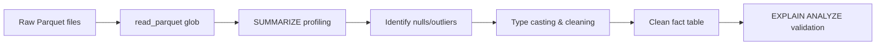

# Codex CLI for DuckDB and MotherDuck: MCP-Driven Analytical SQL, Agent Skills, and Data Pipeline Workflows


DuckDB has become the default analytical engine for local data work — in-process, zero-dependency, and fast enough to replace entire warehouse stacks for datasets that fit on a single machine [^1]. MotherDuck extends that engine into the cloud with hybrid execution, a managed catalog, and a Postgres wire-protocol endpoint [^2]. The `mcp-server-motherduck` MCP server (v1.0.6, April 2026) bridges both into Codex CLI, giving the agent five SQL tools, runtime database switching, and read-write access to local files, S3, and MotherDuck databases [^3].

This article covers the MCP server configuration, MotherDuck Agent Skills, practical workflow patterns, and the sharp edges you will hit.

## MCP Server Setup

### Local DuckDB (In-Memory or File)

```bash
codex mcp add duckdb -- uvx mcp-server-motherduck \
  --db-path :memory: \
  --read-write \
  --allow-switch-databases
```

For a persistent local file:

```bash
codex mcp add duckdb -- uvx mcp-server-motherduck \
  --db-path /absolute/path/to/analytics.duckdb \
  --read-write
```

### MotherDuck Cloud

```bash
codex mcp add motherduck \
  --env motherduck_token=YOUR_TOKEN \
  -- uvx mcp-server-motherduck \
  --db-path md: \
  --read-write
```

### S3-Hosted Databases

```bash
codex mcp add duckdb-s3 \
  --env AWS_ACCESS_KEY_ID=AKIA... \
  --env AWS_SECRET_ACCESS_KEY=... \
  --env AWS_DEFAULT_REGION=eu-west-1 \
  -- uvx mcp-server-motherduck \
  --db-path s3://my-bucket/warehouse.duckdb \
  --read-write
```

### Project-Scoped Configuration

For team consistency, add the server to `.codex/config.toml` at the project root:

```toml
[mcp_servers.duckdb]
command = "uvx"
args = [
  "mcp-server-motherduck",
  "--db-path", "./data/analytics.duckdb",
  "--read-write",
  "--allow-switch-databases",
  "--max-rows", "2048"
]
env = {}
```

Codex merges project-scoped and global MCP configurations, so this server activates only when working in the repository [^4].

## Available MCP Tools

The server exposes five tools [^3]:

| Tool | Purpose |
|------|---------|
| `execute_query` | Run DuckDB-dialect SQL — reads, writes, DDL |
| `list_databases` | Enumerate all connected databases |
| `list_tables` | Show tables and views with optional schema filtering |
| `list_columns` | Column metadata for a specific table |
| `switch_database_connection` | Change active database at runtime |

Default output is capped at 1,024 rows or 50,000 characters [^3]. Override with `--max-rows` for larger result sets, but be aware this directly inflates token consumption.

## MotherDuck Agent Skills

Beyond the MCP server, MotherDuck publishes an open-source Agent Skills catalogue — reusable instruction bundles that teach Codex (and other agents) DuckDB-specific patterns [^5]. Skills are organised in three layers:

1. **Utility skills** — connection mechanics, schema exploration, DuckDB SQL validation, REST API usage
2. **Workflow skills** — data loading, modelling, Dives visualisation, DuckLake evaluation, governance
3. **Use-case skills** — customer analytics, dashboards, pipeline design, migrations

Install the full catalogue:

```bash
codex plugin marketplace add motherduckdb/agent-skills
codex plugin install motherduck-skills@motherduck-skills
```

Once installed, skills are loaded on demand. The agent selects the appropriate skill based on the task — a data-loading prompt pulls in the loading workflow, a migration prompt activates the migration use-case skill [^5].

Verify the installation:

```
> Use MotherDuck Skills to choose the best connection path for this project.
```

The agent should evaluate whether to use the MCP server, a Postgres-compatible endpoint, a native `md:` connection, or the REST API [^5].

## AGENTS.md for DuckDB Projects

Steer the agent towards correct DuckDB SQL rather than PostgreSQL or MySQL idioms:

```markdown
# AGENTS.md — DuckDB Analytics Project

## SQL Dialect
- Write DuckDB SQL, not PostgreSQL or MySQL
- Use `read_parquet()`, `read_csv_auto()`, `read_json_auto()` for file access
- Use `QUALIFY` for window-function filtering instead of subqueries
- Use `EXCLUDE`, `REPLACE`, and `COLUMNS(regex)` for column selection
- Use `STRUCT`, `LIST`, and `MAP` types — avoid JSON strings
- Use `CREATE OR REPLACE TABLE` and `INSERT OR REPLACE` for idempotency
- Use `SUMMARIZE` for quick statistical profiling
- Use `EXPLAIN ANALYZE` before claiming performance improvements

## Data Files
- Parquet is the default interchange format
- CSV imports use `read_csv_auto()` with `header=true`
- For lakehouse workflows, use DuckLake extension (v1.0, production-ready)

## Testing
- Validate row counts after every transformation
- Use `EXCEPT` set operations to verify data equivalence
- Assert NOT NULL constraints before downstream consumption

## Limitations
- DuckDB training data may lag behind v1.5.x syntax
- Do NOT use PostgreSQL-specific functions (e.g., `generate_series` behaviour differs)
- Avoid `COPY TO` to paths outside the sandbox
```

## Workflow Patterns

### Pattern 1: Exploratory Data Analysis Pipeline

```
> Load all Parquet files from ./data/raw/ into a staging table,
> profile the columns with SUMMARIZE, identify nulls and outliers,
> then create a cleaned fact table with appropriate types.
```

The agent uses `execute_query` with `read_parquet('./data/raw/*.parquet')`, runs `SUMMARIZE`, and iterates on cleaning transforms. Each step is a separate SQL execution, giving you approval checkpoints in `suggest` mode.



### Pattern 2: Cross-Source Join with Database Switching

One of the server's distinctive features is runtime database switching [^3]. Use this to join data across sources without manual ETL:

```
> Connect to the S3 warehouse at s3://analytics/prod.duckdb,
> pull the customer dimension table, then switch to the local
> events.duckdb and join on customer_id. Write the result to
> a new Parquet file.
```

The agent calls `switch_database_connection` to toggle between databases within a single session, executes the join, and writes results via `COPY ... TO`.

### Pattern 3: DuckLake Time-Travel Audit

DuckLake v1.0 (shipped with DuckDB v1.5.2, April 2026) provides snapshots and time-travel queries over a SQL-based catalog [^6]. Combine this with Codex for audit workflows:

```
> Attach the DuckLake catalog at postgres://catalog-db/ducklake,
> compare the orders table between yesterday's snapshot and today,
> and summarise all schema changes and row-count deltas.
```

```sql
ATTACH 'postgres://catalog-db/ducklake' AS lake (TYPE ducklake);
SELECT * FROM lake.orders AT (TIMESTAMP => '2026-05-22');
```

The agent compares snapshots, identifies schema drift, and produces a change summary — useful for data-contract enforcement.

### Pattern 4: Batch Analytics with `codex exec`

For non-interactive pipelines, pipe SQL generation through `codex exec`:

```bash
codex exec --json \
  "Generate a DuckDB SQL query that reads all CSVs in ./data/sales/,
   aggregates monthly revenue by region, and exports to ./reports/monthly.parquet" \
  | jq -r '.output' \
  | duckdb analytics.duckdb
```

This chains Codex's SQL generation with DuckDB's CLI for fully automated report generation in CI/CD pipelines [^7].

### Pattern 5: MotherDuck Dives — Agent-Generated Visualisations

MotherDuck's Dives feature lets agents build shareable, real-time data visualisations from composable SQL [^8]. With the MotherDuck Agent Skills installed and the MCP server connected to `md:`:

```
> Using MotherDuck Skills, create a Dive showing weekly active users
> over the last 90 days, broken down by acquisition channel.
> Share the Dive link.
```

The agent writes the SQL, calls the MotherDuck REST API to create the Dive, and returns a shareable URL. The Remote MCP Server achieves over 95% functional correctness on text-to-SQL tasks when provided with schema context [^8].

## Model Selection

| Task | Recommended Model | Rationale |
|------|-------------------|-----------|
| Complex analytical SQL (window functions, CTEs, pivots) | `o3` | Stronger reasoning for multi-step query logic |
| Schema design, data modelling | `o3` | Needs to reason about normalisation trade-offs |
| Simple transforms, CSV imports | `o4-mini` | Straightforward SQL generation, lower cost |
| Batch report generation via `codex exec` | `o4-mini` | Cost-effective for templated queries |

Override per session:

```bash
codex --model o3 "Optimise this 200-line CTE chain for the revenue dashboard"
```

## Sandbox Configuration

DuckDB reads and writes files, so sandbox policy matters. In `~/.codex/config.toml`:

```toml
[sandbox]
# Allow read access to data directories
allow_read = ["./data", "./reports", "/tmp/duckdb_*"]
# Allow write access for output
allow_write = ["./reports", "./data/processed"]
# Network access for MotherDuck and S3
allow_network = true
```

For MotherDuck connections, the server needs outbound HTTPS access to `api.motherduck.com` and your cloud storage endpoints. The `--motherduck-saas-mode` flag restricts local filesystem access entirely, which is prudent when connecting to shared cloud databases [^3].

## Security Considerations

The MCP server documentation explicitly warns that **read-only mode alone is not sufficient** for untrusted access — DuckDB can still access the local filesystem and modify its own configuration even in read-only mode [^3]. For shared or production deployments:

- Use MotherDuck's Remote MCP Server (managed hosting) rather than the local server
- Use read-scaling tokens (not standard tokens) for read-only MotherDuck access
- Enable `--motherduck-saas-mode` to block local filesystem access
- Use `--init-sql` to set security-relevant DuckDB configuration at startup
- Scope the MCP server to specific projects rather than installing globally

## Composing with Other MCP Servers

The DuckDB MCP server pairs well with other data-oriented servers:

```toml
# .codex/config.toml — Data engineering stack

[mcp_servers.duckdb]
command = "uvx"
args = ["mcp-server-motherduck", "--db-path", "./warehouse.duckdb", "--read-write"]

[mcp_servers.github]
command = "npx"
args = ["-y", "@github/mcp-server"]
env = { GITHUB_TOKEN = "ghp_..." }

[mcp_servers.filesystem]
command = "npx"
args = ["-y", "@anthropic/mcp-filesystem", "./data", "./reports"]
```

This gives the agent SQL analytics (DuckDB), version control (GitHub), and structured file access in a single session — covering the full data pipeline from ingestion to committed output.

## Limitations and Sharp Edges

**Training data lag.** DuckDB v1.5.x syntax and DuckLake v1.0 extensions may not be in the model's training data. The AGENTS.md file and Agent Skills mitigate this, but expect occasional PostgreSQL-isms that need correcting. ⚠️

**Token budget on large results.** The default 1,024-row cap exists for good reason. Returning full result sets from analytical queries will exhaust the context window. Use `LIMIT`, aggregations, or `SUMMARIZE` to keep responses manageable.

**File-path sandboxing.** DuckDB's `read_parquet()` and `COPY TO` operate on the filesystem. If your sandbox policy is too restrictive, queries will fail silently or with opaque permission errors. Test file access paths before complex workflows.

**No streaming results.** The MCP server returns complete result sets. For genuinely large datasets, use `codex exec` to generate SQL and pipe it directly to the `duckdb` CLI rather than routing through the MCP server.

**MotherDuck token management.** The `motherduck_token` environment variable is passed in plain text via the MCP server configuration. Use Codex's `env_vars` forwarding with source specification rather than hardcoding tokens in `config.toml`:

```toml
[mcp_servers.motherduck]
command = "uvx"
args = ["mcp-server-motherduck", "--db-path", "md:", "--read-write"]
env_vars = ["MOTHERDUCK_TOKEN"]
```

**Ephemeral connections.** By default, the server uses ephemeral connections for local files to prevent file locking [^3]. This means concurrent access from other processes works, but in-memory state is not shared across tool invocations.

## Citations

[^1]: [DuckDB — An in-process SQL OLAP database management system](https://duckdb.org/)
[^2]: [MotherDuck — The Cloud Data Warehouse Built on DuckDB](https://motherduck.com/)
[^3]: [mcp-server-motherduck GitHub repository (v1.0.6)](https://github.com/motherduckdb/mcp-server-motherduck)
[^4]: [Model Context Protocol — Codex CLI Developer Documentation](https://developers.openai.com/codex/mcp)
[^5]: [Install MotherDuck Skills for Coding Agents — MotherDuck Docs](https://motherduck.com/docs/key-tasks/ai-and-motherduck/agent-skills/)
[^6]: [DuckLake v1.0: The Lakehouse Format Built on SQL Reaches Production-Readiness](https://ducklake.select/2026/04/13/ducklake-10/)
[^7]: [CLI — Codex Developer Documentation (Non-Interactive Mode)](https://developers.openai.com/codex/cli)
[^8]: [MotherDuck Release Notes — Dives and Remote MCP Server](https://motherduck.com/docs/about-motherduck/release-notes/)
