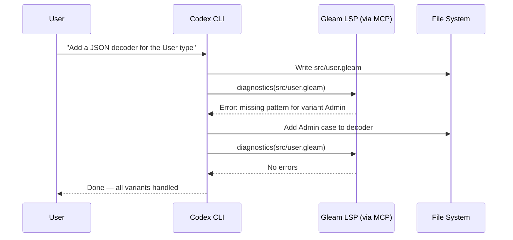

# Codex CLI for Gleam Development: Type-Safe BEAM Agents, LSP-MCP Bridge, and Dual-Target Workflows


---

Gleam occupies a distinctive niche in the language ecosystem: a statically-typed, functional language that compiles to both Erlang (for the BEAM VM) and JavaScript (for browsers and edge runtimes) [^1]. With over 21,400 GitHub stars and a 70% admiration rating in developer surveys, Gleam is no longer a curiosity — it is a production language with a first conference behind it and a v1.16.0 release shipping in April 2026 [^2][^3]. Yet no major AI coding agent ships with Gleam-specific training data or tooling.

This article covers how to configure Codex CLI for effective Gleam development: bridging the Gleam language server via LSP-MCP, writing AGENTS.md conventions for Gleam idioms, handling dual-target compilation, and working around the training data gap that affects every LLM when confronted with a young language.

## The Training Data Gap

Every general-purpose LLM — GPT-5.5 included — has substantially less Gleam training data than it has for Erlang, Elixir, or Haskell [^4]. The practical consequences are predictable:

- The model reaches for Elixir syntax (`def`, `do/end`, pipe operator `|>` without Gleam's function-call semantics) when asked to write Gleam.
- It invents module names that exist on Hex for Elixir but not for Gleam.
- It defaults to Erlang-style atoms where Gleam uses custom types with constructors.
- It omits exhaustive pattern matching, Gleam's primary control-flow mechanism.

The fix is not to avoid Codex CLI — it is to supply enough guardrails via AGENTS.md and LSP diagnostics that the model self-corrects within the agent loop rather than spiralling into invalid code.

## Bridging the Gleam Language Server via LSP-MCP

Gleam ships its language server inside the `gleam` binary itself — run `gleam lsp` and you have a fully compliant LSP server [^5]. The server provides go-to-definition, find-references, rename, 40+ code actions, exhaustive diagnostics, and document formatting [^5]. This is unusually rich for a language of Gleam's age.

To expose these capabilities to Codex CLI, use the LSP-MCP bridge [^6]. Add the following to `~/.codex/config.toml`:

```toml
[mcp_servers.gleam-lsp]
command = "npx"
args = ["-y", "lsp-mcp", "--", "gleam", "lsp"]
```

This spawns the Gleam language server as a child process and translates MCP tool calls into LSP requests [^6]. Codex CLI gains access to:

| MCP Tool | LSP Method | Use Case |
|---|---|---|
| `diagnostics` | `textDocument/publishDiagnostics` | Catch type errors after each edit |
| `hover` | `textDocument/hover` | Inspect inferred types mid-session |
| `definition` | `textDocument/definition` | Navigate to function source |
| `references` | `textDocument/references` | Find all call sites before renaming |
| `codeAction` | `textDocument/codeAction` | Apply Gleam's 40+ automated refactorings |
| `formatting` | `textDocument/formatting` | Enforce standard Gleam style |

The diagnostics channel is the critical one. When the model produces code that type-checks, the agent loop continues. When it does not, the diagnostic payload — including Gleam's famously clear error messages — feeds back into the next turn, and the model corrects itself. This compiler-as-oracle pattern works exceptionally well with Gleam because the type system catches a broad class of errors at compile time [^5].



## AGENTS.md for Gleam Projects

An AGENTS.md file at the repository root prevents the most common LLM mistakes with Gleam. The following template encodes the conventions a competent Gleam developer expects:

```markdown
# AGENTS.md — Gleam Project Conventions

## Language Rules
- All source files use `.gleam` extension. Never write `.erl` or `.ex` files.
- Use `gleam.toml` for project configuration. Never create `mix.exs` or `rebar.config`.
- Import modules with `import module/name` — no `require`, `use`, or `alias`.
- Gleam has no `if/else`. Use `case` expressions with exhaustive pattern matching.
- Gleam has no exceptions. Use `Result(value, error)` for fallible operations.
- Gleam has no `nil`/`null`. Use `Option(a)` from `gleam/option`.
- Atoms do not exist in Gleam. Use custom types: `type Direction { North South East West }`.
- Strings are UTF-8 binaries. Use `gleam/string` and `gleam/string_tree` — not Erlang `:binary`.
- Pipe operator `|>` pipes into the first argument. `list |> list.map(fn(x) { x + 1 })`.

## Build & Test
- Build: `gleam build`
- Test: `gleam test`
- Format: `gleam format`
- Type check only: `gleam check`
- Add dependency: `gleam add package_name`
- Dependencies come from Hex (hex.pm). Verify packages exist before adding.
- `manifest.toml` is the lock file. Commit it. Never edit it by hand.

## Code Style
- Always add type annotations to public functions.
- Use labelled arguments for functions with more than two parameters.
- Prefer `use` expressions for callback chains (Gleam's monadic sugar).
- Keep modules small. One public type per module where practical.
- Write doc comments with `///` above public functions.
- Run `gleam format` before committing — the formatter is canonical.

## Dual-Target Awareness
- Default target is Erlang. Specify `--target javascript` for JS builds.
- FFI to Erlang uses `@external(erlang, "module", "function")`.
- FFI to JavaScript uses `@external(javascript, "./file.mjs", "function")`.
- Never mix FFI targets in the same module without conditional compilation.
- Test on both targets if the package declares both in `gleam.toml`.

## Dependencies — Verified Gleam Packages
- HTTP: `gleam_http`, `gleam_httpc` (Erlang), `gleam_fetch` (JavaScript)
- JSON: `gleam_json` (decode/encode)
- Erlang stdlib: `gleam_erlang` (process, atom interop)
- OTP: `gleam_otp` (actors, supervisors, tasks)
- Testing: `gleeunit` (default test framework)
- Wisp: `wisp` (web framework)
```

The dependency verification section is deliberately prescriptive. Without it, the model will `gleam add` packages that exist only in the Elixir ecosystem — `jason`, `plug`, `ecto` — and produce confusing build errors.

## Practical Workflow Patterns

### Pattern 1: Type-Driven Feature Development

Gleam's type system enables a workflow where you define the types first and let the compiler guide the implementation:

```bash
codex exec "Read the types in src/domain.gleam, then implement the \
  missing functions in src/handlers.gleam. After each edit, run \
  'gleam check' and fix any type errors before moving on."
```

Because `gleam check` runs the full type checker without generating BEAM/JS bytecode, it completes in milliseconds for most projects [^7]. The model can iterate rapidly: write a function body, check types, fix errors, repeat.

### Pattern 2: Dual-Target Library Development

Gleam's dual compilation target requires testing on both Erlang and JavaScript:

```bash
codex exec "Implement the parser module in src/parser.gleam. \
  After implementation, run 'gleam test --target erlang' and \
  'gleam test --target javascript'. Fix any target-specific \
  failures. Do not use FFI — pure Gleam only."
```

The `--target` flag ensures the model discovers platform-specific issues early. Common pitfalls include BigInt handling differences, regex support gaps on the JavaScript target, and process-related APIs that only exist on BEAM [^1].

### Pattern 3: OTP Actor Migration from Elixir

Teams migrating from Elixir to Gleam can use Codex CLI to translate GenServer modules into Gleam's `gleam_otp` actor model:

```bash
codex exec "Read the Elixir GenServer in legacy/user_cache.ex. \
  Translate it into a Gleam actor using gleam_otp/actor. \
  Preserve the same message types and state shape. \
  Use custom types for messages, not atoms. \
  Run 'gleam check' after each file change."
```

The AGENTS.md rule about atoms is critical here — without it, the model translates Elixir atoms (`:get`, `:put`) literally, which Gleam does not support.

### Pattern 4: Hex Package Scaffolding with `codex exec`

Automate the creation of a publishable Hex package:

```bash
codex exec "Create a new Gleam library called 'shimmer' for \
  colour manipulation. Run 'gleam new shimmer --template lib'. \
  Add gleam_json as a dependency. Implement RGB and HSL types \
  with conversion functions. Add type annotations to all public \
  functions. Write tests. Run 'gleam test' and 'gleam format --check'. \
  Generate docs with 'gleam docs build'."
```

## Sandbox Configuration for Gleam

Gleam's build process needs network access to fetch packages from Hex and compile Erlang/JavaScript targets. Configure the sandbox permissions accordingly:

```toml
[profile.gleam]
writable_roots = ["."]
allow_commands = [
  "gleam build",
  "gleam test",
  "gleam check",
  "gleam format",
  "gleam add *",
  "gleam deps *",
  "gleam docs build",
  "gleam run",
  "gleam shell"
]
network_access = true
```

Network access is required because `gleam add` and `gleam deps download` fetch packages from hex.pm [^8]. Without it, dependency resolution fails silently.

## Model Selection for Gleam Tasks

| Task | Recommended Model | Rationale |
|---|---|---|
| Custom type design, actor architecture | GPT-5.5 | Better reasoning about type hierarchies and OTP patterns [^4] |
| Implementing function bodies, tests | GPT-5.4-mini | Faster iteration; type checker catches mistakes cheaply [^9] |
| Erlang FFI bridges | GPT-5.5 | Requires understanding both Gleam and Erlang calling conventions |
| JavaScript target work | GPT-5.4-mini | Simpler FFI surface; fewer edge cases |
| Elixir-to-Gleam migration | GPT-5.5 | Cross-language translation needs larger context and reasoning |

For most Gleam development, GPT-5.4-mini with the LSP-MCP bridge provides the best cost-to-quality ratio. The type checker acts as a free verifier, making rapid cheap iterations more effective than fewer expensive ones.

## Composing MCP Servers

For a complete Gleam development environment, compose the LSP-MCP bridge with a file-system MCP server:

```toml
[mcp_servers.gleam-lsp]
command = "npx"
args = ["-y", "lsp-mcp", "--", "gleam", "lsp"]

[mcp_servers.codebase-memory]
command = "npx"
args = ["-y", "codebase-memory-mcp"]
```

The codebase-memory-mcp server [^10] indexes 155 languages — including Gleam — into a persistent knowledge graph, providing semantic search across the codebase without consuming context tokens on full file reads.

## Limitations and Known Issues

**Training data lag.** GPT-5.5's training data likely includes Gleam up to approximately v1.12–v1.14. Features introduced in v1.15–v1.16 (string concatenation in guards, constant record updates) may produce incorrect code [^3]. The AGENTS.md and LSP diagnostics compensate, but novel syntax will occasionally require manual correction.

**No REPL integration.** Gleam provides `gleam shell`, which drops into an Erlang shell with Gleam modules loaded [^7]. However, evaluating Gleam expressions directly in the Erlang shell requires compiling modules first. There is no equivalent of Elixir's `iex` with inline Gleam expression evaluation. The model cannot use a REPL-driven workflow; it must rely on `gleam check` and `gleam test` for feedback.

**Hex package hallucination.** ⚠️ The model will confidently reference Gleam packages that do not exist on hex.pm. Always verify with `gleam add package_name` — if the package does not exist, the build tool reports an error immediately [^8].

**JavaScript target gaps.** Several `gleam_erlang` and `gleam_otp` packages are BEAM-only. Code that type-checks on the Erlang target may fail to compile for JavaScript [^1]. Dual-target testing is essential for library authors.

**No Gleam-specific MCP server.** Unlike Clojure (ClojureMCP), Elixir (ElixirLS-MCP), or Haskell (HLS via LSP-MCP with typed-hole extensions), Gleam has no purpose-built MCP server as of May 2026. The generic LSP-MCP bridge covers diagnostics, navigation, and refactoring but cannot provide Gleam-specific tools like interactive type-hole filling or OTP supervisor tree visualisation.

## Citations

[^1]: [Gleam Programming Language — Official Website](https://gleam.run/) — Dual compilation target documentation, FFI specifications, and language overview. Accessed 2026-05-23.

[^2]: [Gleam Programming Language 2026 — Programming Helper Tech](https://www.programming-helper.com/tech/gleam-programming-language-2026-type-safe-erlang-beam) — 21,400+ GitHub stars, 70% admiration rating, first Gleam conference (February 2026). Accessed 2026-05-23.

[^3]: [Gleam v1.16.0 Release — GitHub Releases](https://github.com/gleam-lang/gleam/releases) — v1.16.0 released April 24, 2026; changelog including string concatenation in guards, constant record updates. Accessed 2026-05-23.

[^4]: [OpenAI GPT-5.5 Model Documentation](https://developers.openai.com/api/docs/models/gpt-5.5) — GPT-5.5 API availability and capabilities. Accessed 2026-05-23.

[^5]: [Gleam Language Server — Official Documentation](https://gleam.run/language-server/) — 40+ code actions, diagnostics, go-to-definition, rename, formatting, document symbols, signature help. Accessed 2026-05-23.

[^6]: [LSP-MCP Bridge — Codex LSP Bridge (CesarPetrescu)](https://glama.ai/mcp/servers/CesarPetrescu/lsp-mcp) — Generic LSP-to-MCP bridge enabling any language server to be exposed as MCP tools. Accessed 2026-05-23.

[^7]: [Gleam Command Line Reference](https://gleam.run/command-line-reference/) — `gleam check`, `gleam build`, `gleam test`, `gleam shell`, `gleam format` commands and flags. Accessed 2026-05-23.

[^8]: [Gleam Hex.pm Usage Documentation](https://hex.pm/docs/gleam-usage) — Dependency management with `gleam add`, `gleam.toml` configuration, `manifest.toml` lock file. Accessed 2026-05-23.

[^9]: [OpenAI GPT-5.4-mini Model Documentation](https://developers.openai.com/api/docs/models/gpt-5.4-mini) — Optimised for latency and cost in high-volume coding workloads. Accessed 2026-05-23.

[^10]: [Codebase Memory MCP Server — GitHub (DeusData)](https://github.com/DeusData/codebase-memory-mcp) — High-performance code intelligence MCP server indexing 155 languages into a persistent knowledge graph. Accessed 2026-05-23.
