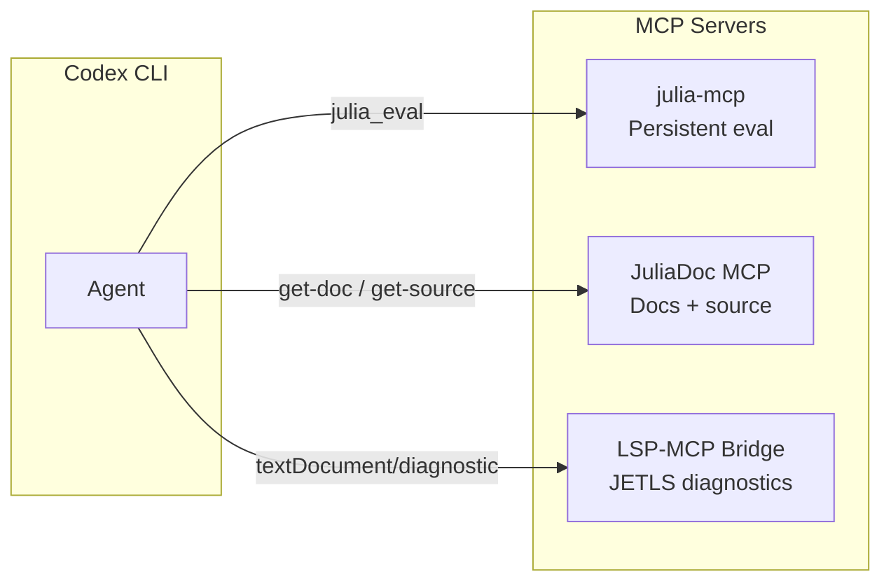
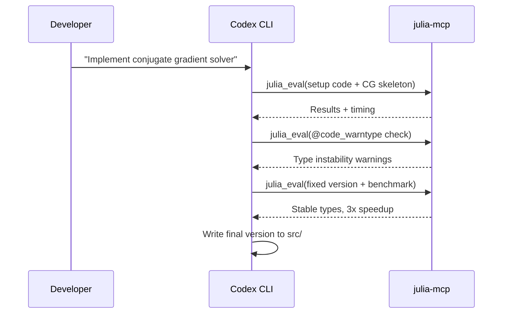

# Codex CLI for Julia and Scientific Computing: julia-mcp, JETLS, and Persistent Session Workflows


Julia occupies a unique niche among languages that Codex CLI can target. Its two-language problem — write prototypes in Python, rewrite hot paths in C — is precisely what Julia was designed to eliminate[^1]. But Julia's compilation latency has historically punished the tight edit-execute loops that agentic coding demands. Three recent ecosystem developments change the calculus: **julia-mcp** for persistent sessions, **JETLS** for compiler-powered diagnostics, and **ModelContextProtocol.jl** for building custom MCP servers in Julia itself. This article shows how to wire them together for effective Codex CLI workflows.

## The Julia Compilation Problem for Agents

Every `julia -e "..."` invocation pays first-use compilation cost — often 10–30 seconds before the first line of user code runs[^2]. In a conventional Codex CLI session, each tool call spawns a fresh process. Run five iterations of a numerical algorithm and you have burned two minutes on compilation alone.

julia-mcp solves this by maintaining **persistent Julia sessions** that survive across MCP calls[^3]. Variables, functions, and loaded packages persist between executions. Revise.jl integration means source file changes are picked up without restarting the process[^3].

## MCP Server Landscape for Julia

Three MCP servers cover distinct needs:



### julia-mcp — Persistent Code Execution

Created by aplavin, julia-mcp exposes three tools via stdio transport[^3]:

| Tool | Purpose |
|------|---------|
| `julia_eval(code, env_path?, timeout?)` | Execute Julia code in a persistent session |
| `julia_restart(env_path?)` | Clear state and restart the session |
| `julia_list_sessions` | Show active sessions and their status |

Sessions are isolated per project directory — each `env_path` gets its own Julia process[^3]. Omitting `env_path` creates a temporary session cleaned up on MCP shutdown. Paths ending in `/test/` automatically activate TestEnv.jl[^3].

**Installation for Codex CLI:**

```bash
git clone https://github.com/aplavin/julia-mcp.git ~/julia-mcp
```

Add to `~/.codex/config.toml`:

```toml
[mcp-servers.julia]
command = "uv"
args = ["run", "--directory", "/Users/you/julia-mcp", "python", "server.py"]
```

Julia launches with `--threads=auto --startup-file=no` by default. Append custom flags after `server.py` to override[^3].

### JuliaDoc MCP — Documentation and Source Lookup

The JuliaDoc MCP server by jonathanfischer97 provides two tools[^4]:

- **`get-doc`** — retrieves documentation for any Julia symbol (e.g., `Base.sort`, `LinearAlgebra.svd`)
- **`get-source`** — fetches source code for functions, types, or methods

Results are cached with a 5-minute TTL[^4]. Configuration:

```toml
[mcp-servers.juliadoc]
command = "npx"
args = ["-y", "@jonathanfischer97/server-juliadoc"]

[mcp-servers.juliadoc.env]
JULIA_PROJECT = "/path/to/your/project"
```

### LSP-MCP Bridge — JETLS Diagnostics

JETLS is a new language server for Julia built on the compiler's own type inference[^5]. Unlike the established LanguageServer.jl, JETLS leverages JET.jl, JuliaSyntax.jl, and JuliaLowering.jl to provide type-sensitive diagnostics and macro-aware go-to-definition[^5].

⚠️ JETLS requires Julia 1.12.2 or later and is explicitly marked as experimental — expect false positives and rough edges[^5].

Bridge JETLS to Codex CLI via the LSP-MCP bridge[^6]:

```toml
[mcp-servers.julia-lsp]
command = "codex-lsp-bridge"
args = ["serve", "--transport", "stdio", "--config", "/path/to/julia-lsp-config.toml"]
```

This exposes LSP capabilities — diagnostics, hover, go-to-definition, code actions — as MCP tools[^6].

## AGENTS.md for Julia Projects

An effective `AGENTS.md` anchors the agent to Julia idioms that LLMs frequently violate:

```markdown
# AGENTS.md — Julia Project Conventions

## Language & Runtime
- Target Julia 1.12+ (required for JETLS compatibility)
- Use `Project.toml` and `Manifest.toml` for all dependency management
- Never use `Pkg.add()` in source files — manage dependencies via Project.toml
- Activate the project environment before any operation: `using Pkg; Pkg.activate(".")`

## Style
- Multiple dispatch over if-else type checks — define new methods, not branches
- Prefer immutable structs (`struct`) over mutable (`mutable struct`)
- Use `@kwdef` for structs with default field values
- Type-annotate function signatures for public APIs; omit for internal helpers
- Follow BlueStyle formatting conventions

## Performance
- Avoid global variables — wrap scripts in functions
- Type-stable code: never return different types from the same branch
- Use `@inbounds` only after verifying bounds safety
- Profile before optimising: `@time`, `@btime` (BenchmarkTools), `@profile`
- Run `@code_warntype` on hot functions to verify type stability

## Testing
- Tests live in `test/runtests.jl` using the `Test` stdlib
- Run with `julia --project -e 'using Pkg; Pkg.test()'`
- Use `@testset` blocks with descriptive names
- Aim for property-based tests with Supposition.jl where applicable

## Documentation
- Docstrings above every exported function and type
- Use triple-quoted markdown docstrings with argument descriptions
- Generate docs with Documenter.jl
```

## Workflow Patterns

### Pattern 1: Iterative Numerical Development

The persistent session pattern eliminates compilation overhead during algorithm iteration:



The key advantage: steps 2–4 execute in the same Julia process. Packages loaded in step 2 remain available in step 4 without recompilation[^3].

### Pattern 2: Package Development with JETLS Diagnostics

Combine JETLS diagnostics with julia-mcp execution for a compiler-in-the-loop workflow:

1. Agent edits source files in `src/`
2. LSP-MCP bridge returns JETLS diagnostics (type errors, unreachable code, undefined references)
3. Agent fixes issues flagged by the compiler
4. Agent runs tests via `julia_eval` in the persistent session
5. Revise.jl picks up source changes automatically — no restart needed

This mirrors the type-driven development pattern used successfully with Haskell HLS[^7], but with Julia's advantage of runtime execution in the same session.

### Pattern 3: Data Pipeline Exploration with JuliaDoc

For data science workflows using DataFrames.jl, Makie.jl, or Flux.jl:

```
Prompt: "Load the CSV from data/measurements.csv, clean missing values,
         fit a linear regression, and plot residuals"
```

The agent can:
- Query `get-doc("DataFrames.dropmissing")` to check the exact API[^4]
- Query `get-source("GLM.lm")` to understand the fitting interface[^4]
- Execute iteratively in julia-mcp without reloading packages between steps[^3]

### Pattern 4: Batch Processing with `codex exec`

For non-interactive bulk tasks — running the same analysis across multiple data files or generating documentation:

```bash
find data/*.csv | codex exec \
  --model o4-mini \
  "Load this CSV with CSV.jl and DataFrames.jl. \
   Compute summary statistics. Output a JSON report."
```

Each `codex exec` invocation starts a fresh process (no persistent session), so this pattern suits embarrassingly parallel tasks where compilation cost is amortised across large inputs[^8].

## Model Selection for Julia Tasks

| Task | Recommended Model | Rationale |
|------|-------------------|-----------|
| Algorithm design, type system architecture | GPT-5.5 | Better grasp of multiple dispatch patterns and abstract type hierarchies[^9] |
| Implementation, bug fixes, test writing | o4-mini | Fast, cost-efficient; Julia syntax is well-represented in training data[^9] |
| Performance optimisation | GPT-5.5 | Understands `@code_warntype` output and LLVM IR patterns[^9] |
| Package scaffolding | o4-mini | Boilerplate-heavy, well-suited to smaller models[^9] |

## Sandbox Configuration

Julia package operations require network access to the General registry and package servers. Configure the Codex CLI permission profile accordingly:

```toml
[permissions]
# Julia needs network for Pkg operations
network = ["pkg.julialang.org", "github.com", "objects.githubusercontent.com"]

# Allow writes to depot and project directories
writable_paths = ["~/.julia", "./"]
```

For fully offline workflows, pre-populate the Julia depot (`~/.julia`) with required packages and use `JULIA_PKG_OFFLINE=true`[^10].

## Composing Multiple MCP Servers

The three Julia MCP servers complement each other without overlap:

```toml
# ~/.codex/config.toml

[mcp-servers.julia]
command = "uv"
args = ["run", "--directory", "/Users/you/julia-mcp", "python", "server.py"]

[mcp-servers.juliadoc]
command = "npx"
args = ["-y", "@jonathanfischer97/server-juliadoc"]

[mcp-servers.julia-lsp]
command = "codex-lsp-bridge"
args = ["serve", "--transport", "stdio", "--config", "/path/to/julia-lsp.toml"]
```

julia-mcp handles execution, JuliaDoc handles documentation lookup, and LSP-MCP handles static analysis. The agent selects the appropriate tool based on context[^11].

## ModelContextProtocol.jl — Building Custom Servers

For teams with domain-specific Julia tooling, ModelContextProtocol.jl enables building MCP servers natively in Julia[^12]:

```julia
using ModelContextProtocol

# Define a tool
tool = MCPTool(
    name = "run_simulation",
    description = "Run Monte Carlo simulation with given parameters",
    parameters = [
        ToolParameter("n_samples", "integer", "Number of samples", required=true),
        ToolParameter("seed", "integer", "Random seed", required=false)
    ]
) do params
    # Simulation logic here
    run_monte_carlo(params["n_samples"], get(params, "seed", 42))
end

# Start server
server = mcp_server(name="domain-sim", tools=[tool])
```

The package supports automatic tool discovery from directory structures and integrates with Claude Desktop and Codex CLI[^12].

## Limitations and Caveats

- **Training data lag**: Julia 1.12 features (type redefinition, `Fix` struct, `--trim`) may not be fully represented in current model training data[^13]. Use AGENTS.md to specify the target version explicitly.
- **JETLS instability**: JETLS requires exactly Julia 1.12.2 and produces false positives[^5]. Treat its diagnostics as advisory, not authoritative.
- **No REPL integration**: julia-mcp provides `eval` but not a full REPL — tab completion, `?` help mode, and `;` shell mode are unavailable[^3].
- **Macro expansion opacity**: LLMs struggle with heavily macro-dependent Julia code (Turing.jl, ModelingToolkit.jl). The agent cannot inspect expanded macro forms without explicit `@macroexpand` calls.
- **Package precompilation**: First use of a package in a julia-mcp session still triggers precompilation. Subsequent calls benefit from caching, but the initial hit can be substantial for large dependency trees.
- **Seatbelt sandbox conflicts**: Julia's package manager writes to `~/.julia`, which the macOS Seatbelt sandbox blocks by default. Add `~/.julia` to `writable_paths` or use the Docker sandbox[^14].

## Citations

[^1]: [Julia Language — "Why We Created Julia"](https://julialang.org/blog/2012/02/why-we-created-julia/) — original motivation for eliminating the two-language problem
[^2]: [Julia Documentation — Performance Tips](https://docs.julialang.org/en/v1/manual/performance-tips/) — compilation latency and type stability guidance
[^3]: [aplavin/julia-mcp GitHub](https://github.com/aplavin/julia-mcp) — persistent Julia sessions for AI assistants, tools, session isolation, Revise.jl integration
[^4]: [JuliaDoc MCP Server — Awesome MCP Servers](https://mcpservers.org/servers/jonathanfischer97/juliadoc-mcp) — documentation and source code lookup tools
[^5]: [aviatesk/JETLS.jl GitHub](https://github.com/aviatesk/JETLS.jl) — compiler-powered language server, Julia 1.12.2 requirement, experimental status
[^6]: [CesarPetrescu/lsp-mcp GitHub](https://github.com/CesarPetrescu/lsp-mcp) — LSP-MCP bridge for exposing language server features as MCP tools
[^7]: [Codex CLI for Haskell Development Teams](https://codex.danielvaughan.com/2026/05/22/codex-cli-haskell-development-hls-mcp-type-driven-agent-workflows/) — type-driven agent workflow pattern with HLS
[^8]: [OpenAI Codex CLI — Non-interactive Mode](https://developers.openai.com/codex/cli) — `codex exec` for batch and pipeline workflows
[^9]: [OpenAI Models Documentation](https://developers.openai.com/api/docs/models) — GPT-5.5, o4-mini capabilities and recommended use cases
[^10]: [Julia Pkg Documentation — Offline Mode](https://pkgdocs.julialang.org/v1/api/#Pkg.offline) — `JULIA_PKG_OFFLINE` environment variable
[^11]: [OpenAI Codex MCP Configuration](https://developers.openai.com/codex/mcp) — composing multiple MCP servers in config.toml
[^12]: [JuliaSMLM/ModelContextProtocol.jl GitHub](https://github.com/JuliaSMLM/ModelContextProtocol.jl) — native Julia MCP server implementation, tool/resource/prompt registration
[^13]: [Julia v1.12 Release Notes](https://docs.julialang.org/en/v1/NEWS/) — type redefinition, Fix struct, --trim feature, wall-time profiler
[^14]: [OpenAI Codex CLI — Sandbox Configuration](https://developers.openai.com/codex/cli) — Seatbelt sandbox, writable paths, Docker sandbox option
