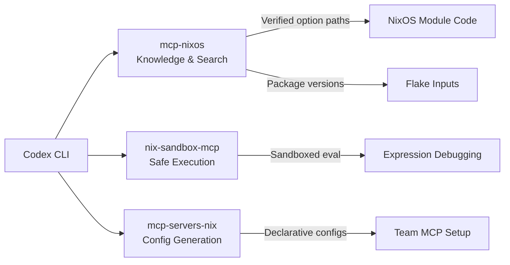

# Codex CLI for Nix and NixOS Development: MCP-NixOS, Sandbox Isolation, and Reproducible Agent Workflows


Nix occupies a singular position in the development tooling landscape: a purely functional package manager that doubles as a build system, configuration language, and operating system foundation. Its 130,000+ packages, deterministic builds, and declarative configuration model make it extraordinarily powerful — and extraordinarily hostile to AI assistants that hallucinate package names, invent non-existent options, or confuse NixOS module syntax with plain Nix expressions [^1]. Three MCP servers now bridge this gap for Codex CLI, turning the Nix ecosystem from a hallucination minefield into a verified, searchable knowledge base.

## The Nix Hallucination Problem

Every coding agent struggles with Nix. The language's lazy evaluation, attribute set nesting, and the sheer scale of nixpkgs (the largest package repository of any distribution [^2]) create a perfect storm for confident fabrication. Ask an unassisted model for a NixOS option path and you will frequently receive something plausible but wrong — `services.nginx.enableSSL` instead of the actual `services.nginx.virtualHosts.<name>.forceSSL`, for instance. The problem compounds with Home Manager (5,000+ options) and nix-darwin (1,000+ macOS settings), where option paths diverge from NixOS conventions in subtle ways [^3].

MCP-NixOS solves this by providing real-time, verified data over the Model Context Protocol rather than relying on training data that may lag nixpkgs by months.

## MCP Server Landscape for Nix

### MCP-NixOS: The Knowledge Server

MCP-NixOS (by utensils) consolidates what was originally seventeen separate tools into just two — `nix()` and `nix_versions()` — keeping context overhead to roughly 1,030 tokens [^3]. The `nix()` tool supports multiple actions:

- **search**: Query 130,000+ packages, 23,000+ NixOS options, and programs across channels
- **info**: Retrieve package metadata, descriptions, and platform availability
- **options**: Look up NixOS, Home Manager, nix-darwin, and Nixvim option paths with type signatures and defaults
- **flake-inputs**: Inspect FlakeHub's registry of 600+ flakes [^3]
- **cache**: Check binary cache status on cache.nixos.org

The `nix_versions()` tool returns historical package versions with their corresponding nixpkgs commit hashes, enabling reproducible pinning — critical when an agent needs to reference a specific package version in a flake input [^3].

#### Codex CLI Configuration

```toml
# ~/.codex/config.toml
[mcp_servers.mcp-nixos]
command = "uvx"
args = ["mcp-nixos"]
```

Alternatively, for NixOS systems with the package installed declaratively:

```toml
[mcp_servers.mcp-nixos]
command = "mcp-nixos"
```

MCP-NixOS requires no local Nix installation — it queries web APIs for package and option data, making it usable on any platform [^3].

### nix-sandbox-mcp: Declarative Execution Sandboxes

Where MCP-NixOS provides knowledge, nix-sandbox-mcp (by SecBear) provides isolated execution environments using Nix flakes and bubblewrap [^4]. Rather than Docker containers, it creates unprivileged sandboxes with separate user, PID, network, and mount namespaces — no root required, no daemon running.

Three environments ship by default: Bash, Python, and Node.js. Each sandbox mounts your project read-only at `/project`, preventing the agent from accidentally corrupting source files during exploratory execution [^4].

```toml
# ~/.codex/config.toml
[mcp_servers.nix-sandbox]
command = "nix"
args = ["run", "github:secbear/nix-sandbox-mcp", "--", "--stdio"]

[mcp_servers.nix-sandbox.env]
PROJECT_DIR = "/home/user/my-nix-project"
SESSION_IDLE_TIMEOUT = "300"
SESSION_MAX_LIFETIME = "3600"
```

The token efficiency design is notable: a single parameterised `run` tool serves all environments at a constant ~420-token context cost, compared to ~150 tokens per tool for static-loading approaches [^4].

Custom environments are defined as Nix flakes using the `mkSandbox` utility:

```nix
# custom-sandbox.nix
data-science = nix-sandbox-mcp.lib.mkSandbox {
  inherit pkgs;
  name = "data-science";
  interpreter_type = "python";
  packages = [
    (pkgs.python3.withPackages (ps: [ ps.numpy ps.pandas ps.scipy ]))
  ];
};
```

This is particularly powerful for Nix development itself — you can create a sandbox with `nix-eval`, `nix-instantiate`, and related tools to let the agent safely evaluate Nix expressions without touching your system store.

### mcp-servers-nix: The Configuration Framework

The third piece is mcp-servers-nix (by natsukium), a meta-framework for managing MCP server configurations declaratively through Nix [^5]. It supports 27 MCP server modules and generates configuration files for multiple clients:

| Client | Config Key | Output File |
|--------|-----------|-------------|
| Codex CLI | `mcp_servers` | `.mcp.toml` |
| Claude Code | `mcpServers` | `.mcp.json` |
| VS Code | `mcp.servers` | `settings.json` |
| Zed | `context_servers` | varies |

For teams running multiple coding agents, this means a single `flake.nix` generates consistent MCP configurations across all of them [^5].

```nix
# flake.nix (excerpt)
{
  inputs.mcp-servers-nix.url = "github:natsukium/mcp-servers-nix";

  outputs = { self, mcp-servers-nix, ... }: {
    # Home Manager integration
    homeConfigurations.dev = {
      programs.mcp.servers = {
        nixos = { enable = true; };
        filesystem = {
          enable = true;
          settings.args = [ "/home/user/projects" ];
        };
        github = {
          enable = true;
          settings.envFile = "~/.config/mcp/github.env";
        };
      };
    };
  };
}
```

## AGENTS.md for Nix Projects

Nix's unique syntax and conventions require explicit guidance. The following template prevents the most common agent mistakes:

```markdown
# AGENTS.md

## Language & Tooling
- Nix expression language (lazy, dynamically typed, purely functional)
- NixOS 25.11 "Xantusia" (current stable)
- Nix CLI 2.31.x with flakes enabled
- Use `nix fmt` (treefmt-nix or nixfmt-rfc-style) before committing

## Conventions
- Flake-first: all projects use flake.nix, never shell.nix alone
- Pin nixpkgs via flake inputs, never use <nixpkgs> channel references
- Use lib.mkOption with type annotations for all module options
- Prefer callPackage pattern over raw import for package definitions
- Use mkIf / mkMerge for conditional configuration, never if-then-else at module level

## NixOS Modules
- Every option must have a type, default, and description
- Use lib.types (attrs, listOf, submodule) — never invent option types
- Test modules with nixosTest or vm.test before merging

## Common Mistakes to Avoid
- Do NOT hallucinate package names: use the mcp-nixos search tool to verify
- Do NOT confuse NixOS options with Home Manager options — different namespaces
- Do NOT use rec { } at the top level of flake outputs
- Do NOT assume fetchFromGitHub hashes — use nix-prefetch or leave as lib.fakeHash for the developer to fill
```

## Workflow Patterns

### Pattern 1: NixOS Module Development with Verified Options

```
Prompt: "Create a NixOS module for Caddy reverse proxy with automatic
HTTPS, using the mcp-nixos tool to verify all option paths exist."
```

The agent queries `nix(action="options", query="services.caddy")` to retrieve the actual option tree, then constructs a module using verified paths rather than guessing. This eliminates the most common failure mode in AI-assisted Nix configuration.

### Pattern 2: Flake Dependency Audit

```bash
codex exec "Audit this flake.nix: check each input is pinned,
verify all referenced packages exist in the pinned nixpkgs,
and flag any inputs that haven't been updated in 90+ days.
Use mcp-nixos nix_versions to check package availability."
```

The agent uses `nix_versions()` to confirm that packages referenced in overlays actually exist at the pinned nixpkgs revision, catching silent breakage from stale locks.

### Pattern 3: Cross-Platform Configuration with nix-darwin

```
Prompt: "I need a shared home-manager config that works on both
NixOS and macOS via nix-darwin. Use mcp-nixos to verify which
options are available on each platform before using them."
```

The agent queries Home Manager options and nix-darwin options separately, identifying the intersection and generating platform-conditional configuration using `lib.mkIf pkgs.stdenv.isDarwin`.

### Pattern 4: Sandboxed Nix Expression Evaluation

When debugging complex Nix expressions, the agent can use nix-sandbox-mcp to evaluate expressions safely:

```
Prompt: "This derivation fails to build. Use the nix sandbox to
evaluate the expression step by step, checking each attribute
set merge. Don't modify my flake.lock."
```

The read-only project mount ensures the agent's debugging cannot corrupt the flake lock or Nix store.

## Model Selection

| Task | Recommended Model | Rationale |
|------|------------------|-----------|
| NixOS module design, complex overlays | gpt-5.5 | Deep reasoning over nested attribute sets and lazy evaluation semantics [^6] |
| Package lookups, option verification | gpt-5.4-mini | Fast MCP tool calls, verification is the bottleneck not reasoning [^6] |
| Flake template generation | gpt-5.4 | Good balance of cost and capability for structured boilerplate [^6] |
| Batch flake audits (`codex exec`) | gpt-5.4-mini | Cost-effective for repetitive verification tasks [^6] |

## Composing the Three Servers

The three MCP servers complement each other without overlap:



```toml
# ~/.codex/config.toml — all three servers composed
[mcp_servers.mcp-nixos]
command = "uvx"
args = ["mcp-nixos"]

[mcp_servers.nix-sandbox]
command = "nix"
args = ["run", "github:secbear/nix-sandbox-mcp", "--", "--stdio"]

[mcp_servers.nix-sandbox.env]
PROJECT_DIR = "."

# Only needed if managing MCP configs for a team
[mcp_servers.mcp-servers-nix]
command = "nix"
args = ["run", "github:natsukium/mcp-servers-nix#mcp-server-nixos"]
```

## Sandbox Considerations

Codex CLI's built-in sandbox and Nix's own sandboxing interact in ways worth understanding:

- **Nix store access**: Codex's `network-read` sandbox mode is sufficient for `nix build` operations that fetch from cache.nixos.org, but `workspace-write` is needed if builds produce outputs in the project directory [^7]
- **nix-sandbox-mcp isolation**: This runs alongside (not inside) Codex's sandbox — bubblewrap creates its own namespace boundaries. The two isolation layers are complementary
- **Flake lock writes**: `nix flake update` and `nix flake lock` modify `flake.lock`. Ensure your sandbox mode permits writes to this file, or the agent will fail silently

## Limitations and Caveats

- **Training data lag**: Models' knowledge of nixpkgs lags the unstable channel by months. The MCP-NixOS server compensates, but novel packages or recently renamed options may still cause confusion [^3]
- **Nix language complexity**: Lazy evaluation, infinite recursion detection, and the `...` pattern in function arguments remain challenging for models even with tool support
- **nix-sandbox-mcp is Linux-only**: bubblewrap requires Linux namespaces. macOS and Windows users cannot use this server [^4]
- **Hash prefetching**: Models cannot compute Nix hashes. Any `fetchFromGitHub` or `fetchurl` call requires the developer to run `nix-prefetch` manually or use `lib.fakeHash` as a placeholder
- **Module evaluation cost**: Full NixOS module evaluation can be slow (10-30 seconds). Agents may time out on complex configurations if tool timeouts are set too low
- **mcp-servers-nix maturity**: The framework covers 27 servers but is under active development; not all server modules expose every configuration option yet [^5]

## Citations

[^1]: [NixOS Manual — Release Notes for NixOS 25.11](https://nixos.org/manual/nixos/stable/release-notes)
[^2]: [Repology — Repository Statistics](https://repology.org/repositories/statistics)
[^3]: [utensils/mcp-nixos — GitHub Repository](https://github.com/utensils/mcp-nixos)
[^4]: [SecBear/nix-sandbox-mcp — GitHub Repository](https://github.com/SecBear/nix-sandbox-mcp)
[^5]: [natsukium/mcp-servers-nix — GitHub Repository](https://github.com/natsukium/mcp-servers-nix)
[^6]: [OpenAI Codex Models Documentation](https://developers.openai.com/codex/models)
[^7]: [OpenAI Codex CLI Features — Sandbox Modes](https://developers.openai.com/codex/cli/features)
