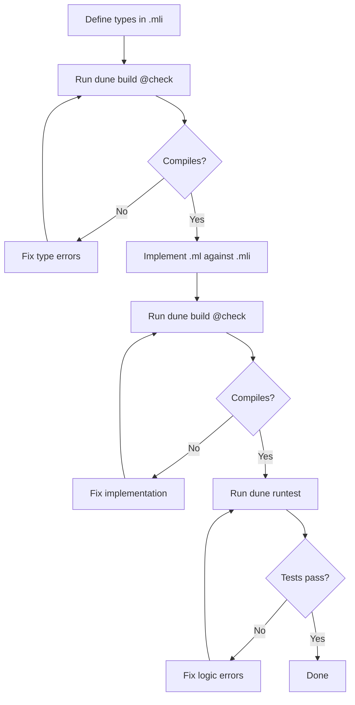

# Codex CLI for OCaml Development: ocaml-mcp-server, Merlin via LSP-MCP, and Type-Driven Agent Workflows


---

OCaml occupies a distinctive position in the programming language landscape: a strict, statically-typed functional language with a mature compiler, algebraic data types, and a module system powerful enough to express most design patterns at the type level. Yet its relatively small community means LLM training corpora under-represent it, making agent-assisted development simultaneously more valuable and more error-prone than with mainstream languages.

This article covers how to configure Codex CLI for productive OCaml work using two MCP integration points, a purpose-built `AGENTS.md`, and workflow patterns that exploit OCaml's type system as a compiler-driven oracle.

## The Training Data Problem

LLMs trained predominantly on Python, JavaScript, and Java produce plausible but subtly wrong OCaml. Common failure modes include using `let rec` where tail recursion is unnecessary, confusing `List.map` from the standard library with `Base.List.map` from Jane Street, and generating pre-5.0 syntax for projects targeting OCaml 5.4 [^1]. MCP tooling mitigates this by giving the agent access to live type information, build diagnostics, and ecosystem documentation at runtime.

## Two MCP Integration Points

### 1. ocaml-mcp-server — Dune, Merlin, and File Operations

Thibaut Mattio's `ocaml-mcp-server` provides a purpose-built MCP server that integrates with the OCaml Platform toolchain [^2]. Install it via opam:

```bash
opam install ocaml-mcp-server
```

The server exposes three categories of tools:

| Category | Tools | Purpose |
|----------|-------|---------|
| **Dune** | `dune/build-status`, `dune/build-target`, `dune/run-tests` | Real-time build diagnostics, targeted compilation, test execution |
| **OCaml** | `ocaml/module-signature`, `ocaml/project-structure`, `ocaml/eval` | Type inspection, project layout, expression evaluation |
| **File** | `fs/read`, `fs/write`, `fs/edit` | Read with automatic Merlin diagnostics, write with ocamlformat, edit preserving syntax |

The `fs/read` tool is particularly valuable: it returns file contents enriched with Merlin diagnostics, so the agent sees type errors inline rather than requiring a separate build step [^2].

Configure it in `~/.codex/config.toml`:

```toml
[mcp-servers.ocaml]
command = "ocaml-mcp-server"
args = []
```

For HTTP transport (useful when running Codex remotely):

```toml
[mcp-servers.ocaml]
command = "ocaml-mcp-server"
args = ["--socket", "8080"]
```

### 2. ocaml-lsp-server via LSP-MCP Bridge

For projects that need full LSP capabilities — rename, find-references, hover, code actions — bridge `ocaml-lsp-server` (which bundles Merlin 5.6) through isaacphi's `mcp-language-server` adapter [^3][^4]:

```bash
go install github.com/isaacphi/mcp-language-server@latest
opam install ocaml-lsp-server
```

```toml
[mcp-servers.ocamllsp]
command = "mcp-language-server"
args = ["-workspace", ".", "-lsp", "ocamllsp"]
```

This exposes the full LSP feature set, including OCaml-LSP 1.24.0's custom requests: `refactorExtract`, `destruct` (exhaustive pattern match generation), `locate_types`, and `rangeFormatting` [^5]. The `destruct` action is especially powerful for agent workflows — it generates exhaustive match arms from a type, guaranteeing the agent handles every variant.

### Composing Both Servers

For maximum coverage, run both simultaneously. The `ocaml-mcp-server` handles build orchestration and expression evaluation; the LSP bridge handles refactoring and type-aware navigation:

```toml
[mcp-servers.ocaml-platform]
command = "ocaml-mcp-server"
args = []

[mcp-servers.ocamllsp]
command = "mcp-language-server"
args = ["-workspace", ".", "-lsp", "ocamllsp"]
```

## AGENTS.md for OCaml Projects

A well-crafted `AGENTS.md` prevents the most common LLM failures with OCaml. Place this at repository root:

```markdown
# OCaml Project Conventions

## Language Version
- Target OCaml 5.4. Use labelled tuples and immutable arrays where appropriate.
- Never use deprecated Pervasives — use Stdlib directly.

## Module System
- Every .ml file MUST have a corresponding .mli interface file.
- Expose only the minimum API in .mli files. Keep implementation types abstract.
- Use functors for dependency injection, not first-class modules (unless performance-critical).

## Type Discipline
- Prefer `Result.t` over exceptions for recoverable errors.
- Use `Option.t` rather than sentinel values.
- Exhaustive pattern matching only — never use `| _ -> ...` on variant types.
- Write type annotations on all top-level `let` bindings.

## Build System
- Dune is the only build system. All build configuration lives in `dune` and `dune-project` files.
- Run `dune build @check` before claiming any change compiles.
- Run `dune runtest` after every functional change.

## Formatting
- All code MUST pass `ocamlformat`. Do not override `.ocamlformat` settings.
- Use `dune fmt` to format before committing.

## Dependencies
- Pin exact versions in `*.opam` files.
- Check `opam list` before adding new dependencies — prefer Stdlib or existing deps.

## Testing
- Use Alcotest or inline PPX tests (`ppx_expect`, `ppx_inline_test`).
- Test modules live alongside source in `test/` directories mirroring `lib/`.
```

This template prevents the agent from generating wildcard matches (a common source of runtime crashes when variants are extended), enforces `.mli` discipline, and ensures builds are verified before the agent reports success [^6].

## Workflow Patterns

### Pattern 1: Type-Driven Feature Development

OCaml's type system enables a "compiler-as-oracle" workflow where the agent iterates against `dune build @check` rather than executing code:



Prompt example:

> Add a `Cache` module to `lib/cache.mli` with an LRU eviction policy. Define the interface first, verify it compiles, then implement `lib/cache.ml`. Use `dune/build-status` after each edit. Run tests before finishing.

The agent writes the `.mli` first, uses `dune/build-target` to check it compiles, then implements the `.ml` file against the contract. This mirrors how experienced OCaml developers work and produces far better results than asking the agent to generate implementation and interface simultaneously.

### Pattern 2: Exhaustive Refactoring with Destruct

When adding a variant to a sum type, the compiler flags every incomplete match. Combined with the LSP `destruct` action:

> I've added `| Timeout of float` to the `error` type in `lib/types.mli`. Use `dune build @check` to find every incomplete pattern match. For each one, use the LSP destruct action to generate the missing arm, then implement the handler.

This workflow is reliable because OCaml's exhaustiveness checker is sound — it catches every case the agent needs to update [^1].

### Pattern 3: Module Signature Extraction and Documentation

Use `ocaml/module-signature` to audit public APIs:

> Extract the module signature for `Db.Connection` using `ocaml/module-signature`. Review it for any leaked implementation types. If any abstract types are missing, update the .mli to hide them. Then generate odoc comments for every exposed value.

### Pattern 4: Batch Linting with codex exec

For CI integration, use `codex exec` to run OCaml-specific checks across a codebase:

```bash
codex exec --model gpt-5.4-mini \
  "Run dune build @check and dune fmt --check. Report any type errors or formatting violations as a JSON array with file, line, and message fields." \
  --output-json
```

Combine with `--approval-mode full-auto` for unattended CI gates [^7].

### Pattern 5: Opam Package Discovery via Hosted MCP

The hosted OCaml ecosystem MCP server (pre-alpha) provides semantic search across all opam packages and sherlodoc-powered type-based search [^8]:

```toml
[mcp-servers.ocaml-ecosystem]
type = "sse"
url = "http://dill.caelum.ci.dev:8000/sse"
```

> Find an OCaml library for parsing TOML files. Use the ocaml-ecosystem MCP to search by functionality, then check reverse dependency count to assess maturity.

⚠️ This server is pre-alpha and may be taken offline without notice [^8].

## Model Selection

| Task | Recommended Model | Rationale |
|------|-------------------|-----------|
| Module interface design, functor architecture | GPT-5.5 | Complex type-level reasoning benefits from larger context and stronger inference [^9] |
| Implementation against existing .mli | GPT-5.4-mini | Constrained by the type signature; cheaper model follows the contract reliably |
| Build error diagnosis | GPT-5.4-mini | Error messages are self-explanatory; the model just needs to read and fix |
| Cross-module refactoring | GPT-5.5 | Needs to hold multiple module signatures in context simultaneously |
| opam dependency research | GPT-5.4-mini | Search and summarise; no complex reasoning required |

## Sandbox Configuration

OCaml builds require network access for opam operations and write access for `_build/`:

```toml
[sandbox]
allow_network = ["opam.ocaml.org", "github.com"]
allow_write = ["_build", "_opam", "*.ml", "*.mli", "dune", "dune-project", "*.opam"]
```

For projects using Jane Street's `opam-repository` overlay:

```toml
[sandbox]
allow_network = ["opam.ocaml.org", "github.com", "v3.ocaml.janestreet.com"]
```

## Limitations

- **Training data lag**: LLMs may generate OCaml 4.x patterns. The `AGENTS.md` must explicitly state the target version. OCaml 5.4 features like labelled tuples and immutable arrays are especially likely to be missed [^1].
- **No REPL integration**: Unlike ClojureMCP's nREPL bridge, there is no persistent utop session exposed via MCP. The `ocaml/eval` tool evaluates expressions but does not maintain state between calls [^2].
- **WIP tools**: `ocaml/find-definition`, `ocaml/find-references`, and `ocaml/type-at-pos` in `ocaml-mcp-server` are marked work-in-progress. Use the LSP bridge for these capabilities [^2].
- **PPX expansion opacity**: PPX-generated code (e.g., `ppx_deriving`, `ppx_yojson_conv`) is invisible to the agent unless explicitly expanded with `dune describe pp` [^10].
- **opam solver complexity**: `opam install` can take minutes for complex dependency resolution. Set `timeout = 300000` for MCP commands that trigger opam operations.
- **Jane Street ecosystem divergence**: Projects using Base/Core have substantially different idioms from Stdlib OCaml. The `AGENTS.md` must specify which ecosystem the project targets.

## Citations

[^1]: [OCaml 5.4.0 Release Notes](https://ocaml.org/releases/5.4.0) — OCaml.org, February 2026. Labelled tuples, immutable arrays, atomic record fields, Merlin improvements.
[^2]: [tmattio/ocaml-mcp — OCaml MCP Server](https://github.com/tmattio/ocaml-mcp) — GitHub. Dune, Merlin, and file operation tools for AI coding agents.
[^3]: [Using ocaml-lsp-server via an MCP server](https://jon.recoil.org/blog/2025/08/ocaml-lsp-mcp.html) — Jon Ludlam, August 2025. LSP-MCP bridge configuration for OCaml.
[^4]: [isaacphi/mcp-language-server](https://github.com/isaacphi/mcp-language-server) — GitHub. Go-based MCP-to-LSP bridge adapter.
[^5]: [New releases of Merlin (5.6) and OCaml-LSP (1.24.0)](https://discuss.ocaml.org/t/ann-new-releases-of-merlin-5-6-and-ocaml-lsp-1-24-0/17354) — OCaml Discuss, 2026. Custom requests including refactorExtract, destruct, locate_types.
[^6]: [Custom instructions with AGENTS.md](https://developers.openai.com/codex/guides/agents-md) — OpenAI Developers. Discovery order, merge semantics, byte limits.
[^7]: [Non-interactive mode — codex exec](https://developers.openai.com/codex/cli/non-interactive) — OpenAI Developers. Batch execution, structured output, approval modes.
[^8]: [OCaml MCP Server — Ecosystem Search](https://jon.recoil.org/blog/2025/08/ocaml-mcp-server.html) — Jon Ludlam, August 2025. Semantic package search, sherlodoc integration, pre-alpha status.
[^9]: [Models — OpenAI Developers](https://developers.openai.com/docs/models) — OpenAI. Current model capabilities and pricing.
[^10]: [Dune Reference — Preprocessing](https://dune.readthedocs.io/en/stable/reference/preprocessing-spec.html) — Dune documentation. PPX pipeline and `dune describe pp` for expansion.
