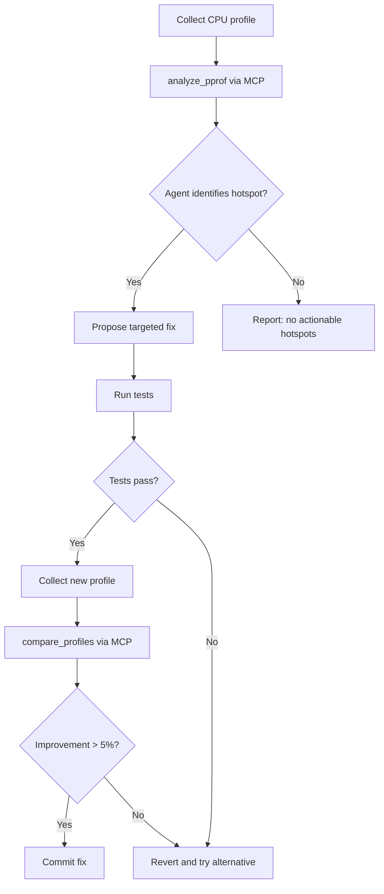

# Codex CLI for Performance Profiling and Optimisation: MCP-Driven Flamegraphs, Bottleneck Analysis, and Automated Fix Loops


---

Performance profiling has always been a two-phase problem: first you collect data, then you interpret it. The interpretation phase — staring at flame graphs, correlating heap snapshots, tracing lock contention — is exactly the kind of pattern-matching that large language models excel at. With Codex CLI's MCP integration, you can now wire profiling tools directly into agentic workflows, creating closed-loop systems that profile, diagnose, fix, and re-measure without manual context-switching.

This article covers the MCP server landscape for performance profiling, AGENTS.md patterns for optimisation work, and four practical workflows that turn Codex CLI into a performance engineer's co-pilot.

## The MCP Profiling Server Landscape

Three MCP servers currently provide profiling capabilities that Codex CLI can consume.

### Profiler-MCP (Sarthak160)

The most polyglot option, Profiler-MCP exposes two tools — `analyze_profile` and `open_interactive_ui` — across three runtimes [^1]:

- **Go**: ingests `cpu.prof` and `mem.prof` files via `pprof`
- **Python**: executes `.py` scripts with `cProfile` and returns cumulative timing data
- **Java**: runs `.jar` files with Java Flight Recorder for 60-second profiling windows, generating `.jfr` recordings

Installation is straightforward:

```bash
git clone https://github.com/Sarthak160/Profiler-MCP.git
cd Profiler-MCP
go build -o profiler-mcp main.go
```

### Pprof Analyzer MCP (ZephyrDeng)

A Go-specific server with deeper analytical capabilities, offering seven tools [^2]:

| Tool | Purpose |
|------|---------|
| `analyze_pprof` | Serialised analysis of profile data |
| `generate_flamegraph` | SVG flame graph generation via `go tool pprof` |
| `open_interactive_pprof` | Interactive web UI (macOS) |
| `detect_memory_leaks` | Heap snapshot comparison |
| `compare_profiles` | Regression detection between two profiles |
| `analyze_heap_time_series` | Memory growth tracking across snapshots |
| `disconnect_pprof_session` | Background process cleanup |

Supported profile types include CPU, heap, goroutine, allocs, mutex, and block [^2]. Output formats span text, markdown, JSON, and flamegraph-JSON (compatible with `d3-flame-graph`) [^2].

```bash
go install github.com/ZephyrDeng/pprof-analyzer-mcp@latest
```

Graphviz is required for SVG flame graph generation.

### CodSpeed MCP Server

CodSpeed takes a different approach: rather than analysing raw profiles, it provides benchmark-aware tools that query a hosted performance database [^3]. Five capabilities ship with the server:

1. **Flamegraph querying** — surfaces functions with the highest self-time and walks the call tree
2. **Run comparison** — generates regression/improvement reports between runs
3. **Run details inspection** — examines individual benchmark results
4. **Run browsing** — accesses recent runs with commit, branch, and PR metadata
5. **Repository listing** — views all CodSpeed-enabled repositories

CodSpeed supports Rust, Python, Node.js, Go, C/C++, and additional languages [^3].

## Configuring MCP Servers in Codex CLI

Wire profiling servers into your `codex.toml` or project-level `.codex/config.toml`:

```toml
[mcp_servers.profiler]
command = "/path/to/profiler-mcp"
transport = "stdio"

[mcp_servers.pprof-analyzer]
command = "pprof-analyzer-mcp"
transport = "stdio"

[mcp_servers.codspeed]
command = "npx"
args = ["-y", "@codspeed/mcp-server"]
transport = "stdio"
env = { CODSPEED_TOKEN = "${CODSPEED_TOKEN}" }
```

For Go projects using both pprof servers, prefer the ZephyrDeng analyser for its richer tool set (memory leak detection, time-series analysis) and reserve Profiler-MCP for cross-language work.

## AGENTS.md Patterns for Performance Work

Encode profiling conventions in your project's `AGENTS.md` to keep the agent on track:

```markdown
## Performance Optimisation Rules

1. **Measure before changing** — always collect a baseline profile before
   proposing optimisations. Never guess at bottlenecks.
2. **Profile types** — use CPU profiles for latency work, heap profiles for
   memory work, mutex profiles for contention work.
3. **Small, reversible changes** — each optimisation should be a single
   commit that can be reverted independently.
4. **Re-measure after every change** — compare the new profile against the
   baseline. Reject changes that show < 5% improvement on the target metric.
5. **Preserve correctness** — run the full test suite after every
   optimisation. Performance wins that break tests are rejected.
6. **Benchmark files** — benchmarks live in `*_bench_test.go` (Go),
   `benchmarks/` (Python/Node), or `benches/` (Rust). Never delete or
   weaken existing benchmarks.
```

This prevents the common anti-pattern where an agent proposes speculative optimisations without profiling data to justify them [^4].

## Workflow 1: Profile-Diagnose-Fix Loop (Go)

The core pattern: collect a profile, feed it to the MCP server, let the agent diagnose and fix, then re-measure.



In practice, start the session with a prompt like:

```
Profile the API server using the Go benchmark suite. Collect a CPU profile,
analyse it with the pprof-analyzer MCP server, identify the top 3 hotspots
by cumulative time, and propose fixes for each. After each fix, re-run the
benchmark and compare profiles. Only keep fixes that show measurable
improvement without breaking tests.
```

The agent will call `analyze_pprof` with the profile path, receive structured hotspot data, and apply fixes iteratively.

## Workflow 2: Memory Leak Detection

The pprof-analyzer's `detect_memory_leaks` and `analyze_heap_time_series` tools enable a structured leak-hunting workflow [^2]:

1. Collect heap profiles at intervals: `curl http://localhost:6060/debug/pprof/heap > heap_t0.prof`
2. Apply load, then collect again: `heap_t1.prof`, `heap_t2.prof`
3. Feed the series to the MCP server for trend analysis

```bash
codex exec --model gpt-5.4-mini \
  "Use the pprof-analyzer to analyze heap profiles heap_t0.prof, heap_t1.prof,
   and heap_t2.prof as a time series. Identify any allocation sites showing
   monotonic growth. For each suspected leak, trace the retention path and
   propose a fix."
```

The `analyze_heap_time_series` tool returns growth rates per allocation site, letting the agent distinguish genuine leaks from transient allocation bursts [^2].

## Workflow 3: CodSpeed Optimise Loop

CodSpeed's `codspeed-optimize` skill implements a complete optimisation loop [^3]:

```
measure → analyse flamegraph → implement targeted change → re-measure → compare
```

This loop continues until no further gains are found. Install and activate it:

```bash
npx skills add CodSpeedHQ/codspeed
```

Then prompt Codex CLI:

```
Using the CodSpeed optimize skill, improve the performance of the
parse_document function. Target a 20% reduction in wall-clock time.
```

The skill handles benchmark execution, flamegraph analysis, and regression comparison automatically. It supports Rust, Python, Node.js, Go, and C/C++ projects [^3].

## Workflow 4: Cross-Language Profiling with `codex exec`

For polyglot services, use `codex exec` to orchestrate profiling across language boundaries:

```bash
codex exec --model gpt-5.5 \
  "Profile the following components and identify the overall bottleneck:
   1. Go API gateway (collect CPU profile from /debug/pprof/profile)
   2. Python ML service (profile with cProfile via the Profiler-MCP)
   3. Node.js frontend SSR (profile with clinic.js)

   Compare latency contributions across all three services. Identify which
   service contributes most to p95 latency and propose targeted optimisations."
```

Use GPT-5.5 for cross-language analysis where the agent must reason across multiple profiling formats simultaneously [^5]. For single-language work, GPT-5.4-mini provides sufficient reasoning at lower cost [^5].

## Model Selection for Performance Work

| Task | Recommended Model | Rationale |
|------|-------------------|-----------|
| Single-function optimisation | GPT-5.4-mini | Focused scope, cost-efficient |
| Cross-service bottleneck analysis | GPT-5.5 | Complex multi-format reasoning |
| Benchmark generation | GPT-5.4-mini | Template-driven, lower complexity |
| Memory leak diagnosis | GPT-5.5 | Requires correlating time-series data |
| Routine regression checks | GPT-5.4-mini | Structured comparison, batch-friendly |

## Sandbox Configuration

Profiling workflows need network access for fetching remote profiles and may need filesystem write access for generating flame graph SVGs:

```toml
[permissions]
network_access = true   # for fetching /debug/pprof endpoints
writable_paths = ["./profiles", "./flamegraphs", "./benchmarks"]
```

For CodSpeed integration, ensure `CODSPEED_TOKEN` is available in the environment. Use a secrets manager or `.env` file excluded from version control [^6].

## Limitations

- **No live process attachment**: MCP profiling servers work with captured profile files, not live process attachment. You must collect profiles separately (via `pprof` endpoints, `cProfile`, or JFR) before feeding them to the agent.
- **Flamegraph rendering**: SVG flame graphs generated by pprof-analyzer require Graphviz. The agent cannot visually inspect SVGs — it works from the structured JSON/text analysis output.
- **Training data lag**: GPT-5.5 and GPT-5.4-mini may not recognise profiling APIs from very recent library releases. The MCP tool descriptions compensate for this by providing structured output the agent can reason about regardless of training data.
- **Java Flight Recorder duration**: Profiler-MCP's JFR profiling runs for a fixed 60-second window [^1], which may miss intermittent issues. ⚠️ There is no current configuration option to adjust this duration.
- **CodSpeed requires hosted benchmarks**: The CodSpeed MCP server queries a hosted database, so your project must already have CodSpeed CI integration configured [^3].

## Citations

[^1]: Profiler-MCP GitHub repository. [https://github.com/Sarthak160/Profiler-MCP](https://github.com/Sarthak160/Profiler-MCP)

[^2]: Pprof Analyzer MCP Server GitHub repository. [https://github.com/ZephyrDeng/pprof-analyzer-mcp](https://github.com/ZephyrDeng/pprof-analyzer-mcp)

[^3]: CodSpeed MCP Server and Agent Skills changelog, 16 March 2026. [https://codspeed.io/changelog/2026-03-16-mcp-server](https://codspeed.io/changelog/2026-03-16-mcp-server)

[^4]: OpenAI Codex CLI Best Practices documentation. [https://developers.openai.com/codex/learn/best-practices](https://developers.openai.com/codex/learn/best-practices)

[^5]: OpenAI Models documentation — GPT-5.5 and GPT-5.4-mini specifications. [https://developers.openai.com/api/docs/models/all](https://developers.openai.com/api/docs/models/all)

[^6]: OpenAI Codex CLI Custom Instructions with AGENTS.md guide. [https://developers.openai.com/codex/guides/agents-md](https://developers.openai.com/codex/guides/agents-md)
