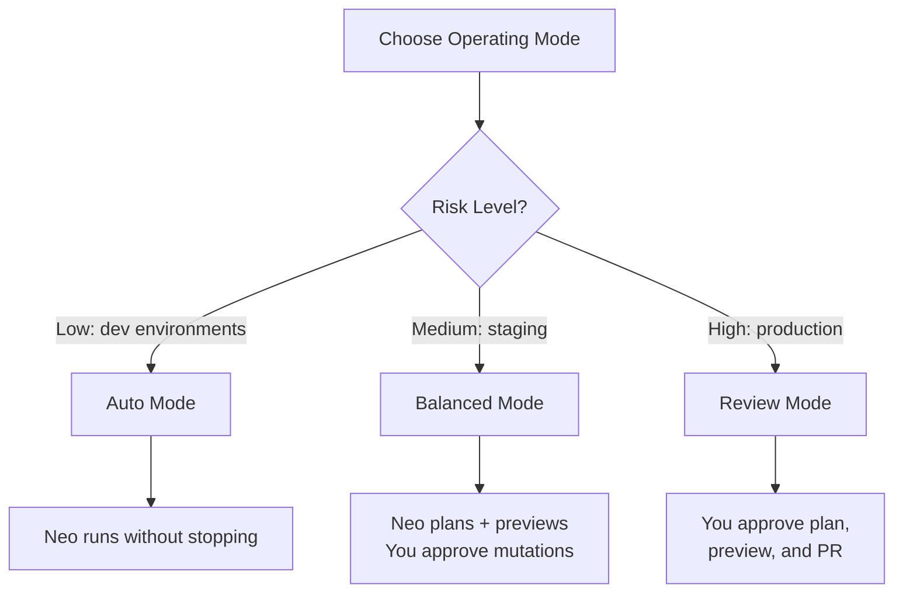
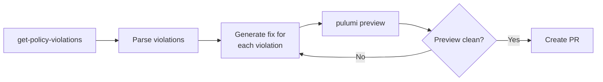

# Codex CLI for Pulumi Infrastructure-as-Code: MCP Server, Neo Delegation, and Agent-Native Workflows


---

Terraform dominated the infrastructure-as-code conversation for a decade, but Pulumi's bet on real programming languages — TypeScript, Python, Go, C# — makes it a natural fit for LLM-driven workflows. As of May 2026, over 20% of infrastructure deployments on the Pulumi platform are handled by LLMs[^1]. This article covers the three integration surfaces between Codex CLI and Pulumi: the hosted MCP server, the `pulumi neo` CLI agent, and the agent skills system — plus practical AGENTS.md patterns and workflow recipes for shipping infrastructure from your terminal.

## The Pulumi MCP Server

Pulumi's MCP server is hosted at `https://mcp.ai.pulumi.com/mcp` and uses HTTP transport with OAuth authentication[^2]. Unlike stdio-based MCP servers that run locally, this is a remote service — no local installation required beyond configuring Codex CLI to connect.

### Configuration

Add the following to your project-scoped `.codex/config.toml` (or `~/.codex/config.toml` for global access):

```toml
[mcp_servers.pulumi]
url = "https://mcp.ai.pulumi.com/mcp"
bearer_token_env_var = "PULUMI_ACCESS_TOKEN"
```

On first connection, Pulumi triggers a browser-based OAuth flow where you select your organisation[^2]. Set `PULUMI_ACCESS_TOKEN` in your shell environment to skip the interactive prompt in CI or `codex exec` pipelines.

### Available Tools

The MCP server exposes four tool categories[^2]:

| Category | Tools | Purpose |
|----------|-------|---------|
| **Cloud** | `get-stacks`, `resource-search`, `get-policy-violations`, `get-users` | Query live infrastructure state |
| **Neo** | `neo-bridge`, `neo-get-tasks`, `neo-continue-task`, `neo-reset-conversation` | Delegate to Pulumi's autonomous agent |
| **Registry** | `get-type`, `get-resource`, `get-function`, `list-resources`, `list-functions` | Look up provider schemas and documentation |
| **Deployment** | `deploy-to-aws` | Generate deployment code |

The `resource-search` tool accepts Lucene query syntax, allowing Codex to search across all stacks by resource type, name, tags, or properties[^2]. This is particularly powerful for drift detection and audit workflows.

## Pulumi Neo: The Delegated Infrastructure Agent

The `pulumi neo` command brings Pulumi's autonomous infrastructure agent to your terminal[^1]. Neo can run the full Pulumi CLI — including stack imports, state management, and plugin operations — plus kubectl, Helm, AWS CLI, GCP CLI, and Oracle Cloud CLI[^3].

### Operating Modes

Neo offers three autonomy levels[^3]:



- **Review Mode** — approval required at every stage: task plan, preview, and pull request
- **Balanced Mode** — Neo handles planning and previews; you approve only mutating operations
- **Auto Mode** — Neo operates independently without interruption

### Neo via MCP

From within a Codex CLI session, you can delegate to Neo through the `neo-bridge` MCP tool rather than spawning a separate process. This is useful when Codex identifies an infrastructure task mid-workflow:

```bash
# Codex CLI prompt example
"Search for all Lambda functions with runtime python3.9 across our stacks,
then use neo-bridge to create a migration plan upgrading them to python3.13"
```

Neo returns a link to track progress in the Pulumi Console, and you can check status via `neo-get-tasks`[^2].

## The `pulumi do` Command

The new `pulumi do` verb enables imperative CRUD operations on individual cloud resources without scaffolding a full Pulumi project[^1]:

```bash
# Create an EKS cluster with built-in best practices
pulumi do create eks:Cluster

# Update a Cloudflare R2 bucket's tags
pulumi do update cloudflare:r2:Bucket --tags '{ "env": "staging" }'

# List all S3 buckets
pulumi do list aws:s3:Bucket
```

Operations are stateful and subject to the same policy framework as a regular `pulumi up`, but they skip project structure entirely[^1]. This is ideal for `codex exec` one-liners:

```bash
codex exec "List all our AWS RDS instances and check which ones are running
outdated engine versions" | pulumi do list aws:rds:Instance --json
```

As complexity grows, you can eject from `pulumi do` into a full IaC project[^1].

## Agent Skills

Pulumi ships 10 agent skills in two plugins[^4]:

**Authoring Plugin** (6 skills): best-practices, component, automation-api, esc, upgrade-provider, upstream-patches

**Migration Plugin** (4 skills): terraform-to-pulumi, cloudformation-to-pulumi, cdk-to-pulumi, arm-to-pulumi

Install all skills for Codex CLI:

```bash
npx skills add pulumi/agent-skills --skill '*'
```

Or install selectively:

```bash
npx skills add pulumi/agent-skills/migration --skill '*'
npx skills add pulumi/agent-skills/authoring --skill '*'
```

Skills activate automatically based on context[^4]. When Codex detects you are working with Terraform files and you ask to migrate, the `terraform-to-pulumi` skill provides the conversion patterns an experienced practitioner would follow.

## AGENTS.md for Pulumi Projects

An `AGENTS.md` file in your repository root teaches Codex the idioms and constraints of your infrastructure codebase. Here is a template for Pulumi TypeScript projects:

```markdown
# AGENTS.md — Pulumi TypeScript Infrastructure

## Stack Architecture
- Stacks follow the pattern: {project}-{environment} (e.g. api-staging, api-production)
- All stacks use the same Pulumi program with per-environment config in Pulumi.{stack}.yaml

## Coding Conventions
- All resources MUST have explicit `name` properties derived from the stack name
- Use ComponentResource for any grouping of 3+ related resources
- Never hardcode AWS account IDs, regions, or secrets — use Pulumi Config or ESC
- Export all resource identifiers needed by downstream stacks via `pulumi.export()`
- Use `dependsOn` explicitly when resource ordering matters; do not rely on implicit ordering

## Secret Handling
- All secrets MUST use `pulumi.secret()` or ESC environment references
- Never pass secrets as plain-text Config values
- Rotate secrets via ESC, not by editing stack config directly

## Safety Rules
- Never run `pulumi destroy` without explicit human approval
- Always run `pulumi preview` before `pulumi up`
- State imports require Review Mode in Neo
- Tag all resources with: project, environment, managed-by: pulumi, team

## Testing
- Unit tests use @pulumi/pulumi/runtime mocking
- Integration tests run against a dedicated test stack with TTL
- Policy packs enforce tagging, encryption, and public-access rules
```

## Practical Workflows

### Pattern 1: Resource Audit via MCP

Use the Pulumi MCP server's `resource-search` to audit infrastructure without leaving Codex:

```bash
codex exec "Connect to the Pulumi MCP server and search for all
EC2 instances without the 'team' tag. Output a markdown table
with instance ID, stack, and region."
```

The `resource-search` tool's Lucene query syntax makes this a single MCP call rather than iterating through stacks manually.

### Pattern 2: Terraform Migration Pipeline

Combine Codex CLI's `codex exec` with Pulumi's migration skills for batch conversion:

```bash
find modules/ -name "*.tf" -path "*/main.tf" | while read f; do
  dir=$(dirname "$f")
  codex exec "Convert the Terraform module in $dir to Pulumi TypeScript.
  Follow the terraform-to-pulumi skill guidance. Write output to
  pulumi-$(basename $dir)/index.ts"
done
```

The migration skill handles provider mapping, state resource correspondence, and idiomatic Pulumi patterns[^4].

### Pattern 3: Policy Violation Remediation Loop



```bash
codex exec "Use the Pulumi MCP server to fetch all policy violations
for the api-production stack. For each violation, generate a fix,
run pulumi preview, and output a summary of changes."
```

### Pattern 4: Ephemeral Environment Scaffolding

Pulumi now offers ephemeral agent accounts — agents can use free Pulumi Cloud accounts directly from Codex without manual signup[^1]. Combined with `npx pulumi` for zero-install operation, this enables fully autonomous environment creation:

```bash
codex exec "Create a new Pulumi TypeScript project for a staging
environment with: VPC, ECS Fargate cluster, RDS Postgres, and
ALB. Use ComponentResource for each logical group. Include
a TTL tag of 7 days on all resources."
```

## Model Selection

For Pulumi work with Codex CLI:

| Task | Recommended Model | Rationale |
|------|-------------------|-----------|
| Multi-service architecture design | GPT-5.5 | Complex dependency graphs, cross-stack references[^5] |
| Single-resource creation, config changes | GPT-5.4-mini | Straightforward, lower cost[^5] |
| Terraform migration | GPT-5.5 | Provider mapping requires broad knowledge |
| Policy violation fixes | GPT-5.4-mini | Pattern-matching against known rules |

## Sandbox Configuration

Pulumi operations require network access to both the Pulumi Cloud API and your cloud provider. Configure your permission profile accordingly:

```toml
[permission_profiles.pulumi]
network_access = ["api.pulumi.com", "*.amazonaws.com", "registry.npmjs.org"]
file_write = ["Pulumi.*", "*.ts", "*.py", "*.go"]
```

For `codex exec` pipelines that call `pulumi preview` or `pulumi up`, you will also need the Pulumi CLI binary available in `$PATH` — or use `npx pulumi` which handles installation automatically[^1].

## Composing MCP Servers

The Pulumi MCP server works well alongside other infrastructure MCP servers. A typical DevOps configuration might compose:

```toml
[mcp_servers.pulumi]
url = "https://mcp.ai.pulumi.com/mcp"
bearer_token_env_var = "PULUMI_ACCESS_TOKEN"

[mcp_servers.context7]
command = "npx"
args = ["-y", "@upstash/context7-mcp"]

[mcp_servers.github]
command = "npx"
args = ["-y", "@modelcontextprotocol/server-github"]
```

This gives Codex simultaneous access to infrastructure state (Pulumi), live documentation (Context7), and repository context (GitHub)[^6].

## Limitations

- **OAuth flow requires a browser** — headless CI environments need a pre-generated `PULUMI_ACCESS_TOKEN` rather than the interactive OAuth flow
- **Neo delegation is asynchronous** — `neo-bridge` returns a task ID, not immediate results; complex deployments may take minutes
- **`pulumi do` is stateful but separate** — resources created via `pulumi do` live in their own state; migrating to a full project requires a state import
- **MCP server is remote** — latency depends on network; no offline operation unlike stdio-based MCP servers
- **Agent skills require `npx`** — the skills CLI depends on Node.js; pure Python or Go Pulumi projects still need Node.js installed for skill management ⚠️
- **Training data lag** — GPT-5.5 and GPT-5.4-mini may not know the latest Pulumi providers or resource schemas; the Registry MCP tools (`get-resource`, `get-type`) mitigate this by providing live schema lookups[^2]

## Citations

[^1]: Pulumi Blog, "The Agentic Infrastructure Era", May 2026. [https://www.pulumi.com/blog/the-agentic-infrastructure-era/](https://www.pulumi.com/blog/the-agentic-infrastructure-era/)
[^2]: Pulumi Docs, "Pulumi MCP Server — AI-Assisted Infrastructure as Code". [https://www.pulumi.com/docs/ai/mcp-server/](https://www.pulumi.com/docs/ai/mcp-server/)
[^3]: Pulumi Blog, "Neo Gets Smarter: New Modes, CLI Access & Sonnet 4.5". [https://www.pulumi.com/blog/neo-levels-up/](https://www.pulumi.com/blog/neo-levels-up/)
[^4]: Pulumi Docs, "Pulumi Agent Skills". [https://www.pulumi.com/docs/ai/skills/](https://www.pulumi.com/docs/ai/skills/)
[^5]: OpenAI, "Models — Codex". [https://developers.openai.com/codex/models](https://developers.openai.com/codex/models)
[^6]: OpenAI, "Model Context Protocol — Codex CLI". [https://developers.openai.com/codex/mcp](https://developers.openai.com/codex/mcp)
