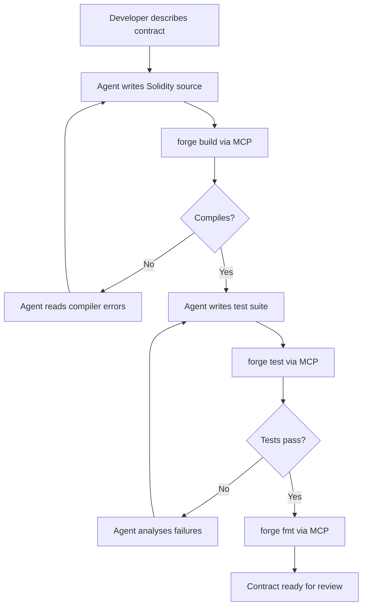

# Codex CLI for Solidity and Smart Contract Development: Foundry MCP, Security Auditing, and Agent-Driven Contract Workflows


---

## Introduction

Smart contract development occupies a peculiar niche in software engineering: the code is immutable once deployed, bugs can drain millions in minutes, and the compiler version matters more than in almost any other language. These constraints make Solidity development simultaneously an ideal and a treacherous use case for AI coding agents.

Codex CLI's sandbox isolation, MCP integration, and structured output capabilities make it a practical assistant for the Foundry-based workflow that dominates professional Solidity development in 2026. Two categories of MCP server — development tooling (Foundry MCP) and security analysis (Solidity Audit MCP, Aderyn, Solodit) — provide the agent with direct access to forge, cast, anvil, and static analysers. Combined with the ethskills knowledge base and careful AGENTS.md conventions, Codex CLI can assist across the full contract lifecycle: writing, testing, auditing, and preparing deployments.

This article covers the practical integration points, the safety guardrails that smart contract work demands, and the workflow patterns that make agent-assisted Solidity development productive without being reckless.

---

## The Foundry Toolchain in 2026

Foundry v1.7.0 remains the dominant Solidity development framework, built in Rust and comprising four tools [^1]:

- **Forge** — compiles, tests, fuzzes, debugs and deploys contracts
- **Anvil** — local Ethereum development node
- **Cast** — Swiss Army knife for on-chain interactions and RPC calls
- **Chisel** — Solidity REPL for rapid experimentation

Solidity itself is at **v0.8.35** (April 2026), introducing the `erc7201` builtin for namespaced storage layouts and an experimental SSA-form control-flow graph code generator [^2]. The v0.8.36 nightly builds are already available.

Codex CLI operates against this toolchain through MCP servers rather than direct tool invocation, which keeps the agent's sandbox intact whilst providing full access to Foundry's capabilities.

---

## MCP Servers for Solidity Development

### Foundry MCP Server

The `foundry-mcp-server` by PraneshASP provides the primary development bridge [^3]. It exposes tools across five categories:

```json
{
  "mcpServers": {
    "foundry": {
      "command": "npx",
      "args": ["-y", "foundry-mcp-server"],
      "env": {
        "RPC_URL": "http://localhost:8545"
      }
    }
  }
}
```

**Network management** — start, stop, and query Anvil instances; connect to remote RPC endpoints; retrieve chain information.

**Contract operations** — read-only function calls via Cast, storage slot reading, transaction receipt retrieval, and event log queries.

**Development tools** — create and edit Solidity files, install dependencies, execute scripts, and deploy contracts. The server maintains a persistent workspace at `~/.mcp-foundry-workspace`.

**Bytecode analysis** — powered by Heimdall-rs, the server can disassemble EVM bytecode to opcodes, decode raw calldata without an ABI, decompile bytecode back to Solidity, and generate control-flow graphs [^3].

**Utilities** — unit conversion (wei/gwei/hex), contract address calculation, bytecode size checking, and gas estimation.

⚠️ The `PRIVATE_KEY` environment variable should only be set for local Anvil instances. Never configure a mainnet private key in an MCP server accessible to an LLM agent.

### Solidity Audit MCP Server

The Solidity Audit MCP integrates three analysis engines into a single server [^4]:

```json
{
  "mcpServers": {
    "solidity-audit": {
      "command": "npx",
      "args": ["-y", "solidity-audit-mcp"],
      "env": {
        "SLITHER_PATH": "/usr/local/bin/slither",
        "ADERYN_PATH": "/usr/local/bin/aderyn"
      }
    }
  }
}
```

- **Slither** — Python-based static analysis by Trail of Bits, detecting reentrancy, boolean equality, unused return values, and 90+ other vulnerability patterns [^5]
- **Aderyn** — Rust-based static analyser by Cyfrin, focusing on gas optimisations and common vulnerability patterns [^6]
- **Foundry integration** — runs `forge test` and `forge coverage` as part of the audit pipeline

The server deduplicates findings across engines and sorts them by severity, providing a unified vulnerability report.

### Solodit MCP Server

Solodit acts as a search engine for historical audit findings, aggregating vulnerability reports from public audits across the ecosystem [^7]. When the agent encounters an unfamiliar pattern, it can query Solodit for similar vulnerabilities found in production contracts.

### ethskills Knowledge Base

The ethskills project by Austin Griffith provides bot-readable Ethereum knowledge as fetchable SKILL.md files [^8]. Each module lives at `https://ethskills.com/<topic>/SKILL.md` and covers topics including:

- **Standards** — ERC-20, ERC-721, ERC-8004, EIP-7702
- **Security** — vulnerability patterns, pre-deploy checklists
- **Testing** — unit, fuzz, fork, and invariant testing strategies
- **Gas & Costs** — mainnet and L2 pricing data
- **Layer 2s** — Base, Arbitrum, Optimism, zkSync deployment differences

The agent can fetch these on demand to correct its Ethereum knowledge before generating code.

---

## AGENTS.md for Solidity Projects

Smart contract development demands stricter agent conventions than typical software projects. A minimal AGENTS.md for a Foundry project:

```markdown
# AGENTS.md — Solidity/Foundry Project

## Toolchain
- Solidity 0.8.35, Foundry v1.7.0
- Build: `forge build --deny-warnings`
- Test: `forge test -vvv`
- Coverage: `forge coverage`
- Format: `forge fmt`
- Static analysis: `slither . --exclude-informational`

## Conventions
- All contracts use named imports: `import {ERC20} from "@openzeppelin/contracts/token/ERC20/ERC20.sol";`
- Custom errors over require strings: `error InsufficientBalance(uint256 available, uint256 required);`
- NatSpec on every external/public function
- Events emitted for every state mutation
- CEI pattern (Checks-Effects-Interactions) enforced on all external calls
- No floating pragmas: use `pragma solidity 0.8.35;` exactly

## Safety Rules
- NEVER generate deployment scripts with real private keys
- NEVER approve transactions on mainnet without explicit human review
- Always run `slither` before suggesting a contract is ready for review
- Flag any use of `selfdestruct`, `delegatecall`, or inline assembly
- Verify OpenZeppelin imports against v5.x — do not use v4.x patterns
- All arithmetic is checked by default in 0.8.x — do not add SafeMath

## Testing
- Minimum one test per external function
- Fuzz tests for functions accepting user input
- Fork tests against mainnet state for integrations
- Invariant tests for any token or accounting logic

## Knowledge
- Fetch https://ethskills.com/security/SKILL.md before any audit task
- Fetch https://ethskills.com/testing/SKILL.md before writing test suites
```

The key difference from a standard AGENTS.md is the **Safety Rules** section. In web development, a bug means a broken page. In Solidity, a bug means lost funds. The agent must be constrained accordingly.

---

## Workflow Patterns

### Pattern 1: Contract Development with Forge Compilation Loop

The most common workflow uses the Foundry MCP server as a compilation oracle:



The agent iterates against the Solidity compiler just as it would against `cargo check` in Rust or `go build` in Go. Foundry's sub-second compilation makes this loop practical even in interactive mode.

### Pattern 2: Security Audit Pipeline

A three-stage audit workflow combining automated analysis with agent reasoning:

```bash
codex exec \
  --prompt "Audit all contracts in src/ for security vulnerabilities. \
    Run slither via the solidity-audit MCP server. \
    Run aderyn via the solidity-audit MCP server. \
    Cross-reference findings with Solodit for known vulnerability patterns. \
    Produce a severity-ranked report with: \
    1. Critical/High findings with exploit scenarios \
    2. Medium findings with recommended fixes \
    3. Gas optimisations \
    4. Informational notes" \
  --output-schema audit-report.schema.json
```

The structured output schema ensures the audit report is machine-parseable, enabling integration with CI gates that block deployment on critical findings.

### Pattern 3: Fuzz Test Generation

Foundry's built-in fuzzer is one of its strongest features. The agent can generate comprehensive fuzz tests by reasoning about function signatures:

```solidity
// Agent-generated fuzz test
function testFuzz_transfer(address to, uint256 amount) public {
    // Bound inputs to valid ranges
    vm.assume(to != address(0));
    vm.assume(to != address(token));
    amount = bound(amount, 0, token.balanceOf(address(this)));

    uint256 senderBefore = token.balanceOf(address(this));
    uint256 receiverBefore = token.balanceOf(to);

    token.transfer(to, amount);

    assertEq(token.balanceOf(address(this)), senderBefore - amount);
    assertEq(token.balanceOf(to), receiverBefore + amount);
}
```

The agent understands Foundry's `vm.assume` and `bound` cheatcodes, making it effective at writing fuzz tests that explore edge cases without reverting on invalid inputs.

### Pattern 4: Fork Testing Against Mainnet State

For contracts that integrate with existing DeFi protocols, fork testing verifies behaviour against real on-chain state:

```solidity
function testFork_swapOnUniswap() public {
    // Fork mainnet at a specific block
    vm.createSelectFork("mainnet", 22_500_000);

    // Test against real Uniswap V3 pool state
    ISwapRouter router = ISwapRouter(UNISWAP_V3_ROUTER);
    // ... swap logic ...
}
```

The Foundry MCP server can start Anvil with `--fork-url` to provide the agent with a forked environment for testing integrations.

### Pattern 5: Pre-Deployment Verification Checklist

Before any deployment, the agent runs a structured verification:

```bash
codex exec \
  --prompt "Pre-deployment checklist for src/MyContract.sol: \
    1. Verify pragma matches target Solidity version (0.8.35) \
    2. Run forge build --deny-warnings \
    3. Run forge test with -vvv \
    4. Run forge coverage — flag any external function below 90% \
    5. Run slither — confirm zero critical/high findings \
    6. Verify all constructor arguments are documented \
    7. Check bytecode size is under 24KB (EIP-170 limit) \
    8. List all external dependencies and their versions \
    9. Confirm events are emitted for all state changes \
    10. Verify CEI pattern on all external calls" \
  --output-schema deployment-checklist.schema.json
```

---

## Model Selection for Solidity Tasks

Solidity's unique constraints influence model selection:

| Task | Recommended Model | Rationale |
|---|---|---|
| Contract architecture, interface design | GPT-5.5 | Requires deep reasoning about security implications and economic incentives [^9] |
| Implementation from specification | GPT-5.5 | Solidity's security surface demands the strongest reasoning |
| Test writing, fuzz test generation | GPT-5.4-mini | Pattern-based work with clear structure; faster iteration |
| Gas optimisation | GPT-5.5 | Requires understanding of EVM opcode costs and storage layout |
| Audit report generation | GPT-5.5 | Cross-referencing multiple analysis tools requires strong synthesis |
| Documentation, NatSpec comments | GPT-5.4-mini | Formulaic output, lower stakes |

For ChatGPT-authenticated sessions, GPT-5.5 is the default model [^9]. For API-key authenticated sessions, GPT-5.2-codex remains the available option. Given the high-consequence nature of smart contract code, defaulting to the strongest available model is recommended for all contract-writing tasks.

---

## Sandbox Configuration

Solidity development requires network access for dependency installation and fork testing, but should be tightly scoped:

```toml
# ~/.codex/config.toml

[sandbox]
writable_roots = ["./src", "./test", "./script", "./lib"]

[permissions]
# Allow forge, cast, anvil, and dependency management
allow_commands = [
  "forge *",
  "cast *",
  "anvil *",
  "soldeer install *",
  "npm install *"
]

# Network access for fork testing and dependency fetching
allow_network = [
  "eth-mainnet.g.alchemy.com",
  "mainnet.infura.io",
  "raw.githubusercontent.com",
  "registry.npmjs.org"
]
```

The writable roots are restricted to standard Foundry project directories. The agent should not have write access to deployment artefacts or key stores.

---

## Limitations and Safety Considerations

**Training data lag** — Solidity evolves rapidly. GPT-5.5's training data may not include the latest v0.8.35 features such as `erc7201` or the SSA CFG code generator. Fetch the ethskills standards module to supplement the agent's knowledge [^8].

**Economic reasoning gaps** — LLMs can identify syntactic vulnerability patterns but struggle with economic attack vectors: oracle manipulation, flash loan arbitrage, governance attacks. These require human review by a security specialist [^10].

**Deployment must remain human-gated** — The Foundry MCP server supports transaction signing via `PRIVATE_KEY`, but this should never be configured for mainnet. All mainnet deployments should go through a multisig or hardware wallet with human approval.

**Gas estimation accuracy** — The agent can estimate gas costs using Cast, but gas prices fluctuate. Never treat agent-generated gas estimates as commitments.

**L2 deployment differences** — Contracts compiled for mainnet may behave differently on L2s due to opcode pricing differences, precompile availability, and EIP support. The ethskills L2 module documents these differences but the agent may not account for them automatically [^8].

**OpenZeppelin version confusion** — The agent may mix v4.x and v5.x OpenZeppelin patterns. The AGENTS.md should specify the exact version and the agent should verify imports against the installed version in `lib/`.

---

## Conclusion

Codex CLI's MCP ecosystem now provides genuine utility for Solidity developers: Foundry MCP for development, Solidity Audit MCP for security analysis, Solodit for historical vulnerability research, and ethskills for correcting the agent's Ethereum knowledge. The combination is more capable than any individual tool.

The critical difference from other language workflows is that safety must be a first-class concern, not an afterthought. Restrict the agent's permissions, gate all deployments on human approval, and treat every agent-generated contract the way you would treat a junior developer's first Solidity PR: useful starting point, mandatory review before it touches real value.

---

## Citations

[^1]: Foundry GitHub repository — Foundry is a blazing fast, portable and modular toolkit for Ethereum application development written in Rust. [https://github.com/foundry-rs/foundry](https://github.com/foundry-rs/foundry)

[^2]: Solidity v0.8.35 Release Announcement — April 29, 2026. Introduces `erc7201` builtin and experimental SSA CFG code generator. [https://www.soliditylang.org/blog/2026/04/29/solidity-0.8.35-release-announcement/](https://www.soliditylang.org/blog/2026/04/29/solidity-0.8.35-release-announcement/)

[^3]: PraneshASP/foundry-mcp-server — MCP server enabling LLM assistants to perform Solidity development and blockchain operations through the Foundry toolchain. [https://github.com/PraneshASP/foundry-mcp-server](https://github.com/PraneshASP/foundry-mcp-server)

[^4]: Solidity Audit MCP — AI-powered smart contract security audits integrating Slither, Aderyn, and Foundry. [https://mcpmarket.com/server/solidity-audit](https://mcpmarket.com/server/solidity-audit)

[^5]: Slither — Solidity & Vyper static analysis framework by Trail of Bits. [https://github.com/crytic/slither](https://github.com/crytic/slither)

[^6]: Aderyn MCP Server — Rust-based Solidity static analyser by Cyfrin. [https://skywork.ai/skypage/en/unlocking-smart-contract-security/1977965316714991616](https://skywork.ai/skypage/en/unlocking-smart-contract-security/1977965316714991616)

[^7]: Solodit MCP Server — Search engine for historical smart contract audit findings. [https://skywork.ai/skypage/en/solodit-mcp-server-ai-engineers/1981548083203338240](https://skywork.ai/skypage/en/solodit-mcp-server-ai-engineers/1981548083203338240)

[^8]: ethskills — Ethereum Knowledge for AI Agents by Austin Griffith, BuidlGuidl, and the Ethereum Foundation. [https://ethskills.com/](https://ethskills.com/)

[^9]: OpenAI Models — Codex CLI model selection documentation. GPT-5.5 is the default for ChatGPT-authenticated sessions. [https://developers.openai.com/codex/models](https://developers.openai.com/codex/models)

[^10]: "How AI Agents Can Audit Smart Contracts in 2026: A Technical Deep-Dive" — DEV Community, 2026. [https://dev.to/ohmygod/how-ai-agents-can-audit-smart-contracts-in-2026-a-technical-deep-dive-5gl](https://dev.to/ohmygod/how-ai-agents-can-audit-smart-contracts-in-2026-a-technical-deep-dive-5gl)
