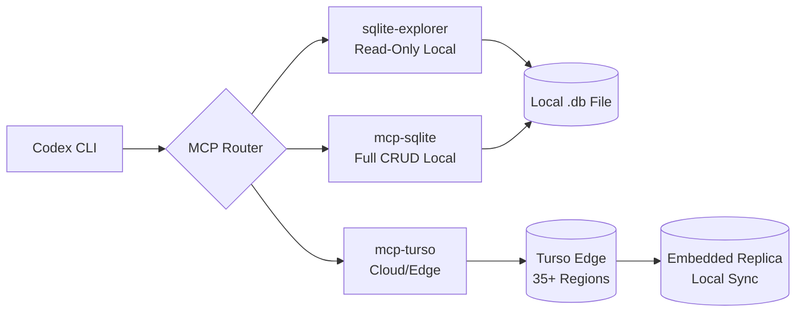
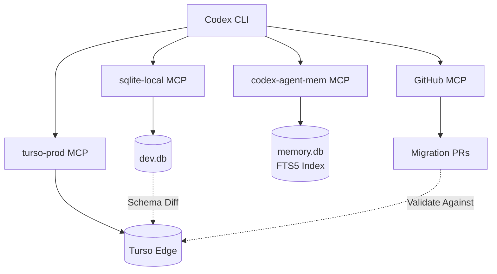

# Codex CLI for SQLite Development: MCP Servers, Turso/libSQL, and Local-to-Edge Database Workflows


SQLite is the most deployed database engine in existence [^1]. It runs inside every smartphone, browser, and IoT device — and increasingly, via libSQL and Turso, at the edge of production architectures. Yet most agent-assisted development workflows ignore SQLite entirely, treating it as a testing stand-in for "real" databases rather than a first-class development target.

Codex CLI changes that equation. With three mature MCP server options spanning local read-only exploration, full CRUD operations, and cloud-hosted Turso databases, you can wire SQLite into every stage of the development lifecycle — from schema design through production monitoring.

This article covers the MCP server landscape, configuration patterns for Codex CLI, practical workflows, and the specific considerations that make SQLite agent-assisted development different from PostgreSQL or MySQL workflows.

## The SQLite MCP Server Landscape

Three servers cover distinct use cases. Choosing the right one — or composing them — depends on whether you need read-only safety, full mutation access, or cloud-hosted edge databases.

### sqlite-explorer (Read-Only, FastMCP)

The `sqlite-explorer-fastmcp-mcp-server` provides safe, read-only access with query validation and row-limit enforcement [^2]. It exposes three tools:

- **`read_query`** — execute validated SELECT statements with parameter binding
- **`list_tables`** — enumerate all tables
- **`describe_table`** — return column names, types, constraints, defaults, and primary keys

This is the right choice for exploratory data analysis, schema understanding, and any workflow where you want the agent to inspect but never modify a database. The FastMCP framework adds query sanitisation and output suppression for clean JSON results [^2].

### mcp-sqlite (Full CRUD, Node.js)

The `mcp-sqlite` server by eQuill Labs provides comprehensive database interaction including writes [^3]. Eight tools cover the full spectrum:

- **`db_info`** / **`list_tables`** / **`get_table_schema`** — exploration
- **`create_record`** / **`read_records`** / **`update_records`** / **`delete_records`** — typed CRUD
- **`query`** — raw SQL with parameterised values

Use this when the agent needs to scaffold test data, run migrations, or modify schema during development. The parameterised query interface mitigates injection risks, but you should still prefer `suggest` approval mode when connecting to any database containing real data.

### mcp-turso (Cloud/Edge, libSQL)

The `mcp-turso` server connects to Turso-hosted libSQL databases [^4]. Four tools map to Turso's capabilities:

- **`list_tables`** / **`get_db_schema`** / **`describe_table`** — schema exploration
- **`query_database`** — execute SELECT queries against cloud-hosted databases

Turso's architecture means your agent can query databases replicated across 35+ edge locations with single-digit millisecond latency [^5]. The server currently supports read operations; write access requires the Turso CLI or SDK directly.



## Configuring MCP Servers in Codex CLI

Codex CLI stores MCP configuration in `config.toml` — either globally at `~/.codex/config.toml` or project-scoped at `.codex/config.toml` [^6]. Each server gets a `[mcp_servers.<name>]` table.

### Local SQLite Explorer (Read-Only)

```toml
[mcp_servers.sqlite-explorer]
command = "uv"
args = ["run", "--with", "fastmcp", "fastmcp", "run", "sqlite_explorer.py"]
env = { SQLITE_DB_PATH = "./data/app.db" }
tool_timeout_sec = 30
```

### Local SQLite CRUD

```toml
[mcp_servers.sqlite]
command = "npx"
args = ["-y", "mcp-sqlite", "./data/app.db"]
tool_timeout_sec = 30
```

### Turso Cloud Database

```toml
[mcp_servers.turso]
command = "npx"
args = ["-y", "mcp-turso"]
env_vars = ["TURSO_DATABASE_URL", "TURSO_AUTH_TOKEN"]
tool_timeout_sec = 60
```

Export your Turso credentials before launching Codex:

```bash
export TURSO_DATABASE_URL=$(turso db show --url my-app-db)
export TURSO_AUTH_TOKEN=$(turso db tokens create my-app-db)
```

### Composing Multiple Servers

For projects spanning local development and edge deployment, enable both the local CRUD server and Turso simultaneously. Codex CLI routes tool calls based on server name, so `sqlite.query` and `turso.query_database` coexist without collision:

```toml
[mcp_servers.sqlite-local]
command = "npx"
args = ["-y", "mcp-sqlite", "./data/dev.db"]

[mcp_servers.turso-prod]
command = "npx"
args = ["-y", "mcp-turso"]
env_vars = ["TURSO_DATABASE_URL", "TURSO_AUTH_TOKEN"]
```

## AGENTS.md for SQLite Projects

An effective `AGENTS.md` file steers the agent toward SQLite-idiomatic patterns and away from PostgreSQL assumptions. Place this in your project root:

```markdown
## SQLite Conventions

- Target SQLite 3.53+ (current stable as of May 2026)
- Use strict typing: `CREATE TABLE ... STRICT` for type enforcement
- Prefer `WITHOUT ROWID` for tables with natural composite keys
- Use `RETURNING` clauses (available since 3.35) for INSERT/UPDATE/DELETE
- Always wrap multi-statement writes in explicit transactions
- Use `json_each()` and `json_extract()` for JSON columns — not string manipulation
- Use `ALTER TABLE` for adding/removing NOT NULL and CHECK constraints (3.53+)
- Enable WAL mode (`PRAGMA journal_mode=WAL`) for concurrent read/write access
- Use parameterised queries exclusively — never string-interpolate values

## Testing
- Use `:memory:` databases for unit tests
- Use file-based databases with `PRAGMA foreign_keys = ON` for integration tests
- Run `PRAGMA integrity_check` after migration scripts

## libSQL/Turso Additions
- Use embedded replicas for read-heavy local workloads
- Turso vector columns use `F32_BLOB(N)` type — do not use BLOB with manual packing
- Multi-tenant: prefer per-tenant databases over row-level isolation
```

## Practical Workflow Patterns

### Pattern 1: Schema Archaeology

When inheriting an undocumented SQLite database, use the read-only explorer to build understanding before touching anything:

```
> Connect to data/legacy.db via sqlite-explorer.
  List all tables, then describe each one.
  Identify foreign key relationships and generate
  a Mermaid ER diagram. Flag any tables missing
  primary keys or using implicit rowid.
```

The agent uses `list_tables` → `describe_table` (per table) → synthesises an ER diagram. The read-only constraint means even a hallucinated DROP TABLE cannot execute.

### Pattern 2: Migration Generation and Validation

Use the CRUD server to prototype migrations interactively:

```
> I need to add a `tags` JSON column to the `articles` table
  with a generated column extracting the first tag.
  Write the migration SQL, apply it to dev.db,
  insert three test rows, and verify the generated column works.
  Use STRICT mode and RETURNING clauses.
```

The agent calls `query` to run the ALTER TABLE, `create_record` to insert test data, and `read_records` to validate. All operations target the local development database.

### Pattern 3: Turso Edge Database Audit

For production Turso databases, use the read-only cloud server to audit schema drift:

```
> Compare the schema in turso-prod against the migration
  files in ./migrations/. Report any columns, indexes,
  or tables present in production but missing from the
  migration history. Check for any tables still using
  implicit rowid that should have been converted.
```

The agent calls `get_db_schema` via Turso, reads local migration files, and diffs them — a safe, read-only operation against production.

### Pattern 4: Batch SQLite Analysis with `codex exec`

For processing multiple database files (common in mobile app testing or IoT data collection):

```bash
codex exec -p "Analyse this SQLite database. Report table count, \
  total row count, largest table by rows, and any schema issues. \
  Output as JSON." data/*.db
```

This runs Codex CLI in non-interactive mode against each `.db` file, producing structured JSON reports [^7].

## Model Selection for SQLite Tasks

| Task | Recommended Model | Rationale |
|------|------------------|-----------|
| Schema design, normalisation | `o3` | Complex relational reasoning, constraint design [^8] |
| Migration scripts, CRUD operations | `o4-mini` | Straightforward SQL generation, fast iteration [^8] |
| Query optimisation, EXPLAIN analysis | `o3` | Requires understanding query planner behaviour |
| Test data generation | `o4-mini` | High volume, formulaic output |
| Turso/libSQL embedded replica design | `o3` | Architecture decisions, sync strategy |

## SQLite-Specific Considerations for Agent Workflows

### The Single-Writer Constraint

SQLite permits only one writer at a time (even in WAL mode, writes are serialised) [^1]. This matters for agent workflows: if your application holds a write lock, the MCP server's mutation tools will block or fail. Use read-only servers against databases your application is actively writing to.

### File-Based Security Model

Unlike PostgreSQL or MySQL, SQLite databases are files. The Codex CLI sandbox (Seatbelt on macOS, Landlock on Linux) controls filesystem access [^9]. Ensure your sandbox configuration permits read access to database file paths:

```toml
# In .codex/config.toml
[sandbox]
allowed_read_paths = ["./data"]
allowed_write_paths = ["./data/dev.db", "./data/dev.db-wal", "./data/dev.db-shm"]
```

Note the WAL and shared-memory files — SQLite creates these alongside the main database file, and the agent's MCP server needs access to all three.

### SQLite 3.53 Features Worth Using

SQLite 3.53 (April 2026) introduced several features relevant to agent-assisted development [^10]:

- **ALTER TABLE constraint management** — add and remove NOT NULL and CHECK constraints without recreating tables
- **Self-healing indexes** — expression indexes automatically rebuild when they become stale
- **REINDEX EXPRESSIONS** — explicitly rebuild expression indexes

These reduce the friction of iterative schema evolution, which is exactly how agents work — small, incremental changes with validation between each step.

### Training Data Considerations

Current models (o3, o4-mini) have strong SQLite coverage but may not reflect 3.53-specific syntax [^8]. The AGENTS.md file above mitigates this by specifying the target version explicitly. For Turso/libSQL-specific features (embedded replicas, vector search, `F32_BLOB`), include explicit examples in your AGENTS.md — these are less well-represented in training data.

## Composing with Other MCP Servers

SQLite MCP servers compose naturally with:

- **Filesystem MCP** — read CSV/JSON files, then import into SQLite via the CRUD server
- **GitHub MCP** — pull migration files from PRs for review against the live schema
- **codex-agent-mem** — a specialised SQLite+FTS5 MCP server that gives agents persistent memory across sessions, using SQLite as the storage backend [^11]



## Limitations

- **No streaming results** — large result sets are buffered in memory before returning to the agent; consider adding `LIMIT` clauses in your AGENTS.md rules
- **Turso MCP is read-only** — write operations require the Turso CLI (`turso db shell`) or application SDK; ⚠️ no write-capable Turso MCP server exists at time of writing
- **WAL file access** — the Codex sandbox must permit access to `-wal` and `-shm` files, not just the main `.db` file
- **Concurrent agent sessions** — multiple Codex sessions targeting the same SQLite file will contend on the write lock; use separate database copies or read-only servers
- **SQLite Cloud MCP** — the `sqlitecloud-mcp-server` provides full CRUD plus performance analytics against SQLite Cloud's hosted service [^12], but requires a SQLite Cloud account and has less community adoption than the local alternatives
- **Training data lag** — models may not know SQLite 3.53 features (self-healing indexes, ALTER TABLE constraint changes) without explicit AGENTS.md guidance

## Citations

[^1]: [SQLite Home Page — "Most Widely Deployed Database Engine"](https://sqlite.org/)
[^2]: [sqlite-explorer-fastmcp-mcp-server — GitHub (hannesrudolph)](https://github.com/hannesrudolph/sqlite-explorer-fastmcp-mcp-server)
[^3]: [mcp-sqlite — GitHub (jparkerweb/eQuill Labs)](https://github.com/jparkerweb/mcp-sqlite)
[^4]: [mcp-turso — GitHub (nbbaier)](https://github.com/nbbaier/mcp-turso)
[^5]: [Turso — Databases Everywhere](https://turso.tech/)
[^6]: [Model Context Protocol — Codex CLI Developer Documentation](https://developers.openai.com/codex/mcp)
[^7]: [CLI — Codex CLI Non-Interactive Mode](https://developers.openai.com/codex/cli)
[^8]: [OpenAI Models Documentation](https://platform.openai.com/docs/models)
[^9]: [Codex CLI Sandbox Documentation](https://developers.openai.com/codex/cli)
[^10]: [SQLite Release 3.53.0 (2026-04-09)](https://sqlite.org/releaselog/3_53_0.html)
[^11]: [codex-agent-mem — SQLite + FTS5 Memory Layer for Agent Workflows](https://marcelocaporale.github.io/codex-agent-mem/)
[^12]: [sqlitecloud-mcp-server — GitHub (sqlitecloud)](https://github.com/sqlitecloud/sqlitecloud-mcp-server)
