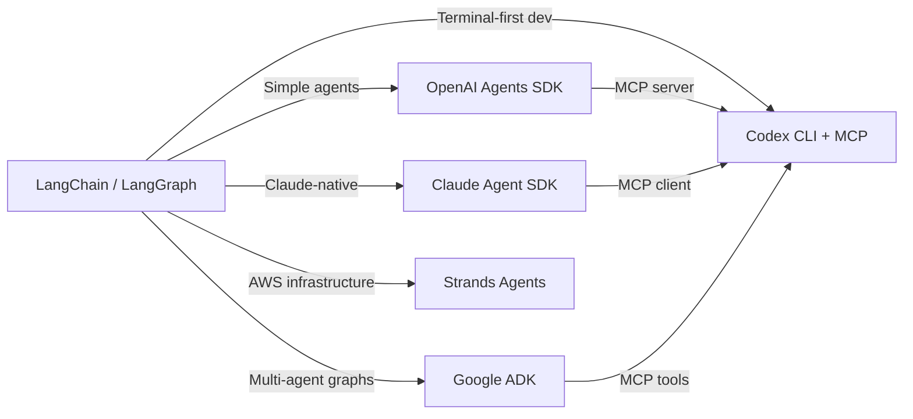
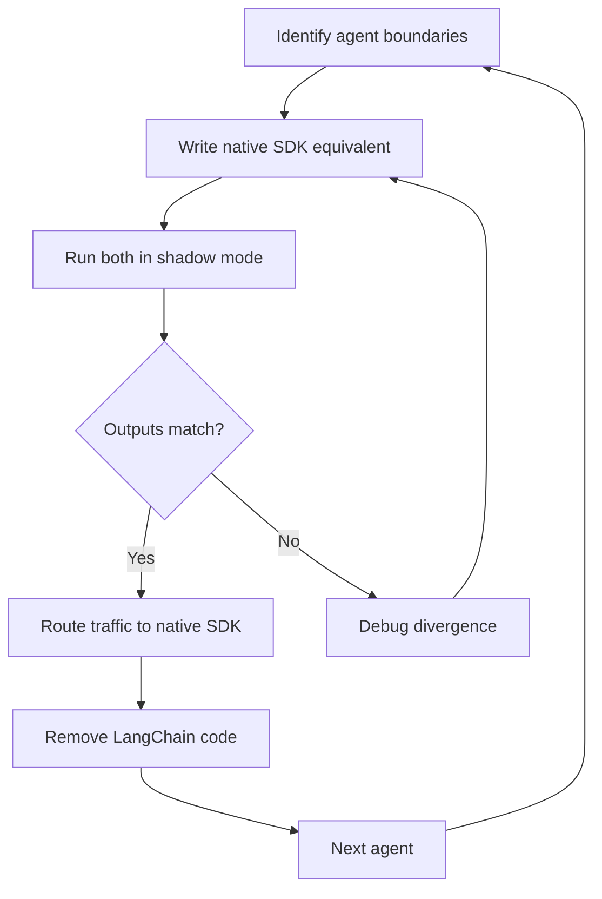

# Migrating from LangChain to Native Agent SDKs: A Codex CLI Perspective


---

By mid-2026, a quiet exodus is underway. Production teams that adopted LangChain in 2023–2024 are rewriting their agent code against vendor-native SDKs — OpenAI's Agents SDK, Anthropic's Claude Agent SDK, Google's ADK, and AWS's Strands Agents [^1]. The core driver is not that LangChain failed; it solved a genuine problem when every provider's API surface was different and unstable. The problem is that in 2026, vendor APIs have converged, and LangChain's abstraction layer now costs more than it saves [^2].

This article maps the migration landscape, shows where Codex CLI fits as both a migration tool and a migration destination, and provides concrete patterns for teams making the switch.

## Why Teams Are Leaving

Five forces are pushing production teams away from LangChain [^1] [^2]:

1. **Abstraction overhead** — a RAG pipeline that could be 30 lines of direct API calls becomes 150 lines of chained LangChain objects. Stack traces from production errors routinely span 15–40 frames of internal framework code [^1].
2. **Version churn** — major API restructurings across v0.1, v0.2, and v0.3 (2023–2024) imposed ongoing migration costs. LangChain v1.0 GA shipped in October 2025, but teams running v0.x production code still carry technical debt [^2].
3. **Latency tax** — benchmarks show OpenAI Agents SDK at 2–5 ms per tool call versus LangChain's 10–30 ms [^1].
4. **Dependency bloat** — LangChain pulls in a wide dependency tree that creates version conflicts, particularly in monorepo environments with pinned transitive dependencies.
5. **Vendor SDK convergence** — OpenAI, Anthropic, Google, and AWS now ship first-party SDKs with built-in tool calling, tracing, and agent orchestration, absorbing the abstraction value LangChain originally provided [^3].

Teams that migrated report 40–60% code reduction and 70–90% fewer framework-related incidents [^1].

## The 2026 Native SDK Landscape

Before choosing a migration target, understand what each vendor SDK offers:

| SDK | Release | Key Primitives | Model Lock-in | MCP Support |
|-----|---------|---------------|----------------|-------------|
| **OpenAI Agents SDK** | March 2025, updated April 2026 [^4] | Agent, Handoff, Guardrail, Runner | OpenAI-native; LiteLLM for others | Via tools |
| **Claude Agent SDK** | 2025, updated May 2026 [^5] | Agent, Tools (8 built-in), MCP | Anthropic-native | First-class |
| **Google ADK** | April 2025, v2.0 2026 [^6] | Agent, SequentialAgent, LoopAgent | Model-agnostic | Native |
| **AWS Strands** | May 2025 [^7] | Agent, @tool, MCP servers | Bedrock default; LiteLLM for others | Native |
| **Codex CLI** | 2025, v0.131.0 May 2026 [^8] | CLI agent, MCP client, Skills, Hooks | OpenAI models | First-class client |



## Concept Mapping: LangChain to Native SDKs

The hardest part of migration is not rewriting code — it is mapping mental models. Here is how LangChain concepts translate [^9]:

### Core Primitives

| LangChain | OpenAI Agents SDK | Codex CLI |
|-----------|-------------------|-----------|
| `ChatOpenAI(model=...)` | `Agent(model="o4-mini")` | `codex --model o4-mini` |
| `@tool` decorator | `@function_tool` | MCP server tool |
| `AgentExecutor` | `Runner.run()` | CLI session |
| `ConversationBufferMemory` | Explicit message list | Session history |
| `SequentialChain` | Agent handoffs | `codex exec` pipeline |
| `LangSmith` tracing | Built-in tracing | Hooks + OpenTelemetry |

### Chains Become Handoffs (or Disappear)

LangChain's chain abstraction — `SequentialChain`, `RouterChain`, `MapReduceChain` — maps to different patterns depending on your target:

```python
# LangChain: sequential chain with two steps
from langchain.chains import SequentialChain

chain = SequentialChain(
    chains=[analyse_chain, summarise_chain],
    input_variables=["code"],
    output_variables=["summary"]
)
result = chain.invoke({"code": source})
```

```python
# OpenAI Agents SDK: agent handoff
from agents import Agent, Runner

analyser = Agent(
    name="analyser",
    model="o4-mini",
    instructions="Analyse the code for issues.",
)

summariser = Agent(
    name="summariser",
    model="o4-mini",
    instructions="Summarise the analysis.",
    handoffs=[],
)

analyser.handoffs = [summariser]
result = await Runner.run(analyser, input="Review this code...")
```

```bash
# Codex CLI: pipe through exec
codex exec "Analyse this code for issues" src/ \
  | codex exec "Summarise the analysis findings"
```

### Memory Becomes Explicit

LangChain's `ConversationBufferMemory`, `ConversationSummaryMemory`, and `VectorStoreRetrieverMemory` all disappear in native SDKs. You pass conversation history as a message list, or use MCP servers for persistent state [^9]:

```toml
# codex config.toml — MCP server for persistent agent memory
[mcp-servers.memory]
command = "npx"
args = ["-y", "@anthropic/mcp-memory"]
```

This is not a regression — explicit memory management is easier to debug, test, and reason about than implicit memory abstractions.

## Using Codex CLI as a Migration Tool

Codex CLI is not just a migration target — it is an effective migration tool. Use it to accelerate the rewrite itself:

### 1. Analyse Existing LangChain Code

```bash
# Map all LangChain imports and usage patterns
codex "Analyse this codebase for LangChain usage patterns. \
  List every chain, agent, tool, and memory class used. \
  Output a migration manifest as markdown." src/
```

### 2. Generate Native SDK Equivalents

Configure an `AGENTS.md` file at the project root to guide the migration:

```markdown
# AGENTS.md

## Migration Context
This project is migrating from LangChain v0.3 to OpenAI Agents SDK.

## Rules
- Replace all `langchain` imports with `agents` SDK equivalents
- Convert `@tool` decorators to `@function_tool`
- Replace `AgentExecutor` with `Runner.run()`
- Remove `ConversationBufferMemory` — pass message history explicitly
- Keep existing vector store (Pinecone) — wrap retrieval in `@function_tool`
- Preserve all existing tests; update assertions for new response format
- Use `o4-mini` as the default model
```

### 3. Batch Migration with `codex exec`

```bash
# Migrate each agent file in the agents/ directory
for f in src/agents/*.py; do
  codex exec "Migrate this LangChain agent to OpenAI Agents SDK \
    following the rules in AGENTS.md. Preserve all business logic." "$f"
done
```

### 4. Validate with Hooks

Use Codex CLI hooks to enforce migration completeness:

```toml
# codex config.toml — block any remaining LangChain imports
[hooks.on-file-write]
command = "grep -rn 'from langchain' {} && echo 'ERROR: LangChain import found' && exit 1 || true"
```

## Codex CLI as MCP Server for the Agents SDK

One powerful post-migration pattern: expose Codex CLI as an MCP server that the OpenAI Agents SDK can call [^10]. This gives your SDK agents access to Codex's file editing, code execution, and terminal capabilities:

```python
from agents import Agent, Runner
from agents.mcp import MCPServerStdio

codex_server = MCPServerStdio(
    command="codex",
    args=["--mcp-server"],
)

orchestrator = Agent(
    name="orchestrator",
    model="o4-mini",
    instructions="You coordinate code changes using Codex.",
    mcp_servers=[codex_server],
)

async with codex_server:
    result = await Runner.run(
        orchestrator,
        input="Refactor the authentication module to use JWT tokens"
    )
```

This pattern exposes two tools — `codex()` to start a conversation and `codex-reply()` to continue one — keeping Codex alive across multiple agent turns [^10].

## What to Keep from LangChain

Not everything needs migrating. Some LangChain components have no native SDK equivalent and remain useful [^9]:

- **Document loaders** — LangChain's 160+ loaders (PDF, HTML, Notion, Confluence) are unmatched. Wrap them in `@function_tool` or expose via MCP.
- **Text splitters** — `RecursiveCharacterTextSplitter` and its variants are battle-tested. Use them as utility functions.
- **Vector store integrations** — if you are using LangChain's Pinecone, Weaviate, or Chroma wrappers, keep the retrieval logic and wrap it as a tool.
- **LangSmith** — if you have invested in LangSmith for observability, it works with non-LangChain code via the `langsmith` Python package directly.

```python
# Keep LangChain's document loader, wrap as Agents SDK tool
from langchain_community.document_loaders import PyPDFLoader
from agents import function_tool

@function_tool
def load_pdf(path: str) -> str:
    """Load and return text content from a PDF file."""
    loader = PyPDFLoader(path)
    pages = loader.load()
    return "\n".join(p.page_content for p in pages)
```

## Migration Timeline and Strategy

Based on reported migration data, expect these timelines [^1]:

| Scope | Duration | Approach |
|-------|----------|----------|
| Single agent | 1–2 weeks | Direct rewrite |
| 5–10 agents | 3–6 months | Incremental, agent-by-agent |
| Platform (shared chains, memory, tools) | 6–12 months | Strangler fig pattern |

The recommended approach for production systems is the **strangler fig pattern**: run both implementations simultaneously, compare outputs, and gradually shift traffic to the native SDK version [^9]. This avoids a risky big-bang rewrite.



## When to Stay on LangChain

Migration is not always the right call. Stay on LangChain if:

- **You rely on LangGraph's graph orchestration** — LangGraph v1.0 (2026) is now the runtime beneath LangChain, and its checkpoint-based state management, human-in-the-loop primitives, and visual debugging are genuinely differentiated [^11].
- **You need model flexibility** — if you switch between OpenAI, Anthropic, and open-source models frequently, LangChain's abstraction still earns its keep. ⚠️ Though note that Google ADK and AWS Strands also offer model-agnostic support.
- **Your team's velocity is fine** — if LangChain is not causing production incidents, debugging pain, or onboarding friction, migration has negative ROI.

## Conclusion

The LangChain-to-native-SDK migration reflects a broader pattern in software engineering: abstraction layers that solve early-market fragmentation become overhead once the underlying platforms stabilise. In 2026, the underlying platforms — OpenAI, Anthropic, Google, AWS — have stabilised.

For Codex CLI users, the migration story is straightforward: use Codex as a tool to automate the rewrite, use MCP servers to preserve valuable LangChain components as tools, and use `AGENTS.md` to encode migration rules that keep every agent session aligned with your migration strategy.

---

## Citations

[^1]: [The LangChain Exit: Why Production Teams Are Quietly Rewriting to Raw SDKs in 2026 — Ravoid](https://ravoid.com/blog/langchain-exit-raw-sdk-migration-2026)

[^2]: [LangChain Alternatives 2026: Why Developers Are Moving — SyncBricks](https://syncbricks.com/why-developers-are-leaving-langchain/)

[^3]: [Why LLM Frameworks Like LangChain and LlamaIndex Are Being Replaced by Agent SDKs — MindStudio](https://www.mindstudio.ai/blog/llm-frameworks-replaced-by-agent-sdks)

[^4]: [The Next Evolution of the Agents SDK — OpenAI](https://openai.com/index/the-next-evolution-of-the-agents-sdk/)

[^5]: [Claude Code Updates by Anthropic — May 2026 — Releasebot](https://releasebot.io/updates/anthropic/claude-code)

[^6]: [Agent Development Kit — Google Cloud Documentation](https://docs.cloud.google.com/gemini-enterprise-agent-platform/build/adk)

[^7]: [Introducing Strands Agents, an Open Source AI Agents SDK — AWS Open Source Blog](https://aws.amazon.com/blogs/opensource/introducing-strands-agents-an-open-source-ai-agents-sdk/)

[^8]: [Codex CLI Changelog — OpenAI Developers](https://developers.openai.com/codex/changelog)

[^9]: [Migrating from LangChain to OpenAI Agents SDK: A Practical Guide — CallSphere](https://callsphere.ai/blog/migrating-langchain-to-openai-agents-sdk-practical-guide)

[^10]: [Use Codex with the Agents SDK — OpenAI Developers](https://developers.openai.com/codex/guides/agents-sdk)

[^11]: [LangChain and LangGraph Agent Frameworks Reach v1.0 Milestones — LangChain Blog](https://blog.langchain.com/langchain-langgraph-1dot0/)
