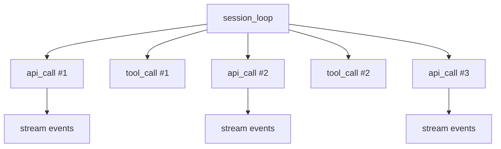
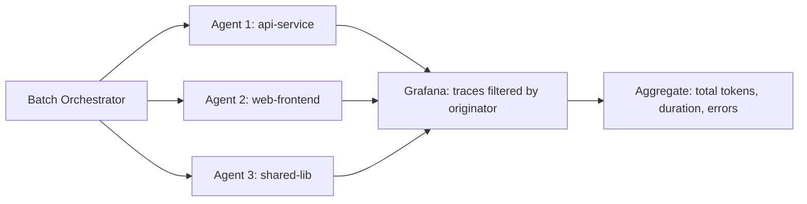

# Agent Observability Dashboard Patterns: OpenTelemetry, Traces, and Cost Monitoring for Codex CLI


---

Running a single Codex CLI session is straightforward. Running dozens across a team — batch migrations, multi-agent pipelines, nightly `codex exec` sweeps — is a different proposition entirely. Without observability, you are flying blind: which sessions are burning tokens on retries? Where do tool calls stall? How much did last night's batch run actually cost?

Codex CLI ships with built-in OpenTelemetry (OTel) support [^1]. This article shows how to configure it, choose a backend, build dashboards that answer the questions that matter, and wire everything into the GenAI semantic conventions that became the industry standard in 2026.

## Codex CLI's Telemetry Architecture

Since v0.130, Codex CLI emits structured OpenTelemetry data across three pillars [^2]:

- **Logs** — conversation starts (model, reasoning level, sandbox mode), API requests (attempt, status, duration, errors), stream events (token counts), tool decisions and results
- **Traces** — one parent span per session (`session_loop`) with child spans for each `api_call` and `tool_call` [^3]
- **Metrics** — counters and histograms for API, stream, and tool activity, tagged with `auth_mode`, `originator`, `session_source`, `model`, and `app.version` [^1]

Telemetry is **disabled by default** and requires explicit opt-in. Exporters batch asynchronously and flush on shutdown, so overhead is negligible [^1].

### Span Hierarchy



The `session_loop` span captures the entire session lifecycle. Each child span carries attributes for model, token counts, latency, and status — the building blocks for every dashboard panel described below.

## Configuration

Add the `[otel]` block to `~/.codex/config.toml`. Codex supports two separate export pipelines: `exporter` for logs and `trace_exporter` for traces [^1].

### Minimal Setup (OTLP HTTP)

```toml
[otel]
environment = "production"
log_user_prompt = false

exporter = { otlp-http = {
  endpoint = "https://otel-collector.internal:4318/v1/logs",
  protocol = "binary",
  headers = { "Authorization" = "Bearer ${OTLP_TOKEN}" }
}}

trace_exporter = { otlp-http = {
  endpoint = "https://otel-collector.internal:4318/v1/traces",
  protocol = "binary",
  headers = { "Authorization" = "Bearer ${OTLP_TOKEN}" }
}}

metrics_exporter = "otlp-http"
```

### Key Configuration Options

| Key | Default | Purpose |
|-----|---------|---------|
| `otel.environment` | `dev` | Environment tag on all emitted events |
| `otel.exporter` | `none` | Log exporter: `none`, `otlp-http`, `otlp-grpc` |
| `otel.trace_exporter` | `none` | Trace exporter with same protocol options |
| `otel.metrics_exporter` | `statsig` | Metrics exporter: `none`, `statsig`, `otlp-http`, `otlp-grpc` |
| `otel.log_user_prompt` | `false` | Whether to include raw prompt text in logs |

A common mistake: configuring `exporter` but forgetting `trace_exporter`. Logs will appear in your backend but traces will not. Both must be set explicitly [^3].

## Choosing a Backend

### Option 1: Aspire Dashboard (Zero-Cost Local Development)

The .NET Aspire Dashboard ships as a standalone Docker container with no dependencies on .NET or Aspire itself [^4]. It accepts OTLP on ports 4317 (gRPC) and 4318 (HTTP), and renders traces, structured logs, and metrics in a single UI.

```bash
docker run --rm -d \
  -p 18888:18888 \
  -p 4317:4317 \
  -p 4318:4318 \
  --name aspire-dashboard \
  mcr.microsoft.com/dotnet/aspire-dashboard:latest
```

Then point Codex at it:

```toml
[otel]
environment = "local"
exporter = { otlp-grpc = { endpoint = "http://localhost:4317" }}
trace_exporter = { otlp-grpc = { endpoint = "http://localhost:4317" }}
metrics_exporter = "otlp-grpc"
```

Open `http://localhost:18888` to view traces. The Aspire Dashboard parses GenAI semantic convention attributes and renders them in a span tree viewer [^4]. This is the fastest path to visibility during development.

### Option 2: Grafana Cloud (Team-Scale Production)

Grafana provides a pre-built Codex dashboard (ID 24202) that surfaces token usage, cache behaviour, reasoning effort, tool invocation statistics, latency, MCP server stats, API request rates, and error counts [^5]. A second community dashboard (ID 24641) adds VictoriaMetrics-backed cost estimation panels [^5].

```toml
[otel]
environment = "production"
exporter = { otlp-http = {
  endpoint = "https://otlp-gateway-prod-gb-south-0.grafana.net/otlp/v1/logs",
  headers = { "Authorization" = "Basic ${GRAFANA_OTLP_TOKEN}" }
}}
trace_exporter = { otlp-http = {
  endpoint = "https://otlp-gateway-prod-gb-south-0.grafana.net/otlp/v1/traces",
  headers = { "Authorization" = "Basic ${GRAFANA_OTLP_TOKEN}" }
}}
```

### Option 3: SigNoz (Self-Hosted Open Source)

SigNoz provides a custom Codex dashboard template with pre-built panels for LLM observability [^6]. Configuration uses gRPC:

```toml
[otel]
log_user_prompt = true
exporter = { otlp-grpc = {
  endpoint = "https://ingest.eu.signoz.cloud:443",
  headers = { "signoz-ingestion-key" = "${SIGNOZ_KEY}" }
}}
```

### Option 4: Vendor Platforms (Dynatrace, Coralogix, Oodle)

Dynatrace expanded AI coding agent monitoring in 2026 to cover Codex CLI, Claude Code, Gemini CLI, and GitHub Copilot SDK [^7]. Coralogix streams live session data for cross-team usage analysis [^3]. Oodle provides dedicated agent observability views [^8]. All accept standard OTLP — configuration follows the same `config.toml` pattern with vendor-specific endpoints and authentication.

## GenAI Semantic Conventions

The OpenTelemetry GenAI semantic conventions reached stable status for client spans in early 2026 [^9]. Agent and framework spans remain experimental but have been stable in practice through Q1-Q2 2026 [^9]. Key attributes your dashboards should capture:

| Attribute | Scope | Use |
|-----------|-------|-----|
| `gen_ai.request.model` | Client span | Filter by model (o3, o4-mini) |
| `gen_ai.usage.input_tokens` | Client span | Token consumption tracking |
| `gen_ai.usage.output_tokens` | Client span | Token consumption tracking |
| `gen_ai.response.finish_reasons` | Client span | Detect truncations and errors |
| `gen_ai.operation.name` | Agent span | `invoke_agent`, `create_agent` |
| `gen_ai.agent.name` | Agent span | Identify agent in multi-agent setups |
| `gen_ai.conversation.id` | Agent span | Correlate messages across turns |
| `gen_ai.provider.name` | Agent span | Provider identification |

These conventions mean a dashboard built for Codex CLI traces will also work for Claude Code, Gemini CLI, or any other tool emitting OTel with GenAI semconv [^9].

## Five Dashboard Panels That Matter

### 1. Token Burn Rate

```
sum(rate(gen_ai_client_token_usage_total[5m])) by (model, environment)
```

Track input and output token consumption per model over time. Alert when burn rate exceeds your budget threshold. Since April 2026, OpenAI bills Codex on input, cached input, and output tokens [^10], so this panel directly maps to cost.

### 2. Session Duration Distribution

```
histogram_quantile(0.95, sum(rate(session_loop_duration_seconds_bucket[5m])) by (le, model))
```

The P95 session duration tells you whether agents are getting stuck. Sessions exceeding 10 minutes on routine tasks indicate prompt drift or sandbox configuration issues.

### 3. Tool Call Success Rate

```
sum(rate(tool_call_total{status="success"}[5m])) /
sum(rate(tool_call_total[5m])) * 100
```

Tool failures are the most common cause of wasted tokens. A drop below 90% warrants investigation — typically a misconfigured MCP server, a stale sandbox, or a tool that requires network access the sandbox blocks.

### 4. API Error Rate by Model

```
sum(rate(api_call_total{status!="200"}[5m])) by (model, status)
```

Rate limits (429), context length exceeded (400), and server errors (500) each require different responses. This panel surfaces which model is hitting which failure mode.

### 5. Cost Estimation

```
(sum(rate(gen_ai_client_token_usage_total{direction="input"}[1h])) * $input_cost_per_token)
+
(sum(rate(gen_ai_client_token_usage_total{direction="output"}[1h])) * $output_cost_per_token)
```

Map token counts to cost using Grafana template variables for per-token pricing. Update the variables when pricing changes rather than rebuilding queries.

## Multi-Agent Pipeline Observability

When running multi-agent workflows — for example, a `codex exec` batch that fans out across a monorepo — the `session_loop` spans from each agent share a common batch identifier through the `originator` metadata tag [^1]. This enables:



### Correlation Strategy

1. **Set `environment`** per deployment stage (`dev`, `staging`, `production`)
2. **Use `originator`** to group agents within a batch run
3. **Filter by `model`** to compare cost efficiency across o3 and o4-mini
4. **Trace by `session_source`** to distinguish interactive sessions from `codex exec` headless runs

### Hooks for Custom Telemetry

Codex CLI's hooks engine (stable since v0.124.0) allows you to inject custom spans or log events at key lifecycle points [^2]. Combined with the in-TUI hook browser (`/hooks` command, v0.129.0), you can:

- Emit a span when a pre-commit hook runs
- Log custom attributes (branch name, PR number, ticket ID) alongside OTel events
- Gate tool approvals on cost thresholds by reading the accumulated token count

## Privacy and Security Considerations

User prompts are **redacted by default**. Setting `log_user_prompt = true` sends raw prompt text to your OTel backend [^1]. For production deployments:

- Keep `log_user_prompt = false` unless you control the backend infrastructure
- Use TLS client certificates for mutual authentication:

```toml
[otel.exporter.otlp-http.tls]
ca-certificate = "/etc/ssl/otel-ca.pem"
client-certificate = "/etc/ssl/otel-client.pem"
client-private-key = "/etc/ssl/otel-client-key.pem"
```

- Scope `environment` tags to prevent development telemetry from polluting production dashboards
- Ensure your OTel collector has retention policies that comply with your data governance requirements

## Getting Started in Five Minutes

1. Start the Aspire Dashboard: `docker run --rm -d -p 18888:18888 -p 4317:4317 mcr.microsoft.com/dotnet/aspire-dashboard:latest`
2. Add the `[otel]` block to `~/.codex/config.toml` pointing at `localhost:4317`
3. Run a Codex session: `codex "refactor the auth module"`
4. Open `http://localhost:18888` and inspect the `session_loop` trace
5. Examine child spans for API latency and tool execution times

From there, graduate to Grafana Cloud or SigNoz when you need team-wide dashboards, alerting, and historical analysis.

## Limitations

- **`codex exec` metrics gap**: As of May 2026, `codex exec` emits traces and logs but metrics support is incomplete. `codex mcp-server` emits no OTel telemetry at all [^11]. ⚠️
- **Agent span conventions are experimental**: The `gen_ai.agent.*` attributes may change before reaching stable status [^9]
- **Cost estimation is approximate**: Cached input tokens are billed at a lower rate, but the cache hit ratio is not currently exposed as an OTel attribute ⚠️
- **Prompt redaction is all-or-nothing**: There is no option to redact sensitive sections while preserving the rest of the prompt

## Citations

[^1]: [Advanced Configuration – Codex CLI | OpenAI Developers](https://developers.openai.com/codex/config-advanced) — Official OpenTelemetry configuration reference for Codex CLI
[^2]: [Codex Updates by OpenAI - May 2026 - Releasebot](https://releasebot.io/updates/openai/codex) — Codex v0.130 changelog: configurable OTel trace metadata, hooks engine stability
[^3]: [Codex CLI - Coralogix Docs](https://coralogix.com/docs/integrations/ai-observability/codex-cli/) — Codex CLI OTel integration: span hierarchy, session_loop structure
[^4]: [Aspire Dashboard — Standalone](https://aspire.dev/dashboard/standalone/) — Free, open-source OTel trace viewer as a Docker container
[^5]: [Codex Dashboard | Grafana Labs](https://grafana.com/grafana/dashboards/24202-codex/) — Pre-built Grafana dashboard for Codex CLI observability
[^6]: [OpenAI Codex Observability & Monitoring with OpenTelemetry | SigNoz Docs](https://signoz.io/docs/codex-monitoring/) — SigNoz Codex monitoring setup and dashboard template
[^7]: [Dynatrace Expands AI Coding Agent Monitoring](https://www.dynatrace.com/news/blog/dynatrace-expands-ai-coding-agent-monitoring/) — Dynatrace support for Codex CLI, Claude Code, Gemini CLI
[^8]: [OpenAI Codex | Oodle Docs](https://docs.oodle.ai/ai-agent-observability/codex) — Oodle agent observability for Codex
[^9]: [Semantic Conventions for GenAI Agent and Framework Spans | OpenTelemetry](https://opentelemetry.io/docs/specs/semconv/gen-ai/gen-ai-agent-spans/) — GenAI semantic conventions: agent spans, attributes, stability status
[^10]: [Best AI Gateway to Manage Codex CLI Token Spend | Maxim](https://www.getmaxim.ai/articles/best-ai-gateway-to-manage-codex-cli-token-spend/) — Token-based billing for Codex (April 2026)
[^11]: [`codex exec` emits no OTel metrics — Issue #12913 | openai/codex](https://github.com/openai/codex/issues/12913) — Known telemetry gap in codex exec and codex mcp-server
