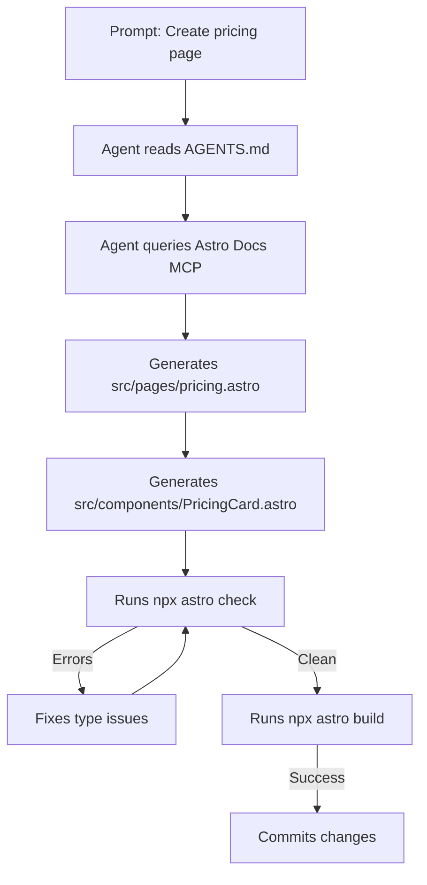
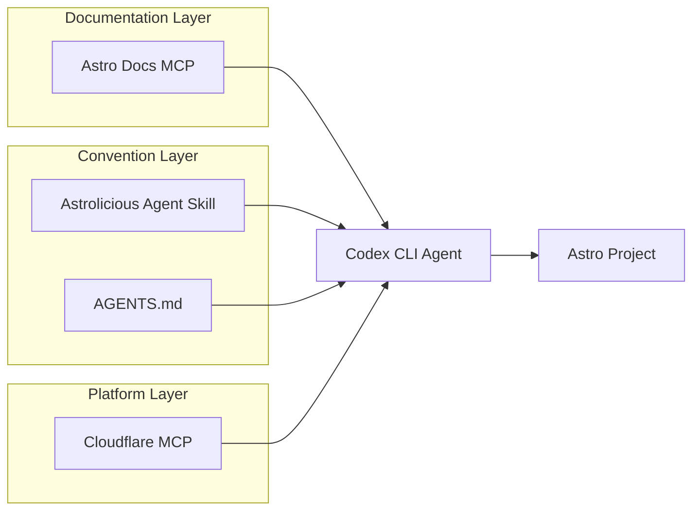

# Codex CLI for Astro Development: Docs MCP, Agent Skills, and Edge-First Workflows on Cloudflare Workers


---

Astro occupies a distinctive position in the 2026 web framework landscape. Cloudflare acquired The Astro Technology Company on 16 January 2026[^1], and Astro 6.0 shipped on 10 March 2026 with a redesigned dev server running on Cloudflare's `workerd` runtime[^2]. The latest stable release, Astro 6.3 (7 May 2026), adds experimental advanced routing with Hono handler composition[^3]. With an official Docs MCP server, a mature agent skill, and native edge-runtime alignment, Astro is one of the best-served web frameworks for agent-assisted development. This article covers configuring Codex CLI for Astro projects end to end.

## Why Astro Deserves a Dedicated Configuration

Most frameworks need MCP servers to bridge the gap between what the model knows and what the framework does today. Astro has three characteristics that make this gap especially dangerous:

1. **Rapid API churn** — Astro 6 introduced breaking changes across Vite 7, Shiki 4, and Zod 4[^2], and dropped Node 18/20 support entirely. Models trained on Astro 4/5 patterns will hallucinate deprecated imports.
2. **Edge-first runtime** — The `workerd`-based dev server means code runs against real Cloudflare APIs (KV, D1, R2, Durable Objects) during development[^2]. Sandbox considerations differ from Node.js projects.
3. **Content layer abstraction** — Live Content Collections (`defineLiveCollection`, `getLiveEntry`) eliminate rebuilds for CMS content[^2], but the API surface is new enough that no model has reliable training data for it.

The combination of an MCP server providing live documentation, an agent skill encoding project conventions, and an AGENTS.md file preventing outdated patterns addresses all three.

## MCP Server: Astro Docs

Astro provides an official MCP server at `https://mcp.docs.astro.build/mcp` using streamable HTTP transport[^4]. Unlike STDIO-based MCP servers that launch a subprocess, this is a hosted service — no local installation required, no process management overhead, and always current with the latest documentation.

### Codex CLI Configuration

Add the server to your project-level `.codex/config.toml`:

```toml
[mcp_servers.astro-docs]
command = "npx"
args = ["-y", "mcp-remote", "https://mcp.docs.astro.build/mcp"]
```

The `mcp-remote` bridge converts the streamable HTTP transport into the STDIO protocol that Codex CLI expects[^4]. The server exposes documentation search tools that the agent can invoke when it encounters unfamiliar Astro APIs — particularly useful for Content Collections, the Fonts API, and CSP configuration, all of which shipped in 6.0[^2].

For teams that also use Cloudflare Workers directly, compose the Astro Docs server alongside the Cloudflare MCP server:

```toml
[mcp_servers.astro-docs]
command = "npx"
args = ["-y", "mcp-remote", "https://mcp.docs.astro.build/mcp"]

[mcp_servers.cloudflare]
command = "npx"
args = ["-y", "@cloudflare/mcp-server-cloudflare"]
```

This gives the agent access to both Astro framework documentation and live Cloudflare account resources (Workers, KV namespaces, D1 databases) in a single session[^5].

## Agent Skill: Astrolicious Astro Skill

The `astrolicious/agent-skills` repository provides a cross-agent Astro skill following the open agent skills standard[^6]. Install it into your project:

```bash
npx skills add https://github.com/astrolicious/agent-skills --skill astro
```

This places a `SKILL.md` file under `.agents/skills/astro/` containing:

- **CLI commands** — `npx astro dev`, `npx astro build`, `npx astro check`, `npx astro add`, `npx astro sync`[^6]
- **Project structure conventions** — `src/pages/` for routes, `src/components/` for reusable components, `src/layouts/` for templates, `public/` for static assets[^6]
- **Deployment adapters** — Node.js, Cloudflare, Netlify, Vercel, and community adapters via `npx astro add <adapter> --yes`[^6]
- **Core configuration** — `site` property for canonical URLs and sitemap generation[^6]

The skill activates implicitly when Codex detects Astro-related tasks, loading its instructions via progressive disclosure to conserve context window budget[^7].

For richer Astro project support, Fred K. Schott's `astro-skills` package can serve agent skills directly from an Astro site[^8], which is useful if your documentation site itself runs on Astro.

## AGENTS.md Template for Astro 6.3 Projects

Create an `AGENTS.md` at your repository root to prevent the most common hallucination patterns:

```markdown
# AGENTS.md — Astro 6.3 / Cloudflare Workers

## Framework Version
- Astro 6.3.x with `@astrojs/cloudflare` adapter
- Node 22+ required (Node 18/20 are NOT supported)
- Vite 7, Shiki 4, Zod 4 (import Zod from `astro/zod`, not `zod`)

## Project Conventions
- Pages in `src/pages/` — file-based routing, `.astro` or `.mdx`
- Components in `src/components/` — `.astro` single-file components
- Layouts in `src/layouts/` — wrap pages via `<Layout>` slot pattern
- Content Collections defined in `src/content.config.ts` using `defineCollection()`
- Live Content Collections use `defineLiveCollection()` and `getLiveEntry()`

## Styling
- Use the built-in Fonts API (`fonts` in astro.config) for font management
- Scoped styles via `<style>` in `.astro` files — NOT global CSS imports
- Tailwind via `@astrojs/tailwind` integration if present

## Content Security Policy
- CSP is enabled: `security: { csp: true }` in astro.config
- Scripts and styles are automatically hashed — do NOT add inline handlers
- Use `<script>` tags, not `onclick` attributes

## Cloudflare Workers Runtime
- Dev server runs on `workerd`, not Node.js
- Platform APIs (KV, D1, R2, Durable Objects) available via `context.locals.runtime`
- Do NOT use Node.js built-in modules unless polyfilled by the adapter
- Test with `npx astro dev` — it runs the real Workers runtime locally

## Testing and Validation
- Run `npx astro check` before committing — catches type errors and invalid pages
- Run `npx astro build` to verify production output
- Run `npx astro sync` after modifying content collection schemas

## Anti-Hallucination Rules
- Do NOT import from `astro/components` — use `astro:components`
- Do NOT use `getCollection()` for live data — use `getLiveEntry()`
- Do NOT assume Express/Koa middleware patterns — Astro uses its own middleware API
- Consult the Astro Docs MCP server for any API you are unsure about
- When using advanced routing (experimental), import handlers from `astro/fetch`
```

This template prevents the most frequent agent mistakes: importing Zod from the wrong package, using Node.js APIs on Workers, and applying Astro 4/5 content collection patterns to the new live collections API.

## Workflow Patterns

### Pattern 1: Component Page Generation with Type Checking



The agent creates the page and components, then validates with `astro check` before committing. The type checker catches invalid prop types, missing slots, and broken imports that the model might hallucinate.

### Pattern 2: Content Collection Schema and Migration

When adding a new content collection or migrating from static to live collections:

```bash
codex exec "Add a 'changelog' live content collection that fetches entries \
from our CMS API at /api/changelog. Use defineLiveCollection with a loader, \
define a Zod schema with title (string), date (date), body (string), and \
breaking (boolean) fields. Update src/content.config.ts and create \
src/pages/changelog/[...slug].astro to render entries."
```

The agent should query the Astro Docs MCP to confirm the current `defineLiveCollection` API shape, generate the schema using `astro/zod`, and validate with `npx astro sync` followed by `npx astro check`.

### Pattern 3: Cloudflare Binding Integration

For projects using Cloudflare platform APIs:

```bash
codex exec "Add a page counter using Cloudflare KV. Create a middleware \
that reads and increments a counter from the VISITS KV namespace, exposing \
the count via context.locals. Display it in the footer component."
```

Because the dev server runs on `workerd`, the agent can test this locally without deploying. The AGENTS.md directive to access bindings via `context.locals.runtime` prevents the common mistake of trying to use `process.env` or Node.js `require` patterns.

### Pattern 4: Advanced Routing with Hono (Astro 6.3)

Astro 6.3's experimental advanced routing enables Hono handler composition[^3]:

```bash
codex exec "Set up experimental advanced routing with Hono. Add rate \
limiting middleware for /api/* routes, let Astro handle all other routes \
normally. Import handlers from astro/hono."
```

Since this is an experimental API, the agent should consult the MCP server for the current handler exports (`astro`, `trailingSlash`, `redirects`, `sessions`, `actions`, `middleware`, `pages`, `cache`, `i18n`) and compose them correctly[^3].

## Sandbox Considerations

Astro projects require more sandbox permissions than a typical read-only analysis:

| Operation | Required Sandbox Mode | Notes |
|-----------|----------------------|-------|
| `astro check` | `read-only` | Type checking only reads files |
| `astro build` | `workspace-write` | Writes to `dist/` directory |
| `astro dev` | `workspace-write` + network | Dev server binds a port and `workerd` needs network |
| `astro add` | `workspace-write` + network | Downloads packages from npm |
| `astro sync` | `workspace-write` | Generates `.astro/` type definitions |

For CI pipelines using `codex exec`, the recommended configuration:

```bash
codex exec --sandbox workspace-write \
  "Fix the failing astro check errors and verify with a build"
```

The `workerd` runtime in the dev server creates an additional consideration: it spawns a separate process that binds to a local port. If you need the agent to run `astro dev` for verification, you will need to allow network access in the sandbox configuration or use `astro build --preview` as a safer alternative.

## Model Selection for Astro Tasks

| Task | Recommended Model | Reasoning |
|------|-------------------|-----------|
| Page/component generation | GPT-5.3-Codex | Complex template logic with slots, props, and scoped styles |
| Content collection schemas | GPT-5.3-Codex | Zod schema design with live collection loaders |
| Configuration changes | o4-mini | Straightforward `astro.config.mjs` edits |
| CSS/styling adjustments | o4-mini | Scoped style modifications are well-understood |
| Advanced routing (Hono) | GPT-5.3-Codex | Experimental API requires MCP lookups |
| Cloudflare binding setup | GPT-5.3-Codex | Platform-specific API patterns need careful handling |

Switch models mid-session with `/model` to optimise cost for simpler subtasks[^9].

## Composing the Full Toolchain

The complete Astro development configuration composes three layers:



The documentation layer provides live API reference. The convention layer encodes project structure and anti-hallucination rules. The platform layer gives access to Cloudflare account resources for deployment verification. Together, they give the agent enough context to generate correct Astro 6.3 code without falling back to outdated patterns.

## Limitations

- **Training data lag** — Models have limited training data for Astro 6.x APIs, particularly Live Content Collections and the Fonts API. The MCP server mitigates this but adds latency to each lookup.
- **`workerd` sandbox interaction** — The `workerd` runtime spawns its own sandboxed process, which can conflict with Codex CLI's sandbox. Running `astro dev` inside a Codex sandbox may fail; prefer `astro build` for verification in automated pipelines.
- **Experimental APIs** — Advanced routing (Astro 6.3) and the Rust compiler are experimental. The agent may generate code using these features that breaks on upgrade.
- **Skill scope** — The Astrolicious skill covers core Astro conventions but does not include Cloudflare-specific patterns, Starlight documentation sites, or integrations like `@astrojs/db`. Supplement with AGENTS.md directives.
- **MCP server availability** — The hosted Astro Docs MCP server depends on network access. In air-gapped or restricted network environments, you will need to provide documentation context through AGENTS.md or local reference files instead.
- **Node 22 requirement** — Astro 6 requires Node 22+[^2], which may not be available in all CI environments or sandbox images. Verify your runner's Node version before configuring automated workflows.

## Citations

[^1]: [Cloudflare Fully Adopts Astro — FEDLIN Blog](https://fedlin.com/blog/astro-cloudflare-acquisition/) — Cloudflare acquisition announced 16 January 2026.
[^2]: [Astro 6.0 Release Blog](https://astro.build/blog/astro-6/) — Astro 6.0 stable release, 10 March 2026, with Fonts API, CSP, Live Content Collections, workerd dev server, Vite 7, Shiki 4, Zod 4.
[^3]: [Astro 6.3 Release Blog](https://astro.build/blog/astro-630/) — Astro 6.3 release, 7 May 2026, with experimental advanced routing and Hono handler composition.
[^4]: [Building Astro Sites with AI Tools — Astro Docs](https://docs.astro.build/en/guides/build-with-ai/) — Official Astro MCP server configuration at `https://mcp.docs.astro.build/mcp`.
[^5]: [Cloudflare MCP Server — npm](https://www.npmjs.com/package/@cloudflare/mcp-server-cloudflare) — Cloudflare's MCP server for Workers, KV, D1, and R2 access.
[^6]: [Astrolicious Agent Skills — skills.sh](https://skills.sh/astrolicious/agent-skills/astro) — Cross-agent Astro skill with CLI commands, project structure, and deployment adapters. Updated 21 May 2026.
[^7]: [Agent Skills — Codex CLI Documentation](https://developers.openai.com/codex/skills) — Progressive disclosure loads skill name and description first, full instructions on selection.
[^8]: [astro-skills — GitHub (FredKSchott)](https://github.com/fredkschott/astro-skills) — Load and serve agent skills from Astro sites automatically.
[^9]: [Models — Codex CLI Documentation](https://developers.openai.com/codex/models) — Current Codex model catalogue including GPT-5.3-Codex and o4-mini.
