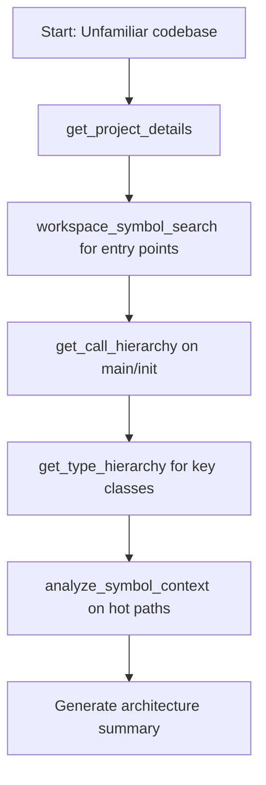
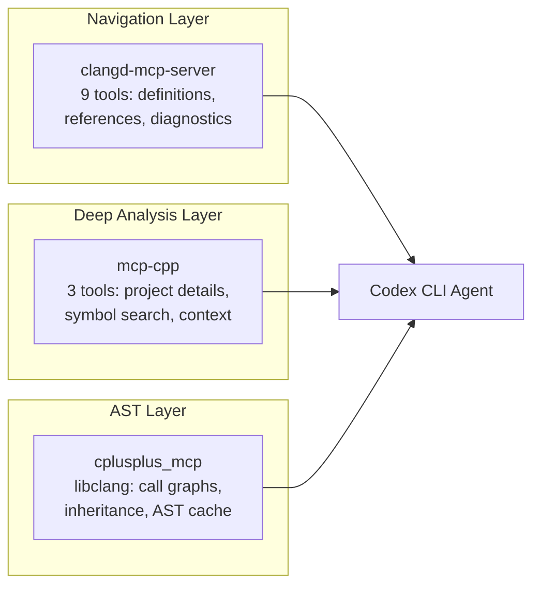

# Codex CLI for C/C++ Development: Clangd MCP Servers, CMake Integration, and Systems Programming Agent Workflows


---

## Introduction

C and C++ codebases present unique challenges for AI coding agents: complex build systems, header dependency graphs, platform-specific preprocessor branches, and the sheer scale of systems-level projects. Without semantic understanding, an agent navigating a million-line C++ codebase is reduced to pattern-matching against text — a recipe for hallucinated APIs and broken builds.

Three MCP servers now bridge this gap, giving Codex CLI IDE-grade code intelligence through clangd's Language Server Protocol implementation. This article covers how to configure them, compose them with Codex CLI's sandbox, and build effective agent workflows for systems programming.

## The C/C++ MCP Server Landscape

### clangd-mcp-server (felipeerias)

A Node.js MCP server exposing nine clangd tools for comprehensive code navigation[^1]:

| Tool | Purpose |
|------|---------|
| `find_definition` | Jump to symbol definitions |
| `find_references` | All references across the codebase |
| `get_hover` | Type information and documentation |
| `workspace_symbol_search` | Cross-project symbol queries |
| `find_implementations` | Virtual method implementations |
| `get_document_symbols` | Hierarchical symbol tree per file |
| `get_diagnostics` | Compiler errors, warnings, notes |
| `get_call_hierarchy` | Function callers and callees |
| `get_type_hierarchy` | Inheritance relationships |

**Requirements:** Node.js 18+, clangd, and a `compile_commands.json` in the project root[^1].

### mcp-cpp (mpsm)

A Rust-based MCP server designed specifically for large C/C++ codebases, supporting multiple simultaneous projects[^2]. It provides three focused analysis tools:

- **`get_project_details`** — Build system analysis and workspace discovery for CMake and Meson projects
- **`search_symbols`** — Locates functions, classes, and variables; supports empty queries for complete file overviews
- **`analyze_symbol_context`** — Deep analysis with definitions, usage examples, class members, inheritance trees, and call relationships

**Requirements:** clangd 11+ (20+ recommended), Rust 2024 edition for building, CMake or Meson for `compile_commands.json` generation[^2].

Install via: `cargo install mcp-cpp-server`

### cplusplus_mcp (kandrwmrtn)

A Python-based server using libclang directly for AST-level analysis[^3]. Rather than proxying through clangd's LSP, it parses translation units and caches ASTs for incremental re-analysis. Provides:

- Class and function discovery
- Inheritance hierarchy traversal
- Call graph generation
- Semantic code relationships

**Requirements:** Python 3.10+, libclang (auto-downloaded via setup script)[^3].

## Configuring Codex CLI

### config.toml Setup

Add your chosen MCP servers to `~/.config/codex/config.toml`[^4]:

```toml
[mcp_servers.clangd]
command = "clangd-mcp-server"
env = { PROJECT_ROOT = "/home/dev/project" }

[mcp_servers.mcp-cpp]
command = "mcp-cpp-server"
args = []
env = { CLANGD_PATH = "/usr/bin/clangd" }
```

For projects using both servers (one for navigation, one for deep analysis):

```toml
[mcp_servers.clangd-nav]
command = "clangd-mcp-server"
env = { PROJECT_ROOT = "/home/dev/project" }

[mcp_servers.cpp-analysis]
command = "mcp-cpp-server"
env = { CLANGD_PATH = "/usr/bin/clangd-20" }
```

### Generating compile_commands.json

All three servers require a compilation database. For CMake projects[^5]:

```bash
cmake -B build -DCMAKE_EXPORT_COMPILE_COMMANDS=ON
ln -sf build/compile_commands.json .
```

For projects using Bear with Make:

```bash
bear -- make -j$(nproc)
```

For Meson:

```bash
meson setup builddir
# compile_commands.json is generated automatically in builddir/
```

## AGENTS.md for C/C++ Projects

A well-structured `AGENTS.md` prevents hallucination of non-existent APIs and enforces project conventions:

```markdown
# Project: libwidget

## Build System
- CMake 3.28+, Ninja generator preferred
- Build: `cmake --build build --parallel`
- Test: `ctest --test-dir build --output-on-failure`
- Lint: `clang-tidy -p build src/**/*.cpp`

## Language Standards
- C++23 (modules disabled, headers only)
- C17 for the C API surface
- Compiler: Clang 20.1 or GCC 15

## Conventions
- Use `std::expected` over exceptions in new code
- RAII wrappers required for all resource handles
- No raw `new`/`delete` — use `std::unique_ptr` or `std::make_unique`
- Header guards use `#pragma once`
- All public API functions documented with Doxygen `/** */`

## Anti-Hallucination Rules
- Do NOT invent standard library functions — verify via get_hover tool
- Do NOT assume header locations — use find_definition to confirm
- Do NOT generate platform-specific code without checking preprocessor defines
- Always run `cmake --build build` after changes to verify compilation

## MCP Server Usage
- Use clangd-mcp-server for navigation (find_definition, find_references)
- Use mcp-cpp-server for deep analysis (analyze_symbol_context)
- Always check get_diagnostics after edits
```

## Workflow Patterns

### Pattern 1: Codebase Archaeology

For understanding unfamiliar C++ codebases before making changes:



Prompt example:
```
Map the architecture of src/core/ — identify the main class hierarchies,
their ownership relationships, and the call flow from main() through
initialisation. Use the MCP tools to verify every claim.
```

### Pattern 2: Refactoring with Verification

Safe refactoring in C++ requires knowing all callers and all implicit conversions:

```bash
codex --model gpt-5.5 \
  "Refactor ConnectionPool to use std::expected<Connection, Error> instead of
   throwing exceptions. Use find_references to locate all call sites.
   After each file change, run cmake --build build to verify compilation.
   Then run ctest to verify tests still pass."
```

### Pattern 3: Header Dependency Audit

Large C++ projects suffer from transitive include bloat. Use the MCP server to audit:

```bash
codex exec --model gpt-5.4-mini \
  --input-file headers.txt \
  "For each header file listed, use get_document_symbols to find what it
   actually exports, then use find_references to check which symbols are
   used by includers. Report headers where <30% of exports are referenced."
```

### Pattern 4: Test Generation from Implementation

```bash
codex --model gpt-5.5 \
  "Generate Catch2 unit tests for src/parser/lexer.cpp. Use
   analyze_symbol_context to understand each public method's contract.
   Use get_type_hierarchy to identify edge cases from derived types.
   Place tests in tests/parser/test_lexer.cpp. Run ctest after writing."
```

## Model Selection for C/C++ Tasks

| Task | Recommended Model | Rationale |
|------|-------------------|-----------|
| Architecture mapping | gpt-5.5 | Complex reasoning across large call graphs[^6] |
| Refactoring | gpt-5.5 | Needs to track all references and side effects |
| Test generation | gpt-5.4-mini | Formulaic output, benefits from speed[^6] |
| Build fix iteration | gpt-5.4-mini | Rapid error-fix loops |
| API design review | gpt-5.5 | Nuanced trade-off reasoning |
| Batch header audit | gpt-5.4-mini | High-volume, low-complexity per file |

## Sandbox Considerations

C/C++ development requires careful sandbox configuration[^7]:

**Filesystem access:**
- The `compile_commands.json` must be readable
- Build directories need write access for object files
- System headers (`/usr/include`, `/usr/lib/clang/`) need read access

**Network:**
- Package managers (Conan, vcpkg) need network for dependency resolution
- Disable network once dependencies are cached

**Recommended sandbox mode:**
```bash
codex --sandbox workspace-write \
  --writable-root build/ \
  --writable-root .cache/
```

**Pre-warming the build:**
```bash
# Generate compile_commands.json before invoking Codex
cmake -B build -DCMAKE_EXPORT_COMPILE_COMMANDS=ON -G Ninja
cmake --build build  # Warm the object cache
```

This ensures clangd can index immediately without waiting for a cold build, and the MCP server has the compilation database available from first invocation.

## Composing MCP Servers

The three servers occupy complementary niches:



For most projects, **clangd-mcp-server alone suffices**. Add mcp-cpp when working across multiple large projects simultaneously or when you need multi-project symbol search. Add cplusplus_mcp when you need call graph generation that clangd's hierarchy tools cannot provide.

## Limitations and Workarounds

| Limitation | Impact | Workaround |
|-----------|--------|-----------|
| Training data lag for C++23/26 | May hallucinate module syntax or `std::execution` APIs | AGENTS.md with explicit standard version; verify via `get_diagnostics` |
| Template instantiation opacity | Clangd struggles with deeply nested SFINAE | Use `get_hover` on specific instantiations rather than templates |
| Preprocessor branches | Only the active configuration is analysed | Generate separate `compile_commands.json` per platform; switch via env var |
| Large TU compilation time | Initial indexing can take minutes on million-line projects | Pre-build before Codex session; use mcp-cpp's multi-project caching |
| Header-only libraries | No `.cpp` files means fewer reference targets | Ensure compile database includes consuming translation units |
| clangd memory usage | Can exceed 4GB on large projects | Set `CLANGD_ARGS="--background-index=false"` for on-demand indexing |

## Conclusion

C/C++ development with Codex CLI moves from "best-effort text search" to "compiler-verified semantic navigation" once you add a clangd MCP server. The combination of compile_commands.json for build context, AGENTS.md for project conventions, and MCP tools for verified code intelligence makes agent-assisted systems programming practical — even on the kind of large, complex codebases where hallucination would otherwise be catastrophic.

---

## Citations

[^1]: felipeerias/clangd-mcp-server — GitHub repository with 9 LSP tools via MCP. [https://github.com/felipeerias/clangd-mcp-server](https://github.com/felipeerias/clangd-mcp-server)

[^2]: mpsm/mcp-cpp — Rust-based MCP server for large C/C++ codebases. [https://github.com/mpsm/mcp-cpp](https://github.com/mpsm/mcp-cpp)

[^3]: kandrwmrtn/cplusplus_mcp — Python MCP server using libclang for AST analysis. [https://github.com/kandrwmrtn/cplusplus_mcp](https://github.com/kandrwmrtn/cplusplus_mcp)

[^4]: OpenAI Codex CLI MCP configuration documentation. [https://developers.openai.com/codex/mcp](https://developers.openai.com/codex/mcp)

[^5]: CMake documentation — CMAKE_EXPORT_COMPILE_COMMANDS. [https://cmake.org/cmake/help/latest/variable/CMAKE_EXPORT_COMPILE_COMMANDS.html](https://cmake.org/cmake/help/latest/variable/CMAKE_EXPORT_COMPILE_COMMANDS.html)

[^6]: OpenAI Codex Models documentation — model selection guidance. [https://developers.openai.com/codex/models](https://developers.openai.com/codex/models)

[^7]: OpenAI Codex Sandbox documentation. [https://developers.openai.com/codex/concepts/sandboxing](https://developers.openai.com/codex/concepts/sandboxing)
