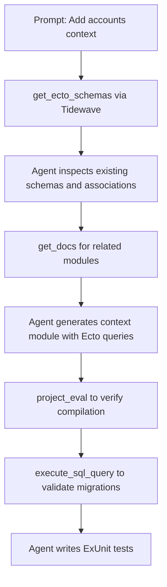
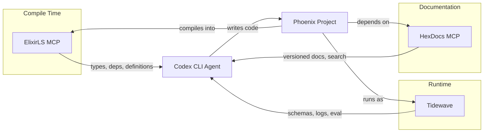

# Codex CLI for Elixir and Phoenix Development: Tidewave, ElixirLS MCP, HexDocs, and Runtime-Aware Agent Workflows


---

Elixir occupies a unique position in the language ecosystem. Its macro-heavy metaprogramming, runtime-defined schemas, OTP supervision trees, and the BEAM's concurrency model create challenges that static analysis alone cannot resolve. Codex CLI's MCP integration addresses this directly: three complementary MCP servers — Tidewave, ElixirLS MCP, and HexDocs MCP — give the agent runtime introspection, compiler-powered code intelligence, and version-accurate documentation search within a single session.

This article covers configuring all three servers for Codex CLI, writing an effective AGENTS.md for Elixir projects, and four workflow patterns that exploit Elixir's runtime characteristics.

## The Elixir MCP Landscape

### Tidewave: Runtime Introspection for Phoenix

Tidewave [^1] is José Valim's answer to the fundamental problem of AI-assisted Elixir development: metaprogramming makes static analysis insufficient. Built as a Plug, Tidewave runs inside your Phoenix application and exposes eight MCP tools [^2]:

| Tool | Purpose |
|------|---------|
| `execute_sql_query` | Run SQL against your application's Ecto database |
| `get_docs` | Retrieve documentation for exact dependency versions |
| `get_logs` | Access server-written application logs |
| `get_models` | Enumerate all application modules with file locations |
| `get_source_location` | Resolve file paths for modules and functions |
| `project_eval` | Execute Elixir code within the application runtime |
| `get_ecto_schemas` | Inspect Ecto schema definitions (if using Ecto) |
| `get_ash_resources` | Inspect Ash framework resources (if using Ash) |

The critical insight is `project_eval` and `get_ecto_schemas`. When Phoenix uses `schema` macros or Ecto's `has_many`/`belongs_to` associations, the actual struct fields and associations exist only at runtime. Tidewave lets the agent introspect these directly rather than guessing from source.

Installation requires two steps in your Phoenix project:

```elixir
# mix.exs
defp deps do
  [
    {:tidewave, "~> 0.5", only: :dev}
  ]
end
```

```elixir
# lib/my_app_web/endpoint.ex
if Mix.env() == :dev do
  plug Tidewave
end
```

Tidewave starts an SSE-based MCP server on your Phoenix application's port (typically `localhost:4000`) at the `/tidewave/mcp` endpoint by default [^2].

### ElixirLS MCP: Compiler-Powered Code Intelligence

ElixirLS v0.29.0 shipped a built-in MCP server in August 2025 [^3], providing six tools optimised for LLM consumption rather than IDE display:

- **`find_definition`** — locates and retrieves source code for modules, functions, types, and macros
- **`get_environment`** — analyses code context including aliases, imports, requires, and variables in scope
- **`get_docs`** — aggregates comprehensive documentation for any symbol
- **`get_type_info`** — extracts typespecs, Dialyzer contracts, and inferred types
- **`find_implementations`** — discovers implementations of behaviours and protocols
- **`get_module_dependencies`** — analyses module dependency relationships

The MCP server listens on TCP, defaulting to port `3789 + hash(workspace_path)` for predictable per-workspace assignment [^3]. Since v0.29.2, it is opt-in — set `elixirLS.mcpEnabled: true` in your editor configuration to activate it.

Where Tidewave provides runtime introspection, ElixirLS provides compile-time intelligence: type information from Dialyzer, behaviour and protocol implementations across the codebase, and dependency graphs. The two are complementary, not competing.

### HexDocs MCP: Semantic Documentation Search

HexDocs MCP v0.6.0 [^4] provides semantic search over Hex package documentation using embeddings. It consists of an Elixir binary that downloads and processes package docs, and a TypeScript MCP server implementing the search interface.

Two primary tools:

- **`search`** — semantic search across fetched package documentation
- **`fetch`** — download and embed documentation for a specific package and version

This eliminates a common failure mode: the agent hallucinating API calls based on training data from older package versions. HexDocs MCP retrieves documentation for the exact versions in your `mix.lock`.

## Codex CLI Configuration

Configure all three servers in `~/.codex/config.toml` or your project-scoped `.codex/config.toml`:

```toml
[mcp_servers.tidewave]
type = "sse"
url = "http://localhost:4000/tidewave/mcp"

[mcp_servers.elixirls-mcp]
type = "sse"
url = "http://localhost:3789/mcp"

[mcp_servers.hexdocs]
command = "npx"
args = ["-y", "hexdocs-mcp@0.6.0"]
```

For Tidewave and ElixirLS, start your Phoenix server (`mix phx.server`) and your editor with ElixirLS before launching Codex CLI. The agent then has access to all tools from all three servers simultaneously [^5].

### Model Selection

For Elixir work, model choice matters:

- **o3** — schema design, complex OTP supervision tree refactoring, protocol and behaviour architecture, performance-critical GenServer implementations
- **o4-mini** — CRUD contexts, test generation, LiveView component scaffolding, routine Ecto changesets

The pattern-matching-heavy nature of Elixir and the prevalence of macros means o3's deeper reasoning handles edge cases (guard clauses, protocol dispatch, macro hygiene) more reliably than o4-mini [^6].

## AGENTS.md for Elixir Projects

An effective AGENTS.md for Elixir 1.19 projects anchors the agent to current conventions and prevents common hallucinations:

```markdown
# AGENTS.md — Elixir/Phoenix Project

## Language & Runtime
- Elixir 1.19.5 on Erlang/OTP 28
- Phoenix 1.8, Phoenix LiveView 1.1+
- Ecto 3.12

## Conventions
- Use `mix format` before committing — enforced by CI
- Run `mix credo --strict` — zero warnings policy
- Dialyzer must pass: `mix dialyzer --format github`
- British English in documentation and comments

## Code Style
- Prefer pattern matching over conditionals
- Use `with` for happy-path chains, not nested `case`
- Contexts (lib/my_app/*.ex) own all Ecto queries — no Repo calls in controllers or LiveView
- Use `Ecto.Multi` for multi-step database operations
- Prefer `Phoenix.Component` function components over templates

## Type System (Elixir 1.19)
- Add @spec to all public functions
- Use set-theoretic types where the compiler supports them
- Protocol implementations must handle all documented types

## Testing
- ExUnit with `async: true` where safe
- Use ExUnit groups for tests sharing database state
- Factory functions via ExMachina, not fixtures
- Property-based tests via StreamData for data transformations

## OTP Patterns
- Every GenServer must implement handle_info for :DOWN messages
- Supervisor strategies: one_for_one unless restart coupling is documented
- Use Registry for dynamic process lookup, not named processes
- Document restart intensity rationale in module docs

## Anti-Hallucination Rules
- Do NOT use Phoenix.View (removed in Phoenix 1.7+)
- Do NOT use Plug.Conn.put_session outside controllers
- Ecto.Query: use explicit joins, not implicit
- LiveView: use assign/2 and assign_new/3, not socket.assigns direct mutation
- Mix.Config is deprecated — use config/runtime.exs
```

## Workflow Patterns

### 1. Phoenix Context Generation with Runtime Validation

This workflow exploits Tidewave's runtime introspection to generate new Phoenix contexts that integrate correctly with existing schemas:



Prompt Codex CLI:

```
Using the Tidewave MCP, inspect the existing Ecto schemas in this project.
Then create a new Accounts context with User and Organisation schemas,
including proper associations to the existing schemas you found.
Verify the migrations compile and the schemas load correctly.
```

The agent uses `get_ecto_schemas` to discover existing associations, generates code that references real field names, then uses `project_eval` to verify the new module compiles within the running application.

### 2. LiveView Component Development with Log-Driven Debugging

LiveView's server-rendered model means client-side debugging tools are insufficient. Tidewave's `get_logs` tool gives the agent direct access to server logs during development:

```
Build a LiveView component for real-time order tracking.
Use get_logs to check for any errors after each change.
Use get_docs to verify Phoenix.LiveView callback signatures
against our exact installed version.
```

The agent iterates: write component → trigger a test event → read logs → fix issues. This loop is particularly effective because LiveView errors often manifest as server-side crashes that are invisible in the browser.

### 3. Protocol Implementation Discovery and Extension

ElixirLS MCP's `find_implementations` tool excels when working with protocols and behaviours:

```
Using ElixirLS MCP, find all implementations of the Reportable protocol
in this project. Then add a new implementation for the Invoice schema,
following the patterns used by the existing implementations.
Check type info to ensure the @spec matches.
```

The agent discovers every existing `defimpl Reportable` block, analyses their patterns, generates a consistent new implementation, and uses `get_type_info` to verify the typespec alignment.

### 4. Dependency Audit with Version-Accurate Documentation

Combine HexDocs MCP with Codex CLI's batch mode for dependency audits across a project:

```bash
codex exec "Using HexDocs MCP, fetch docs for every dependency in mix.lock. \
For each dependency, check if we're using any deprecated functions. \
Generate a report of deprecated API usage with suggested replacements."
```

HexDocs MCP fetches documentation for the exact versions in `mix.lock`, ensuring deprecation warnings are accurate rather than based on the agent's training data [^4].

## Composing MCP Servers

The three servers complement each other precisely because they cover different dimensions:



A typical session might flow: HexDocs MCP to understand a library's API → ElixirLS MCP to find where it's used in the codebase → Tidewave to test changes against the running application.

## Sandbox Considerations

Codex CLI's sandbox interacts with Elixir's toolchain in several ways worth noting:

- **Mix deps**: The sandbox needs read access to `deps/` and `_build/`. For `full-auto` mode, ensure `mix deps.get` has been run before starting Codex CLI
- **Tidewave requires a running server**: Start `mix phx.server` in a separate terminal before launching Codex CLI. The agent connects to Tidewave over HTTP, which works within the sandbox
- **ElixirLS requires editor**: The MCP server runs within ElixirLS, which typically runs inside your editor. Ensure your editor is open with ElixirLS active on the project
- **Compilation artefacts**: Elixir's `_build/` directory can be large. The sandbox's write restrictions in `suggest` mode may prevent recompilation — use `auto-edit` or `full-auto` for workflows that modify source files

## Hermes MCP: Building Custom MCP Servers in Elixir

For teams building their own MCP servers, Hermes MCP v0.14.1 [^7] provides a comprehensive Elixir SDK with both client and server implementations. Built on OTP's supervision trees, it offers automatic recovery and built-in connection supervision — making it production-grade for custom tooling that extends the agent's capabilities.

```elixir
# mix.exs
{:hermes_mcp, "~> 0.14"}
```

This is particularly relevant for teams wanting to expose internal APIs, custom business logic, or proprietary data sources to Codex CLI through the MCP standard.

## Limitations

- **Training data lag**: Elixir 1.19's set-theoretic type checking and protocol type inference are recent enough that models may generate patterns from 1.17/1.18. The AGENTS.md and ElixirLS MCP's `get_type_info` tool mitigate this [^8]
- **Macro expansion opacity**: Neither ElixirLS MCP nor Tidewave fully expose macro expansion chains. Complex `use` macros (e.g., `use Phoenix.Router`) inject code the agent cannot directly inspect
- **Tidewave dev-only**: Tidewave runs as a Plug in `:dev` environment only. The agent cannot introspect production or staging deployments
- **HexDocs embedding model**: HexDocs MCP requires Ollama with `mxbai-embed-large` running locally, adding infrastructure overhead [^4]
- **ElixirLS MCP port conflicts**: Multiple workspaces using the same port hash can conflict. Set explicit ports in ElixirLS configuration for multi-project setups
- **BEAM hot code reloading**: If you hot-reload modules while the agent is working, Tidewave's `get_ecto_schemas` may return stale information until the next full recompile

## Citations

[^1]: [Tidewave Phoenix — GitHub](https://github.com/tidewave-ai/tidewave_phoenix) — Tidewave for Phoenix, the coding agent for full-stack web app development.
[^2]: [Setting up Tidewave MCP — Tidewave v0.5.6](https://hexdocs.pm/tidewave/mcp.html) — MCP tools and configuration reference for Tidewave.
[^3]: [ElixirLS MCP Server — Elixir Forum](https://elixirforum.com/t/elixirls-mcp-server/71992) — ElixirLS v0.29.0+ MCP server announcement and tool documentation.
[^4]: [HexDocs MCP v0.6.0 — HexDocs](https://hexdocs.pm/hexdocs_mcp/readme.html) — Semantic search for Hex documentation via MCP.
[^5]: [Model Context Protocol — Codex CLI OpenAI Developers](https://developers.openai.com/codex/mcp) — Official Codex CLI MCP configuration reference.
[^6]: [OpenAI Models Documentation](https://developers.openai.com/api/docs/models) — Current model capabilities for o3 and o4-mini.
[^7]: [Hermes MCP — Hex.pm](https://hex.pm/packages/hermes_mcp) — Elixir Model Context Protocol SDK by Cloudwalk, v0.14.1.
[^8]: [Elixir v1.19 Released — elixir-lang.org](https://elixir-lang.org/blog/2025/10/16/elixir-v1-19-0-released/) — Enhanced type checking and 4x faster compilation.
