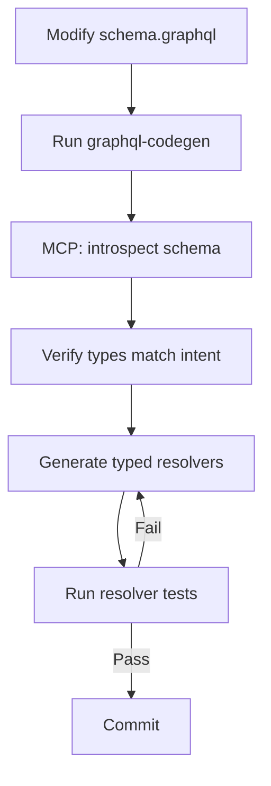
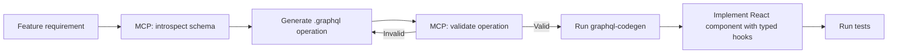

# Codex CLI for GraphQL Development: Apollo MCP Server, Schema Introspection, and Type-Safe Agent Workflows


---

GraphQL's self-describing type system and schema introspection make it uniquely suited to agent-assisted development. Where REST APIs force an agent to guess at endpoint shapes and response structures, a GraphQL schema provides a machine-readable contract that eliminates an entire class of hallucination. This article covers three MCP servers for GraphQL development with Codex CLI, an `AGENTS.md` template for GraphQL projects, and four workflow patterns that exploit GraphQL's type system for safe, verifiable agent output.

## The GraphQL MCP Landscape

Three MCP servers cover distinct points in the GraphQL development lifecycle.

### Apollo MCP Server (v1.14.0)

Apollo's official MCP server exposes GraphQL operations as MCP tools, translating your schema into a toolset that agents can discover and invoke [^1]. Built in Rust, it supports three operation-sourcing modes:

- **Operation files** — individual `.graphql` files defining explicit queries and mutations
- **Persisted query manifests** — pre-approved operation lists from Apollo GraphOS, providing safelisting by default [^2]
- **Schema introspection** — dynamic discovery where the agent explores the schema at runtime

Apollo MCP Server deploys locally via the Rover CLI (stdio transport) or as a containerised service using Streamable HTTP [^1]. Mutation control is granular: `none` blocks all mutations (the default), `explicit` permits only pre-defined mutations, and `all` enables agent-constructed mutations [^2].

### mcp-graphql (v2.0.4)

A community TypeScript server by blurrah that provides two focused tools: `introspect-schema` for automatic schema discovery and `query-graphql` for execution [^3]. Mutations are disabled by default — you must explicitly set `ALLOW_MUTATIONS=true`. Configuration is environment-variable driven:

```bash
ENDPOINT=http://localhost:4000/graphql
HEADERS='{"Authorization": "Bearer ${GQL_TOKEN}"}'
ALLOW_MUTATIONS=false
```

This server suits teams that want lightweight, zero-config schema access without Apollo infrastructure [^3].

### graphql-mcp (ctkadvisors)

A dynamic GraphQL MCP server that generates tools from schema introspection at startup, creating one MCP tool per query and mutation [^4]. It targets exploratory workflows where the operation set cannot be predicted in advance — useful during schema design or when working against third-party APIs.

## Codex CLI Configuration

All three servers compose in `config.toml`. A typical setup pairs Apollo MCP Server for production graph access with mcp-graphql for local development:

```toml
[mcp_servers.apollo-graphql]
command = "npx"
args = ["-y", "@apollo/mcp-server", "--config", "./apollo-mcp.yaml"]

[mcp_servers.local-graphql]
command = "npx"
args = ["-y", "mcp-graphql"]
env = { ENDPOINT = "http://localhost:4000/graphql", ALLOW_MUTATIONS = "false" }

[mcp_servers.graphql-dynamic]
command = "npx"
args = ["-y", "@ctkadvisors/graphql-mcp"]
env = { GRAPHQL_ENDPOINT = "http://localhost:4000/graphql" }
```

For the Apollo MCP Server, the companion `apollo-mcp.yaml` configuration references your schema source:

```yaml
graphRef: my-org/my-graph@current
operationFiles:
  - ./operations/*.graphql
mutations: explicit
```

### Sandbox Considerations

GraphQL development servers typically run on `localhost`. Codex CLI's default sandbox blocks network access, so you must enable it for MCP servers that connect to local or remote GraphQL endpoints [^5]:

```toml
[sandbox_workspace_write]
network_access = true
```

Alternatively, scope network access per-session:

```bash
codex -c 'sandbox_workspace_write.network_access=true'
```

For production graph access via Apollo GraphOS, the MCP server handles authentication through your existing router headers — no additional sandbox configuration is needed beyond network access [^1].

## AGENTS.md Template for GraphQL Projects

```markdown
# AGENTS.md — GraphQL Project

## Stack
- GraphQL (June 2025 spec) with Apollo Server v4 or Yoga v5
- TypeScript 5.8+ with strict mode
- graphql-codegen for type generation
- Apollo Client v3 or urql v4 for client operations

## Conventions
- Schema-first design: always modify `schema.graphql` before resolvers
- All resolvers must be typed via graphql-codegen output — never use `any`
- Use DataLoader for N+1 prevention in every resolver with list access
- Mutations must validate input with zod schemas before execution
- All queries must have complexity cost annotations (@cost, @listSize)
- Persisted queries for production; introspection disabled in production

## Anti-Hallucination Rules
- NEVER invent GraphQL directives — check schema.graphql for supported directives
- NEVER assume field nullability — check the schema definition
- NEVER generate resolvers without running graphql-codegen first
- ALWAYS use the MCP introspect tool to verify schema state before generating code
- ALWAYS run `npm run codegen` after schema changes to regenerate types

## Testing
- Resolver unit tests with graphql-tools mockSchema
- Integration tests execute actual GraphQL operations against test server
- Use `graphql-tag` for operation parsing in tests

## File Structure
- `schema/` — `.graphql` schema files (source of truth)
- `src/resolvers/` — resolver implementations (one file per type)
- `src/generated/` — graphql-codegen output (never edit manually)
- `operations/` — `.graphql` client operations (used by Apollo MCP)
```

## Workflow Patterns

### 1. Schema-First Resolver Generation

The most common GraphQL workflow: modify the schema, generate types, then implement resolvers. With Codex CLI and the Apollo MCP Server, the agent can verify schema state before writing code:



Prompt: *"Add a `bookmarks` field to the User type that returns a paginated connection of Bookmark nodes. Use the introspect tool to verify the schema, run codegen, then implement the resolver with DataLoader and cursor-based pagination."*

The agent uses the MCP introspection tool to confirm the current schema state, ensuring it does not hallucinate existing fields or types. After modifying `schema.graphql`, it runs codegen and implements against the generated types — compile-time safety without manual checking.

### 2. Operation Audit and Optimisation

Apollo MCP Server's persisted query mode lets an agent audit every operation registered against a graph:

```bash
codex exec --input-file operations.txt \
  "For each operation, use the introspect tool to check field usage. \
   Flag any operation selecting more than 20 fields, any missing \
   @cost annotations, and any N+1 patterns in nested selections."
```

This pattern is particularly effective for large schemas where manual operation review is impractical. The agent produces a structured report of operations that need cost annotations, field pruning, or DataLoader additions [^2].

### 3. Type-Safe Client Operation Generation

When building frontend features, the agent can generate client operations that are guaranteed to be valid against the current schema:



The introspect-then-validate loop eliminates the common failure mode where an agent generates operations referencing fields that do not exist or have different nullability than assumed [^6].

### 4. Schema Migration with Breaking Change Detection

For evolving APIs, Codex CLI can orchestrate schema migrations that detect and resolve breaking changes:

Prompt: *"Rename the `User.email` field to `User.emailAddress`. Use the introspect tool to find all operations referencing the old field name. Update each operation, add a @deprecated directive to the old field with a removal date, generate a migration guide, and run the full test suite."*

The agent's access to both schema introspection and the operation file set means it can perform impact analysis before making changes — something that typically requires a separate GraphQL linting tool [^7].

## Model Selection for GraphQL Tasks

| Task | Model | Rationale |
|------|-------|-----------|
| Schema design, complex resolver logic | gpt-5.5 | Strongest reasoning for type relationships and data modelling [^8] |
| CRUD resolvers, test generation | gpt-5.4-mini | Fast iteration on mechanical code [^8] |
| Operation audit, batch analysis | gpt-5.4-mini via `codex exec` | Cost-effective for high-volume repetitive checks [^8] |
| Schema migration, breaking changes | gpt-5.5 | Requires cross-file reasoning and impact analysis [^8] |

## Composing with Other MCP Servers

GraphQL projects benefit from combining the GraphQL MCP servers with complementary tooling:

- **Filesystem MCP** — reading schema files, resolver implementations, and codegen config
- **GitHub MCP** — creating PRs for schema changes with automated migration guides
- **PostgreSQL/database MCP** — verifying resolver data access patterns match actual table structures
- **graphql-codegen** via shell — the agent runs codegen as a shell command, then uses the generated types

A three-server composition (Apollo MCP + database MCP + filesystem) gives the agent end-to-end visibility from schema definition through data layer to generated types.

## Limitations and Considerations

**Schema size and context consumption.** Large schemas with hundreds of types can consume significant context when introspected. Apollo MCP Server's persisted query mode mitigates this by exposing only registered operations rather than the full schema [^1].

**Mutation safety.** All three servers default to blocking mutations, but enabling them requires careful consideration. In production-connected environments, restrict mutations to `explicit` mode with pre-approved operation files [^2].

**Training data lag.** Current models may not reflect the latest GraphQL spec features or Apollo Server v4 patterns. The `AGENTS.md` anti-hallucination rules and MCP introspection provide guardrails, but always verify generated code against your project's actual dependencies. ⚠️

**Localhost access in sandbox.** Codex CLI's sandbox blocks `localhost` by default. GraphQL development servers require `network_access = true`, which also opens access to external endpoints. Consider using `ALLOW_MUTATIONS=false` as an additional safety layer [^5].

**graphql-codegen dependency.** The type-safe workflow depends on running codegen after schema changes. If the agent modifies the schema but does not run codegen, subsequent resolver generation will use stale types. The `AGENTS.md` template addresses this with an explicit rule. ⚠️

**Apollo GraphOS requirement.** Persisted query mode requires an Apollo GraphOS account. Teams using standalone Apollo Server or Yoga can use operation files or introspection modes instead [^1].

## Citations

[^1]: [Apollo MCP Server Documentation](https://www.apollographql.com/docs/apollo-mcp-server) — Apollo GraphQL, 2026. Apollo MCP Server v1.14.0 features, deployment modes, and configuration.

[^2]: [Connect AI Agents to Your GraphQL API Using MCP and Type-Safe Tool Configuration](https://www.apollographql.com/blog/connect-ai-agents-to-your-graphql-api-using-mcp-and-type-safe-tool-configuration) — Apollo GraphQL Blog, 2026. Three patterns for operation sourcing, mutation control modes, and security controls.

[^3]: [mcp-graphql GitHub Repository](https://github.com/blurrah/mcp-graphql) — blurrah, v2.0.4. TypeScript MCP server with schema introspection and query execution tools.

[^4]: [graphql-mcp GitHub Repository](https://github.com/ctkadvisors/graphql-mcp) — ctkadvisors. Dynamic GraphQL MCP server with per-operation tool generation.

[^5]: [Codex CLI Sandbox Documentation](https://developers.openai.com/codex/concepts/sandboxing) — OpenAI, 2026. Sandbox modes, network access configuration, and security boundaries.

[^6]: [GraphQL Code Generator](https://the-guild.dev/graphql/codegen) — The Guild, 2026. TypeScript type generation from GraphQL schemas for type-safe resolvers and operations.

[^7]: [Apollo GraphOS MCP Tools](https://www.apollographql.com/docs/graphos/platform/graphos-mcp-tools) — Apollo GraphQL, 2026. GraphOS platform integration with MCP for schema management and operation validation.

[^8]: [Codex CLI Models](https://developers.openai.com/codex/models) — OpenAI, 2026. Available models including gpt-5.5, gpt-5.4, and gpt-5.4-mini with recommended use cases.
