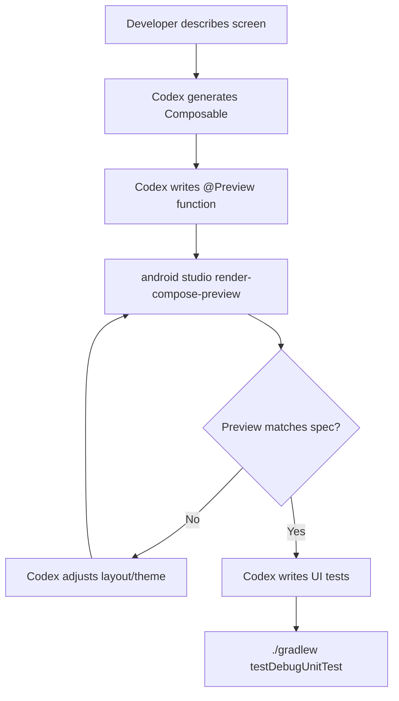
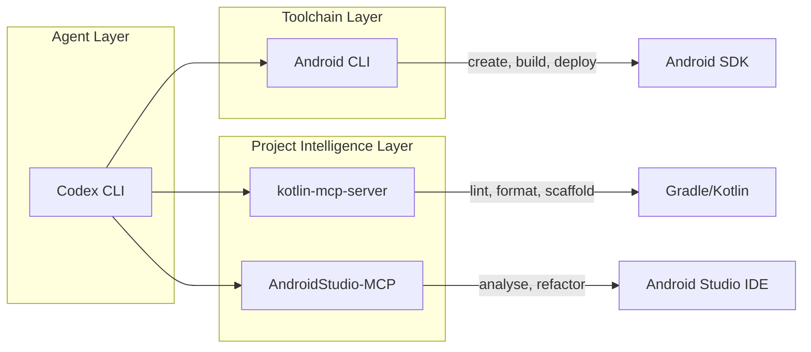

# Codex CLI for Kotlin/Android Development: Android CLI, MCP Servers, and Compose-First Agent Workflows


---

Google's release of Android CLI 1.0 at I/O 2026 fundamentally changed how coding agents interact with the Android toolchain[^1]. Rather than scraping Gradle output or guessing SDK paths, agents now have a structured, machine-readable interface purpose-built for agentic workflows. Combined with Kotlin-specific MCP servers and Codex CLI's sandbox, this creates a development environment where an agent can scaffold a Compose project, build it, deploy to an emulator, render previews, and run tests — all without the developer opening Android Studio.

This article covers the three pillars of agent-assisted Android development: Android CLI for toolchain access, MCP servers for project intelligence, and Codex CLI configuration patterns that tie them together.

## Android CLI: The Agent-First Toolchain

Android CLI provides consistent, scriptable access to every stage of Android development[^1]. In internal benchmarks, it reduced LLM token usage by over 70% for project and environment setup tasks and delivered 3× faster task completion compared to standard toolsets[^2].

### Core Commands

```bash
# Install and initialise
android update
android init  # installs the android-cli skill for your agent

# Project lifecycle
android create --name=MyApp empty-activity-agp-9
android describe --project_dir=./MyApp
android run --apks=app/build/outputs/apk/debug/app-debug.apk

# Emulator management
android emulator create --profile=medium_phone
android emulator start medium_phone
android screen capture --output=ui.png --annotate

# SDK management
android sdk install platforms/android-35 build-tools/36.1.0
android sdk list "build-tools/*" --all-versions
```

The `android describe` command deserves special attention — it returns a structured summary of project modules, dependencies, build variants, and SDK requirements that fits comfortably within a model's context window[^3].

### Android Studio Bridge

When Android Studio Quail 2+ is running, Android CLI exposes IDE capabilities directly[^3]:

```bash
# Symbol resolution without opening the IDE
android studio find-declaration --short HotelDetailScreen
android studio find-usages --short NavHostController

# Render Compose previews as PNGs
android studio render-compose-preview \
  --output-image-file=preview.png \
  --print-semantics \
  app/src/main/java/com/example/ui/DetailScreen.kt \
  DetailScreenPreview

# Static analysis
android studio analyze-file \
  --project=MyApp \
  app/src/main/java/com/example/ui/DetailScreen.kt

# Dependency version lookup
android studio version-lookup \
  androidx.compose.ui:ui \
  agp \
  kotlin
```

The `render-compose-preview` command is particularly powerful for agent workflows — it lets the agent visually verify UI changes by rendering `@Preview` composables to PNG files and extracting semantics data[^3].

## Android Skills: Modular Agent Knowledge

Android Skills are markdown-based instruction sets following the open [Agent Skills Standard](https://agentskills.io)[^4]. They provide expert-level guidance that compensates for training data lag in areas like AGP 9 migration, Navigation 3, and edge-to-edge layouts.

### Installing Skills for Codex CLI

```bash
# Install the core android-cli skill
android skills add --agent=codex

# Install specific skills
android skills add --agent=codex edge-to-edge
android skills add --agent=codex migrate-xml-to-compose

# Install all available skills
android skills add --agent=codex --all

# Discover skills
android skills list --long
android skills find 'navigation'
```

The `--agent` flag supports 37 targets including `codex`, `claude-code`, `gemini`, `cursor`, `aider`, and `github-copilot`[^2]. Skills are installed to `.skills/` or `.agent/skills/` at the project root, where agents automatically discover and activate them based on prompt context[^4].

### Skill Format

Each skill follows the SKILL.md structure[^4]:

```yaml
---
name: edge-to-edge
description: Implement edge-to-edge display support following current Material 3 guidelines.
metadata:
  author: android
  version: "1.0"
---

# Instructions for implementing edge-to-edge...
```

Skills can bundle scripts, reference documentation, and asset templates in subdirectories, keeping the body between 10K and 20K characters (~2,500–5,000 tokens)[^4].

## MCP Servers for Kotlin/Android

Three MCP servers complement Android CLI by providing deeper project intelligence.

### kotlin-mcp-server

The `kotlin-mcp-server` by normaltusker provides 40+ development tools spanning code generation, build management, architecture scaffolding, and security compliance[^5].

Key capabilities:
- **Build automation**: Gradle build/test execution, lint analysis, ktlint formatting
- **Architecture scaffolding**: MVVM setup, Hilt dependency injection, Room database, Retrofit API clients
- **Compose generation**: Jetpack Compose component creation with Material 3
- **Security tooling**: encryption utilities, GDPR/HIPAA compliance scaffolding

```toml
# ~/.codex/config.toml
[mcp-servers.kotlin-android]
command = "python"
args = ["/path/to/kotlin-mcp-server/main.py"]

[mcp-servers.kotlin-android.env]
ANDROID_SDK_ROOT = "/path/to/android-sdk"
```

### AndroidStudio-MCP

The `AndroidStudio-MCP` server by VitoSolin bridges directly to a running Android Studio instance via a Kotlin plugin[^6]. It exposes:

- Project state and module structure
- Build triggers and status
- ADB device interaction
- File analysis through the IDE's own inspection engine

This server is most useful when you need IDE-grade analysis that Android CLI's `android studio` subcommands cannot provide — for instance, custom inspections or refactoring operations that require the full IDE context.

```toml
[mcp-servers.android-studio]
command = "java"
args = ["-jar", "/path/to/android-studio-mcp-server.jar"]
```

### Official MCP Kotlin SDK

For teams building custom MCP servers, the official `kotlin-sdk` from the Model Context Protocol organisation provides Kotlin Multiplatform support (JVM 11+, Native, JS, Wasm) with coroutine-friendly APIs[^7]. It supports stdio, SSE, Streamable HTTP, and WebSocket transports.

```kotlin
// build.gradle.kts
dependencies {
    implementation("io.modelcontextprotocol:kotlin-sdk:$mcpVersion")
}
```

This is relevant when your Android project has domain-specific tooling — custom Gradle plugins, internal design systems, or proprietary build pipelines — that would benefit from MCP exposure.

## Codex CLI Configuration

### AGENTS.md for Kotlin/Android Projects

```markdown
# AGENTS.md

## Project Stack
- Kotlin 2.4 / Android 35 / AGP 9
- Jetpack Compose with Material 3
- Architecture: single-Activity, Compose Navigation 3
- DI: Hilt / Build: Gradle Kotlin DSL

## Conventions
- Compose-first: no XML layouts in new code
- Use `@Composable` functions, not Fragment-based navigation
- Follow official Compose API guidelines: state hoisting, slot APIs
- ktlint for formatting, detekt for static analysis
- All strings in `res/values/strings.xml` — no hardcoded strings
- Use `kotlinx.serialization` for JSON, not Gson

## Build Commands
- Build: `./gradlew assembleDebug`
- Test: `./gradlew testDebugUnitTest`
- Lint: `./gradlew lintDebug`
- Format: `./gradlew ktlintFormat`

## Anti-Hallucination Rules
- Do NOT invent Compose APIs — verify with `android docs search`
- Do NOT use deprecated `accompanist-*` libraries — most are now in core Compose
- Navigation 3 uses type-safe routes — do NOT use string-based `NavHost` routes
- AGP 9 removed `android.enableJetifier` — do NOT include it
- `compileSdk` and `targetSdk` should be 35 for Android 16
```

### config.toml with Composing Servers

```toml
# ~/.codex/config.toml

[mcp-servers.kotlin-android]
command = "python"
args = ["/path/to/kotlin-mcp-server/main.py"]

[mcp-servers.kotlin-android.env]
ANDROID_SDK_ROOT = "/Users/dev/Library/Android/sdk"
```

## Workflow Patterns

### 1. Compose Screen Generation with Preview Verification



This loop is the highest-value workflow for Compose development. The agent generates a composable, renders its preview to a PNG, inspects the visual output, and iterates — all without the developer touching Android Studio. The `--print-semantics` flag provides accessibility tree data the model can reason about structurally[^3].

### 2. XML-to-Compose Migration with Skills

```bash
# Install the migration skill
android skills add --agent=codex migrate-xml-to-compose

# Then prompt Codex
codex "Migrate app/src/main/res/layout/activity_main.xml to Compose following
the migrate-xml-to-compose skill. Preserve all click handlers and data bindings."
```

The skill provides migration patterns covering `ConstraintLayout` to `Modifier` chains, `RecyclerView` to `LazyColumn`, data binding to state hoisting, and Fragment navigation to Compose Navigation 3[^4].

### 3. Dependency Audit and Upgrade

```bash
# Check current versions against latest
android studio version-lookup \
  androidx.compose.ui:ui \
  androidx.navigation:navigation-compose \
  com.google.dagger:hilt-android \
  agp \
  kotlin

# Then prompt Codex
codex "Update all dependencies in gradle/libs.versions.toml to the latest stable
versions shown by android studio version-lookup. Run ./gradlew assembleDebug
to verify the build still passes."
```

### 4. Batch Feature Generation with codex exec

```bash
# Generate multiple screens from specs
find specs/ -name "*.md" | codex exec \
  "Read {file} and generate the corresponding Compose screen, ViewModel,
   and Repository. Place files following the project's package structure.
   Run ./gradlew testDebugUnitTest after each screen."
```

## Model Selection

| Task | Recommended Model | Rationale |
|------|-------------------|-----------|
| Architecture decisions, complex Compose layouts | o3 | Stronger reasoning for multi-constraint UI composition |
| CRUD screens, boilerplate, test generation | o4-mini | Fast, cost-effective for template-driven work |
| Migration tasks (XML→Compose, AGP upgrade) | o3 | Needs to understand both source and target patterns |
| Build script modifications | o4-mini | Gradle DSL changes are well-represented in training data |

## Sandbox Considerations

Codex CLI's network-disabled sandbox works well for most Android development, but some operations require consideration:

- **Gradle dependency resolution** requires network access on first build. Run `./gradlew assembleDebug` outside the sandbox first to populate the Gradle cache, then subsequent builds work offline[^8].
- **Emulator creation** via `android emulator create` needs to download system images. Pre-install them with `android sdk install system-images/android-35/google_apis/x86_64`.
- **Android Studio bridge** commands (`android studio *`) require a running Android Studio instance outside the sandbox.
- **SDK installations** need network — use `android sdk install` before entering sandbox mode.

A practical pattern: run `android sdk install` and `./gradlew assembleDebug --no-daemon` before starting your Codex session to warm all caches.

## Composing Android CLI with MCP Servers

The three layers complement rather than overlap:



- **Android CLI** handles toolchain operations: project creation, SDK management, emulator lifecycle, screen capture, and the skills system.
- **kotlin-mcp-server** provides Kotlin-specific development tools: architecture scaffolding, Compose generation, security compliance.
- **AndroidStudio-MCP** bridges to IDE features when deeper analysis or refactoring is needed.

For most workflows, Android CLI alone covers 80% of needs. Add `kotlin-mcp-server` when you need architecture scaffolding or compliance tooling. Add `AndroidStudio-MCP` when you need IDE-grade inspections or complex refactorings.

## Limitations

- **Training data lag**: Kotlin 2.4.0-RC and AGP 9 are recent — models may hallucinate deprecated patterns. The `android docs search` command and Android Skills mitigate this but do not eliminate it[^2].
- **Compose preview rendering** requires a running Android Studio instance — it cannot work in a headless CI environment or within Codex CLI's sandbox alone[^3].
- **kotlin-mcp-server** bundles its own AI provider integration (OpenAI/Gemini/OpenRouter), which can conflict with Codex CLI's own model usage. Disable the AI tools in the MCP server if you only need build and scaffolding features[^5].
- **Emulator commands** are disabled on Windows[^3].
- **Android Skills** are limited to 20K characters per skill, which constrains the depth of guidance for complex migrations[^4].
- **Gradle cache warming** is essential — cold Gradle builds inside the sandbox will fail due to network restrictions[^8].

## Citations

[^1]: [Android Developers Blog — Android CLI and skills: Build Android apps 3x faster using any agent](https://android-developers.googleblog.com/2026/04/build-android-apps-3x-faster-using-any-agent.html)
[^2]: [InfoQ — With Android CLI, Google is Making the Android Toolchain Agent-Friendly](https://www.infoq.com/news/2026/05/agent-friendly-android-cli/)
[^3]: [Android Developers — Overview of Android CLI](https://developer.android.com/tools/agents/android-cli)
[^4]: [Android Developers — Overview of Android Skills](https://developer.android.com/tools/agents/android-skills)
[^5]: [GitHub — normaltusker/kotlin-mcp-server](https://github.com/normaltusker/kotlin-mcp-server)
[^6]: [GitHub — VitoSolin/AndroidStudio-MCP](https://github.com/vitosolin/androidstudio-mcp)
[^7]: [GitHub — modelcontextprotocol/kotlin-sdk](https://github.com/modelcontextprotocol/kotlin-sdk)
[^8]: [OpenAI Developers — Codex CLI](https://developers.openai.com/codex/cli)
