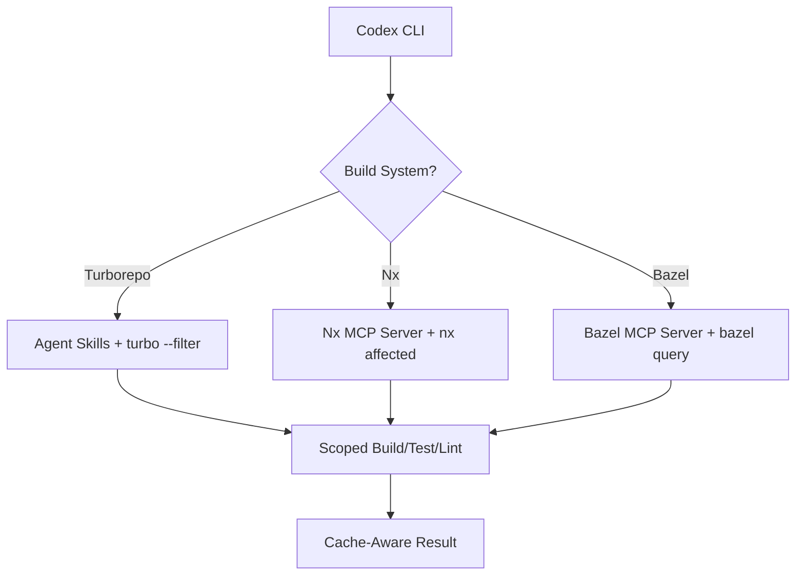
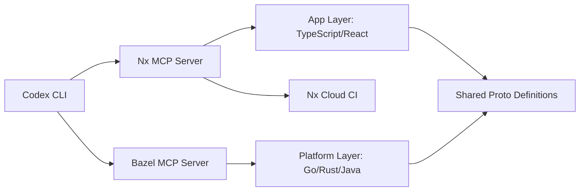
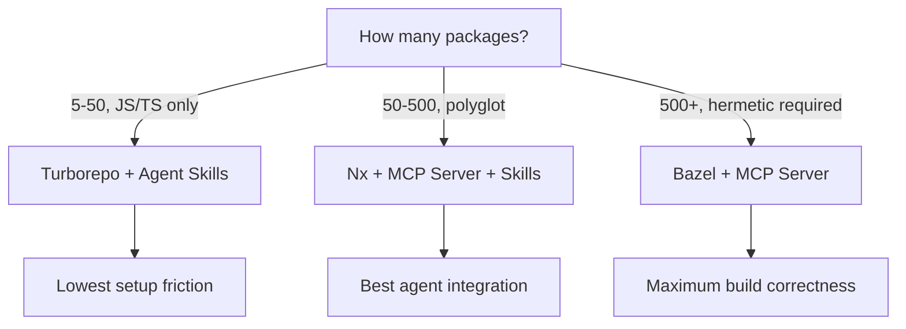

# Codex CLI and Monorepo Tooling: Turborepo, Nx, and Bazel Agent Workflows


---

Monorepos concentrate hundreds of packages behind a single repository root. That density is a gift for an agent — every dependency relationship is collocated — but only if the agent understands the build graph. Without build-system awareness, Codex CLI will lint the wrong packages, run irrelevant tests, and burn tokens traversing files it should never touch.

This article covers the three dominant monorepo orchestrators — Turborepo, Nx, and Bazel — and shows how to wire each into Codex CLI through MCP servers, agent skills, and `AGENTS.md` conventions so the agent operates with full graph awareness.

## The Monorepo Agent Problem

A naïve agent in a 200-package monorepo faces three failure modes:

1. **Blast-radius blindness** — editing `packages/auth/src/index.ts` without knowing that 14 downstream consumers depend on it.
2. **Cache-busting** — running `turbo run build` without `--filter` and rebuilding the entire graph on every iteration.
3. **Wrong-package hallucination** — generating code that imports from `@acme/utils` when the workspace calls it `@acme/shared-utils`.

Build-system-aware tooling solves all three. The agent queries the project graph before acting, scopes commands to affected packages, and validates imports against the actual workspace topology.



## Turborepo: Agent Skills and Filtered Execution

Turborepo 2.8 introduced composable configuration and an official agent skill [^1]. Turborepo 3.0, currently in canary, adds `turbo docs` — AI-powered documentation retrieval [^2]. For Codex CLI integration, the agent skill approach is the most effective pattern today.

### Installing the Turborepo Agent Skill

Turborepo publishes a SKILL.md that triggers on `turbo.json`, task pipelines, `dependsOn`, caching, `--filter`, `--affected`, and CI optimisation [^3]. Install it into your project:

```bash
mkdir -p .codex/skills
curl -o .codex/skills/turborepo.md \
  https://raw.githubusercontent.com/vercel/turborepo/main/SKILL.md
```

The skill teaches Codex CLI to use `--filter` for scoped execution rather than running the entire graph:

```bash
# Build only the changed package and its dependents
turbo run build --filter=...[HEAD~1]

# Lint only packages affected by current changes
turbo run lint --filter=...@acme/auth
```

### Turborepo AGENTS.md Template

Place this at the monorepo root:

```markdown
# AGENTS.md

## Build System
This is a Turborepo monorepo. Always use `turbo run` for build/test/lint.

## Scoping Rules
- NEVER run `turbo run build` without `--filter`
- Use `--filter=...[HEAD~1]` to scope to changed packages
- Use `--filter=@scope/package...` for a package and its dependents
- Check `turbo.json` for task dependencies before adding new tasks

## Caching
- Turborepo uses content-addressed caching. Do not delete `.turbo/`
- Remote cache is enabled via `TURBO_TOKEN` and `TURBO_TEAM`
- If a build seems stale, run `turbo run build --force` to bypass cache

## Package Naming
- All packages use `@acme/` scope prefix
- Shared utilities live in `packages/`, apps in `apps/`
```

### Codex CLI Workflow: Turborepo

```bash
# Identify affected packages, then build and test only those
codex exec -m o3 \
  "List packages affected by the current git diff using turbo run build --filter=...[HEAD~1] --dry-run. Then run build and test for only those packages. Report any failures."
```

## Nx: MCP Server and Six Agent Skills

Nx provides the deepest agent integration of the three tools. The Nx MCP server (v0.25.0, `nx-mcp` on npm) connects Codex CLI to the project graph, Nx Cloud CI pipelines, and self-healing fixes [^4]. The six bundled agent skills handle workspace exploration, code generation, and task execution [^5].

### Configuring the Nx MCP Server

For Nx >= 21.4 [^6]:

```toml
# .codex/config.toml
[mcp_servers.nx]
command = "npx"
args = ["nx", "mcp"]
```

For older Nx versions:

```toml
[mcp_servers.nx]
command = "npx"
args = ["nx-mcp@latest"]
```

The server exposes tools in two modes. **Minimal mode** (default) provides documentation retrieval (`nx_docs`), task monitoring (`nx_current_running_tasks_details`, `nx_current_running_task_output`), graph visualisation (`nx_visualize_graph`), and Nx Cloud CI tools (`ci_information`, `update_self_healing_fix`) [^4]. **Full mode** (`--no-minimal`) adds workspace inspection, plugin discovery, and generator access — but at higher token cost.

### One-Command Setup

Nx ships a single command that configures everything [^5]:

```bash
npx nx configure-ai-agents
```

This generates:
- An MCP server configuration (`.codex/config.toml` or equivalent)
- Six agent skills in `.codex/skills/` or `.claude/skills/`
- A `CLAUDE.md` / `AGENTS.md` with monorepo conventions

### The Six Nx Agent Skills

| Skill | Purpose |
|---|---|
| `nx-workspace` | Explore project graph — filter by type, tags, trace dependencies [^5] |
| `nx-run-tasks` | Execute tasks with `nx run`, `nx run-many`, `nx affected` [^5] |
| `nx-generate` | Discover and run workspace generators instead of writing boilerplate [^5] |
| `nx-plugins` | Find and install plugins via `nx list` and `nx add` [^5] |
| `link-workspace-packages` | Correct workspace protocol linking for pnpm/yarn/npm/bun [^5] |
| `monitor-ci` | Real-time Nx Cloud CI monitoring with self-healing fix application [^5] |

The `monitor-ci` skill is particularly powerful. It allows Codex CLI to watch a CI pipeline, receive failure context from Nx Cloud, apply verified fixes automatically, and iterate until builds pass — a genuine self-healing CI loop [^5].

### Codex CLI Workflow: Nx Affected

```bash
# Run only affected tests with Nx graph awareness
codex exec -m o3 \
  "Run 'nx affected -t test --base=main' and report failures. For each failing test, read the test file and source file, diagnose the issue, and fix it. Re-run only the affected tests to verify."
```

## Bazel: MCP Server for Hermetic Builds

Bazel targets organisations with 1,000+ engineers and multi-language monorepos [^7]. The `bazel-mcp-server` by Amir Omidi provides six tools for agent interaction with the Bazel build system [^8].

### Configuring the Bazel MCP Server

```toml
# .codex/config.toml
[mcp_servers.bazel]
command = "npx"
args = ["-y", "github:nacgarg/bazel-mcp-server"]

[mcp_servers.bazel.env]
MCP_WORKSPACE_PATH = "."
```

### Available Tools

| Tool | Purpose |
|---|---|
| `bazel_build_target` | Compile specified targets [^8] |
| `bazel_test_target` | Execute tests for given targets [^8] |
| `bazel_query_target` | Examine dependency graphs matching patterns [^8] |
| `bazel_list_targets` | List all available targets (use `//` for full listing) [^8] |
| `bazel_fetch_dependencies` | Retrieve external dependencies [^8] |
| `bazel_set_workspace_path` | Change workspace at runtime [^8] |

All commands except `bazel_set_workspace_path` accept an `additionalArgs` parameter for passing Bazel flags like `--verbose_failures` [^8].

### Bazel AGENTS.md Template

```markdown
# AGENTS.md

## Build System
This is a Bazel monorepo. Use bazel build/test/query for all operations.

## Scoping Rules
- Use `bazel query 'rdeps(//..., //path/to/changed:target)'` to find dependents
- NEVER run `bazel build //...` — scope to affected targets
- Use `bazel test //path/to:all` for package-level test runs

## Conventions
- BUILD files use Starlark — do not generate Python syntax
- External dependencies are managed in MODULE.bazel (bzlmod)
- Hermetic toolchains are pinned — do not modify WORKSPACE.bazel
```

### Codex CLI Workflow: Bazel Query-Driven

```bash
# Query the reverse dependency graph before making changes
codex exec -m o3 \
  "Use bazel_query_target to find all reverse dependencies of //lib/auth:auth. List every target that would be affected. Then run bazel_test_target on each affected test target and report results."
```

## Composing Multiple MCP Servers

Large organisations often use Nx or Turborepo for the application layer and Bazel for the platform layer. Codex CLI supports multiple MCP servers simultaneously:

```toml
# .codex/config.toml

[mcp_servers.nx]
command = "npx"
args = ["nx", "mcp"]

[mcp_servers.bazel]
command = "npx"
args = ["-y", "github:nacgarg/bazel-mcp-server"]

[mcp_servers.bazel.env]
MCP_WORKSPACE_PATH = "./platform"
```



## Model Selection for Monorepo Tasks

| Task | Recommended Model | Reasoning |
|---|---|---|
| Cross-package refactoring | o3 | Requires understanding dependency chains across packages [^9] |
| Single-package feature work | o4-mini | Scoped context, lower cost [^9] |
| Build graph analysis | o3 | Complex query construction and result interpretation |
| CI failure triage | o4-mini | Structured error parsing, faster iteration |
| Generator scaffolding | o4-mini | Template-driven, lower reasoning requirement |

## Sandbox Considerations

Monorepo agents need filesystem access patterns that differ from single-package projects:

- **Turborepo**: Requires read access to `.turbo/` cache directories and `turbo.json` at the root. The `--filter` flag prevents unnecessary file reads.
- **Nx**: The `nx.json` and `project.json` files across all packages must be readable. The project graph is computed from these files. Nx Cloud tools require network access for CI monitoring [^4].
- **Bazel**: Requires access to the output base (`~/.cache/bazel/`) and the workspace root. Bazel's hermetic builds may conflict with Codex CLI's sandbox if external toolchains are fetched at build time.

For all three tools, warm the build cache before starting an agent session:

```bash
# Turborepo: warm cache
turbo run build

# Nx: warm cache and compute project graph
nx run-many -t build && nx graph --file=output.json

# Bazel: fetch all external dependencies
bazel fetch //...
```

## Choosing Your Monorepo Agent Stack



- **Turborepo** is the right choice for JavaScript/TypeScript teams under 50 packages who want minimal configuration. Agent skills provide build-system awareness without an MCP server [^1].
- **Nx** offers the deepest agent integration with its MCP server, six skills, and self-healing CI. It suits teams with 50–500 packages or polyglot stacks [^5][^6].
- **Bazel** is for organisations requiring hermetic, reproducible builds across multiple languages at scale. The MCP server provides essential query and build tools but lacks the skill ecosystem of Nx [^8].

## Limitations

- **Turborepo lacks a native MCP server** — the GitHub discussion (#10130) requesting one remains open [^10]. Agent skills bridge the gap but cannot match the real-time CI monitoring that Nx MCP provides.
- **Nx MCP minimal mode hides workspace tools by default** — this saves tokens but means agents cannot inspect project configuration without `--no-minimal` [^4].
- **Bazel MCP has no agent skills** — the six tools cover build/test/query but lack the higher-level guidance that Nx and Turborepo skills provide [^8].
- **Context window pressure** — a 200-package monorepo can exhaust the context window if the agent tries to load the full project graph. Use `--filter`, `nx affected`, or `bazel query` to scope before loading.
- **Cache invalidation during sessions** — long agent sessions that modify multiple packages can invalidate cached outputs. Consider checkpointing with `/compact` between major changes.
- ⚠️ **Turborepo 3.0 is still in canary** — features like `turbo docs` may change before stable release.

## Citations

[^1]: [Turborepo 2.8 Release — Vercel](https://turborepo.dev/blog)
[^2]: [The 2026 Monorepo: Bun 1.3, Turborepo 3.0, and Biome 2.2](https://www.untergletscher.com/en/blog/modern-monorepo-bun-turborepo-biome-2026-guide)
[^3]: [Turborepo Agent Skill — MCP.Directory](https://mcp.directory/skills/turborepo)
[^4]: [Nx MCP Server Reference — Nx Docs](https://nx.dev/docs/reference/nx-mcp)
[^5]: [Teach Your AI Agent How to Work in a Monorepo — Nx Blog](https://nx.dev/blog/nx-ai-agent-skills)
[^6]: [Enhance Your AI Coding Agent — Nx Docs](https://nx.dev/docs/features/enhance-ai)
[^7]: [Monorepo in 2026: Turborepo vs Nx vs Bazel — daily.dev](https://daily.dev/blog/monorepo-turborepo-vs-nx-vs-bazel-modern-development-teams/)
[^8]: [Bazel MCP Server — GitHub (nacgarg)](https://github.com/nacgarg/bazel-mcp-server)
[^9]: [OpenAI Codex CLI Models Documentation](https://developers.openai.com/codex/cli)
[^10]: [Implement MCP support for Turborepo — GitHub Discussion #10130](https://github.com/vercel/turborepo/discussions/10130)
