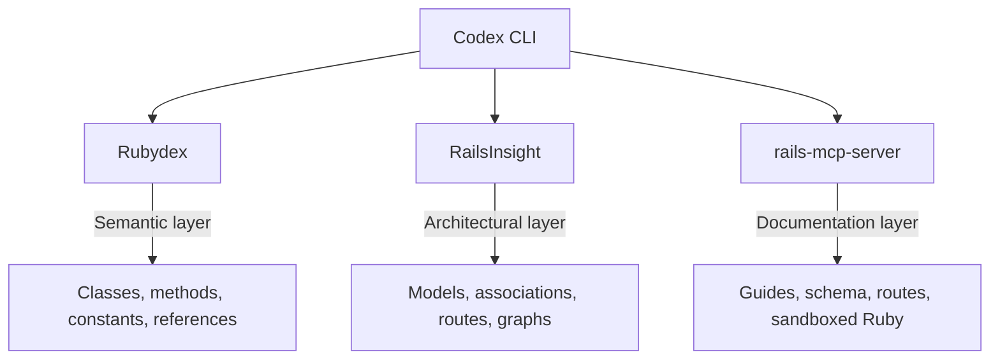

# Codex CLI for Ruby on Rails Development: Rubydex, RailsInsight, and Convention-Aware Agent Workflows


---

Rails has always bet on convention over configuration. That same philosophy — reduce decisions, increase velocity — maps remarkably well onto agentic coding, where an AI agent armed with Rails conventions can scaffold, navigate, and refactor a codebase with minimal hand-holding. This article covers the MCP servers, agent skills, and workflow patterns that make Codex CLI a first-class Rails development companion in 2026.

## The Rails MCP Landscape

Three MCP servers have emerged as the backbone of agent-assisted Rails development, each covering a distinct layer of the stack.

### Rubydex — Semantic Code Intelligence

Shopify's Rubydex is a high-performance Ruby indexer written in Rust that uses Prism-based AST parsing to build a semantic graph of your codebase — classes, modules, methods, constants, and their relationships [^1]. Rather than forcing an agent to read files sequentially, Rubydex lets it query declarations, definitions, references, ancestor chains, and descendants through a structured API.

The experimental MCP server ships with the Ruby gem and provides tools for semantic navigation. In early testing at Shopify, Rubydex delivered a **15–80% reduction in token usage** for LLM tasks that involve codebase exploration [^2].

```toml
# .codex/config.toml — Rubydex MCP server
[mcp_servers.rubydex]
command = "rubydex"
args = ["mcp", "--project", "."]
```

Rubydex also powers several downstream tools: Tapioca v0.19.0+ saw documentation fetching drop from six minutes to twenty seconds, and Packwerk gained 3× more constant references resolved with 3,000 fewer lines of code [^2].

**Limitation:** Rubydex currently lacks type inference for method receivers, so method-level reference tracking is incomplete. The MCP server must still be built from source on some platforms, though pre-compiled binaries ship for macOS, Linux, and Windows [^2].

### RailsInsight — Structural Graph Intelligence

RailsInsight takes a different approach: rather than indexing Ruby syntax, it builds a **directed weighted graph with 22 edge types** — `has_many`, `belongs_to`, `inherits`, `includes_concern`, `routes_to`, `convention_pair`, `tests`, and fifteen others — capturing the architectural relationships specific to Rails applications [^3].

The server provides **17 MCP tools**:

| Tool | Purpose |
|------|---------|
| `get_overview` | Project summary with model/controller/route counts |
| `get_model` | Model details with associations and validations |
| `get_subgraph` | Skill-scoped relationship graph (e.g. `authentication`) |
| `get_blast_radius` | Change impact analysis by risk level |
| `get_review_context` | Risk-classified summaries for code review |
| `get_coverage_gaps` | Test coverage analysis |
| `get_factory_registry` | FactoryBot factory index |
| `get_domain_clusters` | Domain boundary detection |

```toml
# .codex/config.toml — RailsInsight MCP server
[mcp_servers.railsinsight]
command = "npx"
args = ["@reinteractive/railsinsight"]
```

RailsInsight completes its full index in under two seconds, even on large production apps [^3]. Benchmarks from code-review-graph research show **6–49× token reduction** compared to file-by-file reading, and CodeCompass (arXiv, February 2026) demonstrated **99.4% architectural coverage** on hidden-dependency tasks when agents had graph access versus 76.2% without [^3].

### rails-mcp-server — Project Exploration and Documentation

The `rails-mcp-server` gem [^4] provides a complementary layer focused on project exploration and official documentation access. It exposes four registered tools — `switch_project`, `search_tools`, `execute_tool`, and `execute_ruby` — with internal analysers for routes, schema, models, and controller–view relationships accessible through the `execute_tool` interface.

```toml
# .codex/config.toml — rails-mcp-server
[mcp_servers.rails]
command = "rails-mcp-server"
args = ["serve"]
```

A key feature is built-in access to official guides for Rails, Turbo, Stimulus, and Kamal, plus the ability to import custom documentation. This prevents the agent from hallucinating API calls against outdated Rails versions — a common failure mode given that Rails 8.1.3 is current [^5] but training data may reference Rails 7 patterns.

## Composing the Three Servers

Each server addresses a different layer:



Running all three together gives the agent compiler-grade code intelligence (Rubydex), Rails-specific architectural awareness (RailsInsight), and verified documentation (rails-mcp-server). Token cost remains manageable because each server returns structured data rather than raw file content.

## Agent Skills for Rails

### rails_ai_agents

The `rails_ai_agents` project [^6] provides a comprehensive agent skill set for Rails development:

- **19 specialised agents** covering models, controllers, services, migrations, policies, jobs, mailers, views, and testing
- **18 skills** combining task workflows (code review, security audit, accessibility review) with knowledge resources (Rails architecture, Postgres patterns, caching strategies, Solid Queue setup)
- **14 context-aware rules** (11 path-scoped, 3 always-on)
- **Spec-Driven Development kit** with structured directories for specifications, plans, contracts, and validation reports

For Codex CLI, the project includes sync scripts:

```bash
# Mirror Claude skills to Codex-compatible format
scripts/sync_claude_skills_to_codex.sh
```

### AGENTS.md for Rails 8.1 Projects

A well-crafted `AGENTS.md` is essential for convention-aware agent behaviour. Here is a template for Rails 8.1 projects:

```markdown
# AGENTS.md

## Stack
- Ruby 3.4.2 / Rails 8.1.3
- PostgreSQL 17 / Solid Queue / Solid Cache / Solid Cable
- Hotwire (Turbo 8 + Stimulus 4) / Propshaft
- RSpec + FactoryBot + Shoulda Matchers

## Conventions
- Follow Rails conventions: fat models, skinny controllers
- Use concerns for shared behaviour, not inheritance
- Service objects in app/services/ for cross-cutting logic
- All new code must include RSpec tests
- Run `bundle exec rubocop -A` before considering work done
- Run `bundle exec rspec` to verify — all specs must pass

## Anti-Hallucination Rules
- Do NOT use Webpacker, Sprockets, or asset pipeline — we use Propshaft
- Do NOT use `protect_from_forgery` — Rails 8 uses origin checking by default
- Do NOT generate Minitest files — we use RSpec exclusively
- Authentication uses Rails 8 native `has_secure_password` with `generates_token_for`
- Background jobs use Solid Queue, not Sidekiq or Delayed Job
- Real-time features use Solid Cable, not Redis-backed Action Cable

## Test Commands
- `bundle exec rspec` — full suite
- `bundle exec rspec spec/models/` — model specs only
- `bundle exec rubocop -A` — lint and auto-correct
```

## Workflow Patterns

### 1. Model Generation with Convention Verification

```bash
codex "Create a Subscription model that belongs_to :user and
has_many :invoices. Include Solid Queue job for renewal processing.
Use the rails-architecture skill pattern. Verify with rspec."
```

The agent uses RailsInsight's `get_model` to understand existing associations, generates the migration and model with RSpec specs first (TDD pattern from rails_ai_agents), runs `bundle exec rspec` to verify, and checks `rubocop` compliance.

### 2. Blast Radius Analysis Before Refactoring

```bash
codex "Refactor the authentication concern into a dedicated
Authentication module. Use get_blast_radius to assess impact first."
```

RailsInsight's `get_blast_radius` returns impacted entities classified as CRITICAL, HIGH, MEDIUM, or LOW [^3]. The agent reviews the graph before touching code, ensuring that refactoring an `Authenticatable` concern does not silently break controllers, policies, or integration tests that depend on it.

### 3. Batch Feature Generation with codex exec

```bash
# Generate CRUD for multiple resources in a monorepo
for resource in products orders customers; do
  codex exec "Generate full CRUD for ${resource}: model, controller,
  views (Turbo Frames), RSpec request specs, and FactoryBot factories.
  Follow Rails 8.1 conventions per AGENTS.md." \
  --approval-mode full-auto
done
```

### 4. Dependency Audit with Documentation Verification

```bash
codex "Audit Gemfile for outdated or deprecated gems.
Cross-reference each gem's current version against its
documentation via rails-mcp-server. Flag any gems that
conflict with Rails 8.1 or Ruby 3.4."
```

The agent uses `execute_ruby` from rails-mcp-server to run `Bundler::Audit` and cross-references findings against imported documentation.

## Model Selection

For Rails development tasks in May 2026:

| Task | Recommended Model | Rationale |
|------|-------------------|-----------|
| Complex refactoring, architecture changes | `gpt-5.5` | Strongest reasoning for multi-file changes [^7] |
| Feature scaffolding, CRUD generation | `o4-mini` | Fast, cost-effective for convention-heavy work |
| Batch operations via `codex exec` | `o4-mini` | Lower cost at scale |
| Security audits, performance reviews | `gpt-5.5` | Requires deep contextual analysis |

## Sandbox Considerations

Rails development presents specific sandbox challenges:

- **Database access**: Most Rails workflows require a running PostgreSQL instance. Use `network: true` in config.toml or ensure the database is accessible within the sandbox
- **Bundle install**: Gem installation requires network access for initial setup; subsequent runs use the cached `vendor/bundle`
- **Asset compilation**: Propshaft compilation and Tailwind CSS builds need Node.js available in the sandbox environment
- **Spring preloader**: Disable Spring (`DISABLE_SPRING=1`) in agent sessions to avoid stale process issues
- **Solid Queue**: If testing background jobs, ensure Solid Queue's SQLite-backed adapter is configured for the test environment

```toml
# .codex/config.toml — sandbox settings for Rails
[sandbox]
network = true  # Required for bundle install, database connections

[env]
DISABLE_SPRING = "1"
RAILS_ENV = "test"
```

## Convention Over Configuration as an Agent Advantage

Rails' opinionated structure is arguably its greatest asset for agentic development. When an agent knows that:

- Models live in `app/models/`
- Controllers follow RESTful naming in `app/controllers/`
- Views map to `app/views/<controller>/<action>.html.erb`
- Routes follow resource conventions
- Database columns map to model attributes automatically

...it can operate with far fewer tokens than in a framework where every project invents its own structure. RailsInsight's graph formalises these conventions into queryable relationships, and Rubydex provides the semantic layer to navigate the Ruby code itself. Together, they make Rails one of the most agent-friendly frameworks available.

## Limitations

- **Training data lag**: GPT-5.5's training data may not fully cover Rails 8.1.3 features (released March 2026 [^5]). The rails-mcp-server's documentation access mitigates this but does not eliminate it
- **Rubydex MCP maturity**: The MCP server is experimental and may require building from source [^2]. Distribution via the Ruby gem is planned but not yet stable
- **RailsInsight scope**: The graph covers Rails conventions but may miss unconventional patterns (e.g. hand-rolled routing, non-ActiveRecord ORMs) [^3]
- **Hotwire complexity**: Turbo Frame and Turbo Stream interactions are difficult to verify without a running browser; agents may generate correct markup that fails at runtime
- **Spring interference**: Spring's preloading can serve stale code to the agent's test runs if not disabled
- **Ruby version requirements**: Rubydex requires Ruby 3.2+ and ships native extensions; JRuby and TruffleRuby are not supported ⚠️

## Citations

[^1]: [Shopify/rubydex — GitHub](https://github.com/Shopify/rubydex)
[^2]: [One engine, many tools — Introducing Rubydex — Rails at Scale (May 2026)](https://railsatscale.com/2026-05-12-one-engine-many-tools/)
[^3]: [How RailsInsight Gives AI Agents Structural Understanding of Ruby on Rails — Reinteractive](https://reinteractive.com/articles/railsinsight-ai-agents-structural-understanding-ruby-on-rails)
[^4]: [maquina-app/rails-mcp-server — GitHub](https://github.com/maquina-app/rails-mcp-server)
[^5]: [Ruby on Rails release history — RubyGems.org](https://rubygems.org/gems/rails/versions)
[^6]: [ThibautBaissac/rails_ai_agents — GitHub](https://github.com/ThibautBaissac/rails_ai_agents)
[^7]: [OpenAI Codex CLI Changelog — May 2026](https://developers.openai.com/codex/changelog)
