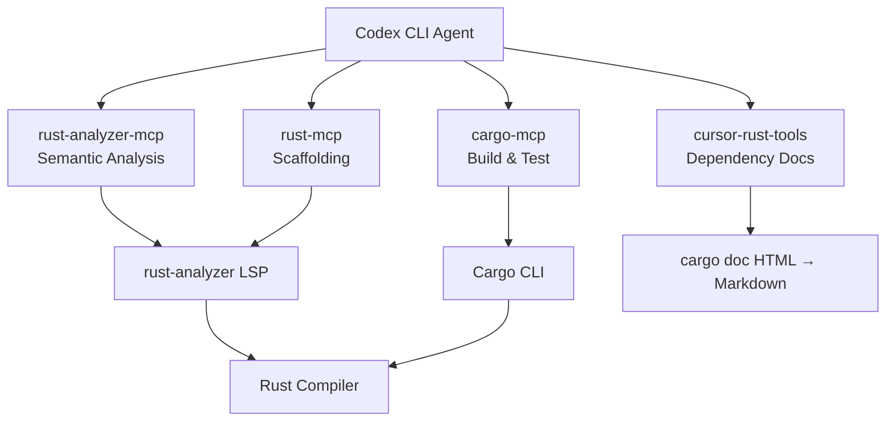
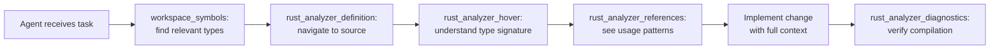

# Codex CLI for Rust Development: rust-analyzer MCP, Cargo MCP, and Systems Programming Agent Patterns


---

An [earlier article in this knowledge base](/2026/03/31/codex-cli-rust-teams/) covered AGENTS.md templates and Cargo workspace patterns for Rust teams. This article goes deeper into the MCP server ecosystem that has matured around Rust development since early 2026. Four MCP servers now give Codex CLI compiler-grade intelligence about Rust codebases — semantic analysis, documentation lookup, and direct Cargo command execution — without relying on training data that may lag behind Rust 1.95 and Edition 2024[^1][^2].

---

## The Problem: Training Data Lag in a Fast-Moving Language

Rust ships a new stable release every six weeks[^1]. By May 2026, Rust 1.95.0 is the current stable, Edition 2024 has been the default since Rust 1.85[^2], and features such as async closures, `use<..>` precise capturing, and `IntoIterator` for `Box<[T]>` are settled API. An LLM trained on 2024–early 2025 data will hallucinate old patterns: suggesting `impl Future` workarounds where `async ||` now works, or missing the Edition 2024 lifetime capture rules that changed RPIT semantics[^2].

MCP servers solve this by giving the agent live access to the compiler's own understanding of your code and to the documentation generated from your actual dependency tree.

---

## Four MCP Servers for Rust Development

### 1. rust-analyzer-mcp (zeenix)

A native Rust binary that wraps rust-analyzer's LSP protocol into MCP's STDIO transport[^3]. It exposes 10 tools:

| Tool | Purpose |
|------|---------|
| `rust_analyzer_symbols` | List all symbols (functions, structs, enums) in a file |
| `rust_analyzer_definition` | Jump to a symbol's definition |
| `rust_analyzer_references` | Find all references to a symbol across the workspace |
| `rust_analyzer_hover` | Type information and documentation at a position |
| `rust_analyzer_completion` | Code completion suggestions |
| `rust_analyzer_format` | Format a file via rustfmt |
| `rust_analyzer_code_actions` | Quick fixes and refactoring suggestions |
| `rust_analyzer_diagnostics` | Errors, warnings, and hints for a single file |
| `rust_analyzer_workspace_diagnostics` | Aggregate diagnostics across the workspace |
| `rust_analyzer_set_workspace` | Switch workspace root directory |

Install via `cargo install rust-analyzer-mcp`[^3]. Requires rust-analyzer in `PATH` and a valid `Cargo.toml`.

### 2. rust-mcp (dexwritescode)

A more opinionated server with 19 tools spanning code analysis, generation, refactoring, and project management[^4]:

- **Analysis:** `find_definition`, `find_references`, `get_diagnostics`, `workspace_symbols`
- **Generation:** `generate_struct`, `generate_enum`, `generate_trait_impl`, `generate_tests`
- **Refactoring:** `rename_symbol`, `extract_function`, `inline_function`, `organize_imports`, `format_code`
- **Quality:** `apply_clippy_suggestions`, `validate_lifetimes`
- **Project:** `analyze_manifest`, `run_cargo_check`, `get_type_hierarchy`, `suggest_dependencies`

The generation tools are particularly useful for scaffolding — the agent can ask `generate_trait_impl` for a trait it has just discovered via `find_definition`, producing a stub implementation that compiles immediately[^4].

### 3. cursor-rust-tools (terhechte)

Originally built for Cursor, this server works with any MCP client including Codex CLI[^5]. Its distinguishing feature is **local documentation indexing**: it runs `cargo doc` on your project, parses the generated HTML into Markdown, and caches it in `.docs-cache/`. This means the agent can look up your dependency documentation at the exact version pinned in `Cargo.lock` — not whatever version the LLM was trained on.

Seven tools: crate documentation lookup, hover information, symbol references, implementation lookup, type finder, `cargo test`, and `cargo check`[^5].

### 4. cargo-mcp (seemethere)

A lightweight server focused purely on Cargo commands: `cargo_build`, `cargo_test`, `cargo_run`, `cargo_check`, `cargo_clippy`, `cargo_fmt`, `cargo_doc`, `cargo_clean`, `cargo_tree`, `cargo_update`, and `cargo_bench`[^6]. Each tool accepts an optional `cargo_env` parameter for environment variables and a `toolchain` parameter for cross-toolchain testing (`+nightly`, `+1.85.0`)[^6].

---

## Codex CLI Configuration

Configure all four servers in `~/.codex/config.toml` or `.codex/config.toml` at the project root:

```toml
[mcp_servers.rust-analyzer]
command = "rust-analyzer-mcp"
args = []

[mcp_servers.rust-mcp]
command = "rustmcp"
args = []
env = { RUST_ANALYZER_PATH = "/usr/local/bin/rust-analyzer" }

[mcp_servers.cursor-rust-tools]
command = "cursor-rust-tools"
args = ["--no-ui"]

[mcp_servers.cargo]
command = "cargo-mcp"
args = []
```

> **Pragmatic note:** You rarely need all four simultaneously. The recommended composition for most projects is **rust-analyzer-mcp** (semantic analysis) + **cargo-mcp** (build commands) + **cursor-rust-tools** (dependency docs). Add rust-mcp only if you need the scaffolding tools.

---

## Composing MCP Servers Across Layers



Each server occupies a distinct layer:

- **Semantic layer** (rust-analyzer-mcp): type information, navigation, diagnostics
- **Build layer** (cargo-mcp): compilation, testing, linting, benchmarking
- **Documentation layer** (cursor-rust-tools): version-accurate crate docs
- **Scaffolding layer** (rust-mcp): code generation, refactoring, manifest analysis

---

## AGENTS.md Addendum for MCP-Equipped Projects

The [Rust teams article](/2026/03/31/codex-cli-rust-teams/) provides a full AGENTS.md template. When MCP servers are available, add these rules:

```markdown
## MCP Server Usage

- ALWAYS use `rust_analyzer_hover` before generating code that uses an unfamiliar type.
  Do not guess trait bounds — look them up.
- Use `get_diagnostics` or `rust_analyzer_diagnostics` after every code change.
  Fix all errors before proceeding.
- When adding a dependency, use `suggest_dependencies` (rust-mcp) to check if
  the crate exists, then verify with cursor-rust-tools documentation lookup.
- NEVER run `cargo build` with `--all-features` unless explicitly asked.
  Use `cargo_check` for fast iteration.
- Use `cargo_clippy` before committing. Address all warnings.
- For Edition 2024 code: async closures (`async || {}`) are stable.
  Do not use `|| async {}` workarounds.
- Rust 1.95 is current stable. Do not use nightly-only features
  unless the project's rust-toolchain.toml specifies nightly.
```

---

## Workflow Patterns

### Pattern 1: Codebase Exploration with Semantic Navigation

When the agent encounters an unfamiliar Rust codebase, MCP tools replace guessing with compiler-verified navigation:



This pattern eliminates the most common failure mode in agent-assisted Rust development: the agent guessing at trait bounds or lifetime constraints that the compiler would immediately reject.

### Pattern 2: Dependency-Aware Feature Development

When adding a feature that requires new crate dependencies:

1. Agent uses `suggest_dependencies` to find candidate crates
2. Agent uses cursor-rust-tools documentation to read the crate's API at the exact version available
3. Agent writes the implementation using verified type signatures
4. Agent runs `cargo_check` to confirm compilation
5. Agent runs `cargo_clippy` for idiomatic lint compliance
6. Agent runs `cargo_test` to validate behaviour

This avoids the common pattern where an LLM generates plausible-looking code against an API that changed two versions ago.

### Pattern 3: Batch Refactoring with `codex exec`

For workspace-wide refactoring across multiple crates:

```bash
codex exec "In every crate, replace all uses of the deprecated \
  std::sync::Once::call_once pattern with LazyLock where applicable. \
  Use rust_analyzer_references to find all call sites, then \
  rust_analyzer_code_actions for automated refactoring suggestions. \
  Run cargo_check after each crate modification."
```

The agent can process each crate independently, using MCP tools to verify that changes compile before moving to the next[^7].

### Pattern 4: Test Generation from Type Signatures

```bash
codex "Generate property-based tests for all public functions in src/parser.rs. \
  Use rust_analyzer_symbols to enumerate functions, rust_analyzer_hover to \
  read their signatures, then generate_tests to scaffold test modules. \
  Use cargo_test to verify they compile and pass."
```

The combination of `rust_analyzer_hover` (to understand exact parameter types and return types) with `generate_tests` (to scaffold compilable test code) produces tests that are structurally correct from the first attempt[^4].

---

## Model Selection for Rust Tasks

| Task | Recommended Model | Rationale |
|------|-------------------|-----------|
| Architecture design, unsafe code review, lifetime analysis | `gpt-5.5` | Complex reasoning about ownership and borrowing[^8] |
| Feature implementation, refactoring | `gpt-5.4` | Strong coding with lower cost[^9] |
| Test generation, documentation, routine CRUD | `gpt-5.4-mini` | Fast iteration on well-constrained tasks[^9] |
| Batch operations via `codex exec` | `gpt-5.4-mini` | Cost-effective for high-volume parallel work[^9] |

Switch models within a session using `/model gpt-5.5` when moving from routine implementation to ownership analysis[^9].

---

## Sandbox Considerations

Rust development under Codex CLI's sandbox requires careful configuration:

- **Network access for `cargo` fetches:** The default sandbox blocks outbound network. If your project needs to fetch crates, either pre-populate `~/.cargo/registry` or use `--full-auto` mode with network access enabled. Alternatively, vendor dependencies with `cargo vendor` before starting the session[^7].
- **`target/` directory size:** Rust compilation artefacts are large. Ensure the sandbox has adequate disk space — a moderate workspace can easily consume 5–10 GB in `target/`[^7].
- **rust-analyzer memory:** rust-analyzer indexes the full workspace on startup. For large workspaces (50+ crates), expect 2–4 GB of additional memory usage from the MCP server process.
- **Concurrent LSP instances:** Both rust-analyzer-mcp and cursor-rust-tools spin up their own rust-analyzer instances. Running both simultaneously doubles memory and indexing time. Choose one for semantic analysis per session.

---

## Limitations and Caveats

- **Training data lag:** Even with MCP servers providing live type information, the model's understanding of Rust idioms is bounded by its training data. Edition 2024 patterns (precise capturing, `unsafe_op_in_unsafe_fn` lint) may not be the agent's default style without explicit AGENTS.md guidance[^2].
- **Macro expansion opacity:** rust-analyzer's macro expansion is incomplete for complex procedural macros. MCP tools may return partial or incorrect information for heavily macro-generated code (e.g., complex derive macros, `sqlx::query!`, `tokio::select!`)[^3].
- **No debugger integration:** None of the current MCP servers provide LLDB or GDB integration. The agent cannot set breakpoints or inspect runtime state — it is limited to static analysis and compilation feedback.
- **rust-mcp scaffolding quality:** The `generate_*` tools produce syntactically correct but sometimes overly generic code. Treat their output as a starting point, not a final implementation[^4].
- **Single-workspace limitation:** rust-analyzer-mcp operates on one workspace at a time. For multi-workspace repositories, use `rust_analyzer_set_workspace` to switch between them, but the agent loses context from the previous workspace[^3].

---

## The Dogfooding Angle

OpenAI's own Codex CLI is a ~70-crate Cargo workspace[^10]. Their public `AGENTS.md` encodes hard-won patterns: `just fmt` instead of `cargo fmt`, `just test` instead of `cargo test`, module size limits of 500 LoC, and mandatory `bazel-lock-update` after dependency changes[^10]. These patterns emerged from using Codex to develop Codex — the most direct possible feedback loop between an AI coding agent and the Rust toolchain.

When you configure MCP servers for your own Rust project, you are extending this same feedback loop. The compiler is no longer a black box that the agent interacts with through trial and error — it becomes a queryable oracle that the agent can consult before, during, and after every change.

---

## Citations

[^1]: [Rust Release Announcements — Rust 1.95.0](https://blog.rust-lang.org/releases/latest/)
[^2]: [Announcing Rust 1.85.0 and Rust 2024 — Rust Blog](https://blog.rust-lang.org/2025/02/20/Rust-1.85.0/)
[^3]: [zeenix/rust-analyzer-mcp — GitHub](https://github.com/zeenix/rust-analyzer-mcp)
[^4]: [dexwritescode/rust-mcp — GitHub](https://github.com/dexwritescode/rust-mcp)
[^5]: [terhechte/cursor-rust-tools — GitHub](https://github.com/terhechte/cursor-rust-tools)
[^6]: [seemethere/cargo-mcp — GitHub](https://github.com/seemethere/cargo-mcp)
[^7]: [Codex CLI Documentation — OpenAI Developers](https://developers.openai.com/codex/cli)
[^8]: [Introducing GPT-5.5 — OpenAI](https://openai.com/index/introducing-gpt-5-5/)
[^9]: [Models — Codex — OpenAI Developers](https://developers.openai.com/codex/models)
[^10]: [codex/AGENTS.md at main — openai/codex — GitHub](https://github.com/openai/codex/blob/main/AGENTS.md)
