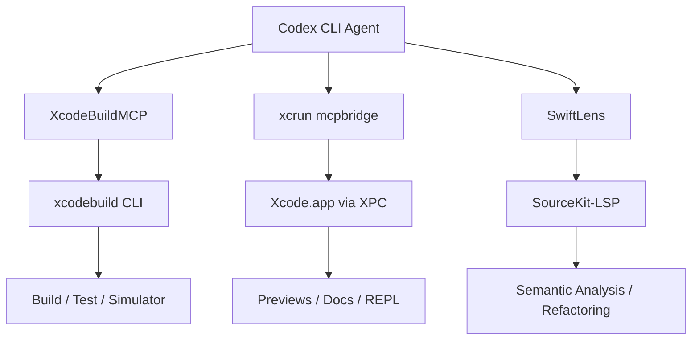

# Codex CLI for Swift and SwiftUI Development: Xcode MCP Servers, Agent Skills, and Build-Test-Debug Workflows


---

Swift and SwiftUI development sits at an intersection that makes agentic coding both powerful and tricky. The toolchain is GUI-heavy, simulators consume resources, and the compiler's type system catches errors that text-based AI tools miss entirely. Three MCP servers — XcodeBuildMCP, Apple's `xcrun mcpbridge`, and SwiftLens — now give Codex CLI structured access to the full build-test-debug cycle, SwiftUI preview rendering, and compiler-grade semantic analysis. Combined with community agent skills and a well-crafted `AGENTS.md`, this turns Codex CLI into a serious iOS and macOS development companion.

## The MCP Server Landscape for Swift

### XcodeBuildMCP (Sentry)

XcodeBuildMCP, acquired by Sentry in early 2026 [^1], ships as a standalone binary with 82 tools spanning builds, tests, simulator control, LLDB debugging, and UI automation [^2]. It operates via the `xcodebuild` CLI — no running Xcode instance required — making it ideal for headless agentic workflows.

Key tool categories:

- **Build and test**: `build_sim`, `test_sim`, `build_device` — structured error and warning output
- **Simulator lifecycle**: `list_sims`, `boot_sim`, `install_app`, `launch_app`
- **LLDB debugging**: `debug_attach_sim`, `set_breakpoint`, `inspect_variable`, `execute_lldb_command`
- **UI automation**: `snapshot_ui`, `tap_element`, `swipe`, `type_text` — gesture simulation on running simulators
- **Dynamic tool loading**: tools register on demand to minimise context window consumption [^2]

```toml
# ~/.codex/config.toml
[mcp.xcodebuild]
command = "npx"
args = ["-y", "xcodebuildmcp@latest", "mcp"]

[mcp.xcodebuild.env]
XCODEBUILDMCP_SENTRY_DISABLED = "true"
```

### Apple Xcode MCP (`xcrun mcpbridge`)

Xcode 26.3 shipped a built-in MCP server accessible via `xcrun mcpbridge` [^3]. It exposes 20 tools that communicate with Xcode's process through XPC, providing access to internal state unavailable through command-line tools:

- **File operations**: `XcodeRead`, `XcodeWrite`, `XcodeGrep` — direct project file manipulation
- **Build and diagnostics**: trigger builds, retrieve structured compiler diagnostics with fix-it suggestions
- **SwiftUI previews**: render preview screenshots without manually navigating the canvas [^4]
- **Swift REPL**: `ExecuteSnippet` runs Swift code in a live REPL session
- **Documentation search**: query Apple's entire documentation corpus from the agent context

```toml
[mcp.xcode]
command = "xcrun"
args = ["mcpbridge"]
```

**Critical requirement**: Xcode must be running with a project open. The bridge auto-detects the Xcode PID and connects via XPC [^4]. This makes it complementary to XcodeBuildMCP rather than a replacement — use XcodeBuildMCP for the headless build loop, Apple's MCP for preview rendering and documentation lookups.

### SwiftLens

SwiftLens integrates directly with Apple's SourceKit-LSP to provide 15 semantic analysis tools with compiler-grade accuracy [^5]. Unlike text-based search, SwiftLens sees code exactly as the Swift compiler does:

- **Single-file analysis** (no index required): `swift_analyze_file`, `swift_summarize_file`, `swift_get_symbols_overview`, `swift_validate_file`, `swift_get_file_imports`
- **Cross-file analysis** (requires index): `swift_find_symbol_references`, `swift_get_symbol_definition`, `swift_get_hover_info`
- **Code modification**: `swift_replace_symbol_body` for AI-driven refactoring
- **Index management**: `swift_build_index` builds the SourceKit-LSP index store for the project

SwiftLens reports 60–90% reduction in context size compared to sending raw file contents, because it extracts only the relevant symbols [^5].

```toml
[mcp.swiftlens]
command = "swiftlens"
args = ["--project-root", "."]
```

## Composing the Three Servers

Each server occupies a distinct layer. Running all three gives the agent a complete toolchain:



| Layer | Server | Requires Xcode Running | Tools |
|-------|--------|----------------------|-------|
| Build automation | XcodeBuildMCP | No | 82 |
| IDE integration | xcrun mcpbridge | Yes | 20 |
| Semantic analysis | SwiftLens | No | 15 |

## Agent Skills for Swift and SwiftUI

The agent skills ecosystem for Swift has matured rapidly. Paul Hudson's open-source SwiftUI agent skill [^6] addresses the most common mistakes AI tools make when generating SwiftUI code:

- **Deprecated API avoidance**: steers agents away from `foregroundColor()` in favour of `foregroundStyle()`, prevents `ObservableObject` when `@Observable` suffices
- **Performance rules**: no work in View initialisers or `body` properties; break up large views
- **Accessibility**: labelled controls, adequate touch targets, scalable fonts
- **Swift idioms**: `localizedStandardContains()` over manual string comparison, `count(where:)` over `filter().count`

Hudson expanded this into a broader **Swift Agent Skills** collection covering SwiftUI, SwiftData, Swift Concurrency, and Swift Testing [^6]. Install via:

```bash
npx skills add https://github.com/twostraws/swiftui-agent-skill --skill swiftui-pro
```

Additionally, community skills exist for Liquid Glass adoption (iOS 26 design language), SwiftUI performance auditing, and Swift concurrency diagnostics [^7].

## AGENTS.md Template for Swift Projects

A well-structured `AGENTS.md` eliminates the most common hallucination patterns. Here is a template targeting Swift 6.2 and iOS 18/macOS 15:

```markdown
# AGENTS.md — Swift/SwiftUI Project

## Language & Toolchain
- Swift 6.2 (current stable, released March 2026)
- Xcode 26.3+ required
- Minimum deployment: iOS 18.0 / macOS 15.0
- Swift Package Manager for dependency management

## Architecture Rules
- SwiftUI-first; AppKit/UIKit only via Representable wrappers
- Use @Observable macro, NOT ObservableObject/StateObject
- Use NavigationStack (iOS) or NavigationSplitView (macOS)
- Structured Concurrency: prefer async/await over Combine
- Use Swift 6.2 InlineArray where fixed-size buffers are needed
- Use Span for safe buffer access instead of UnsafeBufferPointer

## Build Commands
- Build: `xcodebuild -scheme MyApp -destination 'platform=iOS Simulator,name=iPhone 16'`
- Test: `xcodebuild test -scheme MyApp -destination 'platform=iOS Simulator,name=iPhone 16'`
- SwiftPM: `swift build` / `swift test`

## Anti-Hallucination Rules
- Do NOT use APIs deprecated before iOS 18 (List { ForEach } not List(items))
- Do NOT use foregroundColor() — use foregroundStyle()
- Do NOT generate UIKit storyboard code
- Do NOT assume Combine is required for reactive patterns
- Do NOT use AnyView — prefer concrete View types or @ViewBuilder
- Swift 6.2's approachable concurrency: MainActor is default, do NOT add redundant @MainActor annotations

## Testing
- Use Swift Testing framework (#expect, @Test) not XCTest assertions
- ViewInspector for SwiftUI unit tests
- XcodeBuildMCP screenshot tool for visual verification
```

## Workflow Patterns

### Pattern 1: SwiftUI Screen Generation with Preview Verification

This workflow uses XcodeBuildMCP for the build loop and Apple's MCP for preview screenshots:

```bash
codex --model o3 \
  "Create a settings screen with NavigationStack,
   grouped List sections for Account, Notifications, and Privacy.
   Build for iOS Simulator, capture a preview screenshot,
   verify layout matches the specification."
```

The agent writes the SwiftUI view, triggers `build_sim` via XcodeBuildMCP, then uses `xcrun mcpbridge` to render a preview screenshot — all without leaving the agentic loop [^4].

### Pattern 2: Codebase-Wide Refactoring with SwiftLens

SwiftLens excels at large-scale refactoring where text-based find-and-replace breaks:

```bash
codex --model o3 \
  "Find all types conforming to ObservableObject using SwiftLens.
   Migrate each to @Observable macro.
   Update all call sites that use @StateObject to @State.
   Validate with swift_validate_file after each change."
```

SwiftLens's `swift_find_symbol_references` traces every usage with compiler accuracy, and `swift_replace_symbol_body` performs surgical edits [^5].

### Pattern 3: Batch Test Generation

```bash
codex exec --model o4-mini \
  --input-file views.txt \
  "For the SwiftUI view at {line}, generate a Swift Testing
   @Test function covering the primary user interaction.
   Use ViewInspector for view hierarchy assertions."
```

### Pattern 4: Dependency Audit with Swift Package Manager

```bash
codex --model o4-mini \
  "Run 'swift package show-dependencies --format json'.
   For each dependency, check the latest version on Swift Package Index.
   Flag any dependency more than one major version behind.
   Output a markdown report."
```

## Model Selection for Swift Tasks

| Task | Recommended Model | Rationale |
|------|------------------|-----------|
| Architecture design, complex concurrency | o3 | Reasoning through actor isolation, Sendable conformance |
| SwiftUI view generation | o4-mini or GPT-5.5 | Sufficient for template-driven UI code [^8] |
| Test generation, boilerplate | o4-mini | Cost-effective for repetitive patterns |
| Performance auditing | o3 | Requires understanding of SwiftUI rendering pipeline |
| Xcode project configuration | o4-mini | Scheme and target manipulation is formulaic |

GPT-5.5 is now available in Codex and handles most SwiftUI work well, with improved diagnostics interpretation reducing the need for specialised concurrency skills [^8].

## Sandbox Considerations

Codex CLI's sandbox creates specific challenges for Apple platform development:

- **Simulator access**: XcodeBuildMCP launches simulators via `xcodebuild`, which requires the full Xcode installation in the sandbox environment. The `simctl` commands work headlessly but UI automation requires a display server [^2]
- **Derived Data**: warm the DerivedData cache before starting agentic sessions. Cold builds for non-trivial iOS projects can exceed Codex CLI's default timeout
- **Code signing**: disable signing for simulator-only development (`CODE_SIGN_IDENTITY="" CODE_SIGNING_REQUIRED=NO`) to avoid keychain access issues in sandboxed environments
- **SwiftPM cache**: pre-resolve dependencies with `swift package resolve` to avoid network fetches during sandboxed execution
- **Preview rendering**: `xcrun mcpbridge` requires a running Xcode instance, which means preview-based verification workflows need a graphical environment — not available in pure headless sandboxes

## Limitations

- **Training data lag**: Swift 6.2 shipped in March 2026 [^9]. Models may not fully understand `InlineArray`, `Span`, or the approachable concurrency defaults. The `AGENTS.md` anti-hallucination rules mitigate this
- **Compose preview requires Xcode**: unlike Android's CLI-only preview rendering, SwiftUI previews require a running Xcode instance via `xcrun mcpbridge`. XcodeBuildMCP's `snapshot_ui` captures running simulator screenshots as an alternative [^2]
- **SwiftLens requires macOS**: SourceKit-LSP integration means SwiftLens cannot run on Linux CI agents [^5]
- **XcodeBuildMCP tool count**: 82 tools can consume significant context. Use dynamic tool loading to register only the tools needed for the current task [^2]
- **Agent skill conflicts**: multiple skills advising on the same API (e.g., competing SwiftUI patterns) can produce contradictory guidance. Pin a single authoritative skill per domain
- **Xcode single-instance**: `xcrun mcpbridge` connects to one Xcode instance. Multi-project workflows need scheme switching, not multiple Xcode windows

## Citations

[^1]: Sentry Blog, "Sentry acquires XcodeBuildMCP", 2026. [https://blog.sentry.io/sentry-acquires-xcodebuildmcp/](https://blog.sentry.io/sentry-acquires-xcodebuildmcp/)

[^2]: XcodeBuildMCP GitHub (getsentry), v2.3.2 documentation. [https://github.com/getsentry/XcodeBuildMCP](https://github.com/getsentry/XcodeBuildMCP)

[^3]: Jason Moon, "Xcode 26.3 Makes Your IDE an MCP Server — Any AI Agent Can Now Build iOS Apps", March 2026. [https://jasonmoon.dev/blog/2026-03-05-xcode-26-mcp-agentic-coding](https://jasonmoon.dev/blog/2026-03-05-xcode-26-mcp-agentic-coding)

[^4]: Blake Crosley, "Two MCP Servers Made Claude Code an iOS Build System", 2026. [https://blakecrosley.com/blog/xcode-mcp-claude-code](https://blakecrosley.com/blog/xcode-mcp-claude-code)

[^5]: SwiftLens GitHub, "Deep Semantic Swift Code Analysis for AI Models". [https://github.com/swiftlens/swiftlens](https://github.com/swiftlens/swiftlens)

[^6]: Paul Hudson, "SwiftUI Agent Skill — Write better code with Claude, Codex, and other AI tools", Hacking with Swift. [https://www.hackingwithswift.com/articles/282/swiftui-agent-skill-claude-codex-ai](https://www.hackingwithswift.com/articles/282/swiftui-agent-skill-claude-codex-ai)

[^7]: OpenAI Developers, "Build for iOS — Codex use cases". [https://developers.openai.com/codex/use-cases/native-ios-apps](https://developers.openai.com/codex/use-cases/native-ios-apps)

[^8]: OpenAI Developers, "Codex Changelog — May 2026". [https://developers.openai.com/codex/changelog](https://developers.openai.com/codex/changelog)

[^9]: Swift.org, "Swift 6.2 Released", March 2026. [https://www.swift.org/blog/swift-6.2-released/](https://www.swift.org/blog/swift-6.2-released/)
