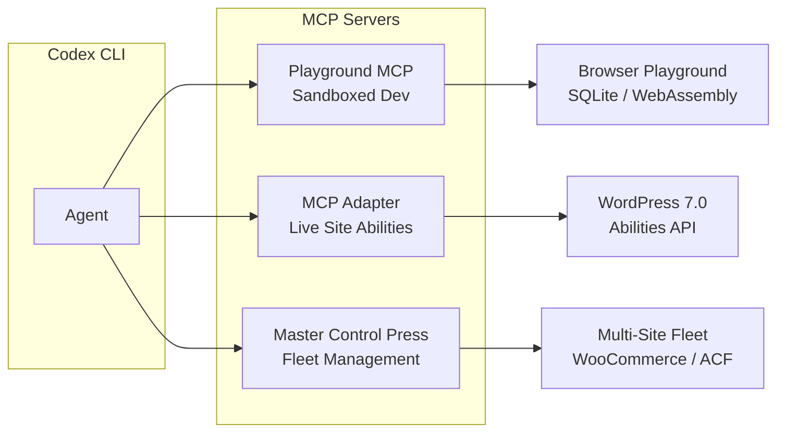
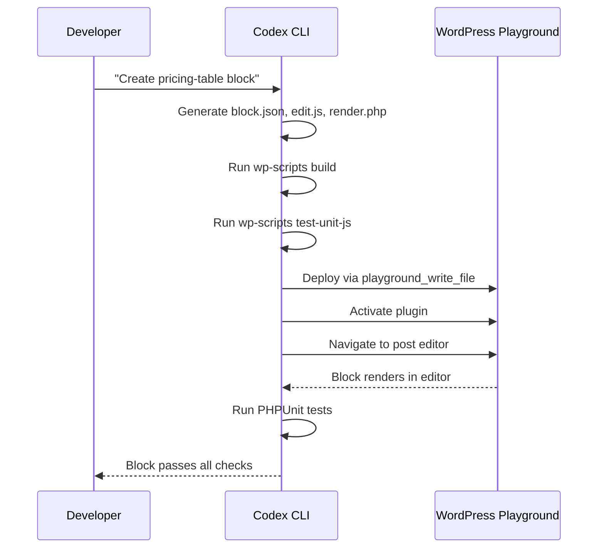
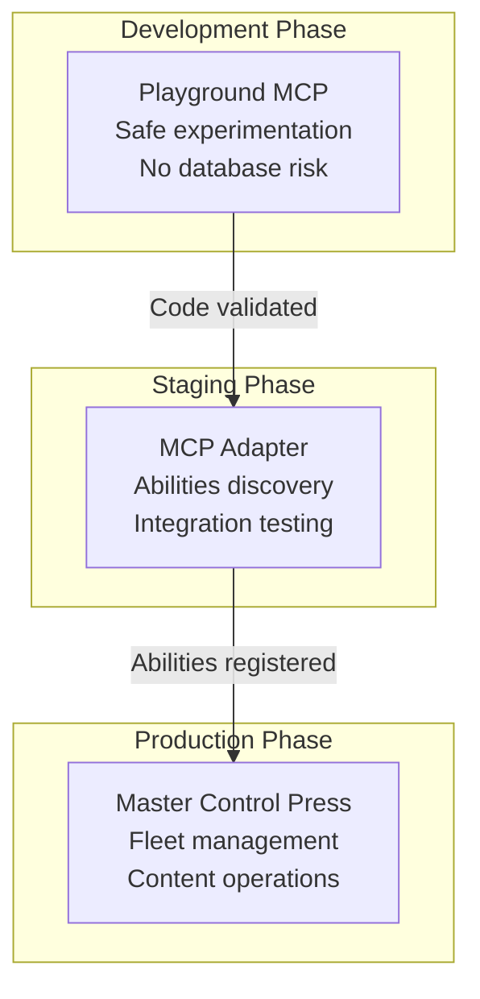

# Codex CLI for WordPress Development: MCP Adapter, Playground, and Agent-Driven Plugin Workflows on WordPress 7.0


---

WordPress powers over 43% of all websites[^1], yet the existing Codex CLI article library covers Laravel, Django, Rails, and a dozen other frameworks without addressing the platform that underpins nearly half the web. That gap closes today. WordPress 7.0 "Armstrong" shipped on 20 May 2026 with a built-in AI Client, the Abilities API merged into core, and PHP-only block registration[^2]. Simultaneously, three mature MCP servers — the official WordPress MCP Adapter, WordPress Playground MCP, and Master Control Press — give Codex CLI unprecedented access to WordPress internals. This article maps the full stack: MCP server configuration, AGENTS.md templates, sandbox considerations, and four workflow patterns for senior WordPress developers.

## The WordPress MCP Landscape

Three MCP servers serve distinct roles. Composing them gives Codex CLI layered access across development, staging, and live environments.



### WordPress Playground MCP

The `@wp-playground/mcp` package bridges Codex CLI to a browser-based Playground instance via WebSocket[^3]. The server runs as a local Node.js process using stdio transport, forwarding commands to a Playground tab. It exposes 16+ tools across five categories: site management, code execution, navigation, filesystem operations, and HTTP requests[^3].

This is the safest entry point for agent-driven development. Playground runs WordPress on SQLite in WebAssembly — no MySQL, no Apache, no risk to production data. Codex CLI can install plugins, scaffold themes, execute arbitrary PHP, and inspect site state without touching a real server.

### WordPress MCP Adapter (Official)

The MCP Adapter, maintained under the `WordPress/mcp-adapter` repository, implements MCP on top of the Abilities API introduced in WordPress 6.9 and merged into 7.0 core[^4]. Rather than exposing individual REST endpoints, it provides three meta-tools:

- `mcp-adapter-discover-abilities` — lists all registered abilities
- `mcp-adapter-get-ability-info` — returns schema and permission details
- `mcp-adapter-execute-ability` — invokes a specific ability[^4]

This layered discovery pattern means Codex CLI does not need to know WordPress's internal API surface in advance. The agent discovers what the site can do at runtime, then acts accordingly. Each ability carries a `permission_callback`, so the adapter respects WordPress's capability system — an agent authenticated as an Editor cannot perform Administrator-only actions[^4].

Transport support includes STDIO via WP-CLI for local development and HTTP via `@automattic/mcp-wordpress-remote` for remote sites[^4].

### Master Control Press

Master Control Press exposes 217+ abilities across WordPress Core, Advanced Custom Fields, WooCommerce, and theme management[^5]. For agencies managing client fleets, each site gets its own MCP server with scoped tokens, and an AI orchestration layer connects to all of them[^5]. This is the choice for multi-site operations where Codex CLI needs to audit, update, or manage content across dozens of installations.

## Codex CLI Configuration

Configure all three servers in `config.toml`. Scope project-level overrides in `.codex/config.toml` within your WordPress project root.

```toml
# ~/.codex/config.toml — Global WordPress MCP servers

[mcp_servers.wordpress-playground]
command = "npx"
args = ["-y", "@wp-playground/mcp"]

[mcp_servers.wordpress-adapter]
command = "wp"
args = [
  "--path=/var/www/wordpress",
  "mcp-adapter",
  "serve",
  "--server=mcp-adapter-default-server",
  "--user=admin"
]

[mcp_servers.master-control-press]
# Remote HTTP transport via proxy
command = "npx"
args = ["-y", "@automattic/mcp-wordpress-remote@latest"]
env = { WP_API_URL = "https://client-site.example/wp-json/mcp/mcp-adapter-default-server", WP_API_USERNAME = "codex-agent", WP_API_APP_PASS = "<your-application-password>" }
```

⚠️ The `WP_API_APP_PASS` above is a WordPress Application Password, not the user's login password. Generate one from **Users → Application Passwords** in wp-admin[^4]. Store it in your OS keyring or a secrets manager rather than in plain-text config files.

## AGENTS.md Template for WordPress 7.0

Drop this at the root of any WordPress plugin or theme repository:

```markdown
# AGENTS.md — WordPress 7.0 Plugin Development

## Stack
- WordPress 7.0 (Armstrong) with Abilities API in core
- PHP 8.3+ (minimum 7.4, recommend 8.3)
- Node.js 20+ for block development toolchain
- WP-CLI 2.12.0 for command-line management
- Gutenberg plugin (latest) for block editor development

## Conventions
- Follow WordPress Coding Standards (WPCS) — run `vendor/bin/phpcs`
- Use `wp_register_ability()` for any new functionality exposed to agents
- Register blocks with PHP-only registration where JavaScript is unnecessary
- Prefix all functions, hooks, and database keys with the plugin slug
- Use `wp_enqueue_*` functions — never hardcode asset URLs
- Escape all output: `esc_html()`, `esc_attr()`, `esc_url()`, `wp_kses_post()`
- Sanitise all input: `sanitize_text_field()`, `absint()`, `wp_unslash()`

## Testing
- Run `vendor/bin/phpunit` for PHP unit tests
- Run `npx wp-scripts test-unit-js` for JavaScript tests
- Run `vendor/bin/phpcs --standard=WordPress .` for coding standards
- Run `npx wp-scripts lint-js` for JS linting
- Test against WordPress 7.0 and trunk (nightly)

## Anti-Hallucination Rules
- Do NOT invent hook names — verify against WordPress Developer Reference
- Do NOT use deprecated functions — check `_deprecated_function()` notices
- The Abilities API uses `wp_register_ability()`, NOT `register_rest_route()`
  for MCP-exposed functionality
- Block.json `apiVersion` is 3 for WordPress 7.0 blocks
- PHP-only blocks use `register_block_type()` with a `render_callback` —
  no `edit.js` required
- The WP AI Client API is `wp_ai_client()`, NOT a direct HTTP call to OpenAI
```

## Sandbox Considerations

WordPress development introduces specific friction points that JavaScript or Python teams never encounter[^6]:

1. **PHP runtime required** — Codex CLI's sandbox does not ship a PHP binary. Ensure PHP 8.3 is installed on the host, or use the Playground MCP server (which embeds PHP via WebAssembly) for sandboxed execution.

2. **Composer needs network access** — `composer install` fetches packages from Packagist over HTTPS. Use `suggest-auto` mode or pre-populate `vendor/` before entering the sandbox. Alternatively, configure a network allowlist for `packagist.org` and `repo.packagist.org`.

3. **Database dependency** — WP-CLI commands and PHPUnit tests typically require a MySQL/MariaDB connection. For sandboxed work, use WordPress Playground (SQLite-backed) or configure a local SQLite database via the `wp-sqlite-db` drop-in[^7].

4. **File permissions** — WordPress expects `wp-content/uploads` to be writable. In `workspace-write` mode, Codex CLI can write to project files but not to system paths. Place your WordPress installation inside the project directory to avoid permission conflicts.

```toml
# .codex/config.toml — sandbox overrides for WordPress
[sandbox]
mode = "workspace-write"
network_allowlist = [
  "packagist.org",
  "repo.packagist.org",
  "api.wordpress.org",
  "downloads.wordpress.org"
]
```

## Workflow Patterns

### 1. Plugin Scaffolding with Playground Validation

Use Codex CLI to generate a complete plugin skeleton, then validate it live in Playground without risking any real installation.

```bash
codex exec "Create a WordPress 7.0 plugin called 'content-audit' that:
  1. Registers a custom post type 'audit_report'
  2. Adds a Gutenberg block for displaying audit summaries
  3. Registers an Ability 'content-audit/run-audit' that scans posts for broken links
  4. Includes PHPUnit tests for the Ability callback
  5. Uses PHP-only block registration — no JavaScript editor component
  Then install it in Playground and verify the block renders on a new post."
```

The agent generates the plugin files, uses `playground_write_file` to deploy them into the Playground instance, activates the plugin via `playground_execute_php`, and navigates to confirm the block appears in the editor.

### 2. Abilities API Development with Runtime Discovery

When extending an existing plugin with new abilities, use the MCP Adapter to discover what the site already exposes, then fill gaps:

```bash
codex "Connect to the WordPress MCP Adapter. Discover all registered abilities.
  List any abilities related to user management. Then register a new ability
  'user-insights/activity-summary' that returns login frequency and content
  contribution stats for a given user_id. Write the registration code,
  add a permission_callback requiring 'list_users', and write PHPUnit tests."
```

The Adapter's `mcp-adapter-discover-abilities` tool lets the agent inspect existing registrations before writing code, preventing duplicate ability names or conflicting namespaces.

### 3. Gutenberg Block Development with Testing Loop

WordPress 7.0's PHP-only block registration eliminates JavaScript for simpler blocks[^2], but complex interactive blocks still need `@wordpress/scripts`. Codex CLI handles both patterns:

```bash
codex "Create a 'pricing-table' Gutenberg block with:
  - block.json with apiVersion 3 and three InspectorControls
  - A React editor component using @wordpress/components
  - A PHP render_callback for server-side rendering
  - Unit tests for both the JS editor and PHP renderer
  Run wp-scripts build, then wp-scripts test-unit-js, then phpunit."
```



### 4. Fleet Audit with Master Control Press

For agencies managing multiple client sites, use `codex exec` to batch-audit across a fleet:

```bash
codex exec "Connect to Master Control Press. For each site in the fleet:
  1. Check WordPress core version — flag anything below 7.0
  2. List plugins with available updates
  3. Verify the Abilities API is active
  4. Check for any plugins still using deprecated functions
  Output a JSON report with site URL, core version, outdated plugins,
  and deprecation warnings." \
  --output-schema fleet-audit-schema.json \
  -o fleet-audit-results.json
```

## Model Selection for WordPress Tasks

| Task | Recommended Model | Rationale |
|------|------------------|-----------|
| Plugin architecture, Abilities API design | o3 | Complex architectural reasoning across PHP, REST, and MCP layers |
| Block development (React + PHP) | gpt-5.5 | Strong cross-language generation bridging JavaScript and PHP |
| Routine CRUD, test data, content migration | o4-mini | Fast, cost-effective for straightforward template work |
| WP-CLI scripting, Composer management | o4-mini | Deterministic command generation, low reasoning overhead |
| Security audit, capability checks | o3 | Requires deep understanding of WordPress's capability system |

Switch models mid-session with `/model` when transitioning between architecture design and implementation[^8].

## Composing MCP Servers

The three WordPress MCP servers complement each other across the development lifecycle:



Use Playground for initial development and experimentation (zero risk), the MCP Adapter on staging for integration testing against real MySQL databases and the full WordPress stack, and Master Control Press for production operations across client fleets.

## Limitations

- **Training data lag** — GPT-5.5 and o3 training data predates WordPress 7.0's release (20 May 2026). The Abilities API, WP AI Client, and PHP-only block registration are post-training features. Mitigate with explicit AGENTS.md rules and MCP-provided documentation[^8].
- **Playground uses SQLite** — queries relying on MySQL-specific syntax (e.g., `GROUP_CONCAT`, certain `JOIN` optimisations) may behave differently in Playground[^3]. Always verify critical database logic against MySQL in staging.
- **PHP not sandboxed by default** — Codex CLI's sandbox does not include a PHP runtime. Development workflows that execute PHP directly (as opposed to through Playground's WebAssembly runtime) require the host to have PHP installed.
- **Application Password exposure** — The MCP Adapter's HTTP transport requires Application Passwords in environment variables. Use Codex CLI's `--env-file` flag or OS keyring integration to avoid leaking credentials in config files[^4].
- **Master Control Press scope** — The 217-ability catalogue covers Core, ACF, and WooCommerce, but niche plugins may lack MCP abilities unless their developers register them via the Abilities API[^5].
- **Gutenberg version skew** — The Gutenberg plugin ships independently of WordPress core and moves faster. Block API features available in Gutenberg 22.x may not be in WordPress 7.0's bundled editor. Pin `apiVersion` in `block.json` and test against the target WordPress version, not the latest Gutenberg release.

## Citations

[^1]: W3Techs, "Usage statistics of content management systems," May 2026. [https://w3techs.com/technologies/overview/content_management](https://w3techs.com/technologies/overview/content_management)

[^2]: WordPress.org, "WordPress 7.0 Release," 20 May 2026. [https://wordpress.org/news/2026/05/armstrong/](https://wordpress.org/news/2026/05/armstrong/) — PHP-only block registration, WP AI Client, Abilities API in core.

[^3]: WordPress Playground Team, "Connect AI coding agents to WordPress Playground with MCP," 17 March 2026. [https://make.wordpress.org/playground/2026/03/17/connect-ai-coding-agents-to-wordpress-playground-with-mcp/](https://make.wordpress.org/playground/2026/03/17/connect-ai-coding-agents-to-wordpress-playground-with-mcp/)

[^4]: WordPress Developer Blog, "From Abilities to AI Agents: Introducing the WordPress MCP Adapter," February 2026. [https://developer.wordpress.org/news/2026/02/from-abilities-to-ai-agents-introducing-the-wordpress-mcp-adapter/](https://developer.wordpress.org/news/2026/02/from-abilities-to-ai-agents-introducing-the-wordpress-mcp-adapter/)

[^5]: Master Control Press, "Agentic MCP for WordPress," 2026. [https://mastercontrolpress.com/](https://mastercontrolpress.com/) — 217+ abilities across Core, ACF, WooCommerce.

[^6]: OpenAI, "Codex CLI Features — Sandbox," 2026. [https://developers.openai.com/codex/cli/features](https://developers.openai.com/codex/cli/features)

[^7]: WordPress Performance Team, "SQLite database integration for WordPress," 2026. [https://wordpress.org/plugins/sqlite-database-integration/](https://wordpress.org/plugins/sqlite-database-integration/)

[^8]: OpenAI, "Codex CLI — Model Selection," 2026. [https://developers.openai.com/codex/cli](https://developers.openai.com/codex/cli)
