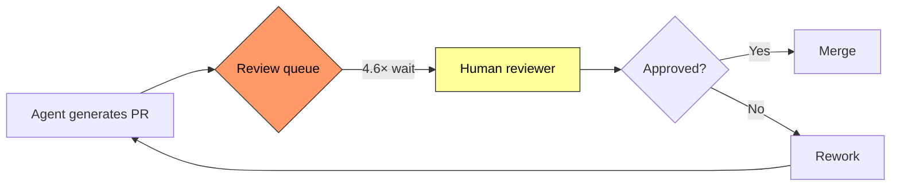
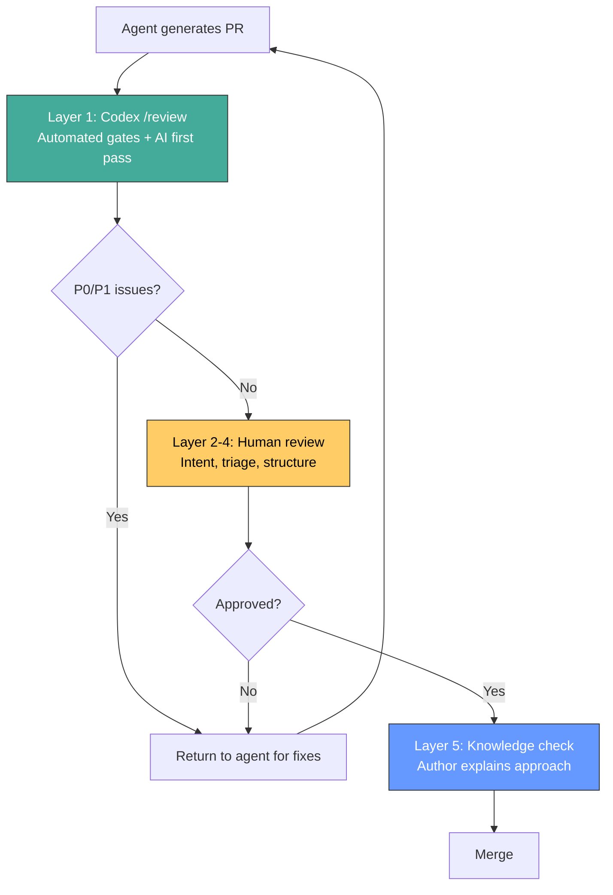

# The Human Review Bottleneck: Practical Code Review Strategies for Agent Output


AI coding agents have solved the wrong half of the problem. Teams using Codex CLI, Claude Code, and similar tools report generating 98% more pull requests while experiencing a 91% increase in PR review time[^1]. Median PR review time is up 441%[^2]. The bottleneck has relocated from writing code to verifying it — and most engineering organisations have not adjusted their processes accordingly.

This article provides a practical framework for reviewing agent-generated code at scale, with specific Codex CLI configuration, triage strategies, and team process patterns that keep review quality high without drowning senior engineers in diff.

## The Scale of the Problem

The numbers tell a stark story. Faros AI's 2026 engineering benchmarks found that AI-generated PRs wait 4.6× longer before a reviewer picks them up[^1]. Once review begins, it completes 2× faster — but that initial queue dominance means cycle time barely improves. Meanwhile, 31% of PRs now merge with zero review, and bugs per developer are up 54%[^2].

The fundamental issue is asymmetric scaling. A developer with agent tooling can produce five or six PRs a day. A reviewer can still only handle the same number they always could — roughly 200–400 lines of meaningful review per hour[^3]. The review queue grows monotonically.



## The Circular Review Trap

A subtler problem lurks beneath the queue. Research from the University of Zurich identifies a structurally circular failure mode: when both the generating agent and the reviewing agent reason from the same artefact, they share the same training distribution and exhibit correlated failures[^4]. The agents check code against itself rather than against intent.

This means using a second AI pass to review agent output provides weaker guarantees than most teams assume. AI review and human review are complementary, not competitive — AI handles mechanical checks (style, obvious bugs, dependency versions), whilst humans focus on validating business logic, assessing architectural fit, and catching specification gaps[^5].

## A Five-Layer Review Framework

Addy Osmani's "PR Contract" pattern[^3] and the six-layer model from Haseeb Sohail[^6] converge on a practical structure. Here is a condensed five-layer framework tuned for agent output:

### Layer 1: Automated Gates (Zero Human Time)

These run before any human sees the diff:

- **CI/CD checks** — linting, type checking, test suite, SAST scanners
- **Codex CLI `/review`** — a read-only sub-turn that reports prioritised findings without modifying the working tree[^7]
- **PR size enforcement** — reject PRs exceeding 250 changed lines; research shows larger PRs receive significantly slower, lower-quality reviews[^1]

### Layer 2: Intent Verification (2 Minutes)

Before reading any code, the reviewer answers one question: *does this PR's description match the ticket?*

Agent-generated PRs frequently satisfy the literal prompt whilst missing the actual requirement. Keep the specification, user story, or acceptance criteria visible in a parallel window throughout the review[^6]. If the PR description lacks an intent statement, send it back.

### Layer 3: Risk-Based Triage (3 Minutes)

Not every PR deserves equal scrutiny. Gating only the riskiest 20% of PRs captures 69% of total review effort[^2]. Classify by:

| Risk tier | Criteria | Review depth |
|-----------|----------|--------------|
| **P0 — Critical** | Auth, payments, secrets, data migrations, public API changes | Full line-by-line, threat model |
| **P1 — Elevated** | New dependencies, schema changes, concurrency, error handling | Focused review of changed modules |
| **P2 — Standard** | Feature code with tests, refactoring with coverage | Skim diff, verify tests, approve |
| **P3 — Mechanical** | Formatting, dependency bumps, generated boilerplate | Auto-approve if CI passes |

### Layer 4: Structural Review (10–15 Minutes)

For P0 and P1 changes, apply these checks specific to agent output:

1. **Hallucinated APIs** — cross-reference every external call against the actual library version installed in `package.json` / `requirements.txt` / `go.mod`. Agents frequently call methods that exist in training data but not in the pinned version[^6].
2. **Over-engineering** — agents tend to produce comprehensive-looking abstractions where a simple function would suffice. Ask: "would a human have written this indirection?"
3. **Security blind spots** — approximately 45% of AI-generated code contains security vulnerabilities; logic errors occur 1.75× more frequently than in human code[^3]. Check authentication bypass paths, input sanitisation, and cryptographic usage.
4. **Test quality** — agent-generated tests can validate flawed logic, creating false confidence[^5]. Verify tests actually exercise edge cases (null, zero, boundary, concurrent inputs), not just the happy path.

### Layer 5: Knowledge Transfer (5 Minutes)

If the PR author cannot explain the agent's approach, the code should not merge. This preserves team understanding and catches cases where the developer accepted output without comprehension. A brief comment thread or async Loom walkthrough suffices.

## Codex CLI Review Configuration

Codex CLI provides three review surfaces: the terminal `/review` command, GitHub cloud reviews via the Codex integration, and CI pipelines via `openai/codex-action`[^8].

### Terminal: `/review` Before Commit

The `/review` command offers four presets[^7]:

1. **Review against a base branch** — compares against upstream merge base
2. **Review uncommitted changes** — inspects staged, unstaged, or untracked modifications
3. **Review a commit** — analyses a specific SHA
4. **Custom review instructions** — accepts freeform prompting

Pin a dedicated review model in `config.toml` to separate generation from review concerns:

```toml
# ~/.codex/config.toml
model = "o3"              # generation model
review_model = "o4-mini"  # cheaper, faster review pass
```

### AGENTS.md Review Guidelines

Codex automatically searches for `AGENTS.md` files and applies any `## Review guidelines` section to review output[^9]. The closest `AGENTS.md` to each changed file wins, enabling per-module review policies:

```markdown
<!-- AGENTS.md at repo root -->
## Review guidelines

- Flag any use of `eval()` or `exec()` as P0
- Reject direct SQL string concatenation; require parameterised queries
- Every new HTTP route must be wrapped in the authentication middleware
- Do not log PII or user-identifiable data at any log level
- Treat typos in public-facing documentation as P1
- New dependencies require a justification comment in the PR description
```

On GitHub, Codex displays only P0 and P1 findings by default, keeping review comments focused on actionable issues[^9].

### CI Pipeline: `codex-action`

The `openai/codex-action` GitHub Action installs Codex CLI and configures it with a secure proxy to the Responses API[^8]. Use it as a required status check:


```yaml
# .github/workflows/codex-review.yml
name: Codex Review
on:
  pull_request:
    types: [opened, synchronize, ready_for_review]

jobs:
  review:
    runs-on: ubuntu-latest
    permissions:
      contents: read
      pull-requests: write
    steps:
      - uses: actions/checkout@v4
      - uses: openai/codex-action@v1
        with:
          task: "Review this PR for security issues, API correctness, and adherence to AGENTS.md guidelines. Flag only P0 and P1 issues."
        env:
          OPENAI_API_KEY: ${{ secrets.OPENAI_API_KEY }}
```


## The Review Sandwich Pattern

The emerging best practice is a three-stage "review sandwich"[^1]:



AI catches surface-level issues first. Humans focus on architecture and business logic. The developer confirms understanding. GitHub's internal data suggests this reduces human review time by 30–50%[^1].

## Team Process Adjustments

### Review SLAs

Target a 4-hour initial response and 24-hour resolution[^1]. Track review times as a team metric — when the queue exceeds two days, it signals a capacity problem, not a discipline problem.

### The 25–40% Threshold

MetaCTO's research suggests an optimal range of 25–40% AI-generated code per team[^1]. Above this range, the review burden outweighs productivity gains. Teams exceeding this threshold should invest in review automation before increasing agent usage.

### Shift Review Left

Validate specifications and intent *before* code generation rather than discovering requirements gaps during review[^4]. A 15-minute design review upstream eliminates hours of rework downstream. This aligns with the Zurich research recommendation: specifications first, deterministic verification second, AI review for structural issues outside specification reach[^4].

### Stacked PRs

Break agent output into small, dependent PRs rather than monolithic changesets. This prevents overwhelming reviewers and enforces developer responsibility for curating changesets into digestible chunks[^5]. Tools like `git-branchless`, Graphite, or GitHub's own stacked PRs feature support this workflow natively.

## What This Means for Your Team

The review bottleneck is not a tooling problem — it is a process problem that tooling can alleviate. The teams pulling ahead in 2026 are those that have invested in review infrastructure: automated first-pass gates, risk-based triage, explicit review SLAs, and disciplined PR sizing[^2].

The goal is not to eliminate human review. It is to ensure that every minute of human attention lands on the decisions that actually require human judgement: architectural fit, business logic correctness, security implications, and knowledge transfer. Everything else should be automated, triaged, or skipped.

⚠️ The statistics cited in this article (441% review time increase, 98% more PRs, 45% vulnerability rate) come from industry reports with varying methodologies and sample sizes. Your team's experience will depend on codebase complexity, agent maturity, and existing review practices.

## Citations

[^1]: [Code Review Is the New Bottleneck in AI Development — MetaCTO](https://www.metacto.com/blogs/code-review-bottleneck-ai-development)
[^2]: [PR Review Time Is Up 441% — The Real Cost of AI-Accelerated Development — DEV Community](https://dev.to/code-board/pr-review-time-is-up-441-the-real-cost-of-ai-accelerated-development-1ho6)
[^3]: [Code Review in the Age of AI — Addy Osmani, Elevate](https://addyo.substack.com/p/code-review-in-the-age-of-ai)
[^4]: [The Specification as Quality Gate: Three Hypotheses on AI-Assisted Code Review — arXiv](https://arxiv.org/abs/2603.25773)
[^5]: [The Human Bottleneck — Scott Logic](https://blog.scottlogic.com/2026/05/14/the-human-bottleneck.html)
[^6]: [How I Evaluate LLM Code Quality: Reviewing AI-Generated Code at Scale — Muhammad Haseeb Sohail](https://medium.com/@haseeb_sohail/how-i-evaluate-llm-code-quality-reviewing-ai-generated-code-at-scale-db8c4f150107)
[^7]: [Features — Codex CLI — OpenAI Developers](https://developers.openai.com/codex/cli/features)
[^8]: [GitHub Action — Codex — OpenAI Developers](https://developers.openai.com/codex/github-action)
[^9]: [Custom instructions with AGENTS.md — Codex — OpenAI Developers](https://developers.openai.com/codex/guides/agents-md)
