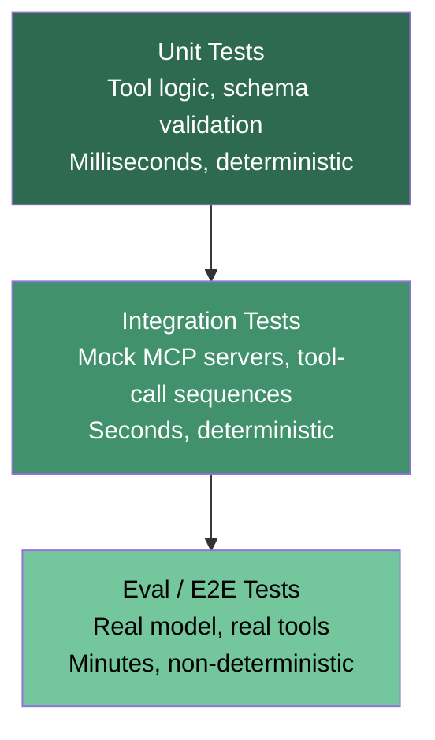
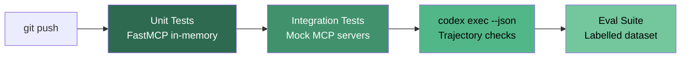

# Agent Testing Frameworks: Unit and Integration Testing for Agent Behaviour


---

Agents ship fast. They also break fast. A Codex CLI workflow that triaged issues flawlessly last Tuesday can silently misroute after a model update, a config change, or a new MCP tool appearing in the manifest. Eval sets catch aggregate regressions but tell you nothing about *which* tool call went wrong or *why* the agent chose a destructive shell command over a read-only one. Deterministic tests do.

This article covers three layers of agent testing — unit tests for MCP server tools, integration tests with mock servers for agent tool-call sequences, and property-based testing for decision boundaries — and shows how each fits into a Codex CLI development workflow.

## The Three-Layer Test Pyramid for Agent Systems

Traditional test pyramids translate surprisingly well to agent architectures. The key insight is separating what is deterministic (tool logic, protocol compliance) from what is non-deterministic (model reasoning) and testing each layer with appropriate techniques [^1].



The bottom layer runs in milliseconds and catches the vast majority of regressions. The top layer — evals with a live model — remains essential but expensive and flaky. The middle layer, integration tests with mock MCP servers, is where most teams have a gap [^2].

## Layer 1: Unit Testing MCP Server Tools

Every MCP server tool is ultimately a function that accepts JSON input and returns JSON output. Test it like one.

### FastMCP In-Memory Testing

FastMCP 2.x provides an in-memory `Client` that connects directly to your server instance — no subprocess, no network, no model in the loop [^3]. Tests complete in milliseconds and are fully deterministic.

```python
import pytest
from fastmcp import FastMCP, Client

server = FastMCP("CodeReviewServer")

@server.tool
def check_complexity(file_path: str, threshold: int = 10) -> dict:
    """Analyse cyclomatic complexity of a Python file."""
    # Real implementation reads the file and runs radon
    import radon.complexity as rc
    with open(file_path) as f:
        blocks = rc.cc_visit(f.read())
    violations = [b for b in blocks if b.complexity > threshold]
    return {
        "file": file_path,
        "violations": [{"name": b.name, "complexity": b.complexity} for b in violations],
        "passed": len(violations) == 0,
    }

@pytest.mark.asyncio
async def test_check_complexity_clean_file(tmp_path):
    clean = tmp_path / "clean.py"
    clean.write_text("def add(a, b):\n    return a + b\n")

    async with Client(server) as client:
        result = await client.call_tool(
            "check_complexity", {"file_path": str(clean)}
        )
        assert result.data["passed"] is True
        assert result.data["violations"] == []
```

### Mocking External Dependencies

When your tool calls a database, API, or cloud service, mock at the boundary:

```python
from unittest.mock import AsyncMock

async def test_database_tool_with_mock():
    server = FastMCP("DataServer")
    mock_db = AsyncMock()
    mock_db.query.return_value = [{"id": 1, "status": "open"}]

    @server.tool
    async def list_open_issues() -> list:
        return await mock_db.query("SELECT * FROM issues WHERE status='open'")

    async with Client(server) as client:
        result = await client.call_tool("list_open_issues", {})
        assert len(result.data) == 1
        mock_db.query.assert_called_once()
```

### Schema Validation with Snapshot Testing

Tool schemas are your contract with the model. Catch unintended schema drift with `inline-snapshot` [^3]:

```python
from inline_snapshot import snapshot

async def test_tool_schema_stability():
    schema = server.list_tools()[0].inputSchema
    assert schema == snapshot({
        "type": "object",
        "properties": {
            "file_path": {"type": "string"},
            "threshold": {"type": "integer", "default": 10},
        },
        "required": ["file_path"],
    })
```

Run `pytest --inline-snapshot=create` to generate initial snapshots, then `pytest --inline-snapshot=fix` after intentional changes.

## Layer 2: Integration Testing with Mock MCP Servers

Unit tests verify individual tools. Integration tests verify that your agent calls the *right* tools in the *right* order with the *right* arguments. This requires mocking the MCP server that the agent connects to, so you control what the "server" returns for any given test case [^2].

### The Mock MCP Server Pattern

The pattern removes the AI model from the testing loop. You define canned responses and assert against the tool-call sequence your client produces:

```python
from fastmcp import FastMCP, Client
from fastmcp.utilities.tests import run_server_async
from fastmcp.client.transports import StreamableHttpTransport

@pytest.fixture
async def mock_github_server():
    server = FastMCP("MockGitHub")

    @server.tool
    def list_issues(repo: str, state: str = "open") -> list:
        return [
            {"number": 42, "title": "Fix login bug", "labels": ["bug"]},
            {"number": 43, "title": "Add dark mode", "labels": ["feature"]},
        ]

    @server.tool
    def add_label(repo: str, issue_number: int, label: str) -> dict:
        return {"issue": issue_number, "label": label, "status": "added"}

    async with run_server_async(server) as url:
        yield url

@pytest.mark.asyncio
async def test_triage_workflow(mock_github_server):
    async with Client(
        transport=StreamableHttpTransport(mock_github_server)
    ) as client:
        issues = await client.call_tool(
            "list_issues", {"repo": "acme/app", "state": "open"}
        )
        # Verify the triage logic labels bugs as priority
        for issue in issues.data:
            if "bug" in issue["labels"]:
                result = await client.call_tool(
                    "add_label",
                    {"repo": "acme/app", "issue_number": issue["number"], "label": "priority"},
                )
                assert result.data["status"] == "added"
```

### Testing Tool-Call Trajectories with the Codex Python SDK

The Codex Python SDK (package `openai-codex`, v0.132+) exposes `TurnResult` objects that contain the complete tool-call sequence [^4]. You can assert against these trajectories in CI:

```python
from codex_app_server import Codex

def test_agent_does_not_use_destructive_commands():
    with Codex() as codex:
        thread = codex.thread_start(model="o4-mini")
        result = thread.run("List all Python files in the project")

        # Inspect tool calls in the trajectory
        for item in result.collected_items:
            if hasattr(item, "command"):
                assert "rm " not in item.command, (
                    f"Agent used destructive command: {item.command}"
                )
                assert "git push --force" not in item.command
```

⚠️ *The Python SDK is experimental and its API surface may change between releases. Pin your dependency version.*

### Using `codex exec` for Trajectory Assertions

For CI pipelines that cannot run the Python SDK, `codex exec --json` streams JSONL events including tool calls and reasoning-token usage [^5]:

```bash
codex exec --json \
  --approval-mode full-auto \
  --sandbox read-only \
  "Explain the architecture of this repo" \
  | jq 'select(.type == "tool_call") | .tool_name' \
  > /tmp/trajectory.txt

# Assert no shell_exec calls in a read-only task
grep -c "shell_exec" /tmp/trajectory.txt && exit 1 || exit 0
```

## Layer 3: Property-Based Testing for Agent Decisions

Traditional assertions check specific inputs against expected outputs. Property-based testing (via Hypothesis or similar) generates hundreds of random inputs and verifies that invariants hold [^6]. For agent systems, useful invariants include:

- **Safety**: the agent never executes a write command when the sandbox is `read-only`
- **Idempotency**: running the same prompt twice produces the same file modifications
- **Schema compliance**: every tool response matches its declared JSON Schema

```python
from hypothesis import given, strategies as st

@given(city=st.text(min_size=1, max_size=50))
@pytest.mark.asyncio
async def test_weather_tool_always_returns_valid_schema(city):
    async with Client(server) as client:
        result = await client.call_tool("get_temperature", {"city": city})
        assert "city" in result.data
        assert isinstance(result.data["temp"], (int, float))
```

## Tooling Landscape (May 2026)

| Tool | Layer | Transport | Key Strength |
|------|-------|-----------|-------------|
| **FastMCP Client** [^3] | Unit + Integration | In-memory, HTTP | Deterministic, millisecond tests |
| **MCP Inspector** [^7] | Integration + Debug | stdio, SSE, HTTP | Visual protocol inspection |
| **Specmatic MCP** [^8] | Integration | HTTP | Contract testing against OpenAPI specs |
| **Tester MCP Client** (Apify) [^1] | Unit | stdio | Lightweight smoke testing |
| **Codex Python SDK** [^4] | Integration + E2E | JSON-RPC/stdio | Trajectory inspection via `TurnResult` |
| **`codex exec --json`** [^5] | E2E + CI | JSONL/stdout | Pipeline-friendly, no SDK dependency |

## Integrating with Codex CLI Workflows

### AGENTS.md Testing Directives

Add testing conventions to your `AGENTS.md` so Codex CLI itself follows them when generating code [^9]:

```markdown
## Testing

- Framework: pytest with pytest-asyncio
- MCP server tests use FastMCP in-memory Client — never spawn subprocesses
- Every new MCP tool must have a corresponding unit test
- Coverage target: 90% on tool functions
- Mock all external services; never call live APIs in tests
- Use inline-snapshot for schema stability tests
```

### CI Pipeline Pattern



The first three stages are deterministic and complete in seconds. The eval suite runs on a schedule or before releases — not on every commit.

### Hooks for Test Gating

With Codex CLI hooks reaching GA in v0.133 (May 2026) [^10], you can gate agent actions on test results:

```json
{
  "hooks": {
    "PreToolUse": [
      {
        "matcher": "^Bash$",
        "hooks": [
          {
            "type": "command",
            "command": "pytest tests/mcp/ -x --timeout=10",
            "timeout": 30
          }
        ]
      }
    ]
  }
}
```

This blocks shell execution if MCP server tests fail, catching regressions before the agent acts on broken tooling. The `PreToolUse` event with a `^Bash$` matcher intercepts shell commands specifically[^10].

## Common Pitfalls

1. **Testing the model, not the tool.** If your test fails because GPT-5.5 chose a different phrasing, you are testing at the wrong layer. Push that assertion into an eval set.

2. **Shared state between tests.** MCP server instances should be created per-test or per-fixture. Global server state causes order-dependent failures [^3].

3. **Ignoring schema drift.** A renamed parameter in your MCP tool breaks every agent that calls it. Snapshot tests catch this before deployment.

4. **Skipping the integration layer.** Unit tests pass, evals pass, but the agent calls tools in the wrong order. Mock MCP integration tests fill this gap.

5. **Over-mocking transport.** Test at least one path through real HTTP transport using `run_server_async` to catch serialisation bugs that in-memory tests miss.

## Conclusion

Agent testing is not a solved problem, but it is a tractable one. The three-layer pyramid — unit tests with FastMCP's in-memory client, integration tests with mock MCP servers, and trajectory assertions via the Codex Python SDK or `codex exec --json` — gives you fast, deterministic feedback on the parts that matter most. Reserve expensive eval suites for what only a model can judge: whether the agent's *reasoning* was sound.

The tooling has matured significantly in the first half of 2026. FastMCP's in-memory testing, the Codex Python SDK's `TurnResult` inspection, and hooks-based test gating make it possible to treat agent code with the same rigour as any other production system.

---

## Citations

[^1]: "How to Test MCP Server: Top Testing Tools & Methods in 2026," Testomat.io, 2026. [https://testomat.io/blog/mcp-server-testing-tools/](https://testomat.io/blog/mcp-server-testing-tools/)

[^2]: "How to Mock MCP Servers for Reliable Agent Testing," Fastio, 2026. [https://fast.io/resources/mocking-mcp-servers-testing/](https://fast.io/resources/mocking-mcp-servers-testing/)

[^3]: "Tests — FastMCP Development Guide," FastMCP Documentation, 2026. [https://gofastmcp.com/development/tests](https://gofastmcp.com/development/tests)

[^4]: "SDK — Codex," OpenAI Developers, 2026. [https://developers.openai.com/codex/sdk](https://developers.openai.com/codex/sdk)

[^5]: "Codex CLI exec mode experiments: 81 flag/feature tests with raw outputs," Alex Fazio, GitHub Gist, 2026. [https://gist.github.com/alexfazio/359c17d84cb6a5af12bac88fa1db9770](https://gist.github.com/alexfazio/359c17d84cb6a5af12bac88fa1db9770)

[^6]: "Hypothesis: Property-Based Testing for Python," Hypothesis Documentation, 2026. [https://hypothesis.readthedocs.io/](https://hypothesis.readthedocs.io/)

[^7]: "MCP Inspector — Visual Testing Tool for MCP Servers," Model Context Protocol, GitHub, 2026. [https://github.com/modelcontextprotocol/inspector](https://github.com/modelcontextprotocol/inspector)

[^8]: "Specmatic MCP as Guardrails for Coding Agents," Specmatic, 2026. [https://specmatic.io/updates/specmatic-mcp-as-guardrails-for-coding-agents-api-spec-to-full-stack-implementation-in-minutes/](https://specmatic.io/updates/specmatic-mcp-as-guardrails-for-coding-agents-api-spec-to-full-stack-implementation-in-minutes/)

[^9]: "Use Codex with the Agents SDK," OpenAI Developers, 2026. [https://developers.openai.com/codex/guides/agents-sdk](https://developers.openai.com/codex/guides/agents-sdk)

[^10]: "Changelog — Codex," OpenAI Developers, May 2026. [https://developers.openai.com/codex/changelog](https://developers.openai.com/codex/changelog)
