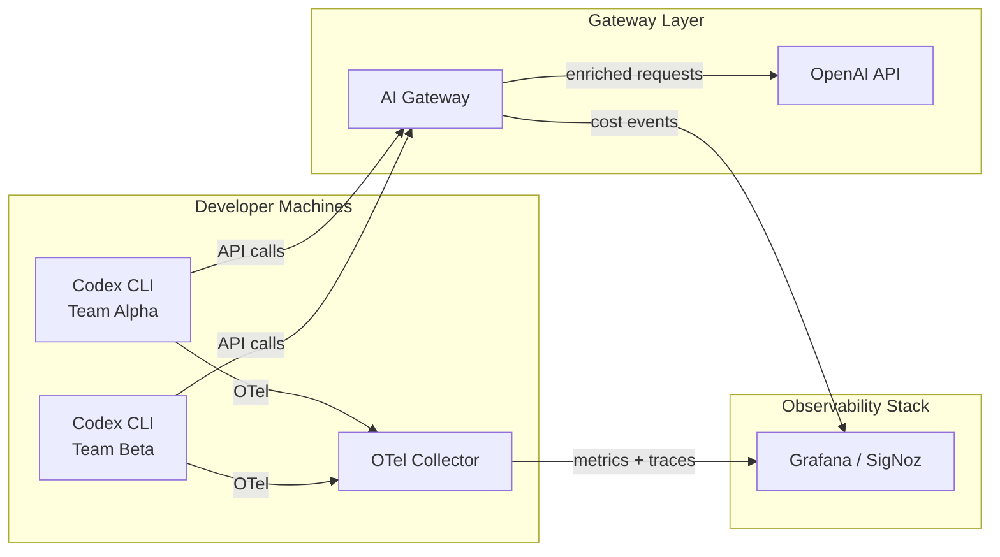
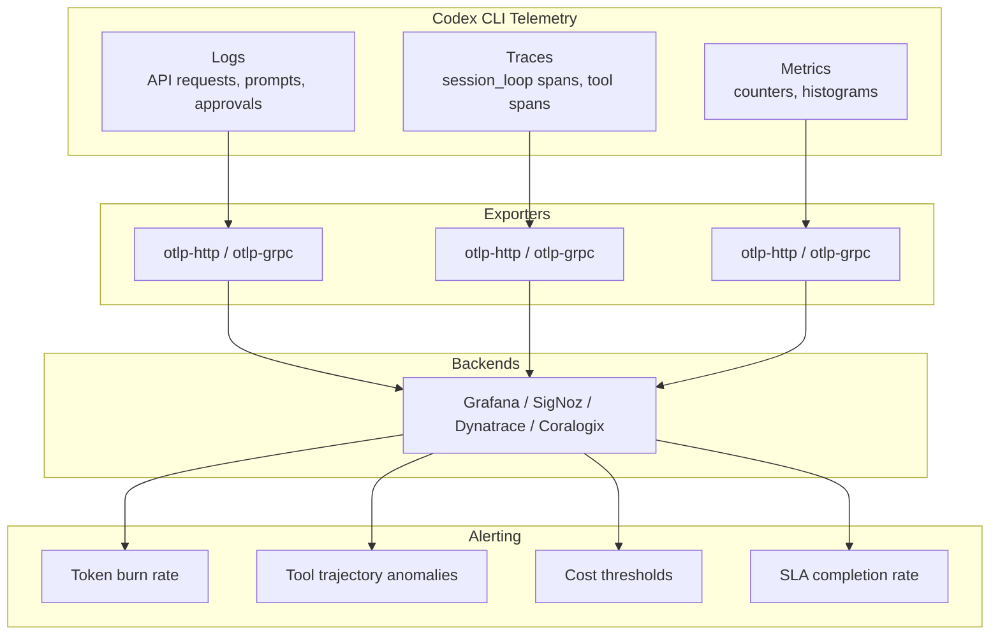

# Agent Observability for Codex CLI Pipelines: OpenTelemetry, Cost Attribution, and SLA Monitoring


---

## The Observability Gap for Coding Agents

Traditional application monitoring tracks HTTP status codes, CPU utilisation, and error rates. Coding agents break every one of those assumptions. A Codex CLI session that hallucinates an entire module and writes passing-but-wrong tests produces traces that look identical to a correct run — green status codes, low latency, zero errors [^1]. The most dangerous failure mode is *silent success*: the agent follows flawed reasoning while every metric stays green.

Enterprise teams running `codex exec` across CI/CD pipelines, scheduled tasks, and multi-developer workstations need a different observability model — one built around token-weighted cost attribution, tool trajectory analysis, and semantic correctness signals rather than uptime percentages.

## Codex CLI's OpenTelemetry Foundation

Codex CLI emits structured telemetry through three independent OpenTelemetry pipelines: logs, traces, and metrics [^2]. Each pipeline has its own exporter configuration in `~/.codex/config.toml`, allowing teams to route different signal types to different backends.

### Configuration

```toml
[otel]
environment = "production"
log_user_prompt = false

# Log events: API requests, tool approvals, session lifecycle
exporter = { otlp-http = {
  endpoint = "https://otel-collector.internal:4318/v1/logs",
  protocol = "binary",
  headers = { "X-Team" = "platform-engineering" }
}}

# Distributed traces: session_loop spans with child spans per API call and tool invocation
trace_exporter = { otlp-http = {
  endpoint = "https://otel-collector.internal:4318/v1/traces",
  protocol = "binary"
}}

# Metrics: counters and histograms for API, stream, and tool activity
metrics_exporter = { otlp-http = {
  endpoint = "https://otel-collector.internal:4318/v1/metrics",
  protocol = "binary"
}}
```

All spans use the service name `codex_cli_rs` [^3]. The top-level span for each session is `session_loop`, with child spans for individual API calls and tool invocations. Default metadata tags on every metric include `auth_mode`, `originator`, `session_source`, `model`, and `app.version` [^2].

### Key Metrics

Codex emits counters and duration histograms across several categories [^2]:

| Category | Representative Metrics | Type |
|----------|----------------------|------|
| API transport | `codex.api_request` | Counter (status, success) |
| Tool activity | `codex.tool.call.duration_ms` | Histogram (tool, outcome) |
| Approvals | `codex.approval.requested` | Counter (result) |
| Token usage | `codex.turn.tokens` | Counter (input, output, cached) |
| Memory | `codex.memory.phase1`, `codex.memory.phase2` | Counter |
| Compaction | `codex.compact.duration_ms` | Histogram |

Setting `log_user_prompt = true` includes raw prompts in log events — useful for debugging but a privacy risk in shared environments. Leave it `false` in production and enable selectively during incident investigation [^2].

## Cost Attribution by Team

Every Codex CLI session is a direct API call to OpenAI. Without an intermediary layer, spend becomes opaque once multiple teams adopt the tool concurrently [^4]. There are two complementary approaches to cost attribution.

### Approach 1: OTel Collector Label Injection

Route all Codex telemetry through an OpenTelemetry Collector that enriches spans and metrics with team ownership labels before forwarding to your backend:

```yaml
# otel-collector-config.yaml
processors:
  attributes/team:
    actions:
      - key: team
        value: "${TEAM_NAME}"
        action: upsert
      - key: cost_centre
        value: "${COST_CENTRE}"
        action: upsert

exporters:
  otlphttp:
    endpoint: https://grafana-cloud.example.com/otlp

service:
  pipelines:
    metrics:
      receivers: [otlp]
      processors: [attributes/team]
      exporters: [otlphttp]
    traces:
      receivers: [otlp]
      processors: [attributes/team]
      exporters: [otlphttp]
```

Each team's Codex installations point their `config.toml` at a team-specific collector instance (or a shared collector with header-based routing). The `X-Team` header in the exporter configuration enables the collector to apply the correct labels [^5].

### Approach 2: AI Gateway Interception

An AI gateway sits between Codex CLI and the OpenAI API, intercepting every request to log token counts, model selection, and cost per call [^4]. Gateways like Portkey, Helicone, or Bifrost can attribute spend to individual developers, teams, or projects. Configure the gateway endpoint via Codex's `OPENAI_BASE_URL` environment variable:

```bash
# Set your gateway endpoint and team-scoped credentials
export OPENAI_BASE_URL="https://gateway.internal/v1"
# Use a team-scoped key issued by your gateway provider
```

The gateway approach provides real-time spend dashboards and can enforce budget limits — throttling or blocking requests when a team exceeds its allocation [^4].



## Alerting on Agent Anomalies

Static thresholds fail for non-deterministic systems. An agent that normally uses 8,000 tokens per task might legitimately use 40,000 on a complex refactoring. The alert strategies that work for coding agents focus on *rate of change* and *trajectory patterns* rather than absolute values [^1].

### Token Burn Rate Alerts

Monitor the derivative of token consumption rather than the absolute count. A sudden spike in tokens-per-minute across a `codex exec` batch indicates either a runaway loop or an unexpectedly complex task:


```yaml
# Grafana alert rule (PromQL)
- alert: CodexTokenBurnRateHigh
  expr: |
    rate(codex_turn_tokens_total{type="output"}[5m])
    > 3 * avg_over_time(
        rate(codex_turn_tokens_total{type="output"}[5m])[1h:5m]
      )
  for: 10m
  labels:
    severity: warning
  annotations:
    summary: "Codex output token rate 3x above hourly average"
    team: "{{ $labels.team }}"
```


### Tool Trajectory Anomalies

Healthy agent sessions follow predictable tool call patterns — read files, make changes, run tests. Anomalous trajectories (repeated `Bash` calls with no `apply_patch`, or `apply_patch` with no subsequent test execution) signal the agent is stuck in a loop or has lost context [^1]:

```yaml
- alert: CodexToolLoopDetected
  expr: |
    increase(codex_tool_call_total{tool="Bash"}[10m]) > 50
    and increase(codex_tool_call_total{tool="apply_patch"}[10m]) == 0
  for: 5m
  labels:
    severity: critical
  annotations:
    summary: "Codex running 50+ Bash calls with no code changes — possible loop"
```

### Cost Anomaly Alerts

Flag individual sessions or users burning through budgets unexpectedly [^6]. This is particularly important for `codex exec` pipelines where an infinite retry loop can accumulate thousands of dollars before a billing alert fires:

```yaml
- alert: CodexSessionCostExceeded
  expr: |
    codex_session_cost_usd > 15
  labels:
    severity: critical
  annotations:
    summary: "Single Codex session exceeded $15 spend threshold"
```

## SLA Monitoring for Codex Pipelines

When `codex exec` runs in CI/CD or scheduled tasks, it becomes infrastructure with SLA expectations. Three metrics define agent pipeline health.

### Task Completion Rate

Track the ratio of successful `codex exec` exits (exit code 0) to total invocations. A completion rate below 95% over a rolling window warrants investigation:

```yaml
- record: codex:exec:completion_rate:5m
  expr: |
    rate(codex_exec_exits_total{code="0"}[5m])
    / rate(codex_exec_exits_total[5m])
```

### Time-to-Resolution (TTR)

Measure the wall-clock duration of `codex exec` tasks. The `session_loop` span duration provides this directly. Set SLA targets per task type — a test-generation task should complete in under 3 minutes; a full-module refactoring might allow 15 minutes.

### Output Quality Gates

SLA monitoring for agents must include *semantic* checks, not just completion status. Use hooks to run post-session validation:

```toml
[[hooks.Stop]]
matcher = ".*"

[[hooks.Stop.hooks]]
type = "command"
command = "/usr/local/bin/codex-quality-gate.sh"
timeout = 60
statusMessage = "Running output quality gate"
```

The quality gate script can verify that generated code compiles, tests pass, linting is clean, and output matches expected schemas (especially useful with `--output-schema`) [^7].

## Hooks as an Observability Extension Point

Codex hooks receive standardised JSON on stdin containing `session_id`, `cwd`, `hook_event_name`, and event-specific fields [^7]. This makes them a natural extension point for custom observability that goes beyond what OTel provides.

### Session Cost Tracker Hook


```python
#!/usr/bin/env python3
"""PostToolUse hook that tracks cumulative token cost per session."""
import json, sys, os, httpx

event = json.load(sys.stdin)
session_id = event.get("session_id", "unknown")
tool_name = event.get("tool_name", "unknown")

# Push custom metric to Prometheus pushgateway
httpx.post(
    f"{os.environ['PUSHGATEWAY_URL']}/metrics/job/codex/session/{session_id}",
    content=f'codex_tool_invocation_total{{tool="{tool_name}"}} 1\n',
    headers={"Content-Type": "text/plain"},
)

# Signal approval to continue
print(json.dumps({"status": "approved"}))
```


Register it in `config.toml`:

```toml
[[hooks.PostToolUse]]
matcher = ".*"

[[hooks.PostToolUse.hooks]]
type = "command"
command = "python3 ~/.codex/hooks/cost_tracker.py"
timeout = 10
statusMessage = "Recording tool metrics"
```

## Platform Integration Matrix

The observability ecosystem for Codex CLI has matured rapidly in 2026. Several platforms now offer dedicated integrations [^3] [^8] [^9] [^10]:

| Platform | Integration Method | Key Capabilities |
|----------|-------------------|-----------------|
| Grafana Cloud | OTel tile + prebuilt dashboards | Metrics, logs, traces; dashboard templates |
| SigNoz | OTel gRPC/HTTP | Custom Codex dashboard; LLM-specific charts |
| Dynatrace | OTel ingestion | Unified agent monitoring across Codex, Claude Code, Copilot |
| Coralogix | OTel + dedicated integration | Code agent observability; anomaly detection |
| Portkey | API gateway | Cost tracking, budget limits, provider routing |



## Practical Deployment Checklist

1. **Enable OTel in `config.toml`** across all developer machines and CI runners — use configuration management to distribute a standard `[otel]` block with team-specific headers.
2. **Deploy an OTel Collector** with team attribution processors between Codex and your backend.
3. **Set up an AI gateway** for real-time cost control and budget enforcement.
4. **Install prebuilt dashboards** — Grafana Cloud offers a one-click OpenAI Codex tile [^10].
5. **Configure token burn rate and tool loop alerts** as baseline anomaly detection.
6. **Add quality gate hooks** for `codex exec` pipelines to enforce SLA output standards.
7. **Review `log_user_prompt` policy** — enable in staging, disable in production unless your data governance permits it.

## Limitations and Open Issues

- **`codex exec` metric gaps**: As of early 2026, `codex exec` did not emit OTel metrics (only traces and logs), and `codex mcp-server` emitted no OTel telemetry at all [^11]. Check the changelog for resolution status.
- **Metrics exporter default**: The `metrics_exporter` defaults to `statsig` (OpenAI's internal analytics), not `none`. Teams must explicitly set it to `otlp-http` or `otlp-grpc` to route metrics to their own backends [^2].
- **Privacy**: Enabling `log_user_prompt` in shared collector environments risks exposing proprietary code in telemetry data. Use TLS client certificates and access controls on your collector endpoints.
- **Cost of observability**: High-cardinality labels (per-session, per-file) can inflate metrics storage costs. Use the OTel Collector's `filter` processor to drop high-cardinality dimensions before export.

## Citations

[^1]: Coralogix, "Agentic AI Observability: A Practical Guide for 2026," [https://coralogix.com/ai-blog/agentic-ai-observability/](https://coralogix.com/ai-blog/agentic-ai-observability/)

[^2]: OpenAI, "Advanced Configuration – Codex," [https://developers.openai.com/codex/config-advanced](https://developers.openai.com/codex/config-advanced)

[^3]: SigNoz, "OpenAI Codex Observability & Monitoring with OpenTelemetry," [https://signoz.io/docs/codex-monitoring/](https://signoz.io/docs/codex-monitoring/)

[^4]: Maxim AI, "Best AI Gateway to Manage Codex CLI Token Spend," [https://www.getmaxim.ai/articles/best-ai-gateway-to-manage-codex-cli-token-spend/](https://www.getmaxim.ai/articles/best-ai-gateway-to-manage-codex-cli-token-spend/)

[^5]: OpenTelemetry, "Collector Configuration," [https://opentelemetry.io/docs/collector/configuration/](https://opentelemetry.io/docs/collector/configuration/)

[^6]: OneUptime, "Monitoring AI Agents in Production: The Observability Gap Nobody's Talking About," [https://oneuptime.com/blog/post/2026-03-14-monitoring-ai-agents-in-production/view](https://oneuptime.com/blog/post/2026-03-14-monitoring-ai-agents-in-production/view)

[^7]: OpenAI, "Hooks – Codex," [https://developers.openai.com/codex/hooks](https://developers.openai.com/codex/hooks)

[^8]: Dynatrace, "Dynatrace expands AI Coding Agent monitoring," [https://www.dynatrace.com/news/blog/dynatrace-expands-ai-coding-agent-monitoring/](https://www.dynatrace.com/news/blog/dynatrace-expands-ai-coding-agent-monitoring/)

[^9]: Coralogix, "Codex CLI Integration," [https://coralogix.com/docs/integrations/ai-observability/codex-cli/](https://coralogix.com/docs/integrations/ai-observability/codex-cli/)

[^10]: Grafana, "OpenAI Codex Integration," [https://grafana.com/docs/grafana-cloud/monitor-infrastructure/integrations/integration-reference/integration-openai-codex/](https://grafana.com/docs/grafana-cloud/monitor-infrastructure/integrations/integration-reference/integration-openai-codex/)

[^11]: GitHub, "`codex exec` emits no OTel metrics; `codex mcp-server` emits no OTel telemetry at all," [https://github.com/openai/codex/issues/12913](https://github.com/openai/codex/issues/12913)
