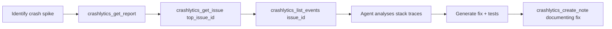
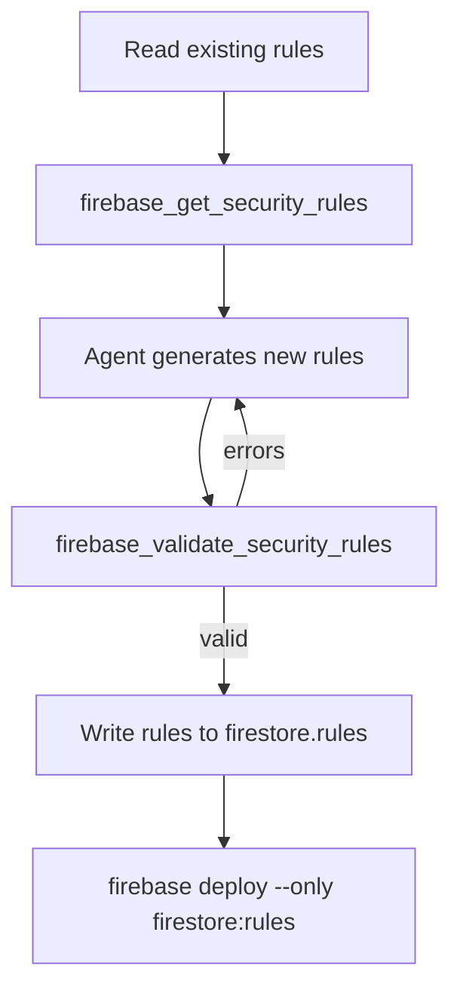

# Codex CLI for Firebase Development: MCP Server, Agent Skills, and Full-Stack Workflows


---

Firebase powers over 3.5 million active applications[^1], yet until recently, developing against its services from an AI coding agent meant blind prompting — the agent hallucinating collection paths, guessing security rule syntax, and fabricating Crashlytics issue IDs. That changed when the Firebase MCP server graduated to general availability in October 2025[^2] and the Firebase agent skills catalogue landed in early 2026[^3]. Together, they give Codex CLI verified, tool-backed access to the entire Firebase platform — from Firestore queries to push notification delivery — without leaving the terminal.

This article covers the official Firebase MCP server (built into Firebase CLI v15.18.0[^4]), the Firebase agent skills system, and the community `gannonh/firebase-mcp` server[^5], then walks through four practical workflow patterns for full-stack Firebase development with Codex CLI.

## The Firebase MCP Server

The Firebase MCP server ships inside `firebase-tools` itself — no separate package to install[^2]. It exposes **50+ tools** across twelve Firebase service categories via stdio transport[^6]:

| Category | Key Tools | Purpose |
|----------|-----------|---------|
| **Core** | `firebase_get_project`, `firebase_list_apps`, `firebase_get_sdk_config` | Project discovery and configuration |
| **Firestore** | `firestore_get_documents`, `firestore_query_collection`, `firestore_list_collections`, `firestore_delete_document` | Document CRUD and collection enumeration |
| **Authentication** | `auth_get_users`, `auth_update_user`, `auth_set_sms_region_policy` | User management and custom claims |
| **Crashlytics** | `crashlytics_get_issue`, `crashlytics_list_events`, `crashlytics_get_report`, `crashlytics_create_note` | Crash investigation and annotation |
| **Cloud Functions** | `functions_list_functions`, `functions_get_logs` | Function listing and log retrieval |
| **Cloud Messaging** | `messaging_send_message` | Push notification delivery |
| **App Hosting** | `apphosting_list_backends`, `apphosting_fetch_logs` | Backend management and log access |
| **SQL Connect** | `dataconnect_build`, `dataconnect_execute` | GraphQL operations against Cloud SQL |
| **Storage** | `storage_get_object_download_url` | Download URL generation |

Additionally, the server provides **security rule tools** — `firebase_validate_security_rules` and `firebase_get_security_rules` — that let the agent read, generate, and validate rules for Firestore, Cloud Storage, and Realtime Database without guessing syntax[^6].

### Configuring the Firebase MCP Server for Codex CLI

Add the server to `~/.codex/config.toml`:

```toml
[mcp_servers.firebase]
command = "npx"
args = ["-y", "firebase-tools@latest", "mcp"]
```

To scope the server to a specific project directory and limit tool categories:

```toml
[mcp_servers.firebase]
command = "npx"
args = ["-y", "firebase-tools@latest", "mcp", "--dir", "/home/dev/my-app", "--only", "firestore,auth,crashlytics"]
```

The `--only` flag is worth using. Exposing all 50+ tools consumes context tokens; filtering to the services you actually use keeps the tool manifest lean[^6].

Since v15.16.0, the Firebase MCP server also supports SSE mode with a customisable port[^4], useful when sharing a single server instance across multiple agent sessions:

```bash
npx firebase-tools@latest mcp --transport sse --port 9199
```

For Codex CLI's streamable HTTP transport:

```toml
[mcp_servers.firebase-sse]
url = "http://localhost:9199/sse"
```

### Authentication

The server uses your Firebase CLI credentials. Run `firebase login` once, and the MCP server inherits the session — no separate API key management required[^6]. For CI environments, set `GOOGLE_APPLICATION_CREDENTIALS` to a service account key path and the server picks up Application Default Credentials automatically.

## Firebase Agent Skills

Firebase agent skills are portable, self-contained knowledge modules that provide Firebase-specific instructions, best practices, and automation scripts[^3]. Where the MCP server provides *tool access* (read this document, query that collection), skills provide *domain knowledge* (how to structure Firestore for offline sync, when to use custom claims versus security rules).

Install skills for Codex CLI:

```bash
npx skills add firebase/agent-skills --agent=codex
```

Key skills available:

| Skill | Focus |
|-------|-------|
| `firebase-auth-basics` | Sign-in flows, custom claims, multi-factor authentication |
| `firebase-firestore-standard` | Data modelling, indexing, offline persistence, security rules |
| `firebase-app-hosting-basics` | Framework deployment (Next.js 16, Angular, SvelteKit) |
| `firebase-ai-logic-basics` | Gemini API integration via Firebase AI Logic |
| `developing-genkit-js` | Building AI-powered applications with Genkit in Node.js |

Skills use **progressive disclosure** — the agent initially scans brief metadata and loads detailed instructions only when the task matches[^3]. This keeps token costs low compared to dumping entire documentation sets into the system prompt.

## The Community Firebase MCP Server

For teams needing capabilities beyond the official server, `gannonh/firebase-mcp`[^5] provides an alternative with HTTP transport support and file upload tools:

- `storage_upload` — upload files from text, base64 content, or local file paths
- `storage_upload_from_url` — import files directly from external URLs with automatic content type detection

Configure it alongside the official server:

```toml
[mcp_servers.firebase-community]
command = "npx"
args = ["-y", "@gannonh/firebase-mcp"]

[mcp_servers.firebase-community.env]
FIREBASE_PROJECT_ID = "my-project-id"
SERVICE_ACCOUNT_KEY_PATH = "/path/to/service-account.json"
```

⚠️ The community server requires explicit service account configuration — it does not inherit Firebase CLI credentials.

## AGENTS.md for Firebase Projects

Create `AGENTS.md` at the project root to encode Firebase-specific conventions:

```markdown
# AGENTS.md — Firebase Project Conventions

## Stack
- Firebase CLI v15.18.0, Node.js 22 LTS
- Firestore in Native mode (NOT Datastore mode)
- Cloud Functions 2nd gen (Node.js 22 runtime)
- Firebase Authentication with Identity Platform

## Rules
- All Firestore security rules MUST use `rules_version = '2'`
- Never use `allow read, write: if true` in any environment
- Custom claims are for role-based access; do not store user data in claims
- Cloud Functions must use `onRequest` (2nd gen) not `functions.https.onRequest` (1st gen)
- Firestore composite indexes must be defined in `firestore.indexes.json`, not created manually

## Anti-hallucination
- Collection paths: verify with `firestore_list_collections` before assuming a path exists
- Function names: verify with `functions_list_functions` before referencing
- Security rules: always validate with `firebase_validate_security_rules` after generation
- SDK config: retrieve with `firebase_get_sdk_config`, never hardcode project IDs

## Testing
- Use Firebase Emulator Suite for all local development
- Emulator ports: Auth 9099, Firestore 8080, Functions 5001, Storage 9199
```

## Workflow Patterns

### Pattern 1: Crash Investigation with Crashlytics MCP

The most immediate value of the Firebase MCP server is crash triage. Instead of switching to the Firebase console, the agent queries Crashlytics directly:



Prompt:

```
The crash rate spiked overnight. Use the Crashlytics MCP tools to pull the
top issues, examine the stack traces, identify the root cause, write a fix,
and annotate the Crashlytics issue with what you found.
```

The agent calls `crashlytics_get_report` for numerical overview, drills into the top issue with `crashlytics_get_issue`, examines individual events via `crashlytics_list_events`, proposes a fix, and documents its findings with `crashlytics_create_note` — all without leaving the terminal[^6].

### Pattern 2: Security Rules Generation and Validation Loop

Firestore security rules are notoriously error-prone. The MCP server enables a generate-validate-fix loop:



The agent retrieves the current rules, understands the data model via `firestore_list_collections` and `firestore_get_documents`, generates updated rules, and validates them before writing to disk. The validation loop catches syntax errors and type mismatches that would otherwise only surface at deploy time[^6].

### Pattern 3: Full-Stack Feature Development

Combining MCP tools with agent skills enables end-to-end feature development:

```
Add a user profile page. Use Firestore for storage, Firebase Auth for the
session, and Cloud Storage for the avatar. Generate security rules that
allow users to read/write only their own profile and upload images under 5MB.
Validate everything before committing.
```

The agent:
1. Queries `firestore_list_collections` to understand the existing schema
2. Retrieves SDK config via `firebase_get_sdk_config`
3. Scaffolds the feature using knowledge from `firebase-firestore-standard` and `firebase-auth-basics` skills
4. Generates Firestore and Storage security rules
5. Validates rules with `firebase_validate_security_rules`
6. Writes the implementation and associated tests

### Pattern 4: Batch Audit with `codex exec`

For multi-project Firebase estates, `codex exec` enables batch operations:

```bash
for project_dir in projects/*/; do
  codex exec \
    --model gpt-5.4-mini \
    --approval-mode full-auto \
    "Audit the Firestore security rules in this project. Flag any rule that \
     grants public write access or allows reads without authentication. \
     Output findings as JSON." \
    < "$project_dir/firestore.rules"
done
```

This pattern works because the Firebase MCP server's `--dir` flag scopes tool access to each project directory[^6].

## Model Selection

| Task | Recommended Model | Rationale |
|------|-------------------|-----------|
| Security rules generation/audit | o3 | Rules require precise logic; reasoning tokens catch edge cases |
| Crash investigation and triage | gpt-5.5 | Complex stack trace analysis benefits from frontier reasoning[^7] |
| CRUD scaffolding and boilerplate | gpt-5.4-mini | Routine generation; cost-effective at scale |
| Batch rule audits via `codex exec` | gpt-5.4-mini | High volume, structured output |

## Composing MCP Servers

The Firebase MCP server composes well with other servers for full-stack workflows:

```toml
[mcp_servers.firebase]
command = "npx"
args = ["-y", "firebase-tools@latest", "mcp", "--only", "firestore,auth,crashlytics"]

[mcp_servers.github]
command = "npx"
args = ["-y", "@modelcontextprotocol/server-github"]

[mcp_servers.filesystem]
command = "npx"
args = ["-y", "@anthropic-ai/mcp-server-filesystem", "/home/dev/my-app"]
```

This gives the agent Firebase project access, GitHub issue/PR context, and local filesystem operations — the three layers needed for most full-stack development workflows.

## Sandbox Considerations

- **Network access required**: The Firebase MCP server calls Firebase APIs over HTTPS. Codex CLI's sandbox must allow outbound connections to `*.googleapis.com` and `*.firebaseio.com`[^8]
- **Emulator alternative**: For offline development, start the Firebase Emulator Suite and point the MCP server at local emulators — no network egress needed
- **Credential exposure**: The MCP server inherits your Firebase CLI session. In `full-auto` mode, the agent can modify production data. Use `suggest` or `auto-edit` approval modes for production projects[^8]
- **npx cold starts**: First invocation downloads `firebase-tools`. Pin a version (`firebase-tools@15.18.0`) to avoid unexpected updates mid-session

## Limitations

- **Training data lag**: Codex models may not know about Firebase CLI v15.18.0 features (SQL Connect search indexes, Crashlytics report tools) — the MCP server bridges this gap by providing live tool access[^7]
- **No emulator control**: The MCP server cannot start or stop the Firebase Emulator Suite; you must manage emulators separately
- **Storage tool gaps**: The official server only provides `storage_get_object_download_url` — no upload, delete, or list operations. Use `gannonh/firebase-mcp` for upload workflows[^5]
- **SQL Connect maturity**: The `dataconnect_*` tools reflect Firebase's renamed Data Connect → SQL Connect service; the API surface is still evolving[^4]
- **Token budget**: With 50+ tools registered, the Firebase MCP server consumes significant context. Use `--only` to filter to relevant service categories

## Citations

[^1]: [Firebase Official Site — "Used by millions of businesses"](https://firebase.google.com/)
[^2]: [Firebase Blog — "It's graduation day for the Firebase MCP Server"](https://firebase.blog/posts/2025/10/firebase-mcp-server-ga/)
[^3]: [Firebase Docs — Agent Skills](https://firebase.google.com/docs/ai-assistance/agent-skills)
[^4]: [Firebase CLI Release Notes — v15.16.0–v15.18.0](https://firebase.google.com/support/release-notes/cli)
[^5]: [gannonh/firebase-mcp — GitHub](https://github.com/gannonh/firebase-mcp)
[^6]: [Firebase Docs — MCP Server](https://firebase.google.com/docs/ai-assistance/mcp-server)
[^7]: [OpenAI — Codex CLI Models](https://developers.openai.com/codex/cli)
[^8]: [OpenAI — Codex Permissions and Sandbox](https://developers.openai.com/codex/permissions)
