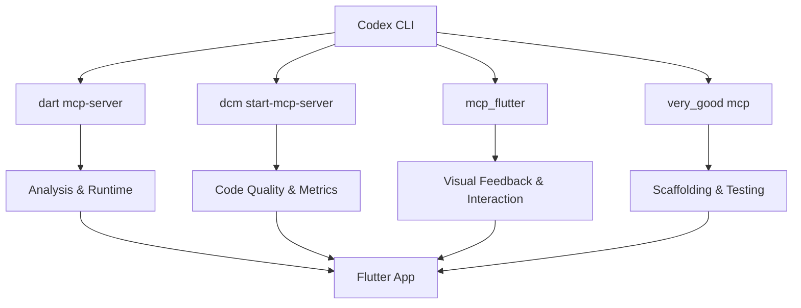
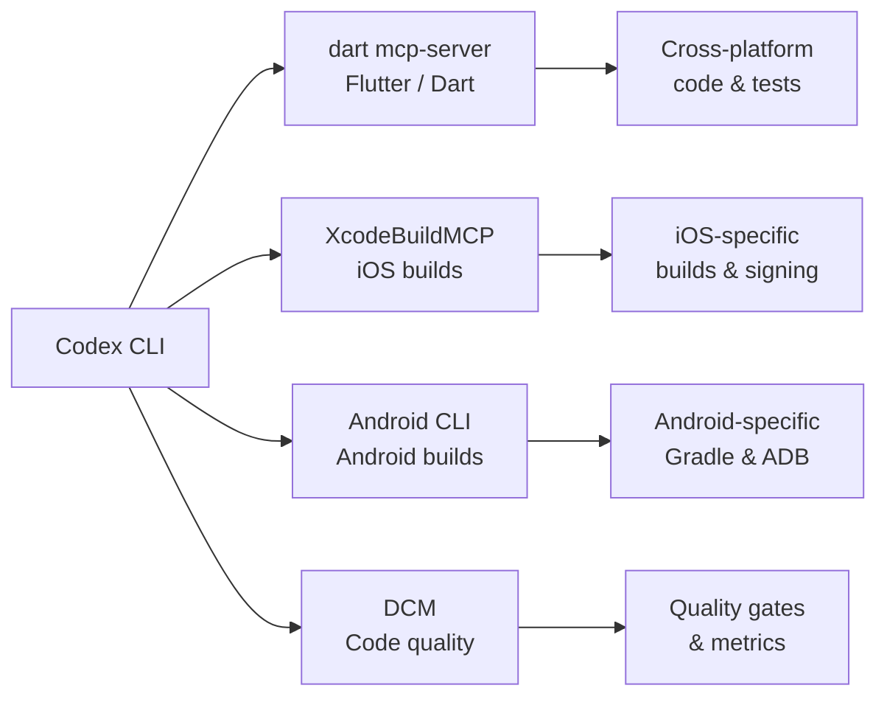

# Codex CLI for Flutter and Dart Development: MCP Servers, Widget Testing, and Cross-Platform Agent Workflows


---

Flutter 3.44 and Dart 3.12 ship with a first-party MCP server baked into the Dart SDK itself[^1]. Combined with community servers for code quality, visual feedback loops, and project scaffolding, Codex CLI now has deeper integration with Flutter than with almost any other cross-platform framework. This article maps the MCP server landscape, shows how to compose them in `config.toml`, and walks through four workflow patterns that exploit the unique characteristics of Flutter's widget tree, hot reload cycle, and multi-platform build targets.

## The MCP Server Landscape for Flutter

Four servers matter for Codex CLI users working with Flutter. Each occupies a distinct layer of the development stack.

### 1. Official Dart and Flutter MCP Server

The official server ships with Dart SDK 3.9+ and is invoked via `dart mcp-server`[^1]. It exposes tools across five categories:

- **Code analysis** — query the Dart analyser, resolve symbols, fetch documentation and signatures
- **Runtime introspection** — connect to a running Flutter app, inspect the widget tree, read runtime errors
- **Package management** — search pub.dev (`pub_dev_search`), manage dependencies in `pubspec.yaml`
- **Testing** — run tests and parse results programmatically
- **Formatting** — apply `dart format` rules via the analysis server

The server uses stdio transport and requires MCP client support for Tools and Resources[^1]. For clients that claim Roots support but do not set them (including Codex CLI), the `--force-roots-fallback` flag is essential.

### 2. DCM MCP Server

DCM (Dart Code Metrics) v1.37 provides a dedicated MCP server for code quality[^2]. Where the official server handles runtime and language tooling, DCM focuses on static analysis: unused code detection, unused file scanning, dependency hygiene, widget complexity metrics, image asset analysis, and baseline generation for incremental adoption[^3].

### 3. mcp_flutter (Visual Feedback Toolkit)

The `mcp_flutter` package by Arenukvern closes the visual feedback loop that text-only agents cannot reach[^4]. Version 3 provides semantic snapshots, widget tapping, form input, hot reload triggering, render tree dumps, performance rebuild monitoring, and — crucially — dynamic tool registration at runtime. A Flutter app can expose custom MCP tools while running, letting the agent interact with domain-specific UI states.

### 4. Very Good CLI MCP Server

Very Good Ventures' CLI (v1.0) exposes project scaffolding, test execution with coverage enforcement, dependency management, and licence compliance checking as MCP tools[^5]. Run `very_good mcp` to start the server. It provides opinionated project templates that encode VGV's testing and architecture standards.

## Composing Servers in config.toml

All four servers serve complementary roles. Configure them in `.codex/config.toml` at project level:

```toml
[mcp_servers.dart]
command = "dart"
args = ["mcp-server", "--force-roots-fallback"]

[mcp_servers.dcm]
command = "dcm"
args = ["start-mcp-server", "--force-roots-fallback", "--client=codex"]

[mcp_servers.mcp_flutter]
command = "dart"
args = ["run", "mcp_flutter"]

[mcp_servers.very_good]
command = "very_good"
args = ["mcp"]
```

The naming convention matters: the section must be `mcp_servers` (underscore, not hyphen), and each server name must be unique[^6].



## AGENTS.md for Flutter 3.44 / Dart 3.12 Projects

An `AGENTS.md` file anchors the agent to current APIs and prevents hallucination of deprecated patterns:

```markdown
# AGENTS.md — Flutter 3.44 / Dart 3.12

## Stack
- Flutter 3.44.0, Dart 3.12.0
- State management: Riverpod 3.x (prefer `@riverpod` code generation)
- Navigation: GoRouter 15.x (declarative routes only)
- Rendering: Impeller (default, do not reference Skia)

## Conventions
- Target: Android 14+, iOS 17+, web, macOS 15+
- Null safety is mandatory — never use `!` without documenting why
- Tests: widget tests for every screen, golden tests for design-critical components
- Use `dart format` (enforced by CI, 80-char line width)
- Prefer `const` constructors wherever possible
- Package imports only — never use relative imports

## Anti-Hallucination Rules
- MaterialApp.router is the only app entry pattern (not MaterialApp with onGenerateRoute)
- BuildContext extensions replaced Navigator.of(context) — use GoRouter
- Impeller is the only renderer from Flutter 3.38+ — do not reference Skia flags
- flutter_test is the test framework — do not import package:test directly
```

## Workflow Patterns

### Pattern 1: Screen Generation with Widget Test Loop

The most common Flutter agent workflow generates a screen and validates it through the analyser and widget tests in a single pass:

```bash
codex -q "Create a ProfileScreen with Riverpod state management. \
  Use the dart MCP server to run the analyser after generating the code. \
  Write a widget test that pumps the screen with a ProviderScope \
  and verifies the user's display name renders. \
  Run the test via the MCP server and fix any failures."
```

The official MCP server's test-running tool returns structured results, so the agent can parse failures and iterate without human intervention. This tight loop — generate, analyse, test, fix — typically converges in two to three iterations for a standard screen[^7].

### Pattern 2: Code Quality Audit with DCM

DCM's MCP server enables batch quality sweeps that would otherwise require manual `dcm analyze` invocations:

```bash
codex -q "Use the DCM MCP server to scan this project for unused code, \
  unused files, and widget complexity violations. \
  Generate a report as QUALITY_AUDIT.md. \
  For any file with widget complexity above 15, \
  extract the complex widget into a separate file and re-run the scan."
```

DCM's baseline feature is particularly useful here — the agent can generate a baseline on the first run, then target only new violations in subsequent passes[^3].

### Pattern 3: Visual Feedback Loop with mcp_flutter

For UI-intensive work, `mcp_flutter` provides what text-only analysis cannot: visual confirmation that a widget renders correctly on device:

```bash
codex -q "Connect to the running Flutter app via mcp_flutter. \
  Take a semantic snapshot of the HomeScreen. \
  The FAB should be positioned bottom-right with a gradient background. \
  If the snapshot shows it's missing or mispositioned, \
  fix the layout and trigger hot reload. \
  Take another snapshot to confirm."
```

The closed feedback loop — snapshot, assess, edit, hot reload, re-snapshot — mirrors how a human developer uses the simulator, but runs autonomously[^4].

### Pattern 4: Multi-Platform Build Validation with codex exec

Flutter's cross-platform promise means a change that works on iOS may break on web or macOS. Use `codex exec` to validate across targets:

```bash
codex exec "Run flutter test on all platforms. \
  Then run flutter build web --release and flutter build macos --release. \
  Report any platform-specific failures. \
  If web builds fail due to dart:io imports, \
  refactor the affected code to use conditional imports."
```

This pattern exploits Codex CLI's ability to run long-lived tasks and handle multi-step remediation[^8].

## Model Selection

Flutter development generates substantial context from widget trees, generated code (Riverpod, Freezed, json_serializable), and test files. Model recommendations:

| Task | Model | Rationale |
|------|-------|-----------|
| Screen generation with tests | GPT-5.5 | Large context for widget trees and generated code[^9] |
| Code quality audit | o4-mini | Fast, cost-effective for rule-based analysis[^9] |
| Visual feedback loops | GPT-5.5 | Needs to reason about layout descriptions[^9] |
| Dependency updates | o4-mini | Straightforward package resolution[^9] |

## Sandbox Considerations

Flutter development has specific sandbox requirements that differ from typical Node or Python projects:

- **Network access** — `flutter pub get` and `pub_dev_search` require network. Use `full-auto` approval mode for dependency resolution, or pre-fetch dependencies before entering the sandbox[^10]
- **Emulator/simulator** — runtime introspection via the official MCP server requires a running app, which means an emulator or simulator must be accessible outside the sandbox. The `mcp_flutter` server connects via the Dart VM service protocol on a localhost port
- **Build artefacts** — `build/` directories for multiple platforms (Android, iOS, web, macOS, Linux) can consume significant disc space. Consider `.codexignore` entries for `build/` and `.dart_tool/`
- **Code generation** — packages like `build_runner` require write access to `lib/` and produce `.g.dart` / `.freezed.dart` files. Ensure `workspace-write` mode is enabled for projects using code generation

## Known Limitations

- **Codex CLI handshake timeout** — there is an open issue (GitHub #13766) where the Dart MCP server's handshake does not complete with Codex CLI in some configurations[^11]. The workaround is to ensure Dart SDK 3.12+ and use `--force-roots-fallback`
- **Training data lag** — models may not know Flutter 3.44 APIs (released May 2026). The `AGENTS.md` file and MCP server's symbol resolution tool mitigate this
- **Impeller-only rendering** — since Flutter 3.38, Skia is no longer available[^12]. Agents trained on older Flutter versions may suggest Skia-specific flags or workarounds that no longer apply
- **DCM is commercial** — DCM requires a licence for teams. The MCP server is available from v1.31.0+ but the underlying tool is not open source[^2]
- **mcp_flutter maturity** — version 3 is functional but the project is community-maintained with a single primary contributor[^4]
- **Platform-specific builds** — iOS builds require Xcode on macOS; Android builds require the Android SDK. These cannot run inside Codex CLI's default sandbox

## Composing with Platform-Specific MCP Servers

For teams targeting iOS and Android natively alongside Flutter, the Dart MCP server composes well with platform-specific servers covered in earlier articles:



This composition lets an agent scaffold a Flutter feature, run cross-platform tests via the Dart server, validate iOS signing via XcodeBuildMCP[^13], and check Android-specific Gradle configuration via Android CLI[^14] — all in a single `codex exec` session.

## Citations

[^1]: [Dart and Flutter MCP Server — Official Documentation](https://docs.flutter.dev/ai/mcp-server)
[^2]: [DCM MCP Server Documentation](https://dcm.dev/docs/ide-integrations/mcp-server/)
[^3]: [Agentic Code Quality with DCM MCP — DCM Blog](https://dcm.dev/blog/2025/08/25/agentic-code-quality-dcm-mcp/)
[^4]: [mcp_flutter — GitHub (Arenukvern)](https://github.com/Arenukvern/mcp_flutter)
[^5]: [Very Good CLI MCP Server — Very Good Ventures Blog](https://verygood.ventures/blog/very-good-cli-mcp-server-flutter-ai-tools/)
[^6]: [Codex CLI MCP Configuration — OpenAI Developers](https://developers.openai.com/codex/mcp)
[^7]: [Create with AI — Flutter Official Docs](https://docs.flutter.dev/ai/create-with-ai)
[^8]: [Codex CLI Features — OpenAI Developers](https://developers.openai.com/codex/cli)
[^9]: [Codex CLI Model Selection — OpenAI Developers](https://developers.openai.com/codex/config-basic)
[^10]: [Codex CLI Sandbox Configuration — OpenAI Developers](https://developers.openai.com/codex/config-sample)
[^11]: [Codex CLI MCP Handshake Timeout with Dart MCP Server — GitHub Issue #13766](https://github.com/openai/codex/issues/13766)
[^12]: [Flutter 3.38 Release Notes — Impeller Default](https://docs.flutter.dev/release/release-notes)
[^13]: [XcodeBuildMCP — GitHub (getsentry)](https://github.com/nicklama/XcodeBuildMCP)
[^14]: [Android CLI — Android Developers](https://developer.android.com/studio/command-line)
