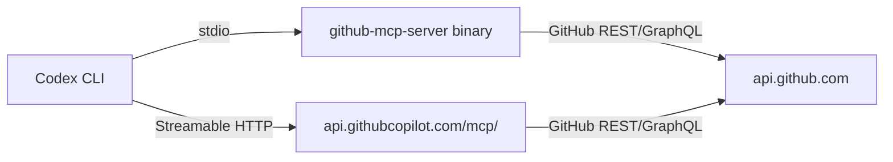
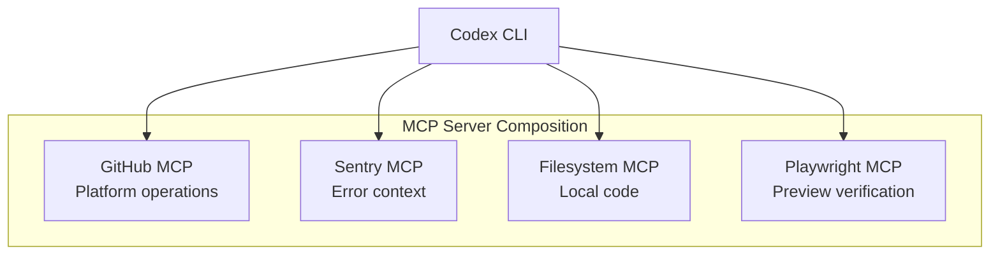

# Codex CLI with the GitHub MCP Server: Issues, Pull Requests, Actions, and Platform Automation


---

## Introduction

The GitHub MCP server (`github/github-mcp-server`) gives Codex CLI native access to GitHub's platform API — repositories, issues, pull requests, Actions workflows, code security alerts, and more — through 162+ tools organised into configurable toolsets[^1]. Rather than shelling out to `gh` or writing one-off scripts, you can let the agent read context, triage issues, review PRs, and trigger deployments in a single conversational session.

This article covers the server's architecture, Codex CLI configuration for both the remote and self-hosted variants, toolset selection strategy, and four production workflow patterns that exploit the integration.

---

## Architecture and Transport Options

The GitHub MCP server ships in two deployment modes:

1. **Remote (GitHub-hosted)** — Streamable HTTP at `https://api.githubcopilot.com/mcp/`, authenticated via OAuth or a Personal Access Token (PAT)[^2].
2. **Local (self-hosted)** — A Go binary or Docker container communicating over stdio, or optionally exposed as a Streamable HTTP service on a custom port[^3].



The remote endpoint is simplest for individual developers — no binary to manage, automatic updates, and OAuth scope filtering handled server-side. The self-hosted path suits enterprise environments requiring network isolation, custom middleware, or audit logging via the `--scope-challenge` and `--base-url` flags[^3].

---

## Codex CLI Configuration

### Remote Server (Recommended)

Edit `~/.codex/config.toml`:

```toml
[mcp_servers.github]
url = "https://api.githubcopilot.com/mcp/"
bearer_token_env_var = "GITHUB_PAT_TOKEN"
```

Or use the CLI shorthand:

```bash
codex mcp add github --url https://api.githubcopilot.com/mcp/
codex mcp login github   # OAuth flow — preferred over PAT
```

Verify with `/mcp` in the TUI to confirm tools are loaded[^4].

### Local Server via Docker

```toml
[mcp_servers.github]
command = "docker"
args = [
  "run", "--rm", "-i",
  "-e", "GITHUB_PERSONAL_ACCESS_TOKEN",
  "-e", "GITHUB_TOOLSETS=repos,issues,pull_requests,actions,code_security",
  "ghcr.io/github/github-mcp-server:latest"
]

[mcp_servers.github.env]
GITHUB_PERSONAL_ACCESS_TOKEN = "${GITHUB_PAT_TOKEN}"
```

### Local Server via Streamable HTTP

For shared or containerised deployments, run the binary in HTTP mode:

```bash
github-mcp-server http --scope-challenge --base-url https://mcp.internal.corp
```

Then point Codex at the internal endpoint:

```toml
[mcp_servers.github]
url = "https://mcp.internal.corp"
bearer_token_env_var = "GITHUB_PAT_TOKEN"
http_headers = { "X-MCP-Toolsets" = "default,actions,code_security" }
```

---

## Toolset Selection Strategy

The server organises its 162+ tools into toolsets[^1]. Loading everything floods the context window; selective enablement keeps token usage lean and improves tool-choice accuracy.

### Default Toolsets (Auto-Enabled)

| Toolset | Purpose | Key Tools |
|---------|---------|-----------|
| `context` | User/org identity | `get_me`, `get_teams` |
| `repos` | Repository operations | `get_file_contents`, `list_commits`, `push_files`, `search_repositories` |
| `issues` | Issue CRUD | `issue_read`, `issue_write`, `add_issue_comment` |
| `pull_requests` | PR lifecycle | `pull_request_read`, `merge_pull_request`, `create_pull_request` |
| `users` | User search | `search_users` |

### Optional Toolsets (Explicitly Enabled)

| Toolset | Purpose | When to Enable |
|---------|---------|----------------|
| `actions` | CI/CD workflows | Deployment automation, workflow debugging |
| `code_security` | Scanning alerts | Security triage, dependency audits |
| `secret_protection` | Secret scanning | Credential rotation workflows |
| `projects` | Projects V2 boards | Sprint planning, backlog grooming |
| `discussions` | Discussions forum | Community management |
| `labels` | Label management | Triage automation |
| `gists` | Gist CRUD | Snippet sharing |
| `git` | Low-level Git API | Tree manipulation, blob access |

### Remote-Only Toolsets

| Toolset | Purpose |
|---------|---------|
| `copilot` | Copilot interactions (`assign_copilot_to_issue`) |
| `github_support_docs_search` | GitHub product documentation search |

### Filtering in config.toml

Use `enabled_tools` and `disabled_tools` for granular control, and `default_tools_approval_mode` to gate destructive operations:

```toml
[mcp_servers.github]
url = "https://api.githubcopilot.com/mcp/"
bearer_token_env_var = "GITHUB_PAT_TOKEN"
enabled_tools = ["issue_read", "issue_write", "pull_request_read", "merge_pull_request"]
default_tools_approval_mode = "prompt"

[mcp_servers.github.tools.merge_pull_request]
approval_mode = "approve"
```

This configuration exposes only four tools and forces an explicit approval step before any merge — suitable for production repositories[^4].

---

## PAT Scope Selection

Apply the principle of least privilege. Start with:

| Scope | Unlocks |
|-------|---------|
| `repo` | Repository read/write, issues, PRs |
| `workflow` | Actions trigger and logs |
| `read:org` | Organisation and team context |
| `project` | Projects V2 board access |

Expand only when a tool request returns a 403[^2]. For OAuth via `codex mcp login`, the server advertises required scopes automatically.

---

## Workflow Patterns

### Pattern 1: Issue Triage with Label Assignment

```
> Review open issues in danielvaughan/codex-resources labelled "needs-triage".
  For each, read the body, suggest a priority label (P0–P3), and add a comment
  summarising the issue for the team.
```

The agent calls `issue_read` to list and filter, analyses each body, then calls `issue_write` to apply labels and `add_issue_comment` to post the summary. With the `labels` toolset enabled, it can create missing labels on the fly.

### Pattern 2: PR Review and Feedback Loop

```
> Review PR #42 in my-org/backend. Check the diff for security issues,
  suggest improvements, and post a review with line comments.
```

Codex uses `pull_request_read` to fetch the diff, applies its reasoning to identify issues, then submits structured review comments. Pair this with the `code_security` toolset to cross-reference any open Dependabot or code-scanning alerts on the same files.

### Pattern 3: Actions Workflow Debugging

```
> The deploy workflow in my-org/frontend failed on the last 3 runs.
  Fetch the logs, identify the root cause, and suggest a fix.
```

With the `actions` toolset enabled, the agent calls `actions_list` and `actions_get` to retrieve run logs, identifies the failure pattern, and can even push a fix via `push_files` if given write access.

### Pattern 4: Batch Security Audit with `codex exec`

```bash
codex exec --output-schema '{"alerts": [{"severity": "string", "tool": "string", "path": "string"}]}' \
  "List all critical and high code-scanning alerts in my-org/api-gateway. Include the tool name and file path."
```

This non-interactive invocation produces structured JSON suitable for piping into a dashboard or alerting system[^5].

---

## Composing with Other MCP Servers

The GitHub MCP server pairs naturally with complementary servers:



A typical full-stack workflow:

1. **Sentry MCP** surfaces a new error with stack trace
2. **GitHub MCP** creates an issue with reproduction steps
3. **Filesystem MCP** reads the relevant source files
4. Codex proposes a fix
5. **GitHub MCP** pushes a branch and opens a PR
6. **Playwright MCP** verifies the fix in a preview environment
7. **GitHub MCP** merges the PR after approval

---

## AGENTS.md Addendum for GitHub MCP Projects

Add these rules to your repository's `AGENTS.md` to guide agent behaviour:

```markdown
## GitHub MCP Rules

- Never force-push or delete branches without explicit approval
- Always check CI status via `actions_list` before merging
- Apply labels from the existing set — do not create new labels without asking
- When creating issues, always include reproduction steps and environment details
- PR descriptions must reference the originating issue number
- Never merge PRs with failing checks or unresolved review threads
```

---

## Security Considerations

- **Token exposure**: Store PATs in environment variables, never in `config.toml` values directly. Use `bearer_token_env_var` to reference the variable name[^4].
- **Scope creep**: The `all` toolset keyword enables everything — avoid in production. Prefer explicit toolset lists.
- **Approval gating**: Set `approval_mode = "approve"` on destructive tools (`merge_pull_request`, `push_files`, `actions_run_trigger`) to prevent unintended mutations[^4].
- **Read-only mode**: Pass `X-MCP-Readonly: true` as an HTTP header to disable all write operations entirely[^3].
- **Sandbox considerations**: The remote server requires network access. In Codex CLI's default sandbox mode, ensure network is permitted for MCP server communication.

---

## Limitations

- **Context budget**: Loading all 162+ tools consumes significant context. Enable only the toolsets you need for each workflow[^1].
- **Rate limiting**: The server proxies GitHub's API rate limits (5,000 requests/hour for authenticated users). Batch operations on large repositories may hit this ceiling.
- **Training data lag**: Codex models may not know about recently added tools or toolsets. The `/mcp` command in the TUI shows the live tool inventory.
- **OAuth vs PAT**: OAuth via `codex mcp login` is smoother but requires browser interaction — unsuitable for headless CI. Use PATs for non-interactive pipelines.
- **No webhook integration**: The server provides pull-based access only. For event-driven workflows, combine with GitHub Actions triggers.
- **Enterprise Server support**: The self-hosted binary supports GitHub Enterprise Server but requires explicit `--gh-host` configuration[^2].

---

## Citations

[^1]: GitHub, "GitHub MCP Server — Toolsets Documentation," github.com/github/github-mcp-server, accessed May 2026. [https://github.com/github/github-mcp-server](https://github.com/github/github-mcp-server)

[^2]: GitHub, "Installation Guide for OpenAI Codex," github.com/github/github-mcp-server/docs/installation-guides/install-codex.md, accessed May 2026. [https://github.com/github/github-mcp-server/blob/main/docs/installation-guides/install-codex.md](https://github.com/github/github-mcp-server/blob/main/docs/installation-guides/install-codex.md)

[^3]: GitHub, "Streamable HTTP Documentation," github.com/github/github-mcp-server/docs/streamable-http.md, accessed May 2026. [https://github.com/github/github-mcp-server/blob/main/docs/streamable-http.md](https://github.com/github/github-mcp-server/blob/main/docs/streamable-http.md)

[^4]: OpenAI, "Model Context Protocol — Codex Developer Documentation," developers.openai.com/codex/mcp, accessed May 2026. [https://developers.openai.com/codex/mcp](https://developers.openai.com/codex/mcp)

[^5]: OpenAI, "Codex CLI Reference — Command Line Options," developers.openai.com/codex/cli/reference, accessed May 2026. [https://developers.openai.com/codex/cli/reference](https://developers.openai.com/codex/cli/reference)
