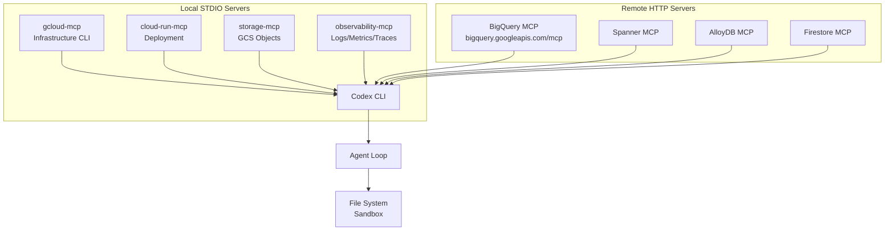
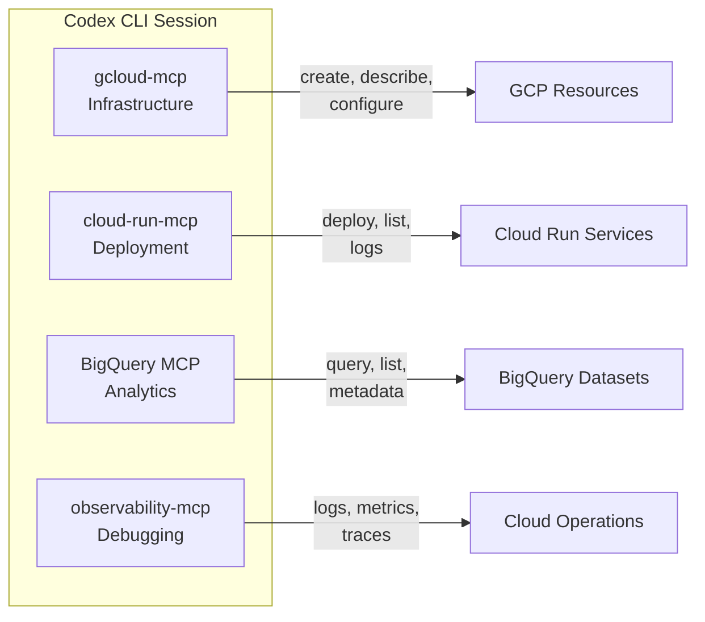
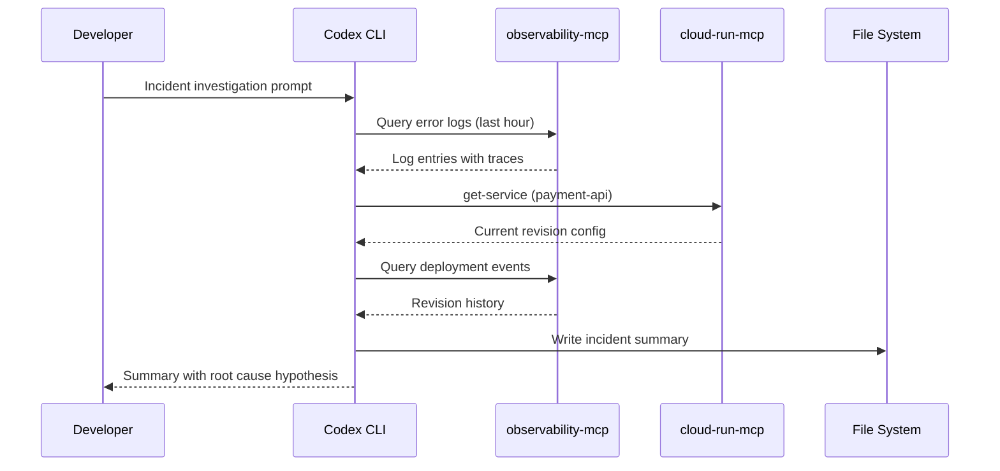

# Codex CLI for Google Cloud Platform Development: gcloud MCP, BigQuery, Cloud Run, and Infrastructure Agent Workflows


---

Google Cloud Platform now ships a rich set of MCP servers covering infrastructure management, data analytics, databases, and deployment — yet no single guide connects them to Codex CLI's agent loop. With over 40 GCP products exposing MCP endpoints as of May 2026[^1], a well-configured Codex session can query BigQuery, deploy to Cloud Run, inspect logs, and manage storage without leaving the terminal. This article maps the key servers, shows the configuration, and walks through production-grade workflow patterns.

## The GCP MCP Landscape

Google's MCP strategy splits into two categories: **local STDIO servers** that wrap the `gcloud` CLI, and **fully managed remote HTTP servers** that run on Google's infrastructure[^1].



### Local STDIO Servers

The `@google-cloud/gcloud-mcp` package bundles four servers under one npm scope[^2]:

| Server | Purpose | Key tools |
|---|---|---|
| `gcloud-mcp` | Execute gcloud commands via natural language | `run_gcloud_command` with restricted command set |
| `observability-mcp` | Query Cloud Logging, Monitoring, and Trace | Log queries, metric reads, trace inspection |
| `storage-mcp` | Manage GCS buckets and objects | 20+ tools for object CRUD, IAM, lifecycle |
| `backupdr-mcp` | Backup and Disaster Recovery | 30+ tools for vaults, plans, restore operations |

The `cloud-run-mcp` server from GoogleCloudPlatform provides deployment-specific tools: `deploy-file-contents`, `deploy-local-folder`, `list-services`, `get-service`, and `get-service-log`[^3].

### Managed Remote HTTP Servers

Google's managed MCP servers run as remote HTTP endpoints — no local process needed. BigQuery's server at `https://bigquery.googleapis.com/mcp` uses OAuth 2.0 with IAM for authentication[^4]. Similar managed endpoints exist for Spanner, AlloyDB, Cloud SQL, Firestore, Bigtable, and Memorystore[^1].

## Configuration

### gcloud-mcp (STDIO)

```toml
[mcp_servers.gcloud]
command = "npx"
args = ["-y", "@google-cloud/gcloud-mcp"]
startup_timeout_sec = 30

[mcp_servers.gcloud.env]
GOOGLE_CLOUD_PROJECT = "my-project-id"
```

### Cloud Run MCP (STDIO)

```toml
[mcp_servers.cloud-run]
command = "npx"
args = ["-y", "@google-cloud/cloud-run-mcp"]
startup_timeout_sec = 20

[mcp_servers.cloud-run.env]
GOOGLE_CLOUD_PROJECT = "my-project-id"
GOOGLE_CLOUD_REGION = "europe-west1"
```

### BigQuery MCP (Remote HTTP)

BigQuery's managed server requires OAuth credentials rather than API keys[^4]. You need an OAuth client ID configured for your project:

```toml
[mcp_servers.bigquery]
url = "https://bigquery.googleapis.com/mcp"
bearer_token_env_var = "GCP_OAUTH_TOKEN"
tool_timeout_sec = 200
```

⚠️ The bearer token must carry the `https://www.googleapis.com/auth/bigquery` scope. For CI, a service account with the BigQuery Job User and BigQuery Data Viewer roles suffices; for interactive sessions, `gcloud auth print-access-token` can populate the variable, but tokens expire after 60 minutes.

### Observability MCP (STDIO)

```toml
[mcp_servers.observability]
command = "npx"
args = ["-y", "@google-cloud/gcloud-mcp", "--server", "observability"]
startup_timeout_sec = 30

[mcp_servers.observability.env]
GOOGLE_CLOUD_PROJECT = "my-project-id"
```

### Composing All Servers

A production `config.toml` or project-scoped `.codex/config.toml` can declare all servers together. Each server occupies its own tool namespace, so there are no collisions:



## AGENTS.md for GCP Projects

A GCP-focused `AGENTS.md` file prevents the agent from hallucinating deprecated APIs or incorrect IAM bindings:

```markdown
# AGENTS.md — GCP Project Conventions

## Stack
- Google Cloud Platform, project: `my-project-id`
- Cloud Run (2nd gen), region: `europe-west1`
- BigQuery dataset: `analytics.events`
- Cloud SQL (PostgreSQL 16) via AlloyDB
- Terraform for infrastructure, stored in `infra/`

## Rules
- NEVER use `gcloud` commands that modify IAM bindings without confirmation
- ALWAYS use `--format=json` when scripting gcloud output
- Cloud Run services MUST use `--no-allow-unauthenticated` unless explicitly required
- BigQuery queries MUST specify dataset explicitly — do not rely on default dataset
- Terraform changes go through `terraform plan` before `terraform apply`
- Use Workload Identity Federation, NEVER embed service account keys

## Anti-hallucination
- Cloud Run 2nd gen uses Cloud Run execution environment v2 — do not reference 1st gen APIs
- BigQuery ML syntax changed in 2025 — verify against current documentation
- AlloyDB Omni is the on-prem variant; AlloyDB is the managed service
- gcloud-mcp is in preview — commands may change between versions
```

## Workflow Patterns

### Pattern 1: Cloud Run Deployment with Log Verification

This pattern uses the Cloud Run MCP server to deploy, then switches to the observability server to verify the deployment succeeded:

```bash
codex -q "Deploy the service in ./api to Cloud Run as 'order-api' \
  in europe-west1. After deployment, check the service logs for \
  the last 5 minutes and confirm no error-level entries. \
  If errors exist, show me the stack traces."
```

The agent calls `deploy-local-folder` via cloud-run-mcp, waits for the deployment to complete, then queries Cloud Logging via observability-mcp for `severity>=ERROR` entries. The entire loop runs without human intervention in `auto-edit` approval mode.

### Pattern 2: BigQuery Schema Exploration and Query Generation

```bash
codex -q "List all tables in the analytics dataset, describe the \
  'events' table schema, then write a SQL query that calculates \
  daily active users for the past 30 days. Execute it and save \
  the results to results/dau-report.csv."
```

The BigQuery MCP server provides `list_datasets`, `list_tables`, `get_table_metadata`, and `execute_sql_readonly` tools[^4]. Note the 3-minute query timeout and 3,000-row result cap on the managed server — queries that exceed either limit are cancelled[^4].

### Pattern 3: Infrastructure Audit with gcloud-mcp

```bash
codex exec "Audit all Cloud Run services in project 'my-project-id': \
  list services, check each for public access (allUsers IAM binding), \
  verify each has a minimum of 1 instance (no scale-to-zero for \
  production), and output a markdown report to audit/cloud-run-audit.md" \
  --output-schema '{"report_path": "string", "services_checked": "number", "issues_found": "number"}'
```

Using `codex exec` with `--output-schema` produces structured JSON alongside the markdown report — useful for feeding into dashboards or alerting pipelines[^5].

### Pattern 4: Incident Investigation Pipeline

When a production alert fires, compose observability and gcloud servers for rapid triage:

```bash
codex -q "An alert fired for high error rate on 'payment-api' \
  Cloud Run service. Investigation steps: \
  1. Query Cloud Logging for ERROR and CRITICAL entries in the last hour \
  2. Check the latest Cloud Run revision's configuration \
  3. Compare the current revision with the previous one \
  4. Check if any recent deployments correlate with the error spike \
  5. Summarise findings in incident-notes/$(date +%Y%m%d)-payment-api.md"
```



## Model Selection for GCP Workflows

| Task type | Recommended model | Rationale |
|---|---|---|
| Infrastructure audits, IAM reviews | `gpt-5.5` | Complex policy reasoning across multiple services[^6] |
| Cloud Run deployment, routine ops | `o4-mini` | Sufficient for straightforward command execution |
| BigQuery query generation | `gpt-5.5` | SQL generation benefits from stronger reasoning |
| Log analysis, incident triage | `gpt-5.5` | Pattern recognition across unstructured log data |

## Sandbox Considerations

GCP MCP servers require network access to reach Google APIs. The default `workspace-write` sandbox blocks outbound connections, so you need to enable network access explicitly:

```toml
[sandbox_workspace_write]
network_access = true
```

For the STDIO servers (`gcloud-mcp`, `cloud-run-mcp`), the `gcloud` CLI must be installed and authenticated in the sandbox environment. If running in a container or CI environment, mount the `gcloud` credential directory:

```bash
# Ensure gcloud credentials are available
gcloud auth application-default login
```

The BigQuery managed HTTP server handles authentication via the bearer token, so it works regardless of local `gcloud` installation — but the token must be refreshed for sessions longer than 60 minutes.

### Security Notes

- The `gcloud-mcp` server restricts which `gcloud` commands can be executed to prevent destructive operations[^2]. However, the restricted command list is maintained by the server, not by Codex's sandbox — treat it as defence in depth, not a sole guardrail.
- For enterprise environments, use service account impersonation with minimal IAM roles rather than user credentials[^2].
- The `cloud-run-mcp` server's `SKIP_IAM_CHECK` flag should never be set in production[^3].

## Composing GCP Servers with Other MCP Servers

A realistic GCP project likely needs the GitHub MCP server for PR workflows and the filesystem server for local operations alongside the GCP servers:

```toml
# GCP infrastructure
[mcp_servers.gcloud]
command = "npx"
args = ["-y", "@google-cloud/gcloud-mcp"]

[mcp_servers.cloud-run]
command = "npx"
args = ["-y", "@google-cloud/cloud-run-mcp"]

[mcp_servers.bigquery]
url = "https://bigquery.googleapis.com/mcp"
bearer_token_env_var = "GCP_OAUTH_TOKEN"

# Development tools
[mcp_servers.github]
command = "npx"
args = ["-y", "@modelcontextprotocol/server-github"]
env_vars = ["GITHUB_TOKEN"]
```

This composition gives the agent infrastructure control, deployment capability, analytics access, and source control management in a single session — the full inner loop for a GCP-native team.

## Limitations

- **gcloud-mcp is in preview**: The server is not officially supported by Google Cloud and may see breaking changes between versions[^2].
- **BigQuery result caps**: The managed BigQuery MCP server limits results to 3,000 rows and queries to 3 minutes[^4]. For larger result sets, write results to a destination table and export separately.
- **OAuth token expiry**: Bearer tokens for managed HTTP servers expire after 60 minutes. Long-running Codex sessions (especially goal-mode multi-hour sessions) need token refresh logic, which Codex does not handle natively. ⚠️
- **No Cloud Functions MCP server**: As of May 2026, there is no dedicated MCP server for Cloud Functions management — use `gcloud-mcp` with `gcloud functions` commands instead.
- **STDIO server startup cost**: Each `npx` invocation downloads and starts a Node.js process. On first run, expect 10–15 seconds of startup time. Subsequent runs use the npm cache.
- **Training data lag**: `gpt-5.5` training data may not include the latest GCP API changes. The `gcloud-mcp` server compensates by providing live command output, but AGENTS.md anti-hallucination rules remain essential[^6].
- **Terraform overlap**: If your infrastructure is managed by Terraform (covered in the [Terraform article](2026-05-25-codex-cli-terraform-development-mcp-server-state-inspection-drift-detection.md)), the `gcloud-mcp` server and the `terraform-mcp-server` may produce conflicting changes. Establish clear boundaries in AGENTS.md — typically Terraform owns infrastructure definitions while `gcloud` handles operational queries.

## Citations

[^1]: Google Cloud, "Google Cloud MCP servers overview — Supported products," docs.cloud.google.com/mcp/supported-products, accessed 25 May 2026.
[^2]: googleapis, "gcloud MCP server," github.com/googleapis/gcloud-mcp, accessed 25 May 2026. Apache-2.0 licensed, 799 stars, preview status.
[^3]: GoogleCloudPlatform, "Cloud Run MCP server," github.com/GoogleCloudPlatform/cloud-run-mcp, accessed 25 May 2026.
[^4]: Google Cloud, "Use the BigQuery MCP server," docs.cloud.google.com/bigquery/docs/use-bigquery-mcp, accessed 25 May 2026.
[^5]: OpenAI, "Codex CLI Features — codex exec and structured output," developers.openai.com/codex/cli/features, accessed 25 May 2026.
[^6]: OpenAI, "Codex CLI — Model selection," developers.openai.com/codex/cli, accessed 25 May 2026.
