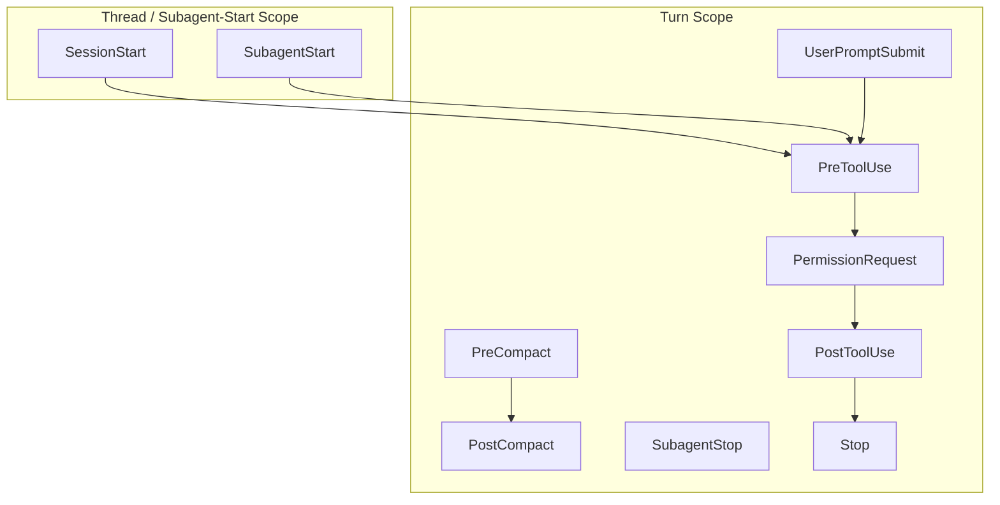

# Codex CLI Hooks After GA: The Complete Event Model, Trust Verification, and Production Patterns for v0.133


---

Codex CLI hooks reached general availability on 14 May 2026[^1]. Since then, three stable releases have shipped new hook events, a hash-based trust model, managed enterprise hooks, plugin-bundled hooks, and an in-TUI hook browser. The April-era documentation covered five events and a flat JSON format. The post-GA surface is substantially larger: ten lifecycle events, four configuration layers, a cryptographic trust chain, and enterprise enforcement through `requirements.toml`.

This article is the definitive post-GA reference. It replaces earlier pre-GA coverage with the complete v0.133 event model, trust verification mechanics, and production-tested patterns for secret scanning, context injection, compaction control, and subagent governance.

## Why Hooks Matter

Every agent session is a sequence of tool calls. Hooks inject deterministic scripts at precise points in that sequence — before a Bash command runs, after a file edit completes, when a subagent spawns, or as the context window compacts. Unlike prompt-based instructions that the model might ignore under context pressure, hooks execute as OS-level processes with guaranteed delivery[^2].

The core design principle: hooks are the control plane, not the data plane. They gate, audit, and enrich — they do not generate code.

## The Complete Event Model

Post-GA Codex CLI exposes ten lifecycle events across two scoping categories[^2]:



### Thread-Start Events

**SessionStart** fires when a session starts, resumes, clears, or compacts. The matcher filters on the trigger: `startup`, `resume`, `clear`, or `compact`. Plain-text stdout from this hook is injected as developer context into the conversation — making it the primary mechanism for dynamic context injection[^2].

**SubagentStart** fires when a child agent spawns. The input payload includes `agent_id` and `agent_type` (e.g. `"general-purpose"`, `"Explore"`, `"Plan"`)[^3]. SubagentStart hooks cannot block spawning, but they can inject `additionalContext` into the subagent's initial context — useful for enforcing per-agent security policies or injecting team-specific instructions.

### Turn-Scoped Events

**PreToolUse** intercepts tool calls before execution. This is the primary enforcement point. Hooks can[^2]:

- **Block** the call: return `"permissionDecision": "deny"` with a reason
- **Rewrite** the input: return `"permissionDecision": "allow"` with `updatedInput`
- **Add context**: return `"additionalContext"` without altering the call

The matcher regex filters on tool names: `Bash`, `apply_patch`, `Edit`, `Write`, or MCP tool identifiers like `mcp__filesystem__read_file`.

**PermissionRequest** fires during the approval flow. Multiple hooks can run; any `deny` decision wins. Missing decisions fall through to the normal interactive approval prompt[^2].

**PostToolUse** executes after tool output is captured. It cannot undo side effects, but it can replace the tool result with feedback via `"decision": "block"` — forcing the agent to reconsider. Exit code 2 with stderr text triggers the same blocking behaviour[^2].

**PreCompact / PostCompact** surround context compaction. A `PreCompact` hook returning `"continue": false` prevents the compaction entirely — critical for sessions where context loss would cause correctness failures. The matcher filters on `manual` or `auto` triggers[^2].

**UserPromptSubmit** fires before user prompts reach the model. Hooks can block submission with `"decision": "block"` and a reason, enabling prompt validation, PII scanning, or injection detection[^2].

**SubagentStop / Stop** fire at subagent and turn boundaries respectively. These support continuation decisions: returning `"decision": "block"` with a reason forces the agent to continue working rather than stopping[^2]. The input includes `last_assistant_message` and a `stop_hook_active` boolean indicating whether a prior continuation was triggered.

## Configuration Format

Hooks configure through a three-level hierarchy: event, matcher group, and handlers[^2].

### JSON Format

```json
{
  "hooks": {
    "PreToolUse": [
      {
        "matcher": "^Bash$",
        "hooks": [
          {
            "type": "command",
            "command": "python3 .codex/hooks/scan-bash.py",
            "statusMessage": "Scanning command...",
            "timeout": 30
          }
        ]
      }
    ],
    "SessionStart": [
      {
        "matcher": "startup|resume",
        "hooks": [
          {
            "type": "command",
            "command": "cat .codex/context/project-rules.txt"
          }
        ]
      }
    ]
  }
}
```

### TOML Format

The same configuration in `config.toml`:

```toml
[[hooks.PreToolUse]]
matcher = "^Bash$"

[[hooks.PreToolUse.hooks]]
type = "command"
command = "python3 .codex/hooks/scan-bash.py"
statusMessage = "Scanning command..."
timeout = 30

[[hooks.SessionStart]]
matcher = "startup|resume"

[[hooks.SessionStart.hooks]]
type = "command"
command = "cat .codex/context/project-rules.txt"
```

### Discovery Locations

Codex discovers hooks from four layers, merged in order[^2]:

1. `~/.codex/hooks.json` or `~/.codex/config.toml` — user level
2. `<repo>/.codex/hooks.json` or `<repo>/.codex/config.toml` — project level
3. Plugin manifests — default `hooks/hooks.json` within plugin root
4. `requirements.toml` managed hooks — enterprise/MDM level

Multiple matching hooks for the same event all run concurrently. No hook can prevent another matching hook from starting[^2].

## The Trust Model

The hash-based trust model is the most significant post-GA addition. It solves a fundamental supply-chain problem: repository-contributed hooks execute as arbitrary shell commands on the developer's machine.

### How Trust Works

When Codex encounters a non-managed hook for the first time, it computes a cryptographic hash of the hook definition and marks it as untrusted. The hook is skipped until explicitly reviewed and trusted[^2]. If a trusted hook's definition changes — even a single character in the command string — the hash no longer matches and the hook reverts to untrusted status, requiring re-review.

### Managing Trust

The `/hooks` slash command in the TUI provides a hook browser for inspecting, trusting, and disabling hooks[^4]. From the command line:

```bash
# Bypass trust for CI/CD environments (use with caution)
codex --dangerously-bypass-hook-trust exec "run the test suite"
```

The `--dangerously-bypass-hook-trust` flag skips trust verification without persisting trust records — designed for ephemeral CI runners where interactive review is impossible[^2].

### Trust Layers

User and system hooks load from their own trusted layers regardless of project trust status. Project-local hooks in `<repo>/.codex/` only load if that layer is trusted. Plugin hooks require separate trust verification — installing a plugin does not auto-trust its hooks[^2].

## Managed Hooks for Enterprise

Enterprise deployments need hooks that developers cannot disable. Managed hooks, configured through `requirements.toml`, bypass the individual trust review entirely[^2][^5].

```toml
# requirements.toml — deployed via MDM or config management
allow_managed_hooks_only = true

[features]
hooks = true

[hooks]
managed_dir = "/etc/codex/hooks"
windows_managed_dir = 'C:\ProgramData\codex\hooks'
```

Setting `allow_managed_hooks_only = true` ignores all user, project, and plugin hooks — only hooks from the managed directory and `requirements.toml` itself execute[^5]. This is the enforcement mechanism for regulated environments where hook tampering would violate compliance requirements.

Managed hook sources include system-level directories, MDM-deployed configurations, cloud-provisioned policies, and `requirements.toml` entries[^2].

## Plugin-Bundled Hooks

Plugins can ship hooks alongside their tool definitions. The default location is `hooks/hooks.json` within the plugin root, overridable via the `"hooks"` entry in `.codex-plugin/plugin.json`[^2].

Plugin hooks receive additional environment variables[^2]:

| Variable | Purpose |
|----------|---------|
| `PLUGIN_ROOT` | Filesystem path to the plugin directory |
| `PLUGIN_DATA` | Plugin-specific data directory |
| `CLAUDE_PLUGIN_ROOT` | Alias for cross-agent compatibility |
| `CLAUDE_PLUGIN_DATA` | Alias for cross-agent compatibility |

Plugin hooks still require trust verification — marketplace installation does not constitute trust approval. This prevents a compromised plugin from silently injecting hooks into the developer's workflow.

## Production Patterns

### Pattern 1: Secret Scanning with PreToolUse

Scan every Bash command for hardcoded secrets before execution:

```python
#!/usr/bin/env python3
"""PreToolUse hook: block Bash commands containing secrets."""
import json, re, sys

payload = json.load(sys.stdin)
tool_input = payload.get("tool_input", {})
command = tool_input.get("command", "")

SECRET_PATTERNS = [
    r'(?i)(api[_-]?key|secret|password|token)\s*=\s*["\'][^"\']{8,}',
    r'ghp_[A-Za-z0-9_]{36,}',
    r'sk-[A-Za-z0-9]{32,}',
    r'AKIA[0-9A-Z]{16}',
]

for pattern in SECRET_PATTERNS:
    if re.search(pattern, command):
        result = {
            "hookSpecificOutput": {
                "hookEventName": "PreToolUse",
                "permissionDecision": "deny",
                "permissionDecisionReason":
                    f"Blocked: command matches secret pattern [{pattern}]"
            }
        }
        json.dump(result, sys.stdout)
        sys.exit(0)

# No secrets found — allow
sys.exit(0)
```

Wire it in `hooks.json`:

```json
{
  "hooks": {
    "PreToolUse": [
      {
        "matcher": "^Bash$",
        "hooks": [
          {
            "type": "command",
            "command": "python3 .codex/hooks/secret-scan.py",
            "statusMessage": "Scanning for secrets...",
            "timeout": 10
          }
        ]
      }
    ]
  }
}
```

### Pattern 2: Context Injection with SessionStart

Inject project-specific rules and current sprint context at session start:

```bash
#!/usr/bin/env bash
# SessionStart hook: inject project context
echo "## Project Rules"
echo "- All new functions require JSDoc comments"
echo "- Use British English in user-facing strings"
echo "- Run 'npm test' before any commit suggestion"
echo ""
echo "## Current Sprint"
cat "$(git rev-parse --show-toplevel)/.codex/sprint-context.md" 2>/dev/null
```

Plain-text stdout from `SessionStart` hooks is automatically added as developer context[^2], making this the simplest way to keep the agent aligned with evolving team standards.

### Pattern 3: Compaction Guard with PreCompact

Prevent automatic compaction during critical multi-step workflows:

```python
#!/usr/bin/env python3
"""PreCompact hook: block auto-compaction during goal execution."""
import json, sys

payload = json.load(sys.stdin)
trigger = payload.get("trigger", "auto")

if trigger == "auto":
    # Check if a goal is active
    import subprocess
    result = subprocess.run(
        ["codex", "goal", "status"],
        capture_output=True, text=True, timeout=5
    )
    if "active" in result.stdout.lower():
        json.dump({"continue": False}, sys.stdout)
        sys.exit(0)

sys.exit(0)
```

### Pattern 4: Subagent Policy Injection with SubagentStart

Enforce security boundaries when subagents spawn:

```python
#!/usr/bin/env python3
"""SubagentStart hook: inject role-specific security context."""
import json, sys

payload = json.load(sys.stdin)
agent_type = payload.get("agent_type", "")

POLICIES = {
    "Explore": "Read-only exploration. Do not modify any files.",
    "general-purpose": "Follow all AGENTS.md rules. Test before committing.",
}

context = POLICIES.get(agent_type, "Follow standard project conventions.")

result = {
    "hookSpecificOutput": {
        "hookEventName": "SubagentStart",
        "additionalContext": context
    }
}
json.dump(result, sys.stdout)
```

### Pattern 5: Output Redaction with PostToolUse

Strip sensitive patterns from tool output before they enter the model's context:

```python
#!/usr/bin/env python3
"""PostToolUse hook: redact secrets from Bash output."""
import json, re, sys

payload = json.load(sys.stdin)
tool_response = payload.get("tool_response", "")

REDACT_PATTERNS = [
    (r'(sk-[A-Za-z0-9]{6})[A-Za-z0-9]+', r'\1***REDACTED***'),
    (r'(ghp_[A-Za-z0-9]{6})[A-Za-z0-9]+', r'\1***REDACTED***'),
    (r'(?i)(password["\s:=]+)[^\s"]+', r'\1***REDACTED***'),
]

redacted = tool_response
for pattern, replacement in REDACT_PATTERNS:
    redacted = re.sub(pattern, replacement, redacted)

if redacted != tool_response:
    result = {
        "hookSpecificOutput": {
            "hookEventName": "PostToolUse",
            "decision": "block",
            "reason": "Output contained sensitive data; redacted version provided."
        }
    }
    json.dump(result, sys.stdout)
else:
    sys.exit(0)
```

## Hook Input/Output Reference

Every hook receives a JSON payload on stdin with common fields[^2]:

| Field | Scope | Description |
|-------|-------|-------------|
| `session_id` | All | Current session identifier |
| `cwd` | All | Working directory |
| `hook_event_name` | All | Triggering event name |
| `model` | All | Active model slug |
| `permission_mode` | All | Current approval mode |
| `transcript_path` | All | Session transcript location (unstable) |
| `turn_id` | Turn-scoped | Current turn identifier |
| `tool_name` | PreToolUse, PostToolUse, PermissionRequest | Tool being invoked |
| `tool_input` | PreToolUse, PermissionRequest | Tool call parameters |
| `tool_response` | PostToolUse | Tool execution result |
| `agent_id` | SubagentStart, SubagentStop | Subagent identifier |
| `agent_type` | SubagentStart, SubagentStop | Agent role name |
| `last_assistant_message` | Stop, SubagentStop | Final agent output |
| `trigger` | PreCompact, PostCompact | `manual` or `auto` |
| `prompt` | UserPromptSubmit | User's prompt text |

Exit code semantics: 0 = success (continue), 2 = block with stderr as reason, non-zero (other) = hook failure (logged and skipped)[^2].

## Known Limitations

Several constraints are worth noting in the current implementation:

- **PreToolUse gaps**: hooks do not reliably fire for `apply_patch` edits, and MCP-dispatched tool calls have intermittent hook coverage[^6]
- **No async handlers**: the `"async": true` field parses but does not execute — all hooks run synchronously relative to the event[^2]
- **Prompt and agent handler types**: `"type": "prompt"` and `"type": "agent"` parse without error but are silently skipped — only `"type": "command"` executes[^2]
- **Concurrent execution**: multiple matching hooks for the same event run concurrently with no ordering guarantees and no ability to prevent other hooks from starting[^2]
- **Default timeout**: 600 seconds is generous enough to mask hung hook scripts in production — set explicit, short timeouts[^2]

## Migration from Pre-GA Hooks

Teams running hooks from before the May 14 GA release should:

1. **Review trust state**: run `/hooks` in the TUI to verify all project hooks are trusted against current definitions
2. **Add new events**: consider `SubagentStart` and `PreCompact`/`PostCompact` hooks — these were unavailable pre-GA
3. **Migrate to TOML**: inline hooks in `config.toml` collocate with other configuration and avoid managing a separate `hooks.json`
4. **Set explicit timeouts**: the 600-second default is too generous for production; 10-30 seconds covers most validation hooks
5. **Evaluate managed hooks**: enterprise teams should migrate enforcement hooks to `requirements.toml` for tamper resistance

## Conclusion

Hooks are the enforcement layer that turns Codex CLI from a powerful but unpredictable tool into a governed engineering platform. The post-GA event model — ten lifecycle events, hash-based trust, managed enterprise enforcement, and plugin-bundled extensibility — provides the primitives needed for production deployment at scale. The patterns in this article are starting points; the real value comes from encoding your team's specific engineering standards as deterministic, auditable hooks that execute regardless of model behaviour or context pressure.

## Citations

[^1]: OpenAI, "Changelog — Codex," developers.openai.com, 14 May 2026. [https://developers.openai.com/codex/changelog](https://developers.openai.com/codex/changelog)

[^2]: OpenAI, "Hooks — Codex," developers.openai.com, May 2026. [https://developers.openai.com/codex/hooks](https://developers.openai.com/codex/hooks)

[^3]: OpenAI, "Codex CLI v0.133.0 release notes," github.com/openai/codex, 21 May 2026. [https://github.com/openai/codex/releases/tag/v0.133.0](https://github.com/openai/codex/releases/tag/v0.133.0)

[^4]: OpenAI, "Codex CLI Features — Hooks," developers.openai.com, May 2026. [https://developers.openai.com/codex/cli/features](https://developers.openai.com/codex/cli/features)

[^5]: OpenAI, "Configuration Reference — Codex," developers.openai.com, May 2026. [https://developers.openai.com/codex/config-reference](https://developers.openai.com/codex/config-reference)

[^6]: Agentic Control Plane, "Codex CLI hook governance: what works today (and what doesn't)," agenticcontrolplane.com, May 2026. [https://agenticcontrolplane.com/blog/codex-cli-hooks-reference](https://agenticcontrolplane.com/blog/codex-cli-hooks-reference)
