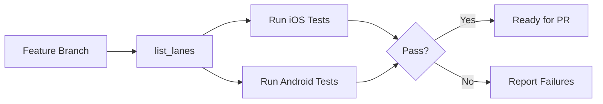
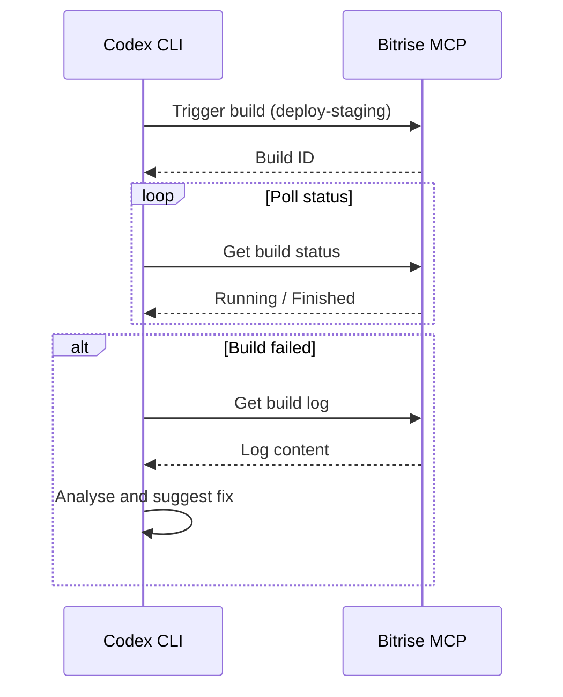
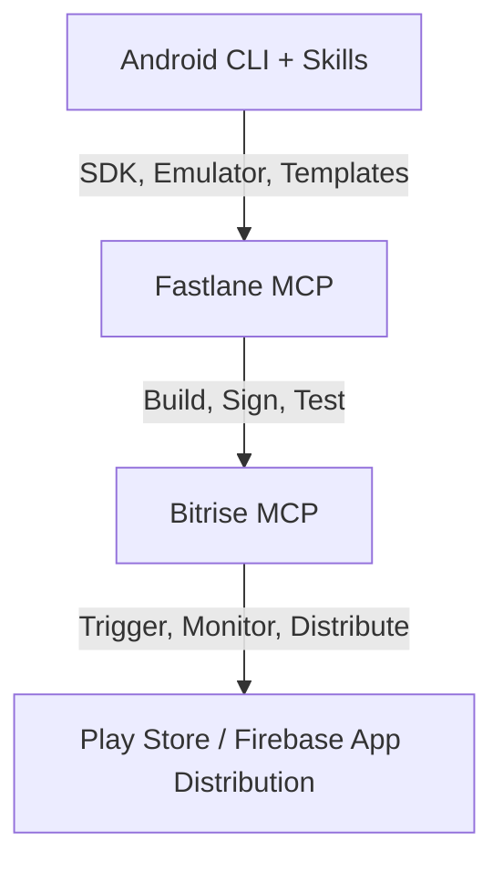

# Codex CLI for Mobile CI: Fastlane, Bitrise, and Agent-Driven Build Pipelines


---

Mobile CI/CD is a domain where everything is slightly harder than it ought to be. Code signing alone has broken more spirits than any algorithm. Fastlane has long been the automation workhorse for iOS and Android build pipelines, and Bitrise provides a mobile-first hosted CI platform with 300+ pre-built steps[^1]. Both now ship MCP servers, which means Codex CLI can orchestrate mobile builds, deployments, and troubleshooting through natural language — without you memorising every `match` invocation or Bitrise API endpoint.

This article covers how to wire both MCP servers into Codex CLI, write an AGENTS.md that keeps the agent honest about code signing and platform quirks, and build four practical workflow patterns from feature branch to TestFlight or Play Store.

## The MCP Servers

### Fastlane MCP Server

The `fastlane-mcp-server` from lyderdev[^2] exposes eight tools over STDIO transport:

| Tool | Purpose |
|------|---------|
| `build` | Build iOS/Android apps with configurable environments |
| `deploy_appcenter` | Distribute to AppCenter for testing |
| `firebase` | Firebase App Distribution and Crashlytics integration |
| `test` | Execute automated tests across devices and simulators |
| `manage_certificates` | Handle code signing certificates and provisioning profiles |
| `list_lanes` | Discover available Fastlane lanes in the project |
| `version_management` | Bump, set, or retrieve app versions and build numbers |
| `metadata_management` | Upload App Store metadata and screenshots |

A separate Python implementation (`fastlane-mcp` on PyPI) was released in January 2026 and requires Python 3.11+[^3]. The Node.js variant is more widely adopted in Codex CLI configurations due to STDIO compatibility.

### Bitrise MCP Server

Bitrise ships an official MCP server at `mcp.bitrise.io` as a remote Streamable HTTP endpoint, authenticated via a Personal Access Token (PAT)[^4]. The server exposes tools across twelve API groups — apps, builds, pipelines, artifacts, workspaces, release management, cache, CodePush, and more[^5]. It is free on all Bitrise plans.

Key capabilities:

- **Build operations** — trigger builds with custom environment variables, abort running builds, retrieve build logs and step statuses
- **Artifact management** — list, retrieve, and control public page access for build artefacts
- **Pipeline control** — list and manage multi-stage pipelines and workflows
- **Release management** — distribute installable artefacts, manage tester groups, track distribution versions
- **Configuration validation** — validate `bitrise.yml` files and search available build stacks

## Configuration

### config.toml — Fastlane MCP (STDIO)

```toml
[mcp_servers.fastlane]
command = "npx"
args = ["-y", "fastlane-mcp-server"]
env = { "FASTLANE_USER" = "ci@example.com" }
env_vars = ["MATCH_PASSWORD", "FASTLANE_APPLE_APPLICATION_SPECIFIC_PASSWORD"]
startup_timeout_sec = 15.0
tool_timeout_sec = 120.0
```

The `env_vars` directive forwards sensitive credentials from the parent environment without hardcoding them in the configuration[^6]. For `match`-based code signing, `MATCH_PASSWORD` must be available to decrypt the certificate repository.

### config.toml — Bitrise MCP (HTTP)

```toml
[mcp_servers.bitrise]
url = "https://mcp.bitrise.io"
headers = { "Authorization" = "Bearer ${BITRISE_PAT}" }
tool_timeout_sec = 90.0
```

Bitrise uses a remote Streamable HTTP transport[^4], so no local binary is needed. The PAT should have read/write access to the relevant workspace and applications.

### Composing Both Servers

For a project that builds locally with Fastlane and deploys through Bitrise, both servers coexist naturally:

```toml
[mcp_servers.fastlane]
command = "npx"
args = ["-y", "fastlane-mcp-server"]
env_vars = ["MATCH_PASSWORD", "FASTLANE_APPLE_APPLICATION_SPECIFIC_PASSWORD"]

[mcp_servers.bitrise]
url = "https://mcp.bitrise.io"
headers = { "Authorization" = "Bearer ${BITRISE_PAT}" }
```

This separation is deliberate: Fastlane handles the build mechanics (signing, compilation, testing), while Bitrise orchestrates the CI pipeline (triggering, monitoring, distributing). Codex CLI can call tools from either server within the same session.

## AGENTS.md for Mobile Projects

Mobile projects carry platform-specific traps that general-purpose agents regularly fall into. An AGENTS.md file at the repository root keeps Codex CLI aligned:

```markdown
# AGENTS.md — Mobile CI Project

## Code Signing
- NEVER generate new certificates or provisioning profiles without explicit approval.
  Use `match` for iOS — certificates live in the encrypted match repo.
- Android keystore files are NOT checked into this repo. The signing config
  references environment variables: `ANDROID_KEYSTORE_PATH`, `ANDROID_KEY_ALIAS`.
- Do NOT modify `ExportOptions.plist` or `build.gradle` signing blocks without
  asking first.

## Build Conventions
- iOS builds target Xcode 16.4 on macOS 15.5 (Sequoia). Do not assume older
  toolchain versions.
- Android builds use AGP 9.x on Java 21. Gradle wrapper version is pinned —
  do not upgrade without discussion.
- Minimum deployment targets: iOS 17.0, Android API 28.

## Anti-Hallucination Rules
- Fastlane lane names are defined in `fastlane/Fastfile` — read the file before
  invoking any lane. Do NOT guess lane names.
- Bitrise workflow names are defined in `bitrise.yml` — read before triggering.
- App Store Connect API keys are managed outside this repo. Do NOT attempt
  to create or rotate them.

## Testing
- Run `fastlane ios test` before any iOS release lane.
- Run `fastlane android test` before any Android release lane.
- UI tests require a running simulator/emulator — confirm availability first.
```

## Workflow Patterns

### 1. Build Verification on Feature Branch

The simplest pattern: validate that a feature branch compiles and passes tests on both platforms before opening a PR.

```bash
codex exec "Using the fastlane MCP server, list all available lanes, \
then run the iOS test lane and the Android test lane. \
Report any failures with the specific test names and error messages."
```



### 2. TestFlight Deployment via Fastlane

After tests pass, deploy a beta build to TestFlight. This pattern uses Fastlane's `pilot` action under the hood.

```bash
codex exec "Bump the iOS build number using the fastlane version_management tool, \
then run the 'beta' lane for iOS. \
Confirm the build was uploaded to TestFlight by checking the lane output for \
'Successfully uploaded' or an error message."
```

The agent will:
1. Call `version_management` to increment the build number
2. Call `build` or invoke the `beta` lane via `list_lanes` discovery
3. Parse the output for upload confirmation

⚠️ This assumes a `beta` lane exists in the Fastfile that handles signing via `match` and uploads via `pilot`. The AGENTS.md anti-hallucination rule ensures the agent reads the Fastfile first rather than guessing.

### 3. Bitrise Build Trigger and Log Analysis

When CI runs on Bitrise, you can trigger builds and analyse failures without leaving the terminal:

```bash
codex exec "Using the Bitrise MCP server: \
1. Trigger a build for the 'deploy-staging' workflow on the current branch. \
2. Wait for the build to complete (poll every 30 seconds). \
3. If the build fails, retrieve the build log and identify the root cause. \
4. Suggest a fix based on the error."
```



### 4. Batch Audit with `codex exec`

For teams managing multiple mobile apps, `codex exec` can audit build configurations across repositories:

```bash
codex exec --output-schema '{"apps": [{"name": "string", "ios_signing": "string", "android_min_sdk": "number", "last_successful_build": "string"}]}' \
"Using the Bitrise MCP server, list all apps in the workspace. \
For each app, check the latest successful build date, \
the iOS code signing method used, and the Android minimum SDK version. \
Return structured results."
```

The `--output-schema` flag produces machine-readable JSON that feeds into dashboards or compliance reports[^7].

## The Android CLI and Skills Ecosystem

Google's Android CLI, announced in April 2026, complements this stack by providing agent-optimised commands for SDK management, project creation, and emulator control[^8]. The `android skills` command exposes modular SKILL.md instruction sets covering Navigation 3 setup, AGP 9 migrations, and R8 configuration — reducing LLM token usage by over 70% compared to raw documentation context[^8].

For Android-heavy projects, combining the Android CLI skills with Fastlane MCP and Bitrise MCP creates a three-layer stack:



The Callstack `agent-device` tool adds a fourth layer for agents that need to interact directly with iOS Simulators and Android Emulators during QA workflows[^9].

## Model Selection

Mobile CI tasks vary in complexity:

| Task | Recommended Model | Rationale |
|------|-------------------|-----------|
| Build log analysis | gpt-5.5 | Long logs require large context and reasoning |
| Lane discovery and invocation | o4-mini | Straightforward tool calls, low latency |
| Code signing troubleshooting | gpt-5.5 | Signing errors require deep platform knowledge |
| Version bumping | o4-mini | Mechanical task, speed matters |
| Batch audits | o4-mini | High volume, structured output |

## Sandbox and Security Considerations

Mobile CI introduces specific sandbox concerns:

- **Network access** — Fastlane needs network access for `match` (certificate repo), App Store Connect, and Firebase. Run with `--full-auto` only in trusted CI environments; use `suggest` mode locally[^6].
- **Credential exposure** — `MATCH_PASSWORD`, Apple API keys, and Android keystores must never appear in agent output. Use `env_vars` rather than `env` in config.toml to avoid logging values.
- **Xcode command-line tools** — Fastlane invokes `xcodebuild` directly. The sandbox must have Xcode installed with accepted licence agreements.
- **Bitrise PAT scope** — Use a PAT with minimal permissions. Read-only access suffices for log analysis and monitoring; read/write is needed for build triggering and artefact management.
- **Build artefact size** — IPA and APK files can be several hundred megabytes. Ensure the working directory has sufficient disk space when using Fastlane locally.

## Limitations

- **Training data lag** — Codex CLI models may not know the latest Fastlane actions or Bitrise steps released after the training cutoff. The AGENTS.md anti-hallucination rules and `list_lanes` tool mitigate this.
- **No simulator/emulator control via MCP** — Neither MCP server can start or manage simulators directly. Use the Android CLI or `agent-device` for device interaction[^8][^9].
- **Bitrise build timeouts** — Long-running builds may exceed Codex CLI's default tool timeout. Set `tool_timeout_sec` generously for build-trigger tools.
- **Code signing complexity** — Agents can invoke `match` but cannot resolve entitlement conflicts or provisioning profile mismatches that require Apple Developer Portal interaction beyond API scope.
- **Fastlane MCP maturity** — The Node.js Fastlane MCP server is community-maintained, not an official Fastlane project. Verify tool behaviour against your Fastfile before relying on it in production pipelines.

## Citations

[^1]: [Bitrise — Mobile DevOps Platform](https://bitrise.io/)
[^2]: [lyderdev/fastlane-mcp-server — GitHub](https://github.com/lyderdev/fastlane-mcp-server)
[^3]: [fastlane-mcp — PyPI](https://pypi.org/project/fastlane-mcp/)
[^4]: [Bitrise MCP Documentation](https://docs.bitrise.io/en/bitrise-platform/ai/bitrise-mcp.html)
[^5]: [bitrise-io/bitrise-mcp — GitHub](https://github.com/bitrise-io/bitrise-mcp)
[^6]: [Codex CLI Configuration Reference](https://developers.openai.com/codex/config-reference)
[^7]: [Codex CLI Features — codex exec](https://developers.openai.com/codex/cli/features)
[^8]: [Android CLI and Skills: Build Android Apps 3x Faster Using Any Agent — Android Developers Blog](https://android-developers.googleblog.com/2026/04/build-android-apps-3x-faster-using-any-agent.html)
[^9]: [callstackincubator/agent-device — GitHub](https://github.com/callstackincubator/agent-device)
