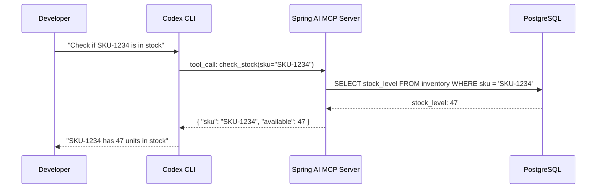
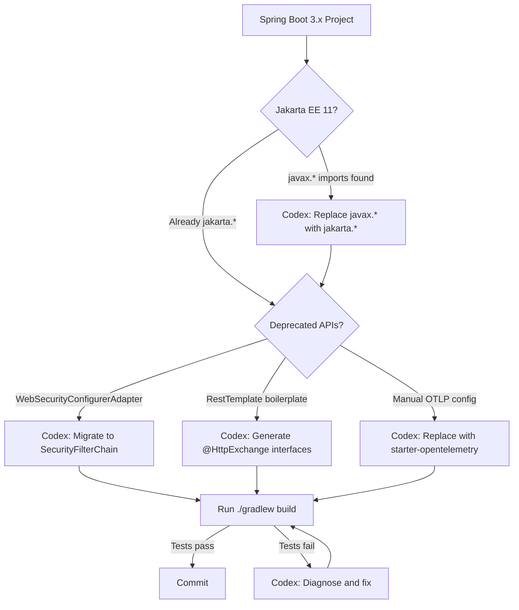

# Codex CLI for Spring Boot 4 and Spring AI: Java MCP Servers, Virtual Threads, and Agent-Assisted Development on Java 25


---

Spring Boot 4.0 shipped in November 2025 with first-class Java 25 support, complete modularisation across seventy-plus modules, virtual threads enabled by default for HTTP clients, and the new `spring-boot-starter-opentelemetry` for unified observability[^1]. Spring AI — now at milestone builds towards 2.0 — added annotation-driven MCP server development through `@McpTool`, `@McpResource`, and `@McpPrompt`, making it trivial to expose Spring services as tool servers for any MCP-compatible agent[^2]. The existing Codex CLI Java article in this knowledge base targets Spring Boot 3.x and Codex CLI v0.125. This article covers the updated landscape: Spring Boot 4.0.5, Spring AI MCP Boot Starters, Codex CLI v0.133, and practical patterns for teams running Java 25 with virtual threads.

## What Changed Since Spring Boot 3.x

The upgrade from 3.x to 4.0 is not cosmetic. Four changes directly affect how Codex CLI interacts with Spring projects:

1. **Jakarta EE 11 and Servlet 6.1** — older containers no longer work, and the namespace shift means Codex must not hallucinate `javax.*` imports[^1].
2. **Virtual threads by default** — setting `spring.threads.virtual.enabled=true` runs web requests, `@Async` tasks, and scheduled operations on virtual threads[^3]. Codex-generated code that spawns platform threads or uses `synchronized` blocks risks pinning.
3. **HTTP Service Clients** — annotated interfaces replace boilerplate `RestTemplate`/`WebClient` wiring[^1]. Codex can generate these cleanly if the AGENTS.md instructs it to prefer them.
4. **OpenTelemetry starter** — `spring-boot-starter-opentelemetry` replaces manual Micrometer-to-OTLP bridging[^1]. Codex should reach for this rather than cobbling together older exporters.

## AGENTS.md Template for Spring Boot 4

The AGENTS.md file is where you encode team conventions so Codex does not fall back on stale training data. Place this at the repository root:

```markdown
# AGENTS.md — Spring Boot 4 Project

## Stack
- Java 25, Spring Boot 4.0.x, Spring Framework 7
- Jakarta EE 11 (all imports use `jakarta.*`, never `javax.*`)
- Gradle 8.x with Kotlin DSL (`build.gradle.kts`)
- Virtual threads enabled (`spring.threads.virtual.enabled=true`)

## Conventions
- Use HTTP Service Clients (`@HttpExchange`) for outbound calls — never raw RestTemplate
- Use `spring-boot-starter-opentelemetry` for observability — do not add manual Micrometer bridges
- Use JSpecify `@Nullable`/`@NonNull` annotations, not Spring's deprecated null-safety annotations
- Records for DTOs — no Lombok `@Data` on new code
- Package-by-feature, not package-by-layer
- Tests use JUnit 5 with `@SpringBootTest(webEnvironment = RANDOM_PORT)`
- Testcontainers for database tests — never H2

## Build
- `./gradlew build` runs all checks
- `./gradlew bootRun` starts the application (binds port 8080)
- `./gradlew nativeCompile` for GraalVM native image (requires GraalVM 25)

## Anti-hallucination rules
- Do NOT use `javax.*` imports — they do not exist in Jakarta EE 11
- Do NOT use `WebSecurityConfigurerAdapter` — it was removed in Spring Security 6
- Do NOT use `spring.config.import` with the old Config Server bootstrap — use `spring.cloud.config.*`
- Do NOT generate `synchronized` blocks — use `ReentrantLock` to avoid virtual thread pinning
```

### Directory-Scoped Overrides

For a payments module with stricter rules, add `payments/AGENTS.md`:

```markdown
# AGENTS.md — Payments Module Override

- All monetary values use `java.math.BigDecimal` — never `double` or `float`
- Every public method must have `@Transactional` or explicitly document why not
- Input validation with Bean Validation 3.1 (`@Valid`, `@NotNull`, custom constraints)
- PCI-DSS: never log card numbers, even in debug — use masking utilities from `com.example.payments.util.Masking`
```

Codex loads the root AGENTS.md first, then appends directory-scoped files as it descends to the working directory[^4].

## Building a Spring AI MCP Server for Codex

Spring AI's MCP Boot Starters let you expose Spring services as MCP tools that Codex CLI can call. This is particularly powerful for domain-specific operations — querying internal APIs, running health checks, or accessing business logic that no public MCP server provides.

### Maven Dependencies

```xml
<dependency>
    <groupId>org.springframework.ai</groupId>
    <artifactId>spring-ai-starter-mcp-server</artifactId>
</dependency>
```

For STDIO transport (required by Codex CLI's local subprocess model), set:

```properties
spring.ai.mcp.server.stdio=true
spring.main.web-application-type=none
spring.main.banner-mode=off
spring.ai.mcp.server.name=inventory-tools
spring.ai.mcp.server.version=1.0.0
```

### Defining Tools with Annotations

```java
@Component
public class InventoryTools {

    private final InventoryService inventoryService;

    InventoryTools(InventoryService inventoryService) {
        this.inventoryService = inventoryService;
    }

    @McpTool(name = "check_stock", description = "Check current stock level for a product SKU")
    public StockLevel checkStock(
            @McpToolParam(description = "Product SKU code", required = true) String sku) {
        return inventoryService.getStockLevel(sku);
    }

    @McpTool(name = "reserve_stock", description = "Reserve stock for an order")
    public ReservationResult reserveStock(
            @McpToolParam(description = "Product SKU code") String sku,
            @McpToolParam(description = "Quantity to reserve") int quantity) {
        return inventoryService.reserve(sku, quantity);
    }
}
```

Spring AI auto-generates the JSON schema from method signatures and `@McpToolParam` annotations[^2]. The `@Component` annotation ensures Spring's dependency injection wires in the `InventoryService` — your MCP tools get the full Spring context, including transaction management, caching, and security.

### Wiring into Codex CLI

Build the server as a fat JAR, then configure it in `~/.codex/config.toml` or `.codex/config.toml`:

```toml
[mcp_servers.inventory]
command = "java"
args = ["-jar", "/opt/tools/inventory-mcp-server.jar"]
env = { SPRING_PROFILES_ACTIVE = "mcp", DATABASE_URL = "jdbc:postgresql://localhost:5432/inventory" }
```

Codex launches the JAR as a child process and communicates over STDIO[^5]. The Spring Boot application starts, auto-configures the MCP server, and begins accepting tool calls.



## Sandbox Configuration for Java Projects

Java builds need network access for dependency resolution. Codex CLI's default sandbox blocks outbound connections, which breaks both Maven and Gradle on first run[^6].

### Gradle (Recommended)

Gradle's daemon model and local cache make it more sandbox-friendly than Maven. Configure a permission profile that allows Gradle wrapper execution:

```toml
# .codex/config.toml
[permissions]
profile = "java-dev"

[permissions.profiles.java-dev]
inherits = "workspace-write"
allow_commands = [
    "./gradlew *",
    "gradle *",
    "java *",
    "javac *",
]
allow_network = ["services.gradle.org", "plugins.gradle.org", "repo.maven.apache.org"]
```

Pre-populating the Gradle cache before the Codex session eliminates most network calls:

```bash
./gradlew dependencies --write-locks
```

### Maven

Maven's HTTP client does not honour the transparent proxy that Codex provisions for tools like `curl`[^6]. The workaround is explicit proxy configuration in `settings.xml` or using the `--offline` flag after an initial dependency download:

```bash
# Before starting Codex — download all dependencies
mvn dependency:go-offline -Dmaven.repo.local=.m2/repository

# In AGENTS.md, instruct Codex to use offline mode
# Build: mvn -o -Dmaven.repo.local=.m2/repository package
```

## Virtual Threads and Codex-Generated Code

Virtual threads change which Java patterns are safe. When `spring.threads.virtual.enabled=true`, every inbound HTTP request runs on a virtual thread[^3]. Codex must avoid two pitfalls:

### Pinning

`synchronized` blocks pin virtual threads to carrier threads, destroying throughput. The AGENTS.md anti-hallucination rule catches this, but Codex should also be instructed to prefer `ReentrantLock`:

```java
// BAD — pins virtual thread
private synchronized void updateCache() {
    cache.put(key, value);
}

// GOOD — does not pin
private final ReentrantLock lock = new ReentrantLock();
private void updateCache() {
    lock.lock();
    try {
        cache.put(key, value);
    } finally {
        lock.unlock();
    }
}
```

### Thread-Local Abuse

Virtual threads make thread-local storage unreliable for request-scoped data. Spring Boot 4 and Spring Security 6.x handle this internally, but custom code that stores state in `ThreadLocal` variables will leak between requests. Codex should prefer scoped values (Java 25 preview) or dependency-injected request-scoped beans[^3].

## Workflow Patterns

### Pattern 1: Generate HTTP Service Clients

Spring Boot 4's HTTP Service Clients replace boilerplate REST clients. Use `codex exec` to generate them from an OpenAPI spec:

```bash
codex exec "Read the OpenAPI spec at docs/api.yaml. \
  Generate Spring Boot 4 HTTP Service Client interfaces \
  using @HttpExchange annotations. Place them in \
  src/main/java/com/example/client/. \
  Use records for response types. \
  Add Javadoc from the OpenAPI descriptions."
```

### Pattern 2: Spring AI MCP Tool Scaffolding

Generate MCP tool classes from an existing service layer:

```bash
codex exec "Scan the service interfaces in src/main/java/com/example/service/. \
  For each public method, generate a corresponding @McpTool method \
  in a new class under src/main/java/com/example/mcp/tools/. \
  Use @McpToolParam with descriptions derived from parameter names \
  and Javadoc. Configure STDIO transport in application-mcp.properties."
```

### Pattern 3: Testcontainers Integration Test Generation

```bash
codex exec "For each repository interface in src/main/java/com/example/repository/, \
  generate an integration test in src/test/java/ using @SpringBootTest, \
  Testcontainers with PostgreSQL, and @Sql for test data setup. \
  Assert both happy path and constraint violation scenarios."
```

### Pattern 4: GraalVM Native Image Compatibility Audit

GraalVM native compilation requires explicit reflection configuration for classes accessed reflectively. Codex can audit the codebase:

```bash
codex exec "Audit this Spring Boot 4 project for GraalVM native image compatibility. \
  Identify classes that use reflection, JNI, or dynamic proxies \
  without @RegisterReflectionForBinding or reflect-config.json entries. \
  Generate the missing configuration files under src/main/resources/META-INF/native-image/." \
  --output-schema '{"type":"object","properties":{"issues":{"type":"array","items":{"type":"object","properties":{"file":{"type":"string"},"line":{"type":"integer"},"issue":{"type":"string"},"fix":{"type":"string"}}}}}}'
```

The `--output-schema` flag (added in Codex CLI v0.132[^7]) returns structured JSON that CI pipelines can parse.

## Model Selection

For Spring Boot 4 development, model choice affects output quality:

| Task | Recommended Model | Rationale |
|------|------------------|-----------|
| Complex refactoring (3.x to 4.0 migration) | `gpt-5.5` | Needs deep understanding of Jakarta EE 11 namespace changes[^8] |
| Boilerplate generation (controllers, DTOs) | `gpt-5.3-codex-spark` | Fast, cost-effective for pattern-heavy tasks |
| MCP tool scaffolding | `gpt-5.5` | Must correctly generate `@McpTool` annotations with proper schemas |
| Test generation | `gpt-5.5` | Testcontainers and `@SpringBootTest` interactions require reasoning |

Switch models mid-session with the `/model` command or set the default in `config.toml`:

```toml
model = "gpt-5.5"
```

## Spring Boot 4 Migration with Codex

Teams migrating from Spring Boot 3.x can use Codex as a migration assistant. The key changes that Codex handles well:



Run the migration as a batch operation:

```bash
codex exec "Migrate this project from Spring Boot 3.4 to Spring Boot 4.0. \
  Steps: \
  1. Update build.gradle.kts — Spring Boot plugin to 4.0.5, Java toolchain to 25 \
  2. Replace any remaining javax.* imports with jakarta.* \
  3. Replace WebSecurityConfigurerAdapter with SecurityFilterChain beans \
  4. Replace RestTemplate usage with @HttpExchange service clients \
  5. Add spring-boot-starter-opentelemetry, remove manual Micrometer OTLP config \
  6. Enable virtual threads in application.properties \
  7. Replace synchronized blocks with ReentrantLock \
  8. Run ./gradlew build and fix compilation errors iteratively"
```

## Limitations

- **Spring AI 2.0 is not GA** — the `@McpTool` annotations and MCP Boot Starters are at milestone builds as of May 2026. APIs may change before the final release[^2]. Pin your Spring AI version explicitly.
- **SSE transport deprecation** — several MCP clients have announced sunset dates for SSE in mid-2026[^9]. Use Streamable HTTP for remote servers, STDIO for local ones.
- **Training data lag** — GPT-5.5's training data may not include Spring Boot 4.0.5 specifics. The AGENTS.md anti-hallucination rules are essential to prevent the model from generating Spring Boot 3.x patterns.
- **Gradle daemon socket** — the Gradle daemon binds a socket that Codex's sandbox may block. If builds hang, set `org.gradle.daemon=false` in `gradle.properties` to run Gradle in foreground mode.
- **GraalVM native image** — `nativeCompile` requires significant memory (4GB+) and may exceed Codex CLI's default execution timeout. Use `--timeout 600000` for native builds.

## Citations

[^1]: Spring Boot 4.0 Release Notes, [https://github.com/spring-projects/spring-boot/wiki/Spring-Boot-4.0-Release-Notes](https://github.com/spring-projects/spring-boot/wiki/Spring-Boot-4.0-Release-Notes)
[^2]: Spring AI MCP Server Boot Starter Documentation, [https://docs.spring.io/spring-ai/reference/api/mcp/mcp-server-boot-starter-docs.html](https://docs.spring.io/spring-ai/reference/api/mcp/mcp-server-boot-starter-docs.html)
[^3]: Spring Boot 4 and Virtual Threads, Medium, [https://medium.com/@oleksandr.dendeberia/spring-boot-4-and-virtual-threads-a-practical-high-impact-upgrade-for-modern-java-development-10631f4f427b](https://medium.com/@oleksandr.dendeberia/spring-boot-4-and-virtual-threads-a-practical-high-impact-upgrade-for-modern-java-development-10631f4f427b)
[^4]: Codex CLI AGENTS.md Documentation, [https://developers.openai.com/codex/guides/agents-md](https://developers.openai.com/codex/guides/agents-md)
[^5]: Codex CLI MCP Configuration, [https://developers.openai.com/codex/mcp](https://developers.openai.com/codex/mcp)
[^6]: Codex CLI for Java and Spring Boot Teams, codex.danielvaughan.com, [https://codex.danielvaughan.com/2026/03/30/codex-cli-java-spring-boot-teams/](https://codex.danielvaughan.com/2026/03/30/codex-cli-java-spring-boot-teams/)
[^7]: Codex CLI v0.132.0 Release Notes, [https://github.com/openai/codex/releases](https://github.com/openai/codex/releases)
[^8]: Codex CLI Model Selection, [https://developers.openai.com/codex/cli/features](https://developers.openai.com/codex/cli/features)
[^9]: MCP Ecosystem H1 2026, [https://www.digitalapplied.com/blog/mcp-ecosystem-h1-2026-retrospective-adoption-data-points](https://www.digitalapplied.com/blog/mcp-ecosystem-h1-2026-retrospective-adoption-data-points)
