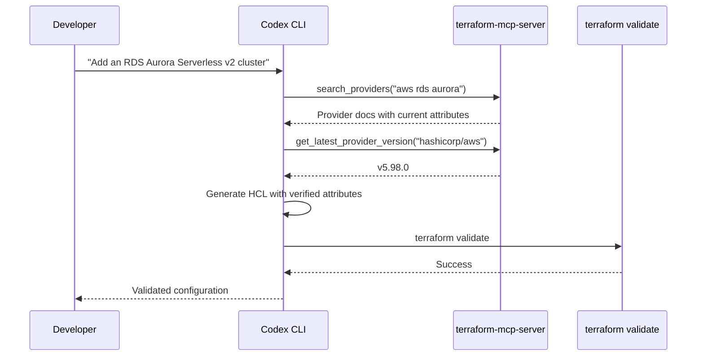
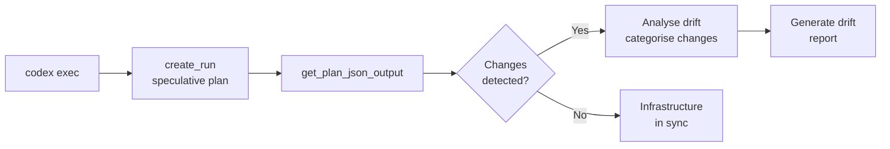
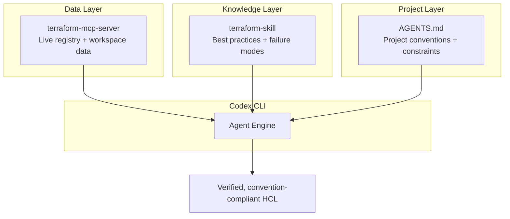

# Codex CLI for Terraform Development: terraform-mcp-server, State Inspection, and Infrastructure Drift Detection


---

Terraform remains the dominant infrastructure-as-code tool, with HashiCorp reporting over 300 million downloads and 4,600+ providers in the public registry [^1]. Yet most AI coding agents hallucinate provider arguments, invent nonexistent resource attributes, and generate configurations pinned to long-superseded provider versions. The official **terraform-mcp-server** (v0.5.2) eliminates this class of error by giving Codex CLI real-time access to the Terraform Registry, HCP Terraform workspaces, and Sentinel policy libraries [^2]. Combined with Anton Babenko's **terraform-skill** and a well-crafted `AGENTS.md`, Codex CLI becomes a genuinely useful infrastructure engineering companion — one that writes Terraform 1.15-era HCL against verified documentation rather than stale training data.

## What the Terraform MCP Server Provides

The server ships as a single Go binary (or Docker image at `hashicorp/terraform-mcp-server:0.5.2`) and exposes tools across three toolsets [^3]:

### Registry Toolset

| Tool | Purpose |
|------|---------|
| `search_providers` | Find provider documentation by service name |
| `get_provider_details` | Retrieve complete documentation for a specific provider component |
| `get_latest_provider_version` | Return the current version of a provider |
| `search_modules` | Find modules by name or functionality, with download counts and verification status |
| `get_module_details` | Comprehensive module information — inputs, outputs, examples, submodules |
| `get_latest_module_version` | Return the current version of a module |
| `search_policies` | Find Sentinel policies by topic or requirement |
| `get_policy_details` | Retrieve policy implementation details and usage instructions |

### HCP Terraform / Enterprise Toolset (TFE)

Over 30 tools for workspace lifecycle management [^4]:

- **Organisation and project listing** — `list_terraform_orgs`, `list_terraform_projects`
- **Workspace operations** — `list_workspaces`, create, update, delete with variables and tags
- **Run management** — `create_run`, `action_run` (apply, discard, cancel), `get_plan_json_output`
- **Variable sets** — `create_variable_set`, `list_variable_sets`
- **Private registry** — `search_private_modules`, `search_private_providers`
- **Policy sets** — `attach_policy_set_to_workspaces` for governance workflows
- **Stacks** — `list_stacks`, `get_stack_details` for Terraform Stacks deployments [^5]

### Terraform Toolset

Plan and apply inspection tools added in v0.5.0 for detailed operation analysis [^6].

## Configuring Codex CLI

### Stdio Transport (Local Development)

Add the server to `~/.codex/config.toml` or your project-scoped `.codex/config.toml`:

```toml
[mcp_servers.terraform]
command = "docker"
args = [
  "run", "-i", "--rm",
  "-e", "TFE_TOKEN",
  "hashicorp/terraform-mcp-server:0.5.2"
]
env_vars = ["TFE_TOKEN"]
tool_timeout_sec = 30
```

Or install from source and run directly:

```toml
[mcp_servers.terraform]
command = "terraform-mcp-server"
args = ["--toolsets=registry,tfe", "--log-level=warn"]
env_vars = ["TFE_TOKEN", "TFE_ADDRESS"]
```

The `--toolsets` flag controls which tool groups are active. Use `--tools` for fine-grained individual tool control [^7].

### Streamable HTTP Transport (Shared/Remote)

For team environments where a single MCP server instance serves multiple developers:

```toml
[mcp_servers.terraform]
url = "https://terraform-mcp.internal.example.com:8080/mcp"
bearer_token_env_var = "TFE_TOKEN"
tool_timeout_sec = 60
```

The HTTP transport supports OpenTelemetry instrumentation for monitoring tool usage volume, latency, and failures [^6].

### CLI Shortcut

```bash
codex mcp add terraform -- docker run -i --rm \
  -e TFE_TOKEN hashicorp/terraform-mcp-server:0.5.2
```

Verify the server is connected in the Codex TUI with `/mcp` [^8].

## Adding the Terraform Skill

Anton Babenko's terraform-skill provides best-practices guidance that complements the MCP server's data access with structural engineering knowledge [^9]:

```bash
codex plugin marketplace add antonbabenko/agent-plugins
```

The skill covers:

- **Testing frameworks** — decision matrices comparing native Terraform tests versus Terratest
- **Module development** — naming conventions, structure standards, versioning strategies
- **State management** — remote backend configurations with locking and security
- **CI/CD integration** — GitHub Actions and GitLab CI patterns with cost optimisation
- **Security and compliance** — static analysis, policy-as-code, and scanning workflows
- **Failure-mode routing** — every query passes through a diagnostic table covering identity churn, secret exposure, blast radius, CI drift, and state corruption [^9]

The skill works with Codex CLI, Claude Code, Cursor, Gemini CLI, and any Agent Skills-compatible platform [^9].

## Writing an AGENTS.md for Terraform Projects

Place this at the root of your Terraform repository:

```markdown
# AGENTS.md — Terraform Project Conventions

## Stack
- Terraform 1.15.x (HCL2)
- AWS Provider ~> 5.x (check with terraform-mcp-server before assuming attributes)
- State backend: S3 + DynamoDB locking
- CI: GitHub Actions with terraform-github-actions

## Rules
1. ALWAYS use terraform-mcp-server's `search_providers` and `get_provider_details`
   before writing any resource or data source block — never guess attribute names.
2. Pin provider versions with pessimistic constraints (~>).
3. Use `terraform fmt` and `terraform validate` after every change.
4. All variables MUST have `description` and `type` constraints.
5. All outputs MUST have `description`.
6. Use `moved` blocks for refactoring — never delete and recreate.
7. Tag all resources with `managed_by = "terraform"` and `environment`.
8. Sensitive values go in variable sets, never in .tf files.
9. Run `tflint` and `checkov` before committing.

## Anti-hallucination
- Do NOT invent provider arguments. If `get_provider_details` does not list
  an attribute, it does not exist.
- Do NOT assume module inputs. Use `get_module_details` to verify.
- Do NOT reference Terraform 0.x or 1.x syntax deprecated before 1.10.
```

## Workflow Patterns

### 1. Provider-Verified Resource Authoring

The core workflow eliminates hallucinated attributes:



This pattern ensures every `resource` and `data` block uses attributes that actually exist in the current provider version.

### 2. Module Discovery and Composition

```bash
# Ask Codex to find and integrate a verified module
codex "Find a verified VPC module for AWS with at least 3 AZs,
       check its inputs with terraform-mcp-server, and integrate
       it into our networking/ directory"
```

Codex will call `search_modules("aws vpc")`, filter for verified modules, then call `get_module_details` to retrieve the exact input variables, outputs, and usage examples before writing HCL.

### 3. Drift Detection with Plan Inspection

For teams using HCP Terraform, Codex CLI can inspect plan outputs to identify drift:



```bash
# Batch drift check across workspaces
codex exec "For each workspace tagged 'production' in our org,
            create a speculative plan run, inspect the JSON output,
            and report any resources showing drift. Categorise
            changes as: cosmetic, security-relevant, or breaking."
```

The `get_plan_json_output` tool returns structured JSON that Codex can parse to distinguish between tag-only changes, security group modifications, and destructive replacements [^4].

### 4. Policy Compliance Audit

```bash
codex "Search for Sentinel policies related to S3 encryption,
       compare them against our current bucket configurations
       in modules/storage/, and flag any non-compliant resources"
```

This leverages `search_policies` and `get_policy_details` to find relevant governance rules, then cross-references them against the codebase.

## Model Selection

| Task | Recommended Model | Rationale |
|------|-------------------|-----------|
| Resource authoring with MCP verification | `o4-mini` | Fast iteration, MCP calls dominate latency |
| Multi-workspace drift analysis | `o3` | Complex reasoning across plan JSON outputs |
| Module refactoring and `moved` blocks | `o3` | Requires understanding dependency graphs |
| Batch operations with `codex exec` | `o4-mini` | Cost-effective for repetitive tasks |
| Security and compliance review | `o3` | Nuanced policy interpretation |

Model names are current as of May 2026 [^10].

## Sandbox Considerations

Terraform development with Codex CLI requires careful sandbox configuration:

- **Network access**: The MCP server needs outbound HTTPS to `registry.terraform.io` and `app.terraform.io` (or your TFE instance). Run Codex in `full-auto` mode or configure network allowlists [^8].
- **State file safety**: Never grant Codex write access to `.terraform/` or state files. Use `workspace-write` mode scoped to `.tf` files only.
- **Credential isolation**: Pass `TFE_TOKEN` via `env_vars` rather than hardcoding. The MCP server supports environment variable forwarding from v0.3.0+ [^2].
- **Plan-only operations**: For drift detection, use speculative plans (`create_run` with plan-only type) rather than apply operations. The `action_run` tool requires the `ENABLE_TF_OPERATIONS` flag, which should be disabled by default [^4].
- **Docker overhead**: The Docker transport adds ~2 seconds startup per invocation. For interactive sessions, prefer the native binary or HTTP transport.

## Composing MCP Server with Skill and AGENTS.md

The three components serve complementary roles:



- **terraform-mcp-server** answers "what exists" — current provider attributes, module interfaces, policy rules, workspace state
- **terraform-skill** answers "how to do it well" — testing patterns, module structure, CI/CD, security scanning
- **AGENTS.md** answers "how we do it here" — provider pins, naming conventions, backend configuration, team-specific rules

## Limitations

- **Beta status**: The MCP server remains in beta. HashiCorp advises against production use of the HTTP transport [^2]. ⚠️
- **Apply operations require explicit opt-in**: The `action_run` tool (apply, discard, cancel) is gated behind `ENABLE_TF_OPERATIONS` to prevent accidental infrastructure changes [^4].
- **No local state inspection**: The MCP server queries the registry and HCP Terraform APIs. It cannot read local `.tfstate` files or run `terraform plan` locally — you still need Terraform installed for that.
- **Training data lag**: Models may not know about Terraform 1.15 features (released April 2026) [^11]. The MCP server compensates for provider documentation but not core HCL syntax changes.
- **OpenTofu divergence**: OpenTofu 1.12 shipped features like dynamic `prevent_destroy` that Terraform lacks [^12]. The MCP server only covers the HashiCorp ecosystem. ⚠️
- **Tool count at scale**: With all toolsets enabled, the server exposes 40+ tools. Use `--toolsets` or `--tools` flags to limit context consumption [^7].
- **Stacks maturity**: Terraform Stacks support was added in v0.5.1 but remains relatively new; expect edge cases in complex stack compositions [^5]. ⚠️

## Citations

[^1]: [Terraform Registry — HashiCorp Developer](https://registry.terraform.io/)
[^2]: [Terraform MCP Server Overview — HashiCorp Developer](https://developer.hashicorp.com/terraform/mcp-server)
[^3]: [Terraform MCP Server Reference — HashiCorp Developer](https://developer.hashicorp.com/terraform/mcp-server/reference)
[^4]: [Terraform MCP Server — GitHub (hashicorp/terraform-mcp-server)](https://github.com/hashicorp/terraform-mcp-server)
[^5]: [Terraform MCP Server Updates: Stacks Support, New Tools, and Tips — HashiCorp Blog](https://www.hashicorp.com/en/blog/terraform-mcp-server-updates-stacks-support-new-tools-and-tips)
[^6]: [Terraform MCP Server Releases — GitHub](https://github.com/hashicorp/terraform-mcp-server/releases)
[^7]: [Terraform MCP Server v0.5.1 Release Notes — GitHub](https://github.com/hashicorp/terraform-mcp-server/releases/tag/v0.5.1)
[^8]: [Model Context Protocol — Codex CLI Documentation](https://developers.openai.com/codex/mcp)
[^9]: [terraform-skill — GitHub (antonbabenko/terraform-skill)](https://github.com/antonbabenko/terraform-skill)
[^10]: [Codex CLI Models — OpenAI Developers](https://developers.openai.com/codex/models)
[^11]: [Terraform Releases — GitHub (hashicorp/terraform)](https://github.com/hashicorp/terraform/releases)
[^12]: [OpenTofu 1.12: The Feature Terraform Never Shipped — InfoQ](https://www.infoq.com/news/2026/05/opentofu-release-terraform/)
