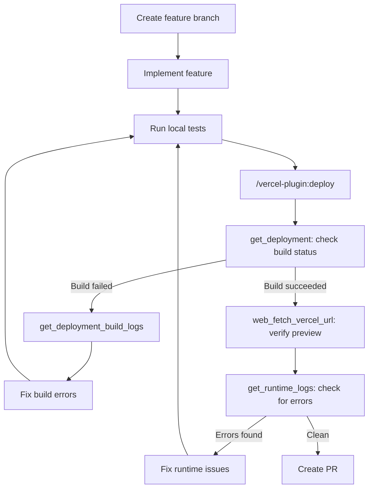
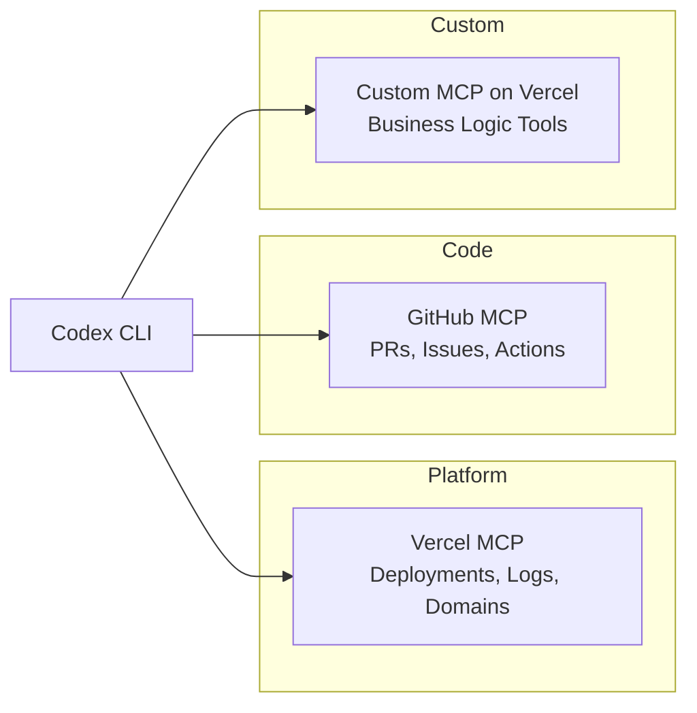

# Codex CLI for Vercel Development: MCP Server, Plugin Ecosystem, and Next.js Deployment Workflows


---

Vercel's integration surface for Codex CLI has quietly become one of the richest in the MCP ecosystem. Between the official Vercel MCP server at `mcp.vercel.com` (18 tools, OAuth, Streamable HTTP), the Vercel Plugin (25 skills, three specialist agents, five slash commands), and AI Gateway routing for multi-model profiles, a Codex CLI session can now manage deployments, inspect runtime logs, respond to toolbar comments, and scaffold entire Next.js projects without leaving the terminal. This article maps the full integration surface and walks through four production workflow patterns.

## The Vercel MCP Server

The Vercel MCP server is a remote, OAuth-authenticated server hosted at `https://mcp.vercel.com`[^1]. It implements MCP Authorization and Streamable HTTP transport — not the deprecated SSE transport[^2]. Codex CLI connects natively via `codex mcp add`:

```bash
codex mcp add vercel --url https://mcp.vercel.com
```

On first connection, Codex detects OAuth support and opens the browser for authorisation. Once authenticated, the MCP server grants the same access level as the Vercel user account — a point worth noting for enterprise teams managing least-privilege policies[^1].

### Tool Categories

The server exposes tools across six categories[^3]:

| Category | Tools | Key Operations |
|----------|-------|----------------|
| **Documentation** | `search_documentation` | Full-text search across Vercel docs with token-limited responses |
| **Project Management** | `list_teams`, `list_projects`, `get_project` | Enumerate teams, projects, framework metadata, and domain bindings |
| **Deployments** | `list_deployments`, `get_deployment`, `get_deployment_build_logs`, `get_runtime_logs` | List/inspect deployments, retrieve build and runtime logs with filters |
| **Domains** | `check_domain_availability_and_price`, `buy_domain` | Domain availability checks and purchase |
| **Access** | `get_access_to_vercel_url`, `web_fetch_vercel_url` | Create shareable links for protected deployments, fetch content from authenticated URLs |
| **Toolbar** | `list_toolbar_threads`, `get_toolbar_thread`, `change_toolbar_thread_resolve_status`, `reply_to_toolbar_thread`, `edit_toolbar_message`, `add_toolbar_reaction` | Read, reply to, resolve, and react to team comments |
| **CLI** | `use_vercel_cli`, `deploy_to_vercel` | Execute Vercel CLI commands and trigger deployments |

The `get_runtime_logs` tool is particularly powerful — it accepts filters for environment (`production` or `preview`), log level (`error`, `warning`, `info`, `fatal`), HTTP status code, source type (`serverless`, `edge-function`, `edge-middleware`, `static`), time range, and full-text query[^3]. This makes it the backbone of incident investigation workflows.

## The Vercel Plugin

The Vercel Plugin is a separate integration layer providing domain expertise rather than API access. Install it with:

```bash
npx plugins add vercel/vercel-plugin
```

The plugin injects session context automatically — but only in empty directories and detected Vercel or Next.js projects[^4]. It does not inject on every prompt, keeping context budgets lean.

### Skill Library

The plugin ships 25 skills covering the Vercel ecosystem[^4]:

- **Framework skills**: `nextjs` (App Router, Server Components, Cache Components), `next-cache-components` (PPR, `use cache`, `cacheLife`), `next-forge` (production SaaS monorepo starter), `next-upgrade` (codemods and migration guides), `shadcn`, `turbopack`
- **Platform skills**: `vercel-functions` (Serverless, Edge, Fluid Compute, Cron Jobs), `vercel-storage` (Blob, Edge Config, Neon Postgres, Upstash Redis), `vercel-cli`, `vercel-sandbox` (Firecracker microVMs), `routing-middleware`
- **AI skills**: `ai-gateway` (provider routing, failover, cost tracking across 100+ models), `ai-sdk` (AI SDK v6 including tool calling, agents, MCP), `workflow` (durable execution, `DurableAgent`, Worlds)
- **Operations skills**: `deployments-cicd`, `env-vars`, `marketplace`, `verification`, `auth`, `bootstrap`

Three specialist agents handle complex, multi-step tasks[^4]:

| Agent | Focus |
|-------|-------|
| `deployment-expert` | CI/CD pipelines, deploy strategies, troubleshooting |
| `performance-optimizer` | Core Web Vitals, rendering strategies, caching |
| `ai-architect` | AI application design, model selection, streaming architecture |

### Slash Commands

Five slash commands provide quick actions[^4]:

```text
/vercel-plugin:bootstrap    # Link project, provision env, set up DB
/vercel-plugin:deploy       # Deploy preview
/vercel-plugin:deploy prod  # Deploy to production
/vercel-plugin:env          # Manage environment variables
/vercel-plugin:status       # Project status and recent deployments
/vercel-plugin:marketplace  # Discover and install integrations
```

> **Platform support note**: The plugin documentation lists OpenAI Codex support as "Coming soon" in its supported-tools table, whilst the Vercel changelog announced Codex and Codex CLI support on 26 March 2026[^5]. The `npx plugins add` command works with the Codex plugin system, but behaviour may differ from the Claude Code integration. Test before relying on hook-based context injection in production.

## AI Gateway Configuration

For teams wanting observability over model usage, Vercel AI Gateway routes Codex CLI requests through Vercel's infrastructure. Configure a model provider in `config.toml`[^6]:

```toml
[model_providers.vercel]
name = "Vercel AI Gateway"
base_url = "https://ai-gateway.vercel.sh/v1"
env_key = "AI_GATEWAY_API_KEY"
wire_api = "responses"

[profiles.vercel]
model_provider = "vercel"
model = "openai/gpt-5.5"

[profiles.fast]
model_provider = "vercel"
model = "openai/gpt-5.4-nano"

[profiles.claude]
model_provider = "vercel"
model = "anthropic/claude-sonnet-4.6"
```

Switch profiles at startup:

```bash
codex --profile vercel    # GPT-5.5 via gateway
codex --profile fast      # Nano for quick edits
codex --profile claude    # Cross-model review
```

All requests flow through the gateway, providing unified cost tracking and detailed traces in Vercel Observability[^6].

## AGENTS.md Template for Vercel Projects

```markdown
# AGENTS.md — Vercel + Next.js Project

## Stack
- Next.js 16 with App Router, React 19+, TypeScript 5.8+
- Vercel deployment target (Serverless + Edge Functions, Fluid Compute)
- Tailwind CSS 4 with shadcn/ui components

## Anti-Hallucination Rules
- Use `use cache` directive, NOT `getStaticProps` or `getServerSideProps`
- Use `cacheLife` and `cacheTag` for cache control, NOT manual headers
- Use `next/image` with Vercel Image Optimization, NOT raw `` tags
- Server Actions use `"use server"` directive at function level
- Edge Functions use `export const runtime = 'edge'`
- Import from `@vercel/blob`, `@vercel/edge-config`, NOT sunset packages
- Environment variables: use `vercel env pull`, never hardcode secrets

## Deployment Rules
- Preview deployments for all non-production branches
- Production deploys require passing build + type checks
- Use `vercel --prebuilt` in CI to separate build and deploy steps

## MCP Servers
- Vercel MCP (`mcp.vercel.com`) for deployment and log management
- GitHub MCP for PR and issue integration
```

## Workflow Patterns

### Pattern 1: Feature Branch to Preview Verification

This workflow develops a feature, deploys a preview, and verifies the result — all within a single Codex session.



The key insight is composing MCP tools with plugin commands: `/vercel-plugin:deploy` triggers the deployment, then `get_deployment` polls for build completion, and `web_fetch_vercel_url` verifies the preview content — bypassing Deployment Protection automatically[^3].

### Pattern 2: Production Incident Investigation

When runtime errors spike, Codex can query logs, identify the failing deployment, and propose a fix:

```bash
codex "Our Next.js API route /api/checkout is returning 500 errors. \
  Use Vercel MCP to check runtime logs for the last hour, \
  identify the error pattern, find the relevant source code, and propose a fix."
```

Codex will call `get_runtime_logs` with `level: ["error", "fatal"]`, `statusCode: "5xx"`, `source: ["serverless"]`, and `since: "1h"`, then cross-reference the stack traces with local source files[^3].

### Pattern 3: Toolbar Comment Resolution Loop

Teams using Vercel's Toolbar leave comments on preview deployments. Codex can process these as a review queue:

```bash
codex "List unresolved toolbar comments on the dashboard project. \
  For each comment, read the thread, identify what needs fixing, \
  implement the fix, and reply confirming the change. \
  Resolve threads where the fix is complete."
```

This uses `list_toolbar_threads` → `get_toolbar_thread` → code changes → `reply_to_toolbar_thread` → `change_toolbar_thread_resolve_status`[^3].

### Pattern 4: Batch Deployment Audit with codex exec

For teams managing multiple Vercel projects, `codex exec` can audit deployment health across a fleet:

```bash
cat projects.csv | codex exec \
  --model gpt-5.5 \
  --output-schema '{"status": "string", "errors": "number", "last_deploy": "string"}' \
  "For the Vercel project {project_id} on team {team_id}, \
   use Vercel MCP to check the last 5 deployments, count error-level runtime logs \
   from the past 24 hours, and report the status."
```

## Deploying MCP Servers to Vercel

Vercel is also a deployment target for custom MCP servers. The `mcp-handler` package provides the scaffolding[^7]:

```typescript
// app/api/mcp/route.ts
import { z } from 'zod';
import { createMcpHandler } from 'mcp-handler';

const handler = createMcpHandler(
  (server) => {
    server.tool(
      'check_stock',
      'Check inventory stock levels',
      { sku: z.string() },
      async ({ sku }) => {
        const stock = await db.inventory.findUnique({ where: { sku } });
        return {
          content: [{ type: 'text', text: `SKU ${sku}: ${stock?.quantity ?? 0} units` }],
        };
      },
    );
  },
  {},
  { basePath: '/api' },
);

export { handler as GET, handler as POST, handler as DELETE };
```

Once deployed, Codex connects to the custom server alongside Vercel's own MCP server:

```toml
# config.toml
[mcp_servers.vercel]
url = "https://mcp.vercel.com"

[mcp_servers.inventory]
url = "https://my-mcp-server.vercel.app/api/mcp"
```

Vercel Functions with Fluid Compute handle the bursty request patterns typical of MCP servers — long idle periods punctuated by rapid tool calls during agent sessions[^7]. Rolling Releases and Instant Rollback provide safe deployment patterns for production MCP servers[^7].

## Server Composition

A production Vercel development setup typically composes three MCP layers:



The Vercel MCP handles deployment lifecycle, runtime observability, and team collaboration (toolbar). GitHub MCP handles code review and issue tracking. Custom MCP servers on Vercel provide domain-specific tools — inventory checks, payment status, content management — that the agent can compose with platform operations.

## Sandbox and Security Considerations

- **OAuth scope**: The Vercel MCP server grants the AI system the same access as the authenticated Vercel user account[^1]. For enterprise environments, create a dedicated service account with restricted project access rather than using a personal account.
- **Network access**: Codex CLI needs outbound HTTPS to `mcp.vercel.com` and `ai-gateway.vercel.sh`. In sandbox mode, configure `allow_network_hosts` in `config.toml`.
- **Confused deputy protection**: The Vercel MCP server requires explicit per-client consent and protects against confused deputy attacks where malicious authorisation requests exploit consent cookies[^1].
- **Prompt injection**: When composing Vercel MCP with untrusted MCP servers, a malicious tool could inject instructions to exfiltrate deployment logs or environment variables. Enable human confirmation for sensitive operations[^1].
- **Plugin telemetry**: The Vercel Plugin sends a daily `dau:active_today` event by default. Disable with `VERCEL_PLUGIN_TELEMETRY=off`[^4].

## Model Selection

| Task | Recommended Model | Rationale |
|------|-------------------|-----------|
| Feature development + deploy | `gpt-5.5` | Strong Next.js understanding, handles multi-file changes |
| Quick config edits | `gpt-5.4-nano` | Fast turnaround for `vercel.json`, env var changes |
| Incident investigation | `gpt-5.5` | Needs reasoning over log patterns and stack traces |
| Cross-model review via Gateway | `anthropic/claude-sonnet-4.6` | Independent perspective on architecture decisions |

## Known Limitations

- **Plugin support status**: The Vercel Plugin documentation lists OpenAI Codex as "Coming soon" despite a March 2026 changelog announcement[^5]. Hook-based context injection may not work identically to the Claude Code integration. ⚠️
- **MCP server tool budget**: The 18 Vercel MCP tools plus plugin skills can consume significant context. Use `--only` patterns or separate MCP tool allow-lists in `config.toml` to limit tool enumeration.
- **Build log latency**: `get_deployment_build_logs` returns logs after the build completes. During active builds, repeated polling is needed — there is no streaming build log tool.
- **No environment variable management via MCP**: The MCP server cannot read or write environment variables directly. Use the plugin's `/vercel-plugin:env` slash command or the Vercel CLI instead.
- **Domain purchase requires registrant details**: The `buy_domain` tool requires full registrant contact information inline — not suitable for automated pipelines without pre-configured defaults.
- **Training data lag**: GPT-5.5 training data may not include the latest Next.js 16 or Vercel SDK changes. The plugin's `knowledge-update` skill and `search_documentation` MCP tool mitigate this, but verify suggestions against current docs.

## Citations

[^1]: Vercel, "Use Vercel's MCP server," Vercel Documentation, updated 12 February 2026. [https://vercel.com/docs/agent-resources/vercel-mcp](https://vercel.com/docs/agent-resources/vercel-mcp)

[^2]: Model Context Protocol, "Streamable HTTP Transport," MCP Specification 2025-06-18. [https://modelcontextprotocol.io/specification/2025-06-18/basic/transports#streamable-http](https://modelcontextprotocol.io/specification/2025-06-18/basic/transports#streamable-http)

[^3]: Vercel, "Vercel MCP Tools Reference," Vercel Documentation, updated 13 February 2026. [https://vercel.com/docs/agent-resources/vercel-mcp/tools](https://vercel.com/docs/agent-resources/vercel-mcp/tools)

[^4]: Vercel, "Vercel Plugin for AI Coding Agents," Vercel Documentation. [https://vercel.com/docs/agent-resources/vercel-plugin](https://vercel.com/docs/agent-resources/vercel-plugin)

[^5]: Vercel, "Vercel plugin now supported on OpenAI Codex and Codex CLI," Vercel Changelog, 26 March 2026. [https://vercel.com/changelog/vercel-plugin-openai-codex-and-codex-cli-support](https://vercel.com/changelog/vercel-plugin-openai-codex-and-codex-cli-support)

[^6]: Vercel, "OpenAI Codex — AI Gateway Configuration," Vercel Documentation. [https://vercel.com/docs/agent-resources/coding-agents/openai-codex](https://vercel.com/docs/agent-resources/coding-agents/openai-codex)

[^7]: Vercel, "Deploy MCP servers to Vercel," Vercel Documentation, updated 17 February 2026. [https://vercel.com/docs/mcp/deploy-mcp-servers-to-vercel](https://vercel.com/docs/mcp/deploy-mcp-servers-to-vercel)
