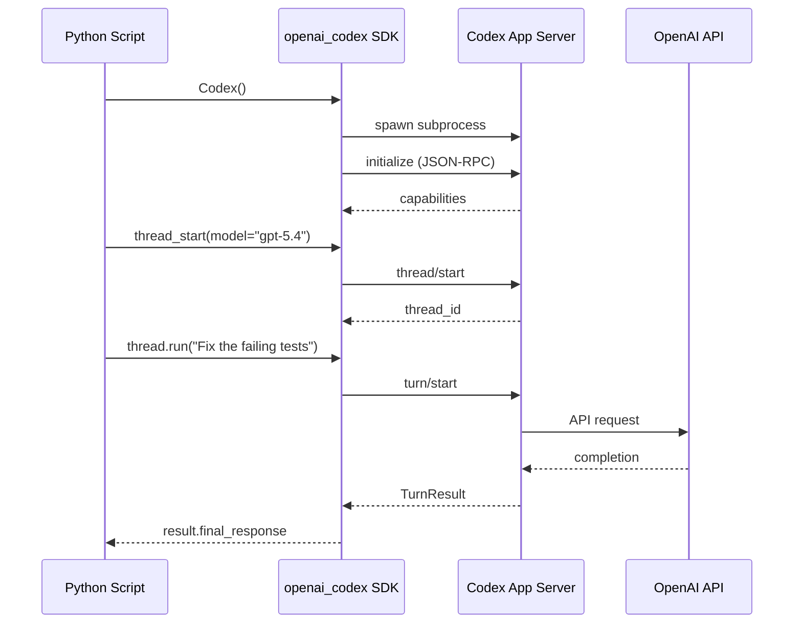

# The Codex Python SDK: Embedding Agents in Scripts, Pipelines, and Custom Tooling


---

The interactive TUI is how most developers first encounter Codex CLI. Type a prompt, watch the agent work, approve or reject tool calls. But the real leverage — the kind that compounds across teams and pipelines — comes when you drop the terminal and drive the agent programmatically. Since v0.131.0, the official Python SDK (`openai-codex` on PyPI, imported as `openai_codex`) provides exactly that surface [^1].

This article covers the SDK's architecture, core API, authentication flows, approval modes, and practical patterns for embedding Codex agents in Python scripts, CI pipelines, and custom tooling.

## Architecture: JSON-RPC over stdio

The Python SDK is a thin, type-safe client that spawns the Codex `app-server` binary as a subprocess and communicates via JSON-RPC v2 over stdio [^2]. This is the same protocol the TUI uses internally — the SDK simply exposes it as a Python API.



The `openai-codex` package depends on `openai-codex-cli-bin`, which bundles platform-specific binaries for macOS (ARM64/x86_64), Linux (x86_64/ARM64), and Windows (x86_64/ARM64) [^2]. Version alignment between the SDK and binary is strict — mismatches produce a startup error.

## Installation

The SDK requires Python 3.10 or later. Install from the repository:

```bash
cd sdk/python
uv sync
source .venv/bin/activate
```

Alternatively, if the published PyPI package is available for your platform:

```bash
pip install openai-codex
```

For development against a local Codex binary, override the path:

```python
from openai_codex import Codex, AppServerConfig

config = AppServerConfig(codex_bin="/usr/local/bin/codex")
with Codex(config=config) as codex:
    ...
```

## Core API Surface

The SDK exposes two primary classes: `Codex` (synchronous) and `AsyncCodex` (asynchronous) [^2]. Both follow the same pattern: create a client, start a thread, run turns.

### Synchronous Usage

```python
from openai_codex import Codex

with Codex() as codex:
    thread = codex.thread_start(model="gpt-5.4")
    result = thread.run("Refactor the auth module to use dependency injection.")
    print(result.final_response)
    print(f"Items generated: {len(result.items)}")
```

The `run()` method submits a turn and collects all events into a `TurnResult`. The `final_response` field contains the agent's concluding text — it is `None` when the turn completes without a final-answer message [^3].

### Asynchronous Usage

```python
from openai_codex import AsyncCodex
import asyncio

async def main():
    async with AsyncCodex() as codex:
        thread = await codex.thread_start(model="gpt-5.4")
        result = await thread.run("Generate unit tests for the payment service.")
        print(result.final_response)

asyncio.run(main())
```

### Thread Lifecycle Methods

Beyond `thread_start()`, the SDK supports resuming and forking threads [^2]:

| Method | Purpose |
|--------|---------|
| `thread_start(model, base_instructions)` | Create a fresh session |
| `thread_resume(thread_id)` | Reload an existing session with state overrides |
| `thread_fork(thread_id)` | Branch from an existing thread's state |
| `thread.run(prompt)` | Submit a turn and collect all events |
| `thread.turn(...)` | Low-level turn control with streaming and interruption |

For text-only workflows, `run()` accepts a plain string as input. For streaming, steering, or interrupt control, use `turn()` instead [^3].

## Authentication

The SDK supports three authentication methods, added in v0.132.0 [^4]:

### API Key (Headless)

```python
from openai_codex import Codex

with Codex() as codex:
    codex.login_api_key("sk-...")
    account = codex.account()
    print(f"Authenticated as: {account}")
```

### ChatGPT Browser Flow

```python
login = codex.login_chatgpt()
print(f"Open this URL: {login.auth_url}")
completed = login.wait()
print(f"Login successful: {completed.success}")
```

### Device Code Flow

```python
login = codex.login_chatgpt_device_code()
print(f"Go to {login.verification_url} and enter: {login.user_code}")
completed = login.wait()
```

For CI pipelines, the API key method is the obvious choice — set `OPENAI_API_KEY` in your environment and the SDK picks it up automatically without an explicit `login_api_key()` call.

## Approval Modes and Security

Codex's dual-layer security model — sandbox enforcement plus approval policies — is fully configurable through the SDK [^5]. The key parameters map to the same CLI flags:

| SDK Parameter | CLI Equivalent | Effect |
|---------------|---------------|--------|
| `approval_policy="on-request"` | `--ask-for-approval on-request` | Agent asks before mutations |
| `approval_policy="never"` | `--ask-for-approval never` | Auto-approve everything |
| `approval_policy="untrusted"` | Default for non-VCS dirs | Safe ops auto-approved, mutations need approval |
| `sandbox_mode="workspace-write"` | `--sandbox workspace-write` | Write access to workspace only |
| `sandbox_mode="read-only"` | `--sandbox read-only` | No file writes permitted |

### Auto-Review (Guardian Subagent)

For automated pipelines where you want safety without human-in-the-loop, configure `approvals_reviewer="auto_review"` to route approval requests through a guardian subagent [^5]. This secondary agent evaluates each request against a risk framework — checking for data exfiltration, credential probing, and destructive actions — before approving or denying. Low-risk actions proceed automatically; critical-risk actions are denied.

```python
from openai_codex import Codex

with Codex() as codex:
    thread = codex.thread_start(
        model="gpt-5.4",
        approval_policy="on-request",
        approvals_reviewer="auto_review",
        sandbox_mode="workspace-write",
    )
    result = thread.run("Upgrade all dependencies and fix breaking changes.")
```

⚠️ The guardian subagent incurs additional model calls and associated costs. For high-throughput batch operations, `approval_policy="never"` with a strict `read-only` sandbox may be more cost-effective.

## Practical Patterns

### Pattern 1: CI Fix-on-Failure

When a CI job fails, trigger a Codex agent to diagnose and propose a fix:

```python
#!/usr/bin/env python3
"""ci_fix.py — Triggered by GitHub Actions on test failure."""

import os
import subprocess
from openai_codex import Codex

failing_test = os.environ["FAILING_TEST"]
commit_sha = os.environ["GITHUB_SHA"]

with Codex() as codex:
    thread = codex.thread_start(
        model="gpt-5.4-mini",
        sandbox_mode="workspace-write",
        approval_policy="never",
    )
    result = thread.run(
        f"The test `{failing_test}` is failing at commit {commit_sha}. "
        "Diagnose the root cause, apply the minimal fix, and verify the test passes."
    )

    if result.final_response:
        # Create a PR with the fix
        subprocess.run(["gh", "pr", "create",
            "--title", f"fix: auto-repair {failing_test}",
            "--body", result.final_response], check=True)
```

### Pattern 2: Batch Code Review with `thread_fork`

Review multiple PRs by forking from a base thread that already has the project context:

```python
from openai_codex import Codex

with Codex() as codex:
    # Base thread with project conventions
    base = codex.thread_start(
        model="gpt-5.4",
        base_instructions="You are a code reviewer. Follow CONTRIBUTING.md rules.",
    )
    base.run("Read CONTRIBUTING.md and the project's linting configuration.")

    # Fork per PR for isolated reviews
    for pr_number in [142, 143, 147]:
        review_thread = codex.thread_fork(base.thread_id)
        result = review_thread.run(
            f"Review the changes in PR #{pr_number}. "
            "Flag security issues, performance regressions, and style violations."
        )
        print(f"PR #{pr_number}: {result.final_response}")
```

### Pattern 3: Structured Output for Toolchain Integration

Combine the SDK with `--output-schema` for machine-readable results that feed into downstream tools:

```python
import json
from openai_codex import Codex

with Codex() as codex:
    thread = codex.thread_start(model="gpt-5.4-mini")
    result = thread.run(
        "Analyse the codebase for security vulnerabilities. "
        "Return JSON with fields: file, line, severity, description, fix."
    )

    findings = json.loads(result.final_response)
    critical = [f for f in findings if f["severity"] == "critical"]

    if critical:
        raise SystemExit(f"{len(critical)} critical vulnerabilities found")
```

### Pattern 4: Agents SDK Integration

For multi-agent orchestration, run Codex as an MCP server and connect it to the OpenAI Agents SDK [^6]:

```python
from agents import Agent
from agents.mcp import MCPServerStdio

async with MCPServerStdio(
    name="Codex CLI",
    params={
        "command": "npx",
        "args": ["-y", "codex", "mcp-server"],
    },
    client_session_timeout_seconds=360000,
) as codex_mcp:
    developer = Agent(
        name="Backend Developer",
        instructions="Implement API endpoints. Use the codex tool for file operations.",
        mcp_servers=[codex_mcp],
    )
```

When running as an MCP server, Codex exposes two tools: `codex` (start a new session) and `codex-reply` (continue an existing session via `threadId`) [^6]. This enables multi-agent workflows where a project manager agent delegates tasks to specialised developer agents, each backed by a Codex session.

## Type Safety and Wire Protocol

The SDK uses Pydantic models generated from the Rust app-server's protocol definitions [^2]. Fields use `snake_case` in Python but serialise to `camelCase` on the wire:

```python
from openai_codex.types import TurnResult

# TurnResult fields:
# - final_response: Optional[str]
# - items: List[Item]
# - timing: TimingInfo
# - usage: UsageData
```

All types are exported from `openai_codex.types`, giving full IDE autocompletion and static analysis support. The strict version pinning between SDK and binary ensures the generated types always match the running app-server's protocol.

## Model Selection

The same model selection rules apply as in interactive mode [^7]. For SDK workloads:

| Use Case | Recommended Model | Rationale |
|----------|------------------|-----------|
| Complex refactoring | `gpt-5.4` | Stronger reasoning for multi-file changes |
| Test generation, linting | `gpt-5.4-mini` | Faster, cheaper for formulaic tasks |
| Architecture analysis | `gpt-5.5` | Extended context for large codebases |
| Batch operations | `gpt-5.4-mini` | Cost control at scale |

## Limitations

- **Subprocess overhead**: Each `Codex()` instance spawns a new app-server process. For high-frequency, low-latency calls, batch multiple turns within a single thread rather than creating new instances.
- **Platform binaries**: The `openai-codex-cli-bin` dependency ships platform-specific wheels. Alpine Linux and musl-based containers are not yet supported ⚠️.
- **No Windows sandbox**: On Windows, the `workspace-write` sandbox relies on native Windows sandboxing, which has known gaps compared to macOS Seatbelt and Linux seccomp [^5].
- **Version lock**: SDK and binary versions must match exactly. Upgrading one without the other produces a startup error.
- **Experimental status**: The SDK is still marked experimental. API surface changes between minor versions are possible [^2].

## Conclusion

The Python SDK transforms Codex from an interactive assistant into an embeddable agent runtime. Whether you are wiring it into CI pipelines, building custom review tooling, or orchestrating multi-agent workflows through the Agents SDK, the API surface is deliberately minimal: create a client, start a thread, run turns. The hard part — sandboxing, approval routing, model selection, protocol framing — is handled by the same battle-tested app-server that powers the TUI.

The combination of `thread_fork` for isolated parallel work, `auto_review` for unsupervised safety, and MCP server mode for multi-agent composition means the SDK is not just a scripting convenience — it is the foundation for production agent infrastructure.

---

## Citations

[^1]: OpenAI Codex Changelog — v0.131.0 release notes, Python SDK migration to `openai-codex` / `openai_codex`. [https://developers.openai.com/codex/changelog](https://developers.openai.com/codex/changelog)

[^2]: OpenAI Codex SDK documentation — Python SDK architecture, installation, API surface, and type system. [https://developers.openai.com/codex/sdk](https://developers.openai.com/codex/sdk)

[^3]: OpenAI Codex Python SDK README — `TurnResult`, `thread.run()`, and `thread.turn()` API details. [https://github.com/openai/codex/tree/main/sdk/python](https://github.com/openai/codex/tree/main/sdk/python)

[^4]: OpenAI Codex Changelog — v0.132.0 release notes, Python SDK authentication flows and simplified turn APIs. [https://developers.openai.com/codex/changelog](https://developers.openai.com/codex/changelog)

[^5]: OpenAI Codex Agent Approvals & Security — sandbox modes, approval policies, guardian subagent, and network controls. [https://developers.openai.com/codex/agent-approvals-security](https://developers.openai.com/codex/agent-approvals-security)

[^6]: OpenAI Codex Guides — Using Codex with the Agents SDK, MCP server mode, multi-agent orchestration patterns. [https://developers.openai.com/codex/guides/agents-sdk](https://developers.openai.com/codex/guides/agents-sdk)

[^7]: OpenAI Codex CLI Features — model selection, non-interactive mode, and configuration reference. [https://developers.openai.com/codex/cli/features](https://developers.openai.com/codex/cli/features)
