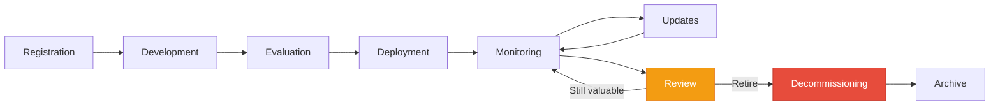
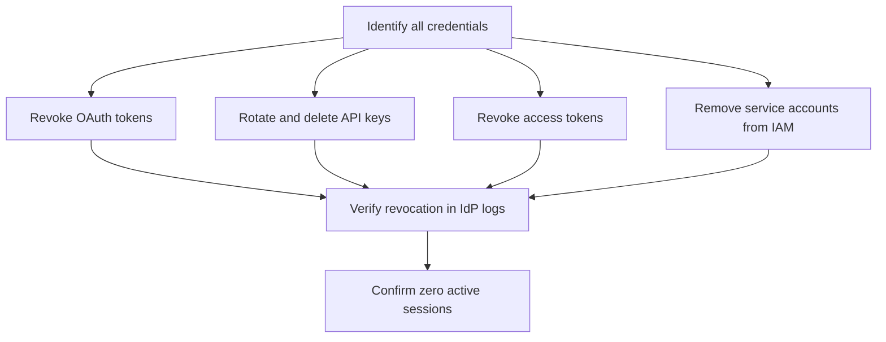

# Agent Retirement and Decommissioning: The Missing Lifecycle Phase


---

Every agent has a birth. Most teams obsess over that birth — the prompt engineering, the harness wiring, the first successful run. Fewer teams think seriously about the life that follows: monitoring, evaluation, cost attribution. Almost nobody thinks about the death.

That is a problem. By mid-2026, non-human identities outnumber human identities in enterprise environments by roughly 45:1 [^1]. Every agent you deploy accumulates API keys, cached tokens, memory stores, vector embeddings, model endpoints, and system integrations [^2]. If you never retire them properly, they become ghost agents — dormant identities with live privileges, invisible and forgotten, silently expanding your attack surface.

This article covers the missing lifecycle phase: when to retire an agent, how to measure whether it still delivers value, what to do with its data and credentials, and how to handle downstream consumers that depend on it.

## The lifecycle model most teams skip

The agent lifecycle is well understood in theory. Registration, development, evaluation, deployment, monitoring, updates, retirement [^3]. In practice, most teams implement the first six stages and treat the seventh as somebody else's problem.

The premium article *The Factory Factory* frames this as a Level 3 concern [^4]. At Level 3, a small pod runs a portfolio of agents as an automated business. Every agent has a lifecycle: creation, evaluation, deployment, monitoring, review, retirement. The pod manages this the way a company manages its workforce — hiring, onboarding, deploying, reviewing performance, and eventually retiring agents that no longer deliver value. No zombie agents. No runaway costs.

But retirement is not exclusive to Level 3. Any team running more than a handful of agents needs a decommissioning protocol. The complexity scales with the number of agents, but the discipline applies from day one.



## When to retire an agent

Retirement is a governance decision, not an infrastructure task [^3]. Four signals indicate an agent is a candidate for decommissioning:

**Declining ROI.** The Composite Agent Value (CAV) framework measures three dimensions: completion ROI (throughput), outcome ROI (business impact), and quality-normalised cost [^5]. An agent that finishes 95 per cent of tasks but produces zero business outcome has zero ROI [^5]. Schedule quarterly reviews of every agent's P&L. Kill the ones that do not break even [^4].

**Model obsolescence.** When the model powering an agent is deprecated — OpenAI's deprecation schedule gives a minimum 90-day notice before model shutdown [^6] — the agent must be migrated or retired. The legacy HTTP+SSE endpoint, for example, is deprecated and will stop working after 30 June 2026 [^7].

**Regulatory or policy change.** New compliance requirements may invalidate an agent's data access patterns, processing logic, or output handling. Re-evaluation against updated baselines is cheaper than remediation after an audit finding.

**Supersession.** A newer agent, a refactored pipeline, or a manual process that outperforms the agent on cost, quality, or reliability. Document the replacement explicitly — the most common decommissioning failure is retiring the old agent without confirming the new one is production-ready.

## Measuring agent value

Before you can retire an agent, you need to know whether it is worth keeping. Most teams track the wrong metrics. Task completion rate tells you the agent is running. It tells you nothing about whether it should be.

A practical measurement framework for Codex CLI agent pipelines:

| Metric | What it measures | How to collect |
|--------|-----------------|----------------|
| Outcome rate | Tasks producing a measurable business result | `codex exec --output-schema` with structured output validation [^7] |
| Cost per outcome | Total API spend divided by successful outcomes | OpenAI usage dashboard + pipeline telemetry |
| Error-to-intervention ratio | How often a human must intervene | Hook-based logging via `on_agent_error` events [^8] |
| Downstream dependency count | Systems consuming this agent's output | Audit via integration inventory |
| Memory staleness | Age of the agent's oldest active memory | `codex debug` memory inspection [^9] |
| Last meaningful update | Date of the most recent prompt, model, or harness change | Git log on AGENTS.md and config.toml |

When an agent scores poorly across multiple metrics for two consecutive review cycles, it is a retirement candidate.

## The decommissioning checklist

Retirement done properly is a coordinated sequence, not a single action. The following checklist reflects current best practices from identity governance frameworks [^1] [^3] and Codex CLI's own lifecycle tooling [^9].

### 1. Approval gate

Retirement requires an approved request, validated by the accountable owner and business sponsor [^3]. This prevents accidental shutdown of active workflows and creates an audit trail. In a Codex CLI context, this means a pull request against the agent's AGENTS.md and config.toml, reviewed by the team lead.

### 2. Dependency mapping

Before removing anything, map every downstream consumer:

- Which pipelines call this agent via `codex exec`?
- Which cron jobs or CI workflows trigger it?
- Which other agents consume its output?
- Which MCP servers does it provide or consume?

```bash
# Find all references to the agent in automation configs
grep -r "agent-name" .github/workflows/ cron/ scripts/ \
  --include="*.yml" --include="*.toml" --include="*.sh"

# Check for MCP server dependencies in config.toml
grep -r "agent-name" ~/.codex/config.toml
```

Downstream consumers must be migrated to a replacement or notified of the retirement before proceeding.

### 3. Credential revocation

This is the step most teams skip, and the one that creates the most security risk. Agents accumulate credentials over their lifetime [^2]:

- **API keys**: Rotate and then delete from the secrets manager
- **OAuth tokens**: Revoke via the identity provider; do not just let them expire
- **Access tokens**: Codex CLI access tokens created for CI runners [^7] must be explicitly revoked in ChatGPT Enterprise workspace settings
- **MCP server credentials**: PATs scoped to specific MCP servers (GitHub, Jira, Sentry) must be revoked individually
- **Service accounts**: Remove from all IAM groups and access policies



### 4. Data and memory cleanup

Codex CLI agents accumulate persistent state across sessions [^9]:

- **Memory store**: Use `codex debug clear-memories` to wipe the agent's SQLite-backed memory database. For selective cleanup, `/m_drop <query>` removes individual memories.
- **Rollout summaries**: Archived in `rollout_summaries/` — retain for compliance, delete for hygiene.
- **Session data**: Thread history, worktree state, and cached context. The `max_unused_days` and `max_rollout_age_days` configuration keys control automatic pruning [^9], but retirement demands explicit cleanup.
- **Vector embeddings**: If the agent used a memory MCP server (Mem0, Chroma), purge the agent's namespace from the vector store.

Archive before you delete. Compliance retention periods vary by jurisdiction and industry, but the principle is consistent: preserve the audit trail, then remove the operational data [^3].

### 5. Configuration removal

Remove the agent's footprint from the codebase:

```toml
# BEFORE: config.toml with the retired agent's MCP server
[mcp_servers.retired-agent-mcp]
  command = "npx"
  args = ["-y", "@retired/mcp-server"]

# AFTER: section removed, comment added for audit trail
# [mcp_servers.retired-agent-mcp] — RETIRED 2026-05-26, see PR #1247
```

Update AGENTS.md to reflect the retirement. Do not delete the section — mark it as retired with a date and rationale. This preserves institutional knowledge about what the agent did, what worked, and what failed [^3].

### 6. Registry update

The agent's entry in your inventory should be updated to reflect retirement status, not deleted [^3]. Maintain the historical record for compliance and for future teams who might wonder why a particular integration no longer exists.

```markdown
## Agent Inventory

| Agent | Status | Deployed | Retired | Reason |
|-------|--------|----------|---------|--------|
| pr-reviewer | Active | 2025-11-01 | — | — |
| stale-issue-closer | **Retired** | 2025-09-15 | 2026-05-26 | Superseded by GitHub Actions native workflow |
| nightly-audit | Active | 2026-01-10 | — | — |
```

## Handling the downstream fallout

The hardest part of retirement is not the technical cleanup. It is managing the consumers who depend on the agent's output. Three patterns help:

**Deprecation notice period.** Announce retirement at least two review cycles before execution. Use hooks to inject deprecation warnings into the agent's output during the notice period [^8].

**Shadow mode.** Run the replacement agent alongside the retiring agent for a defined period. Compare outputs. Only proceed with retirement when the replacement matches or exceeds the incumbent on all measured dimensions.

**Graceful degradation.** If downstream systems cannot be migrated immediately, provide a stub that returns a structured error with migration instructions rather than silently failing.

## Automating retirement with Codex CLI

For teams running multiple agents, manual retirement does not scale. A `codex exec` script can automate the mechanical steps:

```bash
#!/usr/bin/env bash
# retire-agent.sh — automated decommissioning for Codex CLI agents
set -euo pipefail

AGENT_NAME="${1:?Usage: retire-agent.sh <agent-name>}"
RETIRE_DATE=$(date +%Y-%m-%d)

echo "Retiring agent: ${AGENT_NAME} on ${RETIRE_DATE}"

# Step 1: Clear agent memories
codex debug clear-memories --agent "${AGENT_NAME}" 2>/dev/null || true

# Step 2: Revoke access tokens (requires admin)
codex exec "Revoke all access tokens associated with ${AGENT_NAME} \
  and confirm revocation in the audit log" \
  --approval-mode full-auto

# Step 3: Update AGENTS.md
codex exec "In AGENTS.md, mark the ${AGENT_NAME} section as RETIRED \
  with date ${RETIRE_DATE}. Add a note explaining the retirement reason. \
  Do not delete the section." \
  --approval-mode suggest

# Step 4: Remove from config.toml
codex exec "In config.toml, comment out the MCP server entry for \
  ${AGENT_NAME} with a retirement note dated ${RETIRE_DATE}." \
  --approval-mode suggest
```

## The cost of not retiring

The economics are stark. Enterprise AI agent deployments report 15–35 per cent operational cost reductions when agents are well-governed [^5]. But ungoverned portfolios — those without retirement discipline — accumulate zombie agents that consume API quota, hold credentials, and distort cost attribution.

The Composite Agent Value framework [^5] makes the case quantitatively: an agent with declining outcome ROI and stable operational cost has negative marginal value. Every day it runs past its useful life, it erodes the portfolio's aggregate return. At Level 3 scale, where a pod might manage dozens or hundreds of agents [^4], the compounding cost of deferred retirement is the difference between a profitable operation and a money pit.

## Summary

Agent retirement is not optional housekeeping. It is a governance action with security, compliance, and economic implications. The checklist is straightforward:

1. **Measure** — track outcome ROI, not just task completion
2. **Decide** — use quarterly reviews to identify retirement candidates
3. **Approve** — require formal sign-off before decommissioning
4. **Map** — identify and migrate all downstream dependencies
5. **Revoke** — credentials, tokens, service accounts, MCP access
6. **Clean** — memories, session data, vector embeddings
7. **Archive** — preserve the audit trail and institutional knowledge
8. **Update** — mark as retired in the inventory, never delete

The teams that treat agent death with the same rigour as agent birth are the ones building sustainable portfolios. Everyone else is accumulating ghost agents.

---

## Citations

[^1]: Token Security, "Agentic AI Lifecycle Management: From Training to Decommissioning Securely," 2026. [https://www.token.security/blog/agentic-ai-lifecycle-management-from-training-to-decommissioning-securely](https://www.token.security/blog/agentic-ai-lifecycle-management-from-training-to-decommissioning-securely)

[^2]: Dark Reading, "The Lifecycle Crisis: Managing the Birth, Life, and Death of AI Agents," 2026. [https://www.darkreading.com/identity-access-management-security/the-lifecycle-crisis-managing-the-birth-life-and-death-of-ai-agents](https://www.darkreading.com/identity-access-management-security/the-lifecycle-crisis-managing-the-birth-life-and-death-of-ai-agents)

[^3]: Prefactor, "Managing Agent Lifecycle from Development to Retirement," 2026. [https://prefactor.tech/learn/managing-agent-lifecycle](https://prefactor.tech/learn/managing-agent-lifecycle)

[^4]: Daniel Vaughan, "The Factory Factory," *Codex Knowledge Base Premium Series*, article 40, 2026. [https://codex.danielvaughan.com](https://codex.danielvaughan.com)

[^5]: Digital Applied, "AI Agent ROI Measurement 2026: Beyond Task Completion," 2026. [https://www.digitalapplied.com/blog/ai-agent-roi-measurement-beyond-task-completion](https://www.digitalapplied.com/blog/ai-agent-roi-measurement-beyond-task-completion)

[^6]: OpenAI, "Deprecations," API documentation, 2026. [https://platform.openai.com/docs/deprecations](https://platform.openai.com/docs/deprecations)

[^7]: OpenAI, "Codex CLI Changelog," 2026. [https://developers.openai.com/codex/changelog?type=codex-cli](https://developers.openai.com/codex/changelog?type=codex-cli)

[^8]: Daniel Vaughan, "Codex CLI Hooks After GA: The Complete Event Model, Trust Verification, and Production Patterns for v0.133," *Codex Knowledge Base*, 2026. [https://codex.danielvaughan.com/2026/05/25/codex-cli-hooks-after-ga-event-model-trust-verification-production-patterns/](https://codex.danielvaughan.com/2026/05/25/codex-cli-hooks-after-ga-event-model-trust-verification-production-patterns/)

[^9]: Daniel Vaughan, "Memory Lifecycle Management: Create, Consolidate, Clean, Delete in Codex CLI," *Codex Knowledge Base*, 2026. [https://codex.danielvaughan.com/2026/04/15/memory-lifecycle-management-codex-cli/](https://codex.danielvaughan.com/2026/04/15/memory-lifecycle-management-codex-cli/)
