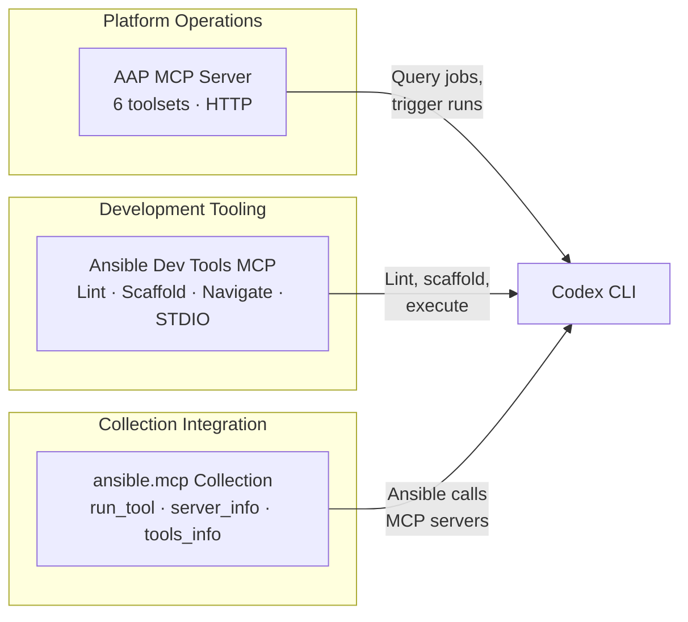
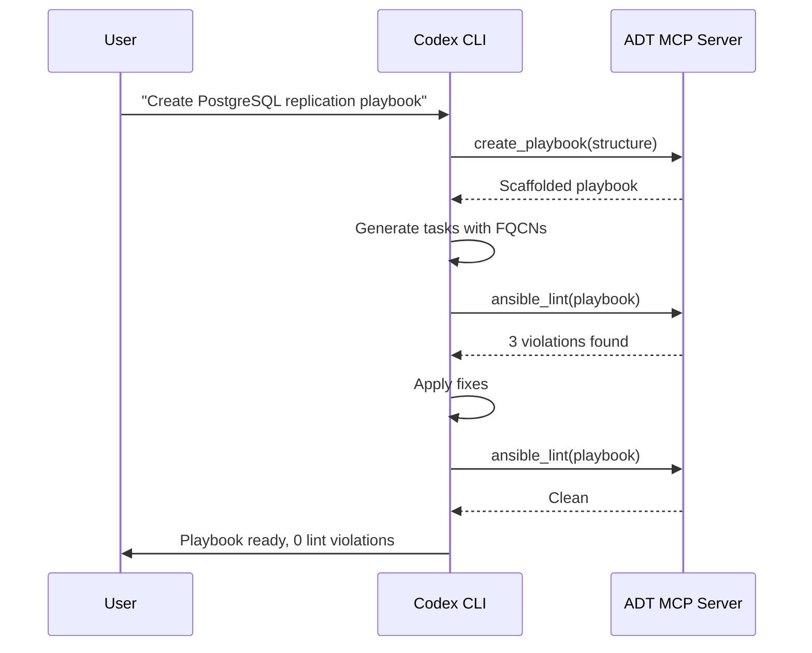

# Codex CLI for Ansible Development: MCP Servers, Playbook Generation, and Infrastructure Automation Workflows


---

Ansible occupies a unique position in the infrastructure automation landscape. Unlike Terraform or Pulumi, which declare desired state and let a provider reconcile, Ansible is procedural — playbooks describe a sequence of tasks that execute against inventory hosts over SSH or WinRM. This procedural nature makes it both an excellent fit for agent-assisted development (the model can reason step by step through task ordering) and a source of subtle failure modes (idempotency violations, handler ordering, fact caching). The Ansible MCP ecosystem in 2026 now spans three distinct server categories — platform operations, development tooling, and collection-level integration — each serving a different stage of the automation lifecycle.

This article maps those servers onto Codex CLI, shows how to configure them in `config.toml`, provides an AGENTS.md template for Ansible projects, and walks through four workflow patterns that exploit the combination.

## The Ansible MCP Landscape

Three server layers are available as of May 2026, each targeting a different concern.



### Red Hat Ansible Automation Platform MCP Server

The AAP MCP server shipped as a technology preview in Ansible Automation Platform 2.6.4 (February 2026)[^1]. It exposes six specialised toolsets over HTTPS on port 8448[^2]:

| Toolset | Capability |
|---------|-----------|
| `job_management` | Launch, monitor, cancel, and inspect automation jobs and templates |
| `inventory_management` | Query host details, group membership, and validate inventory sources |
| `system_monitoring` | Analyse controller logs, job stdout, and troubleshoot failures |
| `user_management` | Inspect access controls, teams, and organisational structure |
| `security_compliance` | Handle credentials, validate system integrity, audit configurations |
| `platform_configuration` | Query and modify platform settings and execution environment definitions |

Administrators choose between **read-only mode** (safe for querying and monitoring) and **read-write mode** (allows agents to launch jobs and apply changes)[^1]. For Codex CLI integration, read-only mode with `approval_mode = "unless-allow-listed"` provides the safest starting point — the agent can inspect infrastructure state but must request approval before triggering any job.

### Ansible Development Tools MCP Server

The ADT MCP server[^3], maintained alongside the Ansible VS Code extension, targets **content authoring**. It runs over STDIO and provides tools for:

- **Playbook creation** — scaffolds new playbooks with proper structure and best-practice patterns
- **Collection creation** — generates collection skeletons following Ansible Galaxy conventions
- **Ansible Lint with fix** — runs `ansible-lint` and applies auto-fixable rule violations
- **Execution Environment Builder** — creates and validates EE definitions for `ansible-builder`
- **Ansible Navigator** — executes playbooks with smart environment detection and container management
- **Zen of Ansible / Best Practices** — injects Ansible design philosophy and content guidelines into agent context
- **Environment Info** — checks Python, Ansible, and development tool versions[^3]

This server requires Python 3.11+ and either Node.js 24+ (npm package) or Docker/Podman (container image)[^3]. It is compatible with any MCP client, including Codex CLI, Claude Code, Cursor, and Gemini CLI[^3].

### ansible.mcp Collection

The `ansible.mcp` collection (technology preview, requires ansible-core 2.16+)[^4] flips the relationship: instead of Codex CLI consuming an Ansible-related MCP server, Ansible playbooks consume *any* MCP server through three modules:

- `ansible.mcp.server_info` — retrieve MCP server metadata
- `ansible.mcp.tools_info` — discover available tools on a connected server
- `ansible.mcp.run_tool` — invoke a specific tool and capture its output[^4]

The companion `ansible.mcp_builder` collection[^5] automates MCP server installation into Execution Environments, with pre-built roles for AWS, Azure, and GitHub MCP servers.

## Configuring Codex CLI

### config.toml for Both Servers

```toml
# ~/.codex/config.toml — Ansible development profile

[mcp_servers.ansible-dev-tools]
command = "npx"
args = ["-y", "@anthropic-ai/ansible-dev-tools-mcp"]
env = { WORKSPACE_ROOT = "." }

[mcp_servers.ansible-aap]
type = "url"
url = "https://aap.internal.example.com:8448/mcp/sse"
headers = { Authorization = "Bearer ${AAP_MCP_TOKEN}" }

[mcp_servers.ansible-aap.approval_mode]
mode = "unless-allow-listed"
allowed_tools = [
  "list_job_templates",
  "get_job_details",
  "list_inventories",
  "get_host_details",
  "list_credentials"
]
```

The ADT server runs locally over STDIO; the AAP server connects over HTTP with a bearer token stored in an environment variable. The `allowed_tools` list gates which AAP tools the agent may invoke without approval — read operations pass through, write operations (like `launch_job`) surface for confirmation[^6].

### AGENTS.md Template for Ansible Projects

```markdown
# AGENTS.md — Ansible Automation Project

## Project Stack
- ansible-core 2.20.4, Ansible community package 13.5.0
- Python 3.12+ required for controller and managed nodes
- Execution Environments built with ansible-builder 3.x
- Molecule 25.x for role testing with Podman driver

## Anti-Hallucination Rules
- NEVER invent module parameters. Check `ansible-doc <module>` first.
- NEVER use deprecated `include:` — use `ansible.builtin.include_tasks`
  or `ansible.builtin.import_tasks` with FQCNs.
- ALL module references MUST use fully qualified collection names (FQCNs):
  `ansible.builtin.copy`, NOT `copy`.
- Handler names are global within a play. NEVER duplicate handler names
  across roles unless intentionally overriding.
- `become: true` is required for privilege escalation. Do NOT assume
  root access on managed hosts.
- Ansible 13 dropped Python 3.10 support on the controller. Do NOT
  generate code targeting Python < 3.11.

## Verification Commands
- Lint: `ansible-lint --strict`
- Syntax check: `ansible-playbook --syntax-check site.yml`
- Dry run: `ansible-playbook --check --diff site.yml`
- Molecule test: `molecule test`
- Collection build: `ansible-galaxy collection build --force`

## Directory Conventions
- `roles/` — one directory per role, each with `tasks/`, `handlers/`,
  `defaults/`, `meta/`, `molecule/`
- `inventories/` — per-environment inventory (dev, staging, prod)
- `group_vars/` and `host_vars/` — variable hierarchy
- `collections/requirements.yml` — pinned collection dependencies
- `execution-environments/` — EE definitions for ansible-builder
```

## Workflow Patterns

### Pattern 1: Playbook Generation with Lint Validation

The ADT MCP server's playbook creation and lint tools combine into a generate-validate loop:

```bash
codex "Create an Ansible playbook that provisions a PostgreSQL 17
  cluster on RHEL 9 with streaming replication. Use the
  community.postgresql collection. Lint the result and fix any
  violations before committing."
```

Codex uses the ADT server's playbook creation tool to scaffold the structure, generates tasks using FQCNs (guided by AGENTS.md), then invokes `ansible-lint` through the ADT server to catch violations. The lint-fix loop typically converges in two to three iterations[^3].



### Pattern 2: Infrastructure Audit with AAP Integration

Connect the AAP MCP server for production visibility:

```bash
codex "Query the AAP inventory for all hosts in the 'webservers' group.
  Check which hosts have failed jobs in the last 24 hours. For each
  failing host, inspect the job stdout and summarise the root cause."
```

In read-only mode, the agent queries `inventory_management` and `job_management` toolsets without triggering any changes. The investigation flows through `list_inventories` → `get_host_details` → `get_job_details` → stdout analysis, producing a structured diagnostic report[^2].

### Pattern 3: Role Development with Molecule Testing

```bash
codex "Create a new Ansible role called 'hardened_ssh' that configures
  OpenSSH with CIS Level 2 benchmarks. Include a Molecule scenario
  using the Podman driver. Run molecule test and fix any failures."
```

Codex scaffolds the role directory structure, generates tasks (using `ansible.builtin.lineinfile` and `ansible.builtin.template` with FQCNs), creates the Molecule scenario with Podman, and runs `molecule test` in the sandbox. Network access must be enabled for container image pulls[^7]:

```toml
# Sandbox configuration for Molecule testing
[sandbox_workspace_write]
network_access = true
```

### Pattern 4: Batch Inventory Audit with codex exec

For fleet-wide audits, use `codex exec` with `--output-schema` to produce structured JSON:

```bash
codex exec "Audit the Ansible inventory at inventories/production.
  For each host, check: (1) whether it appears in at least one group,
  (2) whether ansible_host is set, (3) whether the host has a
  corresponding entry in host_vars/. Report non-compliant hosts." \
  --output-schema ./schemas/inventory-audit.json \
  -o ./reports/inventory-audit.json
```

The schema enforces a stable output shape for downstream CI consumption:

```json
{
  "type": "object",
  "properties": {
    "total_hosts": { "type": "integer" },
    "non_compliant": {
      "type": "array",
      "items": {
        "type": "object",
        "properties": {
          "hostname": { "type": "string" },
          "issues": { "type": "array", "items": { "type": "string" } }
        },
        "required": ["hostname", "issues"],
        "additionalProperties": false
      }
    }
  },
  "required": ["total_hosts", "non_compliant"],
  "additionalProperties": false
}
```

## Server Composition

For full-lifecycle Ansible development, compose the ADT and AAP servers with complementary MCP servers:

| Server | Purpose |
|--------|---------|
| Ansible Dev Tools | Content authoring, linting, scaffolding |
| AAP MCP Server | Production inventory, job management, compliance |
| GitHub MCP Server | PR workflows, issue tracking for playbook repos |
| Filesystem MCP | Read vault-encrypted files, inventory templates |

The ADT server handles the inner development loop; the AAP server provides production context; GitHub MCP connects the CI/CD pipeline. This three-server composition mirrors the pattern used for cloud platform development[^8] but replaces the cloud provider server with AAP.

## Model Selection

Ansible playbooks are YAML-heavy with strict indentation rules and a large module surface area. Model selection matters:

- **GPT-5.3-Codex** (default) — best for complex playbook generation involving multiple roles, handlers, and Jinja2 templates. Strong FQCN adherence when guided by AGENTS.md[^9].
- **GPT-5.3-Codex-Spark** — suitable for quick lint fixes, single-task generation, and inventory queries. Lower latency, lower cost[^10].
- **o4-mini** — effective for reasoning about task ordering, handler dependencies, and idempotency analysis. Use for playbook review workflows.

## Sandbox and Security Considerations

Ansible development in Codex CLI requires careful sandbox configuration:

1. **Network access** — Molecule tests pull container images; `ansible-galaxy` downloads collections. Enable `network_access = true` for development workflows[^7].
2. **SSH keys** — Never expose production SSH keys in the sandbox. Use Molecule with Podman (no SSH required) for local testing. For AAP integration, use bearer tokens rather than SSH credentials.
3. **Vault passwords** — Never pass `ansible-vault` passwords through environment variables visible to the agent. Use `--vault-password-file` pointing to a file outside the writable root, or query vault secrets through the AAP MCP server's credential toolset[^2].
4. **Approval gating** — AAP read-write mode allows the agent to *launch jobs*. Gate all write operations behind approval mode. A misconfigured agent launching a playbook against production inventory is a serious incident vector.
5. **FQCN enforcement** — Short module names (`copy`, `template`) still work but are deprecated and create ambiguity with custom collections. AGENTS.md must mandate FQCNs[^11].

## Limitations

- **AAP MCP server is technology preview** — the toolset surface, authentication model, and configuration keys may change before GA[^1]. ⚠️
- **ADT MCP server is technology preview** — tool names and capabilities are subject to revision[^3]. ⚠️
- **Training data lag** — models may hallucinate module parameters from ansible-core 2.18 or earlier. AGENTS.md anti-hallucination rules and `ansible-doc` verification are essential.
- **Vault handling** — no MCP server currently supports transparent vault decryption. Vault-encrypted variables appear as opaque blobs to the agent.
- **EDA integration** — Event-Driven Ansible is not yet exposed through the official AAP MCP server. Community alternatives like `sibilleb/AAP-Enterprise-MCP-Server`[^12] provide partial EDA coverage but are not Red Hat-supported.
- **Token budget** — large inventories and verbose job stdout can consume significant context. Use `--output-schema` to constrain output shape, and prefer targeted queries over full inventory dumps.
- **ansible.mcp collection** — the bidirectional integration (Ansible calling MCP servers) requires ansible-core 2.16+ and Python 3.10+, but does not yet support streaming responses[^4].

## Citations

[^1]: Red Hat, "IT automation with agentic AI: Introducing the MCP server for Red Hat Ansible Automation Platform", January 2026. [https://www.redhat.com/en/blog/it-automation-agentic-ai-introducing-mcp-server-red-hat-ansible-automation-platform](https://www.redhat.com/en/blog/it-automation-agentic-ai-introducing-mcp-server-red-hat-ansible-automation-platform)

[^2]: Red Hat, "Deploying Ansible MCP server on Ansible Automation Platform — Containerized installation", Ansible Automation Platform 2.6 Documentation, 2026. [https://docs.redhat.com/en/documentation/red_hat_ansible_automation_platform/2.6/html/containerized_installation/deploying-ansible-mcp-server](https://docs.redhat.com/en/documentation/red_hat_ansible_automation_platform/2.6/html/containerized_installation/deploying-ansible-mcp-server)

[^3]: Ansible Project, "Ansible Development Tools MCP Server", 2026. [https://docs.ansible.com/projects/vscode-ansible/mcp/](https://docs.ansible.com/projects/vscode-ansible/mcp/)

[^4]: ansible-collections, "ansible.mcp — Ansible Model Context Protocol (MCP) plugins", GitHub, 2026. [https://github.com/ansible-collections/ansible.mcp](https://github.com/ansible-collections/ansible.mcp)

[^5]: redhat-cop, "ansible.mcp_builder — An Ansible Collection that facilitates installing MCP servers in Execution Environments", GitHub, 2026. [https://github.com/redhat-cop/ansible.mcp_builder](https://github.com/redhat-cop/ansible.mcp_builder)

[^6]: OpenAI, "Advanced Configuration — Codex CLI", Codex Developer Documentation, 2026. [https://developers.openai.com/codex/config-advanced](https://developers.openai.com/codex/config-advanced)

[^7]: OpenAI, "Sandbox — Codex CLI", Codex Developer Documentation, 2026. [https://developers.openai.com/codex/concepts/sandboxing](https://developers.openai.com/codex/concepts/sandboxing)

[^8]: OpenAI, "MCP Servers — Codex CLI", Codex Developer Documentation, 2026. [https://developers.openai.com/codex/cli/features](https://developers.openai.com/codex/cli/features)

[^9]: OpenAI, "Introducing GPT-5.3-Codex", May 2026. [https://openai.com/index/introducing-gpt-5-3-codex/](https://openai.com/index/introducing-gpt-5-3-codex/)

[^10]: OpenAI, "Introducing GPT-5.3-Codex-Spark", 2026. [https://openai.com/index/introducing-gpt-5-3-codex-spark/](https://openai.com/index/introducing-gpt-5-3-codex-spark/)

[^11]: Ansible Community, "Ansible 13 Porting Guide", Ansible Community Documentation, 2026. [https://docs.ansible.com/projects/ansible/latest/porting_guides/porting_guide_13.html](https://docs.ansible.com/projects/ansible/latest/porting_guides/porting_guide_13.html)

[^12]: sibilleb, "AAP-Enterprise-MCP-Server — MCP Server for Ansible Automation Platform and Event-Driven Ansible", GitHub, 2026. [https://github.com/sibilleb/AAP-Enterprise-MCP-Server](https://github.com/sibilleb/AAP-Enterprise-MCP-Server)
