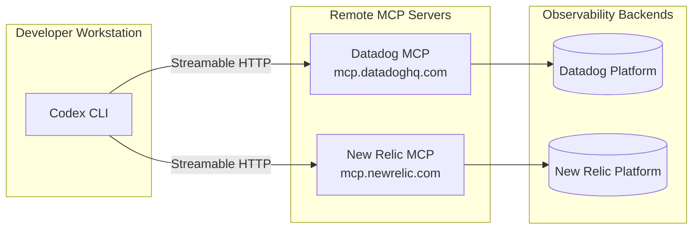

# Codex CLI with Datadog and New Relic: Vendor-Specific Observability for Agent Pipelines


---

The open-standards observability story for Codex CLI — OpenTelemetry traces, Prometheus metrics, Grafana dashboards — is well documented. But most enterprise teams do not run vanilla OTel backends. They run Datadog or New Relic, with years of investment in dashboards, alert policies, and on-call routing. This article bridges the gap: wiring Codex CLI into vendor-specific observability platforms via their MCP servers so that agent pipelines get the same incident response, cost attribution, and SLA monitoring that production services already enjoy.

Both vendors shipped remote MCP servers in early 2026 — Datadog on 9 March [^1] and New Relic on 24 February [^2] — and both work with Codex CLI's Streamable HTTP transport. The result is bidirectional: Codex can query live telemetry to inform its coding decisions, and your existing observability stack can monitor the agent itself.

## Architecture Overview



Both servers are remote-hosted — no local binary to install, no Docker container to run. Authentication flows through OAuth 2.0 (Datadog) or API key headers (New Relic), both configurable in `config.toml`.

## Datadog MCP Server Configuration

Datadog's MCP server exposes 100+ tools across 16 toolsets, from core log and metric queries through APM trace analysis, database monitoring, Kubernetes resource inspection, CI pipeline analytics, and even code execution in a managed sandbox [^3].

### config.toml

```toml
[mcp_servers.datadog]
url = "https://mcp.datadoghq.com/mcp?toolsets=core,apm,alerting,software-delivery"
startup_timeout_sec = 15
tool_timeout_sec = 60
enabled = true
```

Authenticate via the OAuth flow:

```bash
codex mcp login datadog
```

This opens a browser to complete Datadog's OAuth handshake. Codex stores the resulting credentials until the token expires [^4]. For CI environments where browser login is impractical, use API key authentication instead:

```toml
[mcp_servers.datadog]
url = "https://mcp.datadoghq.com/mcp?toolsets=core,apm"
env_http_headers = { "DD-API-KEY" = "DD_API_KEY", "DD-APPLICATION-KEY" = "DD_APP_KEY" }
```

### Toolset Selection

The `?toolsets=` query parameter controls which tool categories load. Loading everything (`?toolsets=all`) floods the context window with 100+ tool descriptions. A pragmatic default for agent development:

| Toolset | Key Tools | When to Enable |
|---------|-----------|----------------|
| `core` | `search_datadog_logs`, `get_datadog_metric`, `search_datadog_monitors` | Always |
| `apm` | `apm_explore_trace`, `apm_latency_bottleneck_analysis`, `apm_search_watchdog_stories` | Microservices debugging |
| `alerting` | `validate_datadog_monitor`, `get_monitor_coverage`, `create_datadog_monitor` | Monitor-as-code workflows |
| `software-delivery` | `search_datadog_ci_pipeline_events`, `get_datadog_flaky_tests`, `aggregate_dora_deployments` | CI/CD pipeline analysis |
| `security` | `datadog_secrets_scan`, `search_datadog_security_signals` | Security-sensitive repos |

### Rate Limits

Datadog enforces 50 requests per 10-second burst window and 50,000 monthly tool calls [^3]. For batch workflows using `codex exec`, this means roughly 1,600 tool calls per day — plan accordingly.

## New Relic MCP Server Configuration

New Relic's MCP server provides 35+ tools with a standout feature: natural language to NRQL conversion [^5]. Where Datadog requires you to know its query syntax, New Relic's `natural_language_to_nrql_query` tool lets the agent describe what it wants in plain English and receive executable NRQL.

### config.toml

```toml
[mcp_servers.newrelic]
url = "https://mcp.newrelic.com/mcp/"
env_http_headers = { "Api-Key" = "NEW_RELIC_API_KEY" }
startup_timeout_sec = 15
tool_timeout_sec = 60
enabled = true
```

New Relic uses API key authentication (NRAK-prefixed user keys) rather than OAuth [^5]. For EU-region accounts, swap the URL to `https://mcp.eu.newrelic.com/mcp/` [^6].

### Key Tool Categories

New Relic organises its 35 tools across six categories [^5]:

- **Discovery**: `get_entity`, `search_entity_with_tag`, `list_related_entities` — map your service topology
- **Data Access**: `execute_nrql_query`, `natural_language_to_nrql_query`, `list_recent_logs`, `query_logs` — the query engine
- **Alerting**: `list_alert_policies`, `list_alert_conditions` — audit alert coverage
- **Incident Response**: `search_incident`, `list_change_events`, `analyze_deployment_impact` — post-deploy verification
- **Performance**: `analyze_golden_metrics`, `analyze_transactions`, `analyze_kafka_metrics`, `analyze_threads` — deep diagnostics
- **Dashboards**: `get_dashboard`, `list_dashboards` — read existing visualisations

## Composing Both Servers

There is no reason to choose one. Many organisations run Datadog for infrastructure and APM whilst using New Relic for application-level analytics and synthetic monitoring. Codex CLI supports multiple MCP servers concurrently:

```toml
[mcp_servers.datadog]
url = "https://mcp.datadoghq.com/mcp?toolsets=core,apm"
startup_timeout_sec = 15
tool_timeout_sec = 60

[mcp_servers.newrelic]
url = "https://mcp.newrelic.com/mcp/"
env_http_headers = { "Api-Key" = "NEW_RELIC_API_KEY" }
startup_timeout_sec = 15
tool_timeout_sec = 60
```

When both servers are active, the agent can cross-reference signals — for example, correlating a Datadog APM trace with New Relic error groups to build a complete incident picture.

## Workflow Patterns

### 1. Incident-Driven Debugging

The most immediate use case: point Codex at a production incident and let it pull live telemetry.

```bash
codex "Service checkout-api has elevated error rates.
Use Datadog to search recent logs for errors in checkout-api,
then check New Relic golden metrics for the last hour.
Identify the root cause and suggest a fix."
```

The agent calls `search_datadog_logs` with service and error-level filters, then `analyze_golden_metrics` on the New Relic side to compare throughput and response time trends. With both signal sources, it can distinguish between a code regression (error rate spike without throughput change) and a load issue (throughput spike preceding errors).

### 2. Post-Deployment Verification

After a `codex exec` batch run that modifies multiple services, verify the deployment's observability impact:

```bash
codex "I just deployed commit abc123 to the payments service.
Use New Relic analyze_deployment_impact to check for regressions.
Then use Datadog to search for any new monitor alerts in the last 15 minutes.
If anything looks wrong, draft a rollback plan."
```

### 3. Monitor-as-Code with Validation

Datadog's `validate_datadog_monitor` tool lets Codex check monitor definitions before applying them, and `get_monitor_coverage` identifies gaps:

```bash
codex "Check monitor coverage for the order-service in Datadog.
For any gaps, generate monitor definitions in Terraform HCL format
using the Datadog provider. Validate each monitor before writing."
```

### 4. CI Pipeline Investigation

When a CI pipeline fails intermittently, the `software-delivery` toolset provides deep visibility:

```bash
codex "Use Datadog to find flaky tests in the main branch CI pipeline
for the last 7 days. For the top 3 flakiest tests,
search for related error tracking issues and suggest fixes."
```

## AGENTS.md Addendum

For projects using vendor observability, add context to your `AGENTS.md`:

```markdown
## Observability

- **Primary APM**: Datadog — all services emit traces via dd-trace-py/dd-trace-js
- **Synthetic monitoring**: New Relic — synthetic monitors cover all public endpoints
- **Alert routing**: Datadog monitors → PagerDuty → #incidents Slack channel
- **Key dashboards**: "Service Overview" (Datadog), "User Impact" (New Relic)

When investigating production issues:
1. Check Datadog monitors and recent alerts first
2. Use New Relic golden metrics for baseline comparison
3. Cross-reference Datadog APM traces with New Relic error groups
4. Never create or modify monitors without validating first
```

## Security Considerations

**Token scope**: Datadog's OAuth flow requests `mcp_read` and `mcp_write` permissions [^4]. For read-only agent workflows, request only `mcp_read`. New Relic API keys should use the minimum required role — `User` rather than `Admin` where possible.

**Credential storage**: Both `DD_API_KEY` / `DD_APP_KEY` and `NEW_RELIC_API_KEY` must live in environment variables, not in `config.toml` directly. Use `env_http_headers` to reference them safely.

**Approval gating**: For tools that modify state (Datadog's `create_datadog_monitor`, `execute_datadog_workflow`), set explicit approval:

```toml
[mcp_servers.datadog]
url = "https://mcp.datadoghq.com/mcp?toolsets=core,apm,alerting"
approval_mode = "approve"
enabled_tools = ["search_datadog_logs", "get_datadog_metric", "search_datadog_monitors", "validate_datadog_monitor"]
```

**Network access**: Both servers require outbound HTTPS from the sandbox. Codex CLI's `full-auto` mode enables network access by default; in `suggest` or `auto-edit` modes, ensure your sandbox policy permits connections to `mcp.datadoghq.com` and `mcp.newrelic.com`.

## Model Selection

Both servers return structured data that benefits from strong reasoning. For incident investigation workflows involving multiple tool calls and cross-referencing:

- **o3**: Best for complex multi-step investigations requiring synthesis across both platforms
- **o4-mini**: Suitable for single-vendor queries and straightforward log searches
- **gpt-5.5**: ⚠️ Strong reasoning but higher latency and cost; reserve for critical incidents

## Limitations

- **Context budget**: Loading both servers simultaneously consumes significant context with tool descriptions. Use `enabled_tools` to whitelist only the tools your workflows need [^7].
- **Rate limits**: Datadog's 50-request/10-second burst limit can throttle aggressive batch workflows. New Relic's rate limits are account-tier dependent [^5].
- **Write operations**: Both servers support creating monitors, dashboards, and alerts, but Codex's sandbox does not roll back vendor-side changes. Gate writes behind `approval_mode = "approve"`.
- **Training data lag**: Neither o3 nor o4-mini have training data covering the March 2026 MCP server launches. The agent relies entirely on tool descriptions for correct usage — which generally works well but can produce suboptimal queries without AGENTS.md guidance.
- **No webhook integration**: Neither MCP server supports push-based notifications. The agent must poll for new incidents rather than receiving real-time alerts.
- **GovCloud**: Datadog's MCP server is not available on GovCloud sites (ddog-gov.com) [^3].

## Citations

[^1]: [Datadog Launches MCP Server — Press Release](https://investors.datadoghq.com/news-releases/news-release-details/datadog-launches-mcp-server-provide-ai-agents-secure-real-time), Datadog Investor Relations, March 2026
[^2]: [New Relic Launches Agentic AI Monitoring and MCP Server](https://www.hpcwire.com/bigdatawire/this-just-in/new-relic-launches-agentic-ai-monitoring-and-mcp-server/), BigDATAwire, February 2026
[^3]: [Datadog MCP Server Documentation](https://docs.datadoghq.com/bits_ai/mcp_server/), Datadog Docs, 2026
[^4]: [Set Up the Datadog MCP Server](https://docs.datadoghq.com/bits_ai/mcp_server/setup/), Datadog Docs, 2026
[^5]: [New Relic MCP Server Review — 35 Tools, Free Tier](https://chatforest.com/reviews/newrelic-mcp-server/), ChatForest, 2026
[^6]: [Set up New Relic MCP](https://docs.newrelic.com/docs/agentic-ai/mcp/setup/), New Relic Documentation, 2026
[^7]: [Model Context Protocol — Codex CLI](https://developers.openai.com/codex/mcp), OpenAI Developers, 2026
