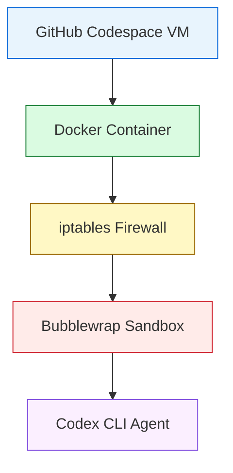
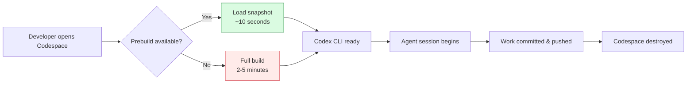

# Codex CLI in GitHub Codespaces: Devcontainer Configuration, Prebuilds, and Cloud Agent Workflows


---

Running Codex CLI on a local workstation works well enough for solo development, but GitHub Codespaces offers something materially better for teams: reproducible, ephemeral environments where every developer — and every agent session — starts from an identical, pre-warmed image with credentials scoped to a single workspace. This article covers the practical configuration needed to run Codex CLI v0.133+ inside GitHub Codespaces, from a minimal devcontainer.json through to organisation-wide governance policies.

Existing coverage in this knowledge base addresses devcontainers and Docker sandboxes generically[^1] and cloud development environments on Coder, Daytona, and DevPod[^2]. This article focuses specifically on the GitHub Codespaces platform, its native secrets management, prebuild infrastructure, and organisation policy controls.

## Why Codespaces for Agent Workloads?

Three capabilities make Codespaces a strong fit for Codex CLI:

**Instant, disposable environments.** Each Codespace is a full Linux VM with a Docker host. Destroying it after an agent session removes all generated artefacts, eliminating credential residue and reducing the blast radius of any sandbox escape[^3].

**Integrated secrets.** Codespaces secrets use libsodium sealed-box encryption and are injected as environment variables at container start[^4]. You never commit an `OPENAI_API_KEY` to a dotfile; it arrives from GitHub's encrypted store, scoped to the repository or organisation.

**Prebuilds.** A prebuild snapshots the fully built devcontainer — with Codex CLI installed, MCP servers configured, and dependencies resolved — so new Codespaces launch in seconds rather than minutes[^5].

## Minimal Devcontainer Configuration

The simplest path uses the community devcontainer feature maintained by Engin Diri[^6]:

```json
{
  "name": "Codex Agent Environment",
  "image": "mcr.microsoft.com/devcontainers/base:ubuntu-24.04",
  "features": {
    "ghcr.io/devcontainers/features/node:1": {
      "version": "22"
    },
    "ghcr.io/dirien/devcontainer-feature-codex/codex:0": {
      "version": "latest"
    }
  },
  "remoteEnv": {
    "OPENAI_API_KEY": "${localEnv:OPENAI_API_KEY}"
  },
  "postCreateCommand": "codex --version"
}
```

The Codex feature requires Node.js, hence the explicit `node` feature preceding it[^6]. The `remoteEnv` block forwards your local API key during development, but for Codespaces you should prefer GitHub's encrypted secrets mechanism instead (covered below).

### Pinning the Codex Version

For reproducibility, pin the Codex CLI version rather than relying on `latest`:

```json
"ghcr.io/dirien/devcontainer-feature-codex/codex:0": {
  "version": "0.133.0"
}
```

This prevents a new Codex release from silently altering agent behaviour mid-sprint. Update the pin deliberately, test, then merge.

## Enabling the Bubblewrap Sandbox

Codex CLI's Linux sandbox uses bubblewrap (`bwrap`) to isolate filesystem writes and block network access[^7]. Inside a devcontainer, Docker's default security profile can prevent bubblewrap from creating the user namespaces it needs. OpenAI's reference secure devcontainer solves this[^8]:

```json
{
  "name": "Codex Secure Agent",
  "build": {
    "dockerfile": "Dockerfile.secure"
  },
  "runArgs": [
    "--cap-add=NET_ADMIN",
    "--cap-add=NET_RAW",
    "--cap-add=SYS_ADMIN",
    "--security-opt", "seccomp=unconfined",
    "--security-opt", "apparmor=unconfined"
  ],
  "remoteEnv": {
    "OPENAI_API_KEY": "${localEnv:OPENAI_API_KEY}"
  },
  "postStartCommand": "bash .devcontainer/init-firewall.sh"
}
```

The `SYS_ADMIN` capability and the unconfined seccomp/AppArmor profiles relax Docker's outer sandbox just enough for bubblewrap to construct Codex's inner sandbox[^8]. The `init-firewall.sh` script then applies an allowlist-driven iptables policy, blocking all outbound traffic except the OpenAI API, GitHub, and npm registries.



The key architectural insight: the container handles network isolation and credential scoping; bubblewrap handles filesystem isolation; Codex's approval policies handle the semantic layer[^3].

> **⚠️ Codespaces limitation:** At the time of writing, GitHub Codespaces does not expose fine-grained control over Docker security profiles via `devcontainer.json` `runArgs` in the same way a local Docker host does. The `SYS_ADMIN` capability works in Codespaces because the underlying VM grants it, but this behaviour is undocumented and may change. Test your secure profile in a Codespace before relying on it in production workflows.

## Secrets Management

Never store API keys in devcontainer.json, environment files, or repository code. GitHub Codespaces provides three tiers of encrypted secret storage[^4]:

### Personal Secrets

Set via **Settings → Codespaces → Secrets** or the CLI:

```bash
gh secret set OPENAI_API_KEY --app codespaces \
  --body "sk-proj-..."
```

Personal secrets are available in all your Codespaces across repositories (or scoped to specific repos).

### Repository Secrets

Set by repository administrators:

```bash
gh secret set OPENAI_API_KEY --app codespaces \
  --repo org/my-project --body "sk-proj-..."
```

### Organisation Secrets

Set by organisation owners, with repository-level access policies:

```bash
gh api -X PUT /orgs/my-org/codespaces/secrets/OPENAI_API_KEY \
  -f encrypted_value="..." \
  -f key_id="..." \
  -f visibility="selected" \
  -f selected_repository_ids='[123,456]'
```

Organisation secrets let you provision a shared API key for the entire engineering team while restricting it to approved repositories[^9]. This eliminates the pattern where every developer manages their own OpenAI key with unpredictable spending limits.

### Recommended Secrets Declaration

Declare which secrets your Codespace expects in `devcontainer.json`:

```json
{
  "secrets": {
    "OPENAI_API_KEY": {
      "description": "OpenAI API key for Codex CLI agent sessions",
      "documentationUrl": "https://platform.openai.com/api-keys"
    },
    "GITHUB_MCP_TOKEN": {
      "description": "PAT for the GitHub MCP server (repo, issues, PR scopes)"
    }
  }
}
```

When a developer creates a Codespace without these secrets configured, GitHub prompts them to set the values before launch[^10].

## Prebuilds for Instant Agent Startup

Installing Codex CLI, Node.js, bubblewrap, and any MCP server dependencies at Codespace creation time adds two to five minutes of startup latency. Prebuilds eliminate this by snapshotting the fully built container image[^5].

### Configuring a Prebuild

In your repository's **Settings → Codespaces → Prebuilds**, create a configuration for your default branch:

- **Branch:** `main`
- **Configuration file:** `.devcontainer/devcontainer.json`
- **Trigger:** Every push (default) or on configuration change only
- **Region:** Select all regions where your team operates

Prebuilds run as GitHub Actions workflows. The first build takes the full install time; subsequent builds are incremental.

### Machine Type Selection

Codex CLI is I/O-bound during file operations and network-bound during model calls. For most agent workloads, a 4-core / 16 GB machine is sufficient. Set a minimum specification in `devcontainer.json`[^11]:

```json
{
  "hostRequirements": {
    "cpus": 4,
    "memory": "16gb",
    "storage": "64gb"
  }
}
```

For parallel subagent workloads or large monorepos, consider 8-core / 32 GB. The `storage` field matters because Codex sessions can generate significant intermediate output, and running out of disk mid-session causes silent failures.



## Codex Configuration Inside Codespaces

### config.toml

Mount your Codex configuration into the container via the `mounts` property or bake it into the Dockerfile. A typical `config.toml` for Codespace use:

```toml
[model]
default = "o3"
large_context = "o3"

[approval]
mode = "auto-edit"

[sandbox]
network_allowed_hosts = [
  "api.openai.com:443",
  "api.github.com:443",
  "registry.npmjs.org:443"
]

[history]
save_history = true
```

### AGENTS.md

Include an `AGENTS.md` in your repository root so Codex understands the project context within the Codespace:

```markdown
# Project Agent Instructions

## Environment
- This project runs in GitHub Codespaces with Ubuntu 24.04
- Codex CLI is pre-installed via devcontainer feature
- Bubblewrap sandbox is active; do not attempt to disable it

## MCP Servers
- GitHub MCP server available for issue/PR operations
- Use `gh` CLI for GitHub API calls

## Rules
- All changes must be committed to a feature branch
- Run `npm test` before committing
- Never access secrets directly; use environment variables
```

### MCP Server Composition

Add MCP servers to your devcontainer by including them in the Dockerfile or as additional features. For example, combining Codex CLI with the GitHub MCP server[^12]:

```json
{
  "features": {
    "ghcr.io/devcontainers/features/node:1": { "version": "22" },
    "ghcr.io/dirien/devcontainer-feature-codex/codex:0": {},
    "ghcr.io/devcontainers/features/github-cli:1": {}
  },
  "postCreateCommand": "npm install -g @anthropic-ai/mcp-server-github || true"
}
```

Then reference the server in your project's Codex `config.toml`:

```toml
[mcp_servers.github]
command = "npx"
args = ["-y", "@modelcontextprotocol/server-github"]
env = { GITHUB_PERSONAL_ACCESS_TOKEN = "${GITHUB_MCP_TOKEN}" }
```

The `GITHUB_MCP_TOKEN` value comes from Codespaces secrets, never from a committed file.

## Organisation Governance

For teams, Codespaces offers organisation-level policies that complement Codex CLI's own governance features[^13]:

### Base Image Restrictions

Restrict which container images can be used for Codespaces:

```
Settings → Codespaces → Base image → Only allow specific images
```

This ensures every Codespace uses an approved image with the correct Codex version, sandbox configuration, and security hardening. Developers cannot bypass the policy by editing their local `devcontainer.json`.

### Cost Controls

Codespaces charges per compute-hour. Agent sessions can be long-running, so set spending limits at the organisation level and configure idle timeout:

```json
{
  "shutdownAction": "stopContainer",
  "idleTimeout": "30m"
}
```

The idle timeout prevents forgotten Codespaces from accruing charges overnight. Combine this with Codex CLI's own token budget controls (`--max-tokens`, `--max-cost` flags) for double-bounded cost management.

### Audit Trail

Codespaces creation, access, and deletion events appear in the organisation's audit log[^13]. Combined with Codex CLI's OpenTelemetry tracing[^14], you get a complete chain: who created the Codespace, what the agent did, which model it called, and what it committed.

## Known Limitations

**Sandbox compatibility is undocumented.** The `SYS_ADMIN` capability needed for bubblewrap works in Codespaces today, but GitHub does not officially document or guarantee this behaviour. A platform update could break the secure sandbox profile without warning.

**No GPU machine types.** Codespaces does not offer GPU-equipped machines, so local model inference (e.g., via Codex Spark or Docker Model Runner) is not possible. All model calls go to the OpenAI API.

**Port forwarding for MCP HTTP servers.** MCP servers using Streamable HTTP transport require port forwarding configuration. Codespaces handles this automatically for common ports, but custom ports need explicit `forwardPorts` entries in `devcontainer.json`.

**Prebuild storage costs.** Each prebuild snapshot consumes storage. With frequent pushes to `main`, prebuild storage can accumulate. Configure retention policies to limit the number of stored prebuilds[^5].

**OAuth redirect issues.** The Codex VS Code extension and ChatGPT OAuth login can fail in Codespaces because the redirect targets `localhost`, which does not map to the Codespace's forwarded port[^15]. Use API key authentication via Codespaces secrets instead.

## Putting It Together

A complete `.devcontainer/devcontainer.json` for a team using Codex CLI in Codespaces:

```json
{
  "name": "Codex Agent Workspace",
  "image": "mcr.microsoft.com/devcontainers/base:ubuntu-24.04",
  "features": {
    "ghcr.io/devcontainers/features/node:1": { "version": "22" },
    "ghcr.io/devcontainers/features/github-cli:1": {},
    "ghcr.io/dirien/devcontainer-feature-codex/codex:0": {
      "version": "0.133.0"
    }
  },
  "secrets": {
    "OPENAI_API_KEY": {
      "description": "OpenAI API key for Codex CLI"
    }
  },
  "hostRequirements": {
    "cpus": 4,
    "memory": "16gb",
    "storage": "64gb"
  },
  "postCreateCommand": "sudo apt-get update && sudo apt-get install -y bubblewrap && codex --version",
  "customizations": {
    "vscode": {
      "extensions": [
        "openai.codex"
      ]
    }
  },
  "shutdownAction": "stopContainer",
  "idleTimeout": "30m"
}
```

Commit this to your repository, configure prebuilds, set organisation secrets for `OPENAI_API_KEY`, and every developer gets a ready-to-use Codex CLI environment in under fifteen seconds.

## Citations

[^1]: Vaughan, D. (2026). "Running Codex CLI in Devcontainers and Docker Sandboxes." *Codex Resources*. https://codex.danielvaughan.com/2026/04/20/codex-cli-devcontainers-docker-sandboxes-secure-containerised-agents/

[^2]: Vaughan, D. (2026). "Cloud Development Environments for AI Coding Agents." *Codex Resources*. https://codex.danielvaughan.com/2026/04/21/cloud-development-environments-codex-cli-coder-daytona-infrastructure/

[^3]: OpenAI. (2026). "Agent approvals & security — Codex." *OpenAI Developers*. https://developers.openai.com/codex/agent-approvals-security

[^4]: GitHub. (2026). "Managing your account-specific secrets for GitHub Codespaces." *GitHub Docs*. https://docs.github.com/en/codespaces/managing-your-codespaces/managing-your-account-specific-secrets-for-github-codespaces

[^5]: GitHub. (2026). "About GitHub Codespaces prebuilds." *GitHub Docs*. https://docs.github.com/en/codespaces/prebuilding-your-codespaces/about-github-codespaces-prebuilds

[^6]: Diri, E. (2026). "devcontainer-feature-codex." *GitHub*. https://github.com/dirien/devcontainer-feature-codex

[^7]: OpenAI. (2026). "Sandbox — Codex." *OpenAI Developers*. https://developers.openai.com/codex/concepts/sandboxing

[^8]: OpenAI. (2026). "Codex .devcontainer reference implementation." *GitHub*. https://github.com/openai/codex/tree/main/.devcontainer

[^9]: GitHub. (2026). "Managing development environment secrets for your repository or organization." *GitHub Docs*. https://docs.github.com/en/codespaces/managing-codespaces-for-your-organization/managing-development-environment-secrets-for-your-repository-or-organization

[^10]: GitHub. (2026). "Specifying recommended secrets for a repository." *GitHub Docs*. https://docs.github.com/en/codespaces/setting-up-your-project-for-codespaces/configuring-dev-containers/specifying-recommended-secrets-for-a-repository

[^11]: GitHub. (2026). "Setting a minimum specification for codespace machines." *GitHub Docs*. https://docs.github.com/en/codespaces/setting-up-your-project-for-codespaces/configuring-dev-containers/setting-a-minimum-specification-for-codespace-machines

[^12]: GitHub. (2026). "github/github-mcp-server." *GitHub*. https://github.com/github/github-mcp-server

[^13]: GitHub. (2026). "Managing codespaces for your organization." *GitHub Docs*. https://docs.github.com/en/codespaces/managing-codespaces-for-your-organization

[^14]: Vaughan, D. (2026). "Codex CLI Agent Observability with OpenTelemetry." *Codex Resources*. https://codex.danielvaughan.com/2026/05/25/codex-cli-agent-observability-opentelemetry-cost-attribution-alerting-sla-monitoring/

[^15]: OpenAI. (2026). "Unable to complete OAuth login for Codex extension when using github.dev / Codespaces." *GitHub Issues*. https://github.com/openai/codex/issues/6403
