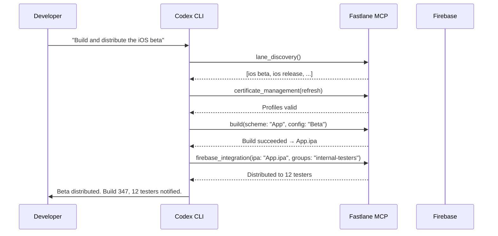

# Codex CLI for Mobile CI/CD: Fastlane MCP, Bitrise MCP, and App Store Connect Workflows


---

Mobile CI/CD pipelines carry unique burdens that server-side workflows never face: code signing, provisioning profiles, platform-specific build toolchains, App Store review metadata, and the perennial joy of Xcode version drift. Three MCP servers now bring these capabilities directly into Codex CLI sessions, turning the agent into a mobile build orchestrator rather than a generic code generator that happens to touch Swift or Kotlin files.

This article covers the Fastlane MCP server for build automation, the Bitrise MCP server for platform CI/CD operations, and practical patterns for composing them with the App Store Connect and Firebase ecosystems — all configured for Codex CLI v0.134.0 [^1].

## The Mobile MCP Server Landscape

Three servers form the backbone of agent-assisted mobile CI/CD in mid-2026:

| Server | Transport | Tools | Focus |
|--------|-----------|-------|-------|
| `fastlane-mcp-server` (lyderdev) [^2] | STDIO | 8 | Build, sign, test, deploy, metadata |
| `bitrise-mcp` (bitrise-io) [^3] | STDIO | API-wide | App management, builds, artifacts, logs |
| `app-store-connect-mcp-server` (archived) [^4] | STDIO | 15+ | App metadata, beta testing, analytics |

Microsoft App Center was retired on 31 March 2025 [^5], removing what was once a common distribution target. Firebase App Distribution and TestFlight have absorbed most of that traffic, with the Firebase MCP server [^6] and the auto-generated Firebase App Distribution MCP server [^7] covering the distribution gap.

## Fastlane MCP Server Configuration

The Fastlane MCP server wraps the Fastlane CLI, exposing eight tools for build orchestration, certificate management, and store submission [^2]. It requires Node.js 18+, a working Fastlane installation, and the relevant platform SDKs (Xcode for iOS, Android SDK for Android).

### Installation

```bash
# Direct usage via npx
npx fastlane-mcp-server

# Or clone and build
git clone https://github.com/lyderdev/fastlane-mcp-server.git
cd fastlane-mcp-server && npm install && npm run build
```

### config.toml for Codex CLI

```toml
[mcp_servers.fastlane]
command = "npx"
args = ["fastlane-mcp-server"]

[mcp_servers.fastlane.env]
# Fastlane expects these for iOS code signing
MATCH_PASSWORD = "${MATCH_PASSWORD}"
FASTLANE_USER = "${FASTLANE_USER}"
```

### Available Tools

The server exposes tools across the mobile build lifecycle:

- **build** — Construct iOS or Android apps with configuration options (scheme, configuration, destination)
- **test** — Execute automated tests on devices or simulators
- **certificate_management** — Handle iOS code signing certificates and provisioning profiles
- **lane_discovery** — Identify available Fastlane lanes in the current project
- **version_management** — Modify app and build version numbers
- **metadata_management** — Upload App Store metadata and screenshots
- **appcenter_deployment** — Distribute builds (legacy, now primarily Firebase)
- **firebase_integration** — Deploy via Firebase App Distribution and Crashlytics

## Bitrise MCP Server Configuration

The Bitrise MCP server (v2.4.5, April 2026) is written in Go and provides comprehensive access to the Bitrise API [^3]. It supports app management, build triggering, log retrieval, artifact downloads, and — via a companion server — remote macOS development environments with GUI automation [^8].

### config.toml for Codex CLI

```toml
[mcp_servers.bitrise]
command = "docker"
args = ["run", "--rm", "-i", "-e", "BITRISE_API_TOKEN", "ghcr.io/bitrise-io/bitrise-mcp:latest"]

[mcp_servers.bitrise.env]
BITRISE_API_TOKEN = "${BITRISE_API_TOKEN}"
```

Alternatively, install from the Go binary:

```bash
go install github.com/bitrise-io/bitrise-mcp@v2.4.5
```

```toml
[mcp_servers.bitrise]
command = "bitrise-mcp"
env = { BITRISE_API_TOKEN = "${BITRISE_API_TOKEN}" }
```

### Key Capabilities

The Bitrise MCP server enables Codex CLI to:

1. **Trigger builds** with specific branch, workflow, and environment variable overrides
2. **Query build status** and retrieve real-time logs for failure diagnosis
3. **Download artifacts** — IPAs, APKs, test results, coverage reports
4. **Manage apps** — list projects, update settings, configure permissions
5. **Troubleshoot failures** by having the agent analyse build logs and recommend fixes [^9]

The companion `bitrise-mcp-dev-environments` server [^8] adds session lifecycle management and macOS GUI automation (screenshots, mouse clicks, keyboard input) for scenarios requiring Xcode interaction through remote development sessions.

## AGENTS.md for Mobile Projects

Mobile projects benefit enormously from precise AGENTS.md rules that prevent the agent from generating code for the wrong platform version or violating signing requirements.

```markdown
# AGENTS.md — Mobile CI/CD Project

## Platform Requirements
- iOS minimum deployment target: iOS 17.0
- Android minSdkVersion: 26 (Android 8.0), targetSdkVersion: 35
- Xcode 16.3+ required for iOS builds
- AGP 9.2+ for Android builds

## Build Commands
- iOS build: `bundle exec fastlane ios build`
- Android build: `bundle exec fastlane android build`
- iOS tests: `bundle exec fastlane ios test`
- Android tests: `bundle exec fastlane android test`

## Code Signing
- Use Fastlane Match for iOS certificate management
- NEVER commit certificates, provisioning profiles, or keystores
- Android signing config lives in `keystore.properties` (git-ignored)

## Conventions
- Swift code follows SwiftLint rules in `.swiftlint.yml`
- Kotlin code follows ktlint with `.editorconfig`
- All UI changes require screenshot tests
- Version bumps via Fastlane, never manual Info.plist edits
```

## Workflow Patterns

### Pattern 1: Agent-Driven iOS Build and Distribution

This pattern uses Fastlane MCP for local builds and Firebase for distribution:



### Pattern 2: Bitrise Build Failure Diagnosis

When a Bitrise build fails, Codex CLI can pull the logs, analyse the failure, and propose a fix — all within a single conversational turn:

```bash
codex exec \
  --prompt "The latest Bitrise build for the iOS app failed. \
            Use the Bitrise MCP to fetch the build log, diagnose the failure, \
            and propose a fix. If it's a code signing issue, check the \
            provisioning profile expiry dates." \
  --approval-mode suggest \
  --model o4-mini
```

### Pattern 3: Batch Release Verification with `codex exec`

Before submitting to the App Store, run a multi-check verification pipeline:

```bash
codex exec \
  --prompt "Verify the iOS release build is ready for submission: \
            1. Run the release lane and confirm it succeeds \
            2. Check that the version and build number are incremented \
            3. Verify all screenshot tests pass \
            4. Confirm the App Store metadata is complete" \
  --output-schema '{"type":"object","properties":{"build_ok":{"type":"boolean"},"version":{"type":"string"},"screenshots_pass":{"type":"boolean"},"metadata_complete":{"type":"boolean"},"blockers":{"type":"array","items":{"type":"string"}}}}' \
  --model o4-mini
```

### Pattern 4: Cross-Platform Build Matrix

For teams shipping both iOS and Android from a shared codebase (React Native, Flutter, KMP), use `codex exec` with subagents:

```bash
# iOS build in one subagent, Android in another
codex exec \
  --prompt "Run parallel platform builds: \
            Use Fastlane MCP to build both iOS and Android. \
            For iOS, use the 'ios release' lane. \
            For Android, use the 'android release' lane. \
            Report both results as structured JSON." \
  --output-schema '{"type":"object","properties":{"ios":{"type":"object","properties":{"success":{"type":"boolean"},"artifact":{"type":"string"}}},"android":{"type":"object","properties":{"success":{"type":"boolean"},"artifact":{"type":"string"}}}}}' \
  --model o4-mini
```

## Server Composition

The real power emerges when composing mobile MCP servers with other tools:

```toml
# config.toml — Full mobile CI/CD stack
[mcp_servers.fastlane]
command = "npx"
args = ["fastlane-mcp-server"]

[mcp_servers.bitrise]
command = "bitrise-mcp"
env = { BITRISE_API_TOKEN = "${BITRISE_API_TOKEN}" }

[mcp_servers.github]
command = "github-mcp-server"
env = { GITHUB_PERSONAL_ACCESS_TOKEN = "${GITHUB_TOKEN}" }

[mcp_servers.firebase]
command = "npx"
args = ["-y", "firebase-tools", "experimental:mcp"]
```

This composition enables workflows like:

- **PR-triggered beta distribution**: GitHub MCP detects a merged PR → Fastlane MCP builds → Firebase distributes to testers
- **Build failure auto-triage**: Bitrise MCP fetches logs → Codex diagnoses → GitHub MCP creates an issue with the fix
- **Release orchestration**: Version bump → build both platforms → upload metadata → create GitHub release

## GitHub Actions Integration

The `openai/codex-action@v1` action [^10] slots directly into mobile CI pipelines. A practical pattern for mobile projects is a post-build verification step:


```yaml
name: Mobile Release Verification
on:
  push:
    tags: ['v*']

jobs:
  verify-release:
    runs-on: macos-latest
    steps:
      - uses: actions/checkout@v4
      - uses: ruby/setup-ruby@v1
        with:
          bundler-cache: true
      - name: Verify release readiness
        uses: openai/codex-action@v1
        with:
          prompt: |
            Verify this mobile release is ready:
            1. Check Fastfile lanes exist for both platforms
            2. Confirm version in pubspec.yaml/build.gradle/Info.plist matches the tag
            3. Run lint on both platforms
            4. Report any blockers
          model: o4-mini
          approval_mode: suggest
        env:
          OPENAI_API_KEY: ${{ secrets.OPENAI_API_KEY }}
```


## Model Selection

| Task | Recommended Model | Reasoning Effort |
|------|-------------------|------------------|
| Build failure log analysis | o4-mini | medium |
| Code signing troubleshooting | o4-mini | high |
| Fastfile/lane generation | o4-mini | medium |
| App Store metadata writing | gpt-4.1 | — |
| Cross-platform build verification | o4-mini | low |
| Release notes generation | gpt-4.1 | — |

Build log analysis and signing troubleshooting are diagnostic tasks where o4-mini's reasoning capabilities shine [^1]. Metadata and release notes are creative writing tasks better suited to gpt-4.1.

## Sandbox and Security Considerations

Mobile builds require broader sandbox permissions than typical Codex CLI sessions:

```toml
[profiles.mobile-build]
allow_read = [
  "~/Library/MobileDevice/**",
  "~/Library/Developer/**",
  "~/.fastlane/**",
  "~/.gradle/**",
  "~/.android/**"
]
allow_write = [
  "./build/**",
  "./fastlane/**",
  "./android/app/build/**",
  "./ios/build/**"
]
allow_exec = [
  "xcodebuild",
  "fastlane",
  "gradle",
  "pod",
  "bundle"
]
network_access = true  # Required for dependency downloads, code signing, distribution
```

Critical security rules for mobile CI/CD:

- **Never expose signing credentials** in prompts or AGENTS.md — use environment variables
- **Gate distribution tools** behind `approval_mode = "always"` to prevent accidental App Store submissions
- **Restrict Bitrise API tokens** to read-only scopes for diagnostic workflows; use write-scoped tokens only for build-triggering workflows
- **Rotate Match passwords** and keystore credentials regularly; the agent should never persist these

## Limitations

- **⚠️ Fastlane MCP server maturity**: The `fastlane-mcp-server` has only 5 GitHub stars and limited community adoption as of May 2026 — expect rough edges and missing edge-case handling
- **Xcode-on-Linux**: iOS builds require macOS runners; Codex CLI's Linux sandbox cannot run `xcodebuild`
- **Code signing complexity**: Provisioning profile errors remain the most common mobile build failure; the agent can diagnose but rarely fix signing issues without human intervention
- **App Store Connect MCP archived**: The `app-store-connect-mcp-server` was archived in February 2026 [^4] — it still works but receives no updates; consider using the App Store Connect API directly via Fastlane's `deliver` and `pilot` actions instead
- **Training data lag**: Models may not reflect the latest Xcode 16.3 or AGP 9.2 APIs; AGENTS.md version pinning is essential
- **Token budget**: Mobile build logs can be enormous; use Bitrise MCP's log filtering or pre-process logs before feeding them to the agent

## Citations

[^1]: [Codex CLI Changelog — v0.134.0 and v0.133.0](https://developers.openai.com/codex/changelog)
[^2]: [Fastlane MCP Server — lyderdev/fastlane-mcp-server](https://github.com/lyderdev/fastlane-mcp-server)
[^3]: [Bitrise MCP Server — bitrise-io/bitrise-mcp v2.4.5](https://github.com/bitrise-io/bitrise-mcp)
[^4]: [App Store Connect MCP Server — archived February 2026](https://github.com/JoshuaRileyDev/app-store-connect-mcp-server)
[^5]: [Visual Studio App Center Retirement — Microsoft Learn](https://learn.microsoft.com/en-us/appcenter/retirement)
[^6]: [Firebase MCP Server — Official Google Documentation](https://firebase.google.com/docs/ai-assistance/mcp-server)
[^7]: [Firebase App Distribution API MCP Server — ag2-mcp-servers](https://github.com/ag2-mcp-servers/firebase-app-distribution-api)
[^8]: [Bitrise MCP Dev Environments — macOS GUI Automation](https://github.com/bitrise-io/bitrise-mcp-dev-environments)
[^9]: [Bitrise MCP Documentation — AI-Powered CI/CD Interaction](https://docs.bitrise.io/en/bitrise-platform/ai/bitrise-mcp.html)
[^10]: [Codex GitHub Action — openai/codex-action@v1](https://developers.openai.com/codex/github-action)
