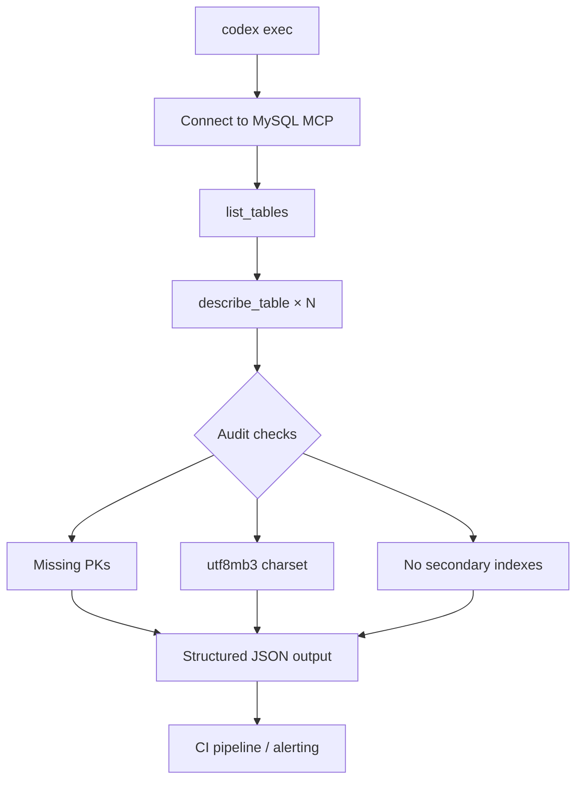
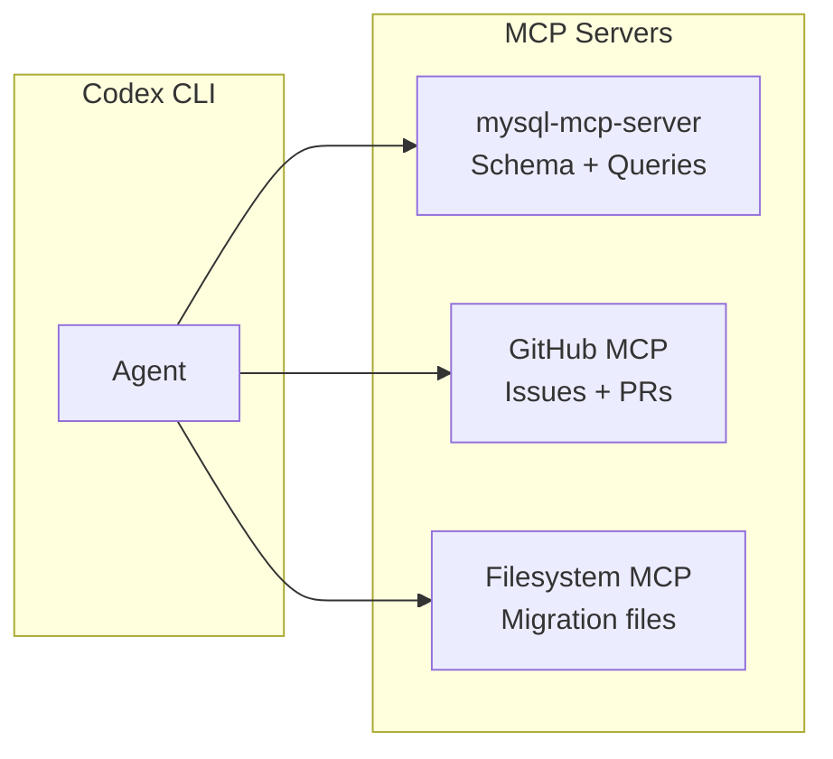

# Codex CLI for MySQL Development: MCP Servers, Schema Exploration, and Query Workflows on MySQL 9.7


---

## Why MySQL Needs Its Own Article

Codex CLI articles already cover PostgreSQL, MongoDB, Redis, DuckDB, SQLite, Neo4j, and the search-engine triad. MySQL — still the world's most deployed open-source relational database — has been conspicuously absent. With MySQL 9.7.0 LTS shipping in May 2026 with JSON Duality Views in Community Edition, the Hypergraph Optimiser, and in-database JavaScript [^1], and at least five mature MCP servers now available, the integration surface is rich enough to warrant dedicated coverage.

---

## The MySQL MCP Server Landscape

Four servers stand out for Codex CLI integration, each occupying a different niche.

### askdba/mysql-mcp-server (Go, read-only)

A single Go binary that exposes ten tools — `list_databases`, `list_tables`, `describe_table`, `run_query`, `ping`, `server_info`, `list_connections`, `use_connection`, `vector_search`, and `vector_info` — across MySQL 8.0–9.7 and MariaDB 10.x–11.x [^2]. Queries are hard-limited to `SELECT`, `SHOW`, `DESCRIBE`, and `EXPLAIN`, making it the safest option for production introspection. Multi-DSN support lets a single server instance connect to several MySQL instances with tool-based switching.

Install via Homebrew (`brew install askdba/tap/mysql-mcp-server`) or Docker (`ghcr.io/askdba/mysql-mcp-server:latest`).

### benborla/mcp-server-mysql (Node.js, configurable permissions)

A Node.js server with SSH tunnel support, connection pooling, query caching, and SQL injection prevention [^3]. Permissions are granular: `ALLOW_INSERT_OPERATION`, `ALLOW_UPDATE_OPERATION`, and `ALLOW_DELETE_OPERATION` flags control write access independently. The server annotates its `mysql_query` tool with MCP `ToolAnnotations`, hinting destructive operations to the agent so Codex CLI's approval mode can gate them correctly.

### designcomputer/mysql_mcp_server (Python, resource-based)

A Python implementation that exposes MySQL tables as MCP resources rather than just tools, letting Codex CLI browse schemas through the resource discovery protocol before issuing queries [^4]. Comprehensive logging provides an audit trail for every database operation.

### awslabs/mysql-mcp-server (Python, Aurora-native)

The AWS Labs server supports two connection methods — the RDS Data API for serverless Aurora MySQL connections and direct `asyncmy` connections for self-hosted MySQL, RDS MySQL, RDS MariaDB, or Aurora MySQL [^5]. It integrates with AWS Secrets Manager for credential retrieval and supports read-only mode by default with configurable write access.

### Google MCP Toolbox for Databases

Google's MCP Toolbox (v1.0.0, April 2026) provides a production-grade, database-agnostic MCP server with native MySQL support, connection pooling, IAM authentication, and OpenTelemetry observability out of the box [^6]. Its prebuilt tools — `list_tables`, `execute_sql`, and `list-table-stats-tool` for MySQL — plus Cloud SQL integration make it the enterprise choice for GCP-hosted MySQL instances.

---

## Configuring Codex CLI

### Single-server setup (askdba, read-only)

```toml
[mcp_servers.mysql]
command = "mysql-mcp-server"
args = ["--dsn", "user:password@tcp(127.0.0.1:3306)/mydb"]
```

### Node.js server with SSH tunnel

```toml
[mcp_servers.mysql]
command = "npx"
args = ["-y", "@benborla/mcp-server-mysql"]

[mcp_servers.mysql.env]
MYSQL_HOST = "127.0.0.1"
MYSQL_PORT = "3306"
MYSQL_USER = "codex_agent"
MYSQL_PASSWORD = ""
MYSQL_DATABASE = "mydb"
ALLOW_INSERT_OPERATION = "false"
ALLOW_UPDATE_OPERATION = "false"
ALLOW_DELETE_OPERATION = "false"
```

Use `env_vars` to forward credentials from your shell environment rather than hardcoding them:

```toml
[mcp_servers.mysql]
command = "npx"
args = ["-y", "@benborla/mcp-server-mysql"]
env_vars = ["MYSQL_HOST", "MYSQL_PORT", "MYSQL_USER", "MYSQL_PASSWORD", "MYSQL_DATABASE"]
```

### AWS Aurora MySQL via RDS Data API

```toml
[mcp_servers.aurora_mysql]
command = "uvx"
args = ["awslabs.mysql-mcp-server"]

[mcp_servers.aurora_mysql.env]
CONNECTION_TYPE = "rds_data_api"
RESOURCE_ARN = "arn:aws:rds:eu-west-1:123456789:cluster:my-cluster"
SECRET_ARN = "arn:aws:secretsmanager:eu-west-1:123456789:secret:my-secret"
DATABASE = "mydb"
AWS_PROFILE = "dev"
READONLY = "true"
```

### Google MCP Toolbox (Streamable HTTP)

```toml
[mcp_servers.toolbox_mysql]
url = "http://127.0.0.1:5000/mcp"
```

The Toolbox runs as a sidecar; configure it with a `tools.yaml` pointing at your Cloud SQL or self-hosted MySQL instance [^6].

---

## AGENTS.md for MySQL 9.7 Projects

Drop this into your repository root so Codex CLI adopts project-wide conventions:

```markdown
# AGENTS.md — MySQL 9.7 Project Conventions

## Database
- MySQL 9.7 LTS (Community Edition) with InnoDB default
- Use JSON Duality Views for document-relational hybrid access patterns
- Prefer the Hypergraph Optimiser path for complex joins (9.7+ default)

## Anti-hallucination rules
- Do NOT use syntax from MySQL 5.7 or 8.0-only features that have been superseded
- `mysql_native_password` is deprecated; use `caching_sha2_password`
- `utf8` is an alias for `utf8mb3`; always specify `utf8mb4` explicitly
- Window functions require MySQL 8.0+; CTEs require MySQL 8.0+
- JSON Duality Views are 9.7+ only — do not assume availability on 8.4 LTS

## Naming conventions
- Tables: snake_case, plural (e.g. `order_items`)
- Columns: snake_case (e.g. `created_at`)
- Indexes: `idx_<table>_<columns>` (e.g. `idx_orders_customer_id`)
- Foreign keys: `fk_<table>_<ref_table>` (e.g. `fk_order_items_orders`)

## Safety
- Always include `WHERE` clauses in `UPDATE` and `DELETE` statements
- Use transactions for multi-statement writes
- Prefer `ALTER TABLE ... ALGORITHM=INSTANT` where supported
- Never run `DROP TABLE` or `TRUNCATE` without explicit confirmation
```

---

## Workflow Patterns

### 1. Schema exploration and documentation

```
codex "Connect to the MySQL database via the mysql MCP server.
List all tables, describe each one, and produce a markdown
data dictionary with column types, indexes, and foreign key
relationships."
```

The agent calls `list_tables` → `describe_table` for each table → writes a structured markdown file. With the askdba server, `server_info` also captures the MySQL version and global variables for context.

### 2. Query generation with safety gating

```
codex --approval-mode suggest "Write a query that returns the
top 10 customers by lifetime order value, joining orders,
order_items, and products. Use CTEs for clarity. Run it via
the mysql MCP server and explain the EXPLAIN output."
```

In `suggest` mode, Codex CLI shows the generated SQL and waits for approval before executing via `run_query`. The agent can then call `run_query` with `EXPLAIN ANALYZE` prefixed to the query and interpret the execution plan.

### 3. Migration script generation

```
codex "Examine the current schema via the mysql MCP server.
Generate an Alembic migration that adds a 'status' enum column
to the orders table with values ('pending', 'processing',
'shipped', 'delivered', 'cancelled'), a default of 'pending',
and an index on (status, created_at). Use ALGORITHM=INSTANT
if the MySQL version supports it."
```

The agent introspects the live schema to avoid column name collisions, checks `server_info` for the MySQL version, and generates a migration that uses `INSTANT` DDL on MySQL 8.0.12+ [^7].

### 4. Batch audit with `codex exec`

```bash
codex exec \
  --prompt "Connect to MySQL via the mysql MCP server. \
    List all tables missing a primary key, tables using \
    utf8mb3 instead of utf8mb4, and tables with no indexes \
    beyond the primary key. Return JSON." \
  --output-schema '{"tables_no_pk":["string"],"utf8mb3_tables":["string"],"unindexed_tables":["string"]}'
```

This pattern works well in CI pipelines for drift detection — the structured JSON output can feed into alerting or reporting tools.



---

## Composing Multiple MCP Servers

For a typical MySQL-backed web application, compose the MySQL MCP server with complementary servers:

```toml
# Schema exploration and queries
[mcp_servers.mysql]
command = "mysql-mcp-server"
args = ["--dsn", "codex:@tcp(127.0.0.1:3306)/myapp"]

# GitHub issues and PRs
[mcp_servers.github]
url = "https://api.githubcopilot.com/mcp/"
bearer_token_env_var = "GITHUB_TOKEN"

# Filesystem access for migration files
[mcp_servers.filesystem]
command = "npx"
args = ["-y", "@modelcontextprotocol/server-filesystem", "./migrations"]
```



This three-server stack lets the agent read a GitHub issue describing a schema change, introspect the current database state, generate a migration file, and open a pull request — all in a single turn.

---

## Model Selection

| Task | Recommended model | Rationale |
|------|-------------------|-----------|
| Complex query generation | `gpt-5.5` (default) | Best at multi-join SQL, CTEs, window functions [^8] |
| Schema documentation | `gpt-5.4-mini` | Lower cost; schema introspection is structured [^8] |
| Batch audits via `codex exec` | `codex-mini-latest` | Optimised for fast, focused tool-calling loops [^8] |
| Migration review | `gpt-5.5` | Needs version-awareness for DDL algorithm selection |

For ChatGPT-authenticated sessions, omit the `--model` flag to track the recommended default automatically.

---

## Sandbox and Security Considerations

**Network access.** All MySQL MCP servers need TCP access to the database host. When using Codex CLI's default sandbox, ensure port 3306 (or your custom port) is allowed. The `full-auto` approval mode will execute queries without confirmation — use `suggest` or `auto-edit` for production databases.

**Credential hygiene.** Never hardcode passwords in `config.toml`. Use `env_vars` to forward credentials from your shell, or the AWS Labs server's Secrets Manager integration for cloud deployments. Create a dedicated MySQL user with minimal privileges:

```sql
CREATE USER 'codex_agent'@'%' IDENTIFIED BY '...';
GRANT SELECT, SHOW DATABASES, SHOW VIEW, PROCESS ON *.* TO 'codex_agent'@'%';
-- Add write grants only if needed:
-- GRANT INSERT, UPDATE, DELETE ON mydb.* TO 'codex_agent'@'%';
```

**Read-only by default.** Start with a read-only MCP server (askdba) or read-only flags (benborla with all `ALLOW_*` set to `false`, awslabs with `READONLY=true`). Escalate to write access only when the workflow explicitly requires it.

**Approval gating.** For write-capable servers, use Codex CLI's approval mode:

```toml
[mcp_servers.mysql]
command = "npx"
args = ["-y", "@benborla/mcp-server-mysql"]
approval_mode = "always"
```

This forces a confirmation prompt before every tool invocation, including destructive queries.

---

## Limitations

- **Training data lag.** GPT-5.5's training data predates MySQL 9.7 LTS (May 2026). The agent may not know about JSON Duality Views in Community Edition, the Hypergraph Optimiser, or in-database JavaScript without MCP-provided context [^1]. Use an `AGENTS.md` file to bridge the gap.
- **No real-time monitoring.** None of the community MCP servers expose `SHOW PROCESSLIST`, slow query log tailing, or Performance Schema dashboards. For operational monitoring, use Datadog or Grafana integrations separately.
- **Tool budget.** The askdba server exposes 10 tools; composing it with other MCP servers can consume significant context. Use `enabled_tools` to expose only the tools needed for the current workflow.
- **MariaDB divergence.** The askdba server supports MariaDB, but MariaDB 11.x and MySQL 9.7 have diverged significantly on JSON handling, CTEs, and window functions. Specify the exact engine version in `AGENTS.md` to avoid cross-engine hallucinations.
- **Vector search maturity.** MySQL 9.0+ vector search support is still evolving; the `vector_search` and `vector_info` tools in askdba may produce unexpected results on older versions [^2].
- **⚠️ Google MCP Toolbox prebuilt MySQL tools may lag behind the latest Toolbox release.** Check `googleapis.github.io/genai-toolbox/reference/prebuilt-tools/` for current tool availability.

---

## Citations

[^1]: Oracle, "MySQL 9.7.0 LTS Is Now Available: Expanded Community Capabilities and Dynamic Data Masking for Enterprise," *Oracle MySQL Blog*, May 2026. [https://blogs.oracle.com/mysql/mysql-9-7-0-lts-is-now-available-expanded-community-capabilities-and-dynamic-data-masking-for-enterprise](https://blogs.oracle.com/mysql/mysql-9-7-0-lts-is-now-available-expanded-community-capabilities-and-dynamic-data-masking-for-enterprise)

[^2]: askdba, "mysql-mcp-server: MySQL Server implementation for Model Context Protocol (MCP) written in Go," *GitHub*, 2026. [https://github.com/askdba/mysql-mcp-server](https://github.com/askdba/mysql-mcp-server)

[^3]: benborla, "mcp-server-mysql: A Model Context Protocol server that provides access to MySQL databases," *GitHub*, 2026. [https://github.com/benborla/mcp-server-mysql](https://github.com/benborla/mcp-server-mysql)

[^4]: designcomputer, "mysql_mcp_server: A Model Context Protocol (MCP) server that enables secure interaction with MySQL databases," *GitHub*, 2026. [https://github.com/designcomputer/mysql_mcp_server](https://github.com/designcomputer/mysql_mcp_server)

[^5]: AWS Labs, "Amazon Aurora MySQL MCP Server," *Open Source MCP Servers for AWS*, 2026. [https://awslabs.github.io/mcp/servers/mysql-mcp-server](https://awslabs.github.io/mcp/servers/mysql-mcp-server)

[^6]: Google, "MCP Toolbox for Databases," *googleapis.github.io*, 2026. [https://googleapis.github.io/genai-toolbox/](https://googleapis.github.io/genai-toolbox/)

[^7]: Oracle, "MySQL 9.7 Reference Manual: ALTER TABLE and Generated Columns," *dev.mysql.com*, 2026. [https://dev.mysql.com/doc/refman/9.7/en/](https://dev.mysql.com/doc/refman/9.7/en/)

[^8]: OpenAI, "Models — Codex," *OpenAI Developers*, 2026. [https://developers.openai.com/codex/models](https://developers.openai.com/codex/models)
