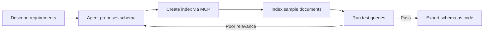
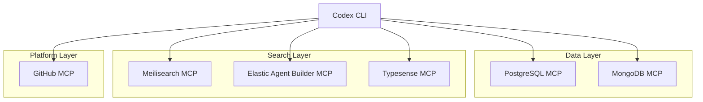

# Codex CLI for Search Engineering: Elasticsearch, Meilisearch, and Typesense MCP Servers


---

Search infrastructure sits at the heart of most production applications, yet it remains one of the most under-tooled areas for agent-assisted development. With dedicated MCP servers now available for the three dominant open-source search engines — Elasticsearch, Meilisearch, and Typesense — Codex CLI can query indices, manage schemas, monitor cluster health, and generate search configurations without leaving the terminal. This article covers the MCP server landscape, practical `config.toml` wiring, AGENTS.md conventions, and four workflow patterns that turn Codex into a search-engineering co-pilot.

## The Search MCP Landscape in Mid-2026

Three MCP servers cover the major open-source search engines, each at a different maturity level:

| Engine | MCP Server | Tools | Transport | Status |
|--------|-----------|-------|-----------|--------|
| Elasticsearch 9.4 | `elastic/mcp-server-elasticsearch` v0.4.6 | 5 | stdio, streamable-HTTP | Deprecated — superseded by Agent Builder MCP [^1] |
| Elasticsearch 9.2+ | Agent Builder MCP endpoint | Dynamic (all built-in + custom tools) | Streamable HTTP via Kibana | GA in Elastic 9.2.0+ [^2] |
| Meilisearch 1.41+ | `meilisearch/meilisearch-mcp` | 20+ | stdio | Active, official [^3] |
| Typesense 30.2 | `avarant/typesense-mcp-server` | 14 | stdio, SSE, streamable-HTTP | Community, active development [^4] |

The Elasticsearch story has a wrinkle: the standalone `mcp-server-elasticsearch` shipped five tools (list_indices, get_mappings, search, esql, get_shards) but was deprecated in early 2026 [^1]. Elastic's replacement — the Agent Builder MCP endpoint baked into Kibana — dynamically exposes every tool registered in Agent Builder, including custom tools you define [^2]. If you run Elastic 9.2+ or Serverless, use the Agent Builder endpoint; if you run an older cluster, the standalone server still works but receives only critical security patches.

## Wiring MCP Servers in config.toml

### Meilisearch (STDIO)

```toml
[mcp_servers.meilisearch]
enabled = true
command = "uvx"
args = ["meilisearch-mcp"]
env_vars = ["MEILI_HTTP_ADDR", "MEILI_MASTER_KEY"]
startup_timeout_sec = 10.0
tool_timeout_sec = 30.0
```

Set the environment variables before launching Codex:

```bash
export MEILI_HTTP_ADDR="http://localhost:7700"
export MEILI_MASTER_KEY="your-master-key"
codex
```

### Typesense (STDIO)

```toml
[mcp_servers.typesense]
enabled = true
command = "uvx"
args = ["typesense-mcp-server"]
env_vars = ["TYPESENSE_HOST", "TYPESENSE_PORT", "TYPESENSE_PROTOCOL", "TYPESENSE_API_KEY"]
startup_timeout_sec = 10.0
tool_timeout_sec = 30.0
```

```bash
export TYPESENSE_HOST="localhost"
export TYPESENSE_PORT="8108"
export TYPESENSE_PROTOCOL="http"
export TYPESENSE_API_KEY="$TYPESENSE_API_KEY"  # set in your shell profile
```

### Elasticsearch Agent Builder (Streamable HTTP)

The Agent Builder endpoint runs inside Kibana, so you connect via HTTP rather than spawning a local process:

```toml
[mcp_servers.elastic]
enabled = true
type = "http"
url = "https://your-kibana.example.com/api/agent_builder/mcp"
bearer_token_env_var = "ELASTIC_API_KEY"
tool_timeout_sec = 60.0
```

The API key needs `monitor_inference` cluster privileges, index read access, and Kibana application privileges for `feature_agentBuilder.read` and `feature_actions.read` [^2].

### Standalone Elasticsearch (STDIO — Legacy)

For clusters below 9.2, the deprecated standalone server still functions:

```toml
[mcp_servers.elasticsearch]
enabled = true
command = "npx"
args = ["-y", "@elastic/mcp-server-elasticsearch"]
env_vars = ["ES_URL", "ES_API_KEY"]
startup_timeout_sec = 15.0
```

## AGENTS.md for Search Projects

An AGENTS.md addendum for search-heavy projects prevents the most common hallucination traps:

```markdown
## Search Engineering Rules

- Elasticsearch: Use ES|QL for analytical queries where possible (GA since 8.11).
  Do NOT hallucinate query DSL syntax — always verify field names via get_mappings
  before constructing queries.
- Meilisearch: Ranking rules order matters. Default is
  ["words", "typo", "proximity", "attribute", "sort", "exactness"].
  Never reorder without explicit instruction.
- Typesense: Collection schemas are immutable after creation for non-auto fields.
  To change a field type, drop and recreate the collection.
- All engines: Never expose admin/master API keys in generated code.
  Use scoped search-only keys for client-side search.
- Elasticsearch 9.x uses `elasticsearch` package, NOT `elasticsearch7` or
  `elasticsearch8`. Meilisearch uses `meilisearch` SDK. Typesense uses `typesense`.
- Vector search: Elasticsearch uses kNN with `dense_vector` fields,
  Meilisearch uses `vectorStore: true` on index settings,
  Typesense uses `vec:` field type with `vector_search` tool.
```

## Workflow Patterns

### Pattern 1: Index Schema Design with Validation

The tightest feedback loop uses the MCP server to validate schema decisions against live data:



For Meilisearch, the agent calls `create-index`, then `add-documents` with a sample payload, then `search` to verify ranking. For Typesense, the equivalent flow uses `create_collection` with a schema definition, `index_multiple_documents`, and `search` or `vector_search`.

### Pattern 2: Search Relevance Tuning

Relevance tuning is traditionally a manual, iterative process. With MCP tools, the agent can adjust settings and immediately re-query:

```bash
codex "The search for 'wireless headphones' returns Bluetooth adapters first. \
  Adjust the ranking rules so product_name matches rank higher than description matches. \
  Use the meilisearch MCP to update settings and verify with three test queries."
```

The agent calls `get-settings` to inspect current ranking rules, modifies the `attribute` ranking to prioritise `product_name`, calls `update-settings`, then runs `search` three times with different queries to confirm the change improved relevance without degrading other results.

### Pattern 3: Cluster Health Audit with codex exec

For Elasticsearch, batch auditing across multiple indices suits the `codex exec` pattern with structured output:

```bash
codex exec "Audit all Elasticsearch indices. For each, report: \
  name, document count, primary shard count, mapping field count, \
  and whether any field uses nested type (expensive for aggregation). \
  Flag indices with >50 mapping fields as 'mapping explosion risk'." \
  --output-schema ./es-audit-schema.json \
  -o ./audit-report.json
```

The `es-audit-schema.json` constrains the output:

```json
{
  "type": "object",
  "properties": {
    "audit_date": { "type": "string" },
    "indices": {
      "type": "array",
      "items": {
        "type": "object",
        "properties": {
          "name": { "type": "string" },
          "doc_count": { "type": "integer" },
          "primary_shards": { "type": "integer" },
          "field_count": { "type": "integer" },
          "has_nested": { "type": "boolean" },
          "mapping_explosion_risk": { "type": "boolean" }
        },
        "required": ["name", "doc_count", "field_count", "mapping_explosion_risk"]
      }
    }
  },
  "required": ["audit_date", "indices"]
}
```

### Pattern 4: Cross-Engine Migration

When migrating from one search engine to another (a common scenario as teams outgrow simpler engines or adopt vector search), Codex can orchestrate the mapping:

```bash
codex "We're migrating our 'products' collection from Typesense to Meilisearch. \
  Use the typesense MCP to export the collection schema and a sample of 100 documents. \
  Then use the meilisearch MCP to create an equivalent index, map the field types, \
  index the sample documents, and run the same five test queries against both engines. \
  Report any relevance differences."
```

This workflow composes both MCP servers in a single session — one of the advantages of Codex CLI's multi-server architecture.

## Server Composition

For teams that use search alongside their primary datastore, composing search MCP servers with database servers creates a powerful development environment:



A typical composition uses one search server alongside one database server and the GitHub MCP. Adding all three search servers simultaneously is unnecessary unless you are actively benchmarking or migrating between engines. Each MCP server connection adds approximately 200-500 tokens of context overhead, plus 550-1,400 tokens per tool definition [^5]. The Meilisearch server alone (20+ tools) can consume 15,000+ tokens before your first prompt.

## Model Selection

Search engineering tasks involve schema design, query construction, and relevance analysis — all pattern-heavy work where stronger models pay for themselves:

| Task | Recommended Model | Rationale |
|------|------------------|-----------|
| Schema design, relevance tuning | gpt-5.5 or o3 | Needs deep reasoning about ranking trade-offs |
| Query generation, settings updates | gpt-5.4 | Good balance of speed and accuracy |
| Batch audits via codex exec | gpt-5.4-mini | Cost-efficient for structured extraction |

## Sandbox and Security Considerations

- **Network access**: All three MCP servers require network connectivity to reach the search engine. Set `sandbox_workspace_write.network_access = true` or use the `on-request` approval mode [^6].
- **Credential hygiene**: Store API keys and master keys in environment variables, never in committed `config.toml` files. Use `env_vars` to reference them.
- **Read-only mode**: For production clusters, create scoped API keys with read-only permissions. Meilisearch supports action-based key scoping; Typesense supports search-only API keys; Elasticsearch supports role-based API keys [^7].
- **Approval gating**: For write operations (index creation, document insertion, settings changes), consider using `approval_mode = "on-tool-use"` to require confirmation before mutations reach production.

## Limitations

- **Training data lag**: Codex models may not know the latest API changes for Elasticsearch 9.4, Meilisearch 1.41, or Typesense 30.2. The MCP servers bridge this gap for runtime operations, but generated client code may use outdated SDK patterns. Always verify against current documentation.
- **Elastic Agent Builder dependency**: The recommended Elasticsearch MCP path requires an Elastic 9.2+ deployment with Kibana. Self-hosted clusters on older versions are limited to the deprecated standalone server.
- **Typesense server maturity**: The community Typesense MCP server has no formal releases and is under active development. Expect breaking changes.
- **Token budget**: Composing multiple search MCP servers in one session can consume 30,000+ tokens of context before useful work begins. Use `enabled_tools` to restrict tool exposure:

```toml
[mcp_servers.meilisearch]
enabled_tools = ["search", "get-settings", "update-settings", "create-index", "list-indexes"]
```

- **No real-time analytics**: None of the MCP servers expose real-time search analytics (query frequency, click-through rates). You still need dedicated analytics tooling for relevance optimisation at scale.
- **Vector search gaps**: While all three engines now support vector search, the MCP server coverage varies. Typesense exposes `vector_search` as a dedicated tool; Meilisearch's vector support is configured via settings but not as a distinct MCP tool; Elasticsearch's kNN queries go through the standard `search` or `esql` tools.

## Citations

[^1]: [elastic/mcp-server-elasticsearch — GitHub](https://github.com/elastic/mcp-server-elasticsearch) — Deprecation notice and tool reference (v0.4.6, October 2025).
[^2]: [Elastic Agent Builder MCP server — Elastic Docs](https://www.elastic.co/docs/explore-analyze/ai-features/agent-builder/mcp-server) — Agent Builder MCP endpoint documentation for Elastic 9.2+.
[^3]: [meilisearch/meilisearch-mcp — GitHub](https://github.com/meilisearch/meilisearch-mcp) — Official Meilisearch MCP server with 20+ tools.
[^4]: [avarant/typesense-mcp-server — GitHub](https://github.com/avarant/typesense-mcp-server) — Community Typesense MCP server with 14 tools.
[^5]: [Codex CLI Performance Optimisation — Codex Knowledge Base](https://codex.danielvaughan.com/2026/04/08/codex-cli-performance-optimization/) — MCP server token overhead measurements.
[^6]: [Sandbox — Codex CLI Developer Docs](https://developers.openai.com/codex/concepts/sandboxing) — Network access configuration for sandboxed sessions.
[^7]: [Meilisearch API Keys Documentation](https://www.meilisearch.com/docs/reference/api/keys), [Typesense API Key Documentation](https://typesense.org/docs/30.2/api/api-keys.html), [Elasticsearch Security API](https://www.elastic.co/docs/api/doc/elasticsearch/operation/operation-security-create-api-key) — Scoped API key creation across all three engines.
