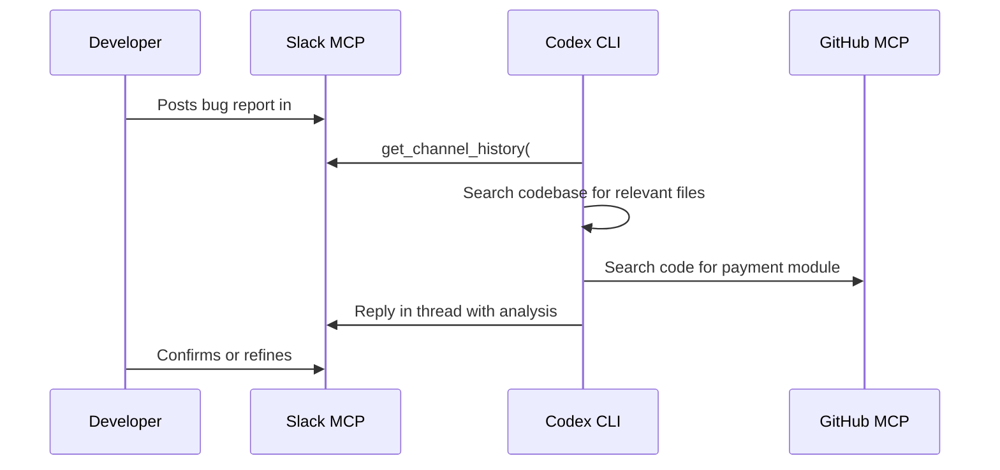

# Codex CLI with Slack MCP Servers: ChatOps, Channel Automation, and Team Notification Workflows


---

Slack remains the nervous system of most engineering teams. When Codex CLI gains the ability to read channels, search messages, post updates, and manage threads, it stops being a tool you use in isolation and becomes an active participant in your team's communication loop. This article maps the three Slack MCP server options available to Codex CLI in May 2026, walks through realistic `config.toml` configurations, and demonstrates four workflow patterns that connect code changes to the conversations that triggered them.

## The Slack MCP Landscape

Three distinct Slack MCP servers serve different use cases. Choosing the right one — or composing two together — depends on your authentication constraints, transport requirements, and whether you need read-only intelligence or bidirectional ChatOps.

```mermaid
graph TD
    A[Codex CLI] --> B{Transport?}
    B -->|Streamable HTTP| C[Official Slack MCP Server<br/>mcp.slack.com/mcp]
    B -->|STDIO| D[korotovsky/slack-mcp-server<br/>18 tools, stealth mode]
    B -->|STDIO| E[@modelcontextprotocol/server-slack<br/>Archived, basic toolset]
    C --> F[OAuth 2.0<br/>Confidential Client]
    D --> G[Browser/OAuth/Bot tokens]
    E --> H[Bot token only]
```

### Official Slack MCP Server

Slack's first-party MCP server, launched in early 2026, uses Streamable HTTP at `https://mcp.slack.com/mcp` with JSON-RPC 2.0 [^1]. It requires confidential OAuth with a pre-registered `client_id` and `client_secret` — no dynamic client registration [^2]. As of May 2026, this creates a friction point with `codex mcp login`, which relies on DCR by default [^3].

The official server provides tools across four categories: search (messages, files, channels, users, emoji), messaging (send, read history, create conversations, add reactions), canvas management (create and read), and member information (profiles, channel membership) [^1]. Five additional tools shipped on 13 May 2026: reaction adding, conversation creation, channel member listing, emoji listing, and file reading [^4].

### korotovsky/slack-mcp-server

The most feature-rich community option, with 18 tools across STDIO, SSE, and HTTP transports [^5]. It supports three authentication modes:

- **Browser tokens** (`xoxc`/`xoxd`): stealth mode with full API access and no bot installation required
- **OAuth tokens** (`xoxp`): standard user-level access
- **Bot tokens** (`xoxb`): limited to channels where the bot is invited

Key differentiators include unread message aggregation with priority sorting (DMs > partner channels > internal), saved-item management, user group operations, and smart history fetch with date-range or message-count modes [^5]. Write operations (posting messages, adding reactions, marking channels as read) are disabled by default — an important safety feature for agent workflows.

### @modelcontextprotocol/server-slack (Archived)

The reference implementation from the MCP project provides basic channel listing, message posting, thread replies, reactions, channel history, and user info [^6]. It is no longer actively maintained but remains functional for simple read/post workflows. It requires a Slack Bot token with `channels:history`, `channels:read`, `chat:write`, `reactions:write`, `users:read`, and `users.profile:read` scopes [^6].

## Configuration

### STDIO Server (korotovsky/slack-mcp-server)

The STDIO approach runs the server as a local subprocess, keeping credentials off the network:

```toml
[mcp_servers.slack]
command = "npx"
args = ["-y", "korotovsky-slack-mcp-server"]
env = { SLACK_MCP_XOXB_TOKEN = "${SLACK_BOT_TOKEN}", SLACK_MCP_TEAM_ID = "${SLACK_TEAM_ID}" }

# Safety: disable write tools until you need them
disabled_tools = ["conversations_add_message", "reactions_add", "reactions_remove", "conversations_mark"]
default_tools_approval_mode = "prompt"
```

### Streamable HTTP (Official Server)

Because the official server requires pre-registered OAuth credentials and does not support DCR, you cannot use `codex mcp login slack` directly [^3]. The workaround is to register a Slack app with MCP server access enabled, complete the OAuth code exchange manually, and configure the bearer token:

```toml
[mcp_servers.slack-official]
url = "https://mcp.slack.com/mcp"
bearer_token_env_var = "SLACK_MCP_OAUTH_TOKEN"

enabled_tools = [
  "search_messages",
  "search_files",
  "get_channel_history",
  "get_thread_replies",
  "list_channels",
  "get_user_profile"
]
default_tools_approval_mode = "auto"

# Write tools behind approval gate
[mcp_servers.slack-official.tools.send_message]
approval_mode = "prompt"

[mcp_servers.slack-official.tools.add_reaction]
approval_mode = "prompt"
```

⚠️ The DCR limitation (GitHub issue #13200) means token renewal is manual. Monitor expiry and rotate tokens in your environment accordingly [^3].

### Composing Slack with GitHub MCP

The real power emerges when Slack MCP and GitHub MCP operate together, letting Codex trace a conversation to a code change and back:

```toml
[mcp_servers.slack]
command = "npx"
args = ["-y", "korotovsky-slack-mcp-server"]
env = { SLACK_MCP_XOXB_TOKEN = "${SLACK_BOT_TOKEN}", SLACK_MCP_TEAM_ID = "${SLACK_TEAM_ID}" }
default_tools_approval_mode = "prompt"

[mcp_servers.github]
url = "https://api.githubcopilot.com/mcp/"
bearer_token_env_var = "GITHUB_TOKEN"
default_tools_approval_mode = "auto"
```

## AGENTS.md for Slack-Integrated Projects

Add a Slack-specific section to your project's `AGENTS.md`:

```markdown
## Slack Integration Rules

- NEVER post messages containing credentials, tokens, API keys, or secrets
- ALWAYS use thread replies rather than top-level messages when responding to an existing conversation
- When searching for context, prefer `conversations_search_messages` with date filters over fetching full channel history
- Limit channel history fetches to 50 messages unless explicitly asked for more
- When posting status updates, include: what changed, which files, and a link to the PR
- Use emoji reactions (✅, 👀, 🚀) to acknowledge messages before posting longer replies
- NEVER mark channels as read — that is a user-level action
- Slack user IDs are NOT email addresses — use `users_search` to resolve names
```

## Workflow Patterns

### Pattern 1: Bug Report Triage from Slack

A team member posts a bug report in `#incidents`. Codex reads the thread, searches the codebase, and posts a preliminary analysis:

```bash
codex --model o4-mini \
  "Read the latest thread in #incidents about the payment timeout. \
   Search our codebase for the payment processing module. \
   Identify likely causes and post your analysis as a thread reply \
   with file paths and line numbers."
```



### Pattern 2: Deployment Notification Pipeline

After a successful deployment, Codex posts a structured update to `#deployments`:

```bash
codex exec \
  --model o4-mini \
  --prompt "Compare the last two git tags. Summarise changes in bullet points. \
            Post to #deployments with the tag name, change summary, and a link \
            to the GitHub comparison view." \
  --approval-mode prompt
```

This pattern works particularly well with `codex exec` in CI pipelines, where the Slack MCP server posts progress updates as the pipeline runs.

### Pattern 3: Daily Standup Digest

Codex reads yesterday's messages across multiple channels, synthesises activity, and posts a digest:

```bash
codex --model gpt-5.5 \
  "Search Slack messages from yesterday across #frontend, #backend, and #infrastructure. \
   Group by team. Summarise what shipped, what's blocked, and what's in review. \
   Post the digest to #standup-bot as a single formatted message with sections."
```

### Pattern 4: Batch Channel Audit with `codex exec`

Audit channel naming conventions and membership across the workspace:

```bash
codex exec \
  --model o4-mini \
  --output-schema '{"channels": [{"name": "string", "members": "number", "compliant": "boolean", "issue": "string"}]}' \
  --prompt "List all public channels. Check each against our naming convention: \
            team channels must start with team-, project channels with proj-, \
            incident channels with inc-. Flag non-compliant channels."
```

The `--output-schema` flag (added in v0.132.0) [^7] returns structured JSON that downstream scripts can consume for reporting or automated remediation.

## The Native @Codex Integration

Separately from MCP servers, Codex offers a native Slack integration where mentioning `@Codex` in any channel creates a cloud task [^8]. This is a higher-level abstraction: rather than wiring MCP tools, you mention the bot, it spins up a cloud environment, executes against your connected GitHub repositories, and replies in the thread.

The native integration requires a Plus, Pro, Business, Enterprise, or Edu ChatGPT plan, a connected GitHub account, and at least one configured cloud environment [^8]. It automatically selects the appropriate environment and repository from your environment map, and earlier messages in the thread provide context without restating.

The MCP approach and the native integration serve different purposes:

| Aspect | MCP Servers | Native @Codex |
|---|---|---|
| Runs where | Local CLI / your CI | OpenAI cloud |
| Sandbox | Your machine's sandbox | Cloud environment |
| Trigger | You invoke Codex | Team member mentions @Codex |
| Customisation | Full config.toml control | Environment map only |
| Cost | Your API quota | ChatGPT plan quota |

For teams wanting both, the MCP server handles programmatic automation (CI notifications, batch audits, scheduled digests) while the native integration handles ad-hoc requests from team members who are not running the CLI.

## Security Considerations

### Token Scope Minimisation

Request only the scopes you need. A read-only audit workflow needs `channels:read`, `channels:history`, and `search:read`. Adding `chat:write` opens the door to the agent posting messages — gate that behind `approval_mode = "prompt"` [^9].

### Credential Hygiene

- Store Slack tokens in environment variables, never in `config.toml` directly
- Use `bearer_token_env_var` or `env` references to inject credentials at runtime
- Rotate bot tokens on a schedule; browser tokens (`xoxc`/`xoxd`) expire and should not be used in CI

### Write Tool Gating

The `korotovsky/slack-mcp-server` disables write operations by default [^5]. Follow this pattern: start with read-only tools, enable writes only for specific workflows, and always gate them behind `approval_mode = "prompt"` or `approval_mode = "approve"`.

### Message Content Filtering

Add a hook to scan outbound messages for secrets before they reach Slack. The post-GA hooks system supports ten lifecycle events including `PermissionRequest`, which fires before any tool call [^10]:

```toml
[[hooks]]
event = "PermissionRequest"
command = "python3 scripts/scan-slack-message.py"
timeout_ms = 5000
```

## Model Selection

| Task | Recommended Model | Rationale |
|---|---|---|
| Channel search and summarisation | gpt-5.5 | Long context window handles large message histories [^11] |
| Structured audit output | o4-mini | Efficient for schema-constrained extraction [^11] |
| Bug triage with code search | o4-mini | Balances reasoning depth with cost for code analysis [^11] |
| Multi-channel digest | gpt-5.5 | Synthesising across channels benefits from broader context [^11] |

## Limitations

- **Official server DCR gap**: `codex mcp login` cannot authenticate with Slack's official MCP server because it requires pre-registered OAuth credentials [^3]. A fix is pending.
- **Token renewal**: Manual OAuth token refresh is required for the official server workaround. Bot tokens for STDIO servers are long-lived but still need rotation.
- **Rate limiting**: Slack API rate limits apply (20–100+ requests per minute depending on the endpoint tier) [^1]. Batch operations against large workspaces should include backoff logic.
- **No real-time streaming**: MCP servers poll Slack state on each tool call. There is no WebSocket subscription for live message events — `conversations_unreads` approximates this but is not instantaneous.
- **Training data lag**: Models may not know about Slack's May 2026 MCP tools (reactions, conversations, file reading) [^4]. Include tool descriptions in your prompt context.
- **Channel access**: Bot tokens only access channels where the bot is invited. Browser tokens access everything the user can see, which may be more than intended.
- **Message formatting**: Slack's `mrkdwn` syntax differs from standard Markdown. Models occasionally emit GitHub-flavoured Markdown that renders incorrectly in Slack.

## Citations

[^1]: Slack Developer Docs — Slack MCP Server Overview. [https://docs.slack.dev/ai/slack-mcp-server/](https://docs.slack.dev/ai/slack-mcp-server/)
[^2]: Slack Developer Docs — MCP Server Authentication. [https://docs.slack.dev/ai/slack-mcp-server/](https://docs.slack.dev/ai/slack-mcp-server/)
[^3]: GitHub Issue #13200 — codex mcp login fails for Slack official MCP. [https://github.com/openai/codex/issues/13200](https://github.com/openai/codex/issues/13200)
[^4]: Slack Developer Changelog — New MCP Server tools released, 13 May 2026. [https://docs.slack.dev/changelog/2026/05/13/new-mcp-tools/](https://docs.slack.dev/changelog/2026/05/13/new-mcp-tools/)
[^5]: korotovsky/slack-mcp-server — GitHub. [https://github.com/korotovsky/slack-mcp-server](https://github.com/korotovsky/slack-mcp-server)
[^6]: modelcontextprotocol/servers-archived — Slack server. [https://github.com/modelcontextprotocol/servers-archived/tree/main/src/slack](https://github.com/modelcontextprotocol/servers-archived/tree/main/src/slack)
[^7]: OpenAI Codex CLI Releases — v0.132.0. [https://github.com/openai/codex/releases](https://github.com/openai/codex/releases)
[^8]: OpenAI Developers — Use Codex in Slack. [https://developers.openai.com/codex/integrations/slack](https://developers.openai.com/codex/integrations/slack)
[^9]: OpenAI Developers — MCP Configuration. [https://developers.openai.com/codex/mcp](https://developers.openai.com/codex/mcp)
[^10]: OpenAI Codex CLI Releases — v0.133.0 hooks and lifecycle events. [https://github.com/openai/codex/releases](https://github.com/openai/codex/releases)
[^11]: OpenAI Developers — Codex CLI Models. [https://developers.openai.com/codex/cli](https://developers.openai.com/codex/cli)
