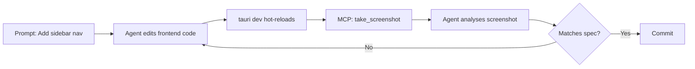

# Codex CLI for Tauri Desktop Development: MCP Servers, IPC Debugging, and Cross-Platform Agent Workflows


---

Tauri v2 has become the default choice for developers building cross-platform desktop applications with web frontends and Rust backends[^1]. With bundle sizes under 3 MB compared to Electron's 150 MB+, a permissions-based security model, and first-class mobile support for iOS and Android, Tauri occupies a unique position in the desktop ecosystem[^2]. Two dedicated MCP servers now bring Tauri's dual-language architecture — TypeScript/JavaScript frontend, Rust backend — into Codex CLI's agentic workflow, enabling screenshot-driven debugging, IPC inspection, and full UI automation without leaving the terminal.

This article covers the MCP server landscape, `config.toml` configuration, an AGENTS.md template for Tauri v2.11 projects, and four production workflow patterns.

## The Tauri MCP Server Landscape

Two community MCP servers target Tauri v2 development, each serving a different slice of the workflow.

### hypothesi/mcp-server-tauri

The more comprehensive option provides 21 tools across four categories[^3]:

| Category | Tools | Purpose |
|----------|-------|---------|
| UI Automation | 13 | Screenshots, clicks, typing, scrolling, element finding, DOM snapshots, JavaScript execution |
| IPC & Plugin | 5 | Command execution, backend state retrieval, IPC monitoring, traffic capture, event emission |
| Mobile | 1 | iOS simulator and Android emulator device listing |
| Setup | 1 | Bridge configuration |

The server works by injecting a bridge plugin into the running Tauri application, giving the agent direct access to both the WebView layer and the Rust backend through IPC inspection.

### dirvine/tauri-mcp

A Rust-native server focused on testing and interaction[^4]:

- Process management (launch, terminate, restart)
- Window manipulation (resize, move, focus)
- Input simulation (keyboard and mouse)
- Performance profiling
- Network interception

Configuration options include `auto_discover`, `session_management`, `event_streaming`, and `performance_profiling`[^4]. Note that Claude Desktop has compatibility issues with Rust-based MCP servers; a Node.js wrapper is recommended for that client, though Codex CLI handles STDIO servers natively.

## Configuration

### config.toml for Codex CLI

```toml
[mcp_servers.tauri-dev]
command = "npx"
args = ["-y", "@hypothesi/tauri-mcp-server"]
startup_timeout_sec = 15
tool_timeout_sec = 60

[mcp_servers.tauri-test]
command = "npx"
args = ["-y", "tauri-mcp-wrapper"]
env_vars = ["TAURI_MCP_LOG_LEVEL"]
startup_timeout_sec = 10
tool_timeout_sec = 30
enabled_tools = [
  "launch_app",
  "take_screenshot",
  "send_keyboard_input",
  "execute_javascript"
]
```

For project-scoped configuration, place this in `.codex/config.toml` within a trusted project directory[^5]. The `enabled_tools` allowlist restricts the agent to a safe subset during testing workflows, preventing accidental process termination.

### Combining with Rust Tooling

Tauri projects benefit from composing the Tauri MCP server with a Rust language server for backend work:

```toml
[mcp_servers.rust-analyzer]
command = "rust-analyzer"
startup_timeout_sec = 30
tool_timeout_sec = 120
```

This gives the agent type-checked diagnostics on the `src-tauri/` backend while simultaneously providing WebView interaction on the frontend.

## AGENTS.md Template for Tauri v2 Projects

```markdown
# AGENTS.md — Tauri v2 Desktop Application

## Stack
- Tauri v2.11.x (tauri-apps/tauri)
- Frontend: TypeScript, React 19 / Svelte 5 / Vue 3.5, Vite 7
- Backend: Rust (edition 2024), src-tauri/
- Styling: Tailwind CSS 4 / shadcn-ui

## Architecture Rules
1. All Rust commands use #[tauri::command] and return Result<T, String>
2. Frontend invokes backend exclusively via `invoke()` from @tauri-apps/api/core
3. Never use `unsafe` in command handlers without explicit approval
4. All IPC payloads must derive serde::Serialize + serde::Deserialize
5. File paths from frontend MUST be sanitised via tauri::path::PathResolver
6. Permissions declared in src-tauri/capabilities/ — never use allow-all

## Anti-Hallucination Rules
- Tauri v2 uses `@tauri-apps/api/core` NOT `@tauri-apps/api/tauri` (v1 import)
- The allowlist system from v1 is REPLACED by capabilities/permissions in v2
- Events use `emit()` and `listen()` from `@tauri-apps/api/event`
- Plugin APIs are at `@tauri-apps/plugin-*` NOT `tauri-plugin-*-api`
- Mobile support requires `tauri android init` / `tauri ios init` BEFORE build
- Window creation uses WebviewWindow from @tauri-apps/api/webviewWindow

## Testing
- Frontend: Vitest + @testing-library
- Backend: `cargo test` in src-tauri/
- Integration: MCP server screenshot + DOM assertion loop
- E2E: Playwright with WebView connection via CDP

## Model Preference
- Complex Rust refactoring: o3 or gpt-5.5
- Frontend iteration / styling: gpt-5.3-codex-spark (speed priority)
- IPC debugging: o4-mini (cost-effective reasoning)
```

## Workflow Patterns

### Pattern 1: Screenshot-Driven UI Development

The hypothesi MCP server's screenshot and DOM snapshot tools enable a visual feedback loop:



This pattern works particularly well with `gpt-5.3-codex-spark` for rapid frontend iteration, where the 1,000+ tokens/second output speed[^6] matches the fast hot-reload cycle of `tauri dev`.

### Pattern 2: IPC Command Debugging

When a Rust command returns unexpected results, the agent can intercept the full IPC round-trip:

```bash
codex "The save_document command returns a serialisation error when \
  payload contains nested arrays. Use the tauri-dev MCP server to \
  capture IPC traffic, identify the serde mismatch, fix the Rust \
  struct, and verify with a round-trip test."
```

The MCP server's `capture_ipc_traffic` tool exposes the raw JSON payloads crossing the bridge, letting the agent correlate frontend `invoke()` arguments with the Rust command's deserialization expectations.

### Pattern 3: Cross-Platform Build Verification

Tauri's platform-specific behaviour — WebView2 on Windows, WebKit on macOS, WebKitGTK on Linux[^2] — means rendering differences are inevitable. Using `codex exec` for batch verification:

```bash
codex exec \
  --prompt "Take a screenshot of the settings panel on each platform \
    and report CSS rendering differences" \
  --output-schema '{"platforms": [{"os": "string", "issues": ["string"]}]}'
```

### Pattern 4: Plugin Scaffolding with Agent Skills

Tauri's plugin system requires coordinated changes across Rust, TypeScript, and configuration[^7]. Agent skills encode the scaffold pattern:

```bash
codex "Create a new Tauri plugin called 'clipboard-history' following \
  the official plugin development guide. Include the Rust implementation \
  with #[tauri::command] handlers, the TypeScript guest bindings, \
  permissions in capabilities/, and a Vitest suite for the JS API."
```

The agent leverages knowledge from Tauri development skills[^8] to produce the correct directory structure (`tauri-plugin-clipboard-history/` with `src/`, `guest-js/`, `permissions/`) without hallucinating v1 patterns.

## Security Considerations

Tauri's capability-based permissions model[^9] aligns well with Codex CLI's approval gating:

- **Filesystem access**: Declare specific paths in `capabilities/*.json`; the agent should never add blanket `fs:allow-*` permissions
- **Network**: Restrict `http:allow-*` to known API endpoints
- **Shell**: The `shell:allow-execute` permission requires explicit listing of allowed commands
- **MCP approval mode**: Set `approval_mode = "unless-allow-listed"` for the Tauri MCP server to prevent the agent from executing destructive IPC commands without confirmation

```toml
[mcp_servers.tauri-dev]
command = "npx"
args = ["-y", "@hypothesi/tauri-mcp-server"]
approval_mode = "unless-allow-listed"
allowed_tools = ["take_screenshot", "get_dom_snapshot", "find_element"]
```

## Model Selection for Tauri Workflows

| Task | Recommended Model | Rationale |
|------|------------------|-----------|
| Rust backend logic | o3 / gpt-5.5 | Strong reasoning for lifetime/ownership |
| Frontend styling loops | gpt-5.3-codex-spark | Speed matches hot-reload cadence |
| IPC debugging | o4-mini | Cost-effective for structured analysis |
| Plugin architecture | o3 | Multi-file coordination requires planning |
| Mobile adaptation | gpt-5.5 | Platform-specific API knowledge |

## Limitations

- ⚠️ The hypothesi/mcp-server-tauri is a community project, not officially affiliated with the Tauri Programme[^3]
- ⚠️ The dirvine/tauri-mcp Rust binary has reported compatibility issues with some MCP clients; the Node.js wrapper may be necessary[^4]
- ⚠️ WebView rendering differences across platforms cannot be fully captured from a single development machine — CI screenshot comparison is still required
- ⚠️ Mobile development tools (iOS simulator, Android emulator listing) are limited to device enumeration; full mobile debugging requires platform-specific tooling
- ⚠️ Training data lag means the agent may conflate Tauri v1 patterns (allowlist, `tauri::api`) with v2 (capabilities, `@tauri-apps/api/core`); the AGENTS.md anti-hallucination rules mitigate this
- ⚠️ Token budget pressure: a full Tauri project with Rust backend + frontend + config can exceed context limits; use subagent delegation for large refactors

## Citations

[^1]: [Tauri 2.0 Stable Release](https://v2.tauri.app/blog/tauri-20/) — official announcement of Tauri 2.0 production readiness with desktop and mobile support.

[^2]: [Tauri in 2026: Build Cross-Platform Desktop Apps with Web Technologies](https://dev.to/ottoaria/tauri-in-2026-build-cross-platform-desktop-apps-with-web-technologies-better-than-electron-11mo) — bundle size comparison (under 3 MB vs Electron's 150 MB+) and WebView architecture.

[^3]: [hypothesi/mcp-server-tauri on GitHub](https://github.com/hypothesi/mcp-server-tauri) — 21-tool MCP server for Tauri v2 with UI automation, IPC monitoring, and mobile development support.

[^4]: [dirvine/tauri-mcp on GitHub](https://github.com/dirvine/tauri-mcp) — Rust-native MCP server for process management, window manipulation, and performance profiling.

[^5]: [Codex CLI Configuration Reference](https://developers.openai.com/codex/config-reference) — MCP server configuration in config.toml with STDIO transport, timeouts, and tool filtering.

[^6]: [Introducing GPT-5.3-Codex-Spark](https://openai.com/index/introducing-gpt-5-3-codex-spark/) — 1,000+ tokens/second speed-optimised model for real-time coding iteration.

[^7]: [Tauri Plugin Development Guide](https://v2.tauri.app/develop/plugins/) — official documentation for building Tauri v2 plugins with Rust core and guest bindings.

[^8]: [Tauri Development Agent Skill](https://explainx.ai/skills/mindrally/skills/tauri-development) — community agent skill encoding Tauri v2 patterns, project structure, and security constraints.

[^9]: [Tauri v2 Capabilities and Permissions](https://v2.tauri.app/develop/calling-rust/) — the capability-based security model replacing v1's allowlist system.
