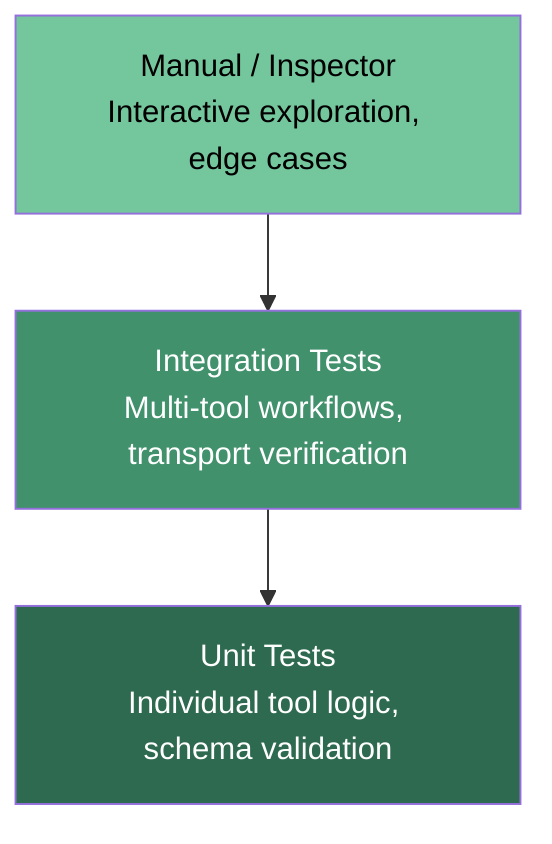
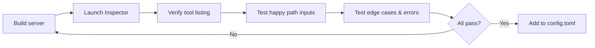

# MCP Server Testing and Quality Assurance: Unit Tests, Integration Flows, and the Inspector Workflow


Every Codex CLI workflow is only as reliable as the MCP servers it depends on. A flaky tool definition, a malformed JSON response, or a silently swallowed error will propagate through the agent's reasoning chain and produce incorrect results with high confidence. Yet most teams treat MCP servers as configuration rather than code — they wire them into `config.toml` and hope for the best.

This article covers a three-layer testing strategy for MCP servers: unit tests with in-memory transports, integration tests across multi-tool flows, and interactive verification with the MCP Inspector. Everything here targets Codex CLI v0.133 [^1] and the MCP TypeScript SDK v2 and Python `fastmcp` library as of May 2026.

## The Testing Pyramid for MCP Servers

The standard test pyramid applies directly to MCP servers, but the layers map to protocol-specific concerns:



**Unit tests** validate individual tool handlers in isolation — correct return types, error handling, input validation — without spawning a server process. **Integration tests** verify multi-tool workflows, transport negotiation, and concurrent request handling. **Inspector sessions** provide interactive exploration during development and serve as the final verification step before deployment [^2].

## Unit Testing with In-Memory Transports

The most effective pattern for MCP unit tests eliminates subprocess management entirely. Both the TypeScript and Python SDKs support in-memory client-server binding, where data written to one side of a transport pair appears as input on the other [^3].

### Python with FastMCP

FastMCP's `Client` class accepts a server instance directly, creating an in-memory transport under the hood:

```python
import pytest
from fastmcp import FastMCP, Client

@pytest.fixture
def server():
    mcp = FastMCP("TestServer")

    @mcp.tool
    def lint_config(path: str) -> dict:
        """Validate a configuration file and return diagnostics."""
        if not path.endswith((".toml", ".yaml", ".json")):
            raise ValueError(f"Unsupported file type: {path}")
        return {"valid": True, "warnings": 0, "path": path}

    return mcp

@pytest.mark.asyncio
async def test_lint_valid_toml(server):
    async with Client(server) as client:
        result = await client.call_tool("lint_config", {"path": "config.toml"})
        import json
        data = json.loads(result[0].text)
        assert data["valid"] is True

@pytest.mark.asyncio
async def test_lint_rejects_unsupported_type(server):
    async with Client(server) as client:
        with pytest.raises(Exception) as exc_info:
            await client.call_tool("lint_config", {"path": "readme.txt"})
        assert "Unsupported file type" in str(exc_info.value)
```

Install dependencies with `pip install pytest pytest-asyncio fastmcp` [^4]. The in-memory binding means tests complete in milliseconds with no port allocation or process lifecycle to manage.

### TypeScript with Vitest

Vitest is the recommended framework because it natively supports ESM, which the MCP TypeScript SDK requires [^3]. Use `InMemoryTransport.createLinkedPair()` to connect client and server in the same process:

```typescript
import { describe, it, expect } from "vitest";
import { McpServer } from "@modelcontextprotocol/sdk/server/mcp.js";
import { Client } from "@modelcontextprotocol/sdk/client/index.js";
import { InMemoryTransport } from "@modelcontextprotocol/sdk/inMemory.js";
import { z } from "zod";

describe("lint_config tool", () => {
  it("returns valid for TOML files", async () => {
    const server = new McpServer({ name: "test", version: "1.0.0" });

    server.tool(
      "lint_config",
      { path: z.string() },
      async ({ path }) => ({
        content: [
          {
            type: "text",
            text: JSON.stringify({ valid: true, warnings: 0, path }),
          },
        ],
      })
    );

    const [clientTransport, serverTransport] =
      InMemoryTransport.createLinkedPair();

    await server.connect(serverTransport);
    const client = new Client({ name: "test-client", version: "1.0.0" });
    await client.connect(clientTransport);

    const result = await client.callTool({
      name: "lint_config",
      arguments: { path: "config.toml" },
    });

    const data = JSON.parse((result.content as any)[0].text);
    expect(data.valid).toBe(true);
  });
});
```

### Mocking External Dependencies

Production MCP tools typically call databases, APIs, or file systems. Mock these at the boundary to keep tests deterministic:

```python
from unittest.mock import AsyncMock, patch

@pytest.mark.asyncio
async def test_query_tool_with_mocked_db(server):
    mock_pool = AsyncMock()
    mock_pool.fetch.return_value = [{"id": 1, "name": "widget"}]

    with patch("myserver.db.get_pool", return_value=mock_pool):
        async with Client(server) as client:
            result = await client.call_tool("query", {"sql": "SELECT * FROM items"})
            data = json.loads(result[0].text)
            assert len(data) == 1
            mock_pool.fetch.assert_called_once()
```

The rule is straightforward: mock the I/O boundary, not the MCP protocol layer. Testing the protocol itself is the SDK's responsibility [^3].

## Integration Testing Multi-Tool Workflows

Unit tests verify individual tools; integration tests verify that tools compose correctly. The key pattern is chaining tool calls where each step depends on the previous result — matching how Codex CLI actually uses MCP servers during a session.

```python
@pytest.mark.asyncio
async def test_schema_audit_pipeline(server):
    """Test the full audit workflow: discover -> analyse -> report."""
    async with Client(server) as client:
        # Step 1: discover tables
        tables = await client.call_tool("list_tables", {"schema": "public"})
        table_names = json.loads(tables[0].text)
        assert len(table_names) > 0

        # Step 2: analyse each table
        findings = []
        for table in table_names:
            result = await client.call_tool("analyse_table", {"table": table})
            findings.append(json.loads(result[0].text))

        # Step 3: generate report
        report = await client.call_tool(
            "generate_report", {"findings": json.dumps(findings)}
        )
        report_data = json.loads(report[0].text)
        assert "summary" in report_data
        assert report_data["tables_analysed"] == len(table_names)
```

### Concurrent Request Testing

MCP servers must handle multiple simultaneous tool calls without race conditions or data contamination — Codex CLI's subagent architecture means several agents may hit the same server concurrently [^5]:

```python
@pytest.mark.asyncio
async def test_concurrent_tool_calls(server):
    async with Client(server) as client:
        tasks = [
            client.call_tool("process_item", {"id": str(i)})
            for i in range(10)
        ]
        results = await asyncio.gather(*tasks)
        ids = {json.loads(r[0].text)["processed_id"] for r in results}
        assert len(ids) == 10  # all unique, no cross-contamination
```

### Transport-Level Integration Tests

For HTTP-based MCP servers (Streamable HTTP), test the actual transport rather than relying solely on in-memory binding. Spin up the server on a random port in a test fixture:

```python
@pytest.fixture
async def http_server():
    server = create_my_mcp_server()
    port = find_free_port()
    task = asyncio.create_task(server.run_http(port=port))
    yield f"http://localhost:{port}/mcp"
    task.cancel()

@pytest.mark.asyncio
async def test_http_transport(http_server):
    async with Client(http_server, transport="streamable-http") as client:
        tools = await client.list_tools()
        assert len(tools) > 0
```

## The MCP Inspector Workflow

The MCP Inspector is the protocol's equivalent of Postman — a browser-based interactive tool for exploring and debugging servers [^6]. It runs via npx without installation:

```bash
npx @modelcontextprotocol/inspector node ./my-server/index.js
```

For Python servers:

```bash
npx @modelcontextprotocol/inspector uvx my-mcp-package --arg1 value
```

The Inspector UI (default `http://localhost:6274`) provides four panels:

1. **Server Connection** — select transport type, customise command-line arguments and environment variables
2. **Tools** — browse all registered tools, inspect JSON schemas, execute with custom inputs, view raw responses
3. **Resources** — list URIs, inspect MIME types, read content, test subscriptions
4. **Notifications** — real-time log stream and server notifications [^6]

### Development Verification Workflow

Before wiring any MCP server into `config.toml`, verify it through the Inspector:



This catches issues that would otherwise surface as cryptic agent failures during a Codex session — missing tool descriptions, incorrect schema types, unhandled exceptions leaking stack traces, or tools that silently return empty results.

### Inspector with Codex's Own MCP Server

Codex CLI itself exposes an MCP server interface [^7]. You can inspect it directly:

```bash
npx @modelcontextprotocol/inspector codex mcp-server
```

This is invaluable for debugging tool availability when composing Codex as an MCP server within a larger agent orchestration.

## Integrating MCP Tests into CI/CD

MCP server tests should run in CI alongside application tests. The in-memory transport pattern means no Docker containers or port allocation required for unit tests:

```yaml
# .github/workflows/mcp-tests.yml
name: MCP Server Tests
on: [push, pull_request]

jobs:
  test:
    runs-on: ubuntu-latest
    steps:
      - uses: actions/checkout@v4
      - uses: actions/setup-python@v5
        with:
          python-version: "3.12"
      - run: pip install -e ".[test]"
      - run: pytest tests/mcp/ -v --timeout=30
```

For integration tests that require the actual transport, add a separate job with appropriate timeouts. Set integration test timeouts to 5–10 seconds per test — anything slower indicates a server startup or teardown issue [^8].

### Pre-Commit Verification with codex doctor

Before running the full test suite, use `codex doctor` (shipped in v0.131) to verify the local MCP environment is healthy [^9]:

```bash
codex doctor --json | jq '.mcp_servers'
```

This catches environment issues — missing API keys, unresolved paths, timed-out servers — before they cause test failures.

## Verifying Servers via /mcp in a Codex Session

After automated tests pass and the server is registered in `config.toml`, the final verification step is interactive. Start a Codex session and run:

```
/mcp
```

This lists all connected MCP servers and their registered tools [^10]. Verify the tool count matches expectations and that descriptions render correctly. If a server fails to connect, check:

1. **TOML syntax** — arrays use brackets (`args = ["arg1"]`), strings need quotes
2. **PATH resolution** — use absolute paths for stdio executables
3. **Startup timeout** — increase `startup_timeout_sec` for servers with heavy initialisation
4. **Trust** — project-scoped `.codex/config.toml` requires the directory to be trusted [^10]

## Common Failure Patterns and Mitigations

| Failure | Symptom | Mitigation |
|---------|---------|------------|
| Schema drift | Agent sends wrong parameter types | Pin tool schemas with snapshot tests |
| Silent empty response | Tool returns `[]` instead of error | Assert non-empty responses in unit tests |
| Timeout under load | Server hangs on concurrent calls | Add concurrent request integration tests |
| Credential leak in errors | Stack trace exposes API keys | Test error responses contain no secrets |
| Transport mismatch | stdio server configured as HTTP | Verify transport type in Inspector first |
| Type coercion | JSON serialisation alters numeric types | Test with exact production types [^3] |

## AGENTS.md Conventions for MCP Server Projects

Encode testing requirements in `AGENTS.md` so Codex CLI enforces them during development:

```markdown
## MCP Server Testing Rules

- Every `@mcp.tool` handler MUST have a corresponding unit test
- Unit tests use in-memory transport — never subprocess spawning
- Integration tests cover all multi-tool workflows documented in README
- Error paths tested for every tool: invalid input, missing auth, timeout
- No tool may return an empty response without raising an explicit error
- Run `npx @modelcontextprotocol/inspector` verification before any PR
- CI must pass `pytest tests/mcp/ -v --timeout=30` with zero failures
```

## Limitations

- **No built-in connectivity test at startup** — Codex CLI does not verify MCP server health when launching a session; `codex doctor` must be run separately [^9]
- **Inspector requires Node.js** — even for Python-only MCP servers, the Inspector runs via npx
- **In-memory transport skips serialisation edge cases** — transport-level integration tests remain necessary for production deployments
- **No official test harness for Streamable HTTP auth** — OAuth 2.1 flows (shipping Q2 2026) require manual verification or custom test tooling [^2]
- **Training data lag** — models may suggest outdated MCP SDK patterns; always verify against current SDK documentation

## Citations

[^1]: [Codex CLI Changelog — v0.133.0](https://developers.openai.com/codex/changelog)
[^2]: [How to Test MCP Server: Top Testing Tools & Methods in 2026 — Testomat.io](https://testomat.io/blog/mcp-server-testing-tools/)
[^3]: [Unit Testing MCP Servers — Complete Testing Guide — MCPcat](https://mcpcat.io/guides/writing-unit-tests-mcp-servers/)
[^4]: [FastMCP Python Library — PyPI](https://pypi.org/project/fastmcp/)
[^5]: [MCP Integration Testing — E2E Testing Guide — MCPcat](https://mcpcat.io/guides/integration-tests-mcp-flows/)
[^6]: [MCP Inspector — Model Context Protocol Official Documentation](https://modelcontextprotocol.io/docs/tools/inspector)
[^7]: [Codex CLI as MCP Server — OpenAI Developers](https://developers.openai.com/codex/mcp)
[^8]: [The Complete Guide to Testing MCP Server Applications — Anil Goyal, Medium](https://medium.com/@anil.goyal0057/the-complete-guide-to-testing-mcp-server-applications-a-three-layer-test-pyramid-for-ai-powered-027e941be6d4)
[^9]: [Codex CLI Diagnostic Logs Deep-Dive — SmartScope](https://smartscope.blog/en/generative-ai/chatgpt/codex-cli-diagnostic-logs-deep-dive/)
[^10]: [Codex CLI MCP Setup: How to Configure MCP Servers — AgentPatch](https://agentpatch.ai/blog/codex-cli-mcp-setup/)
