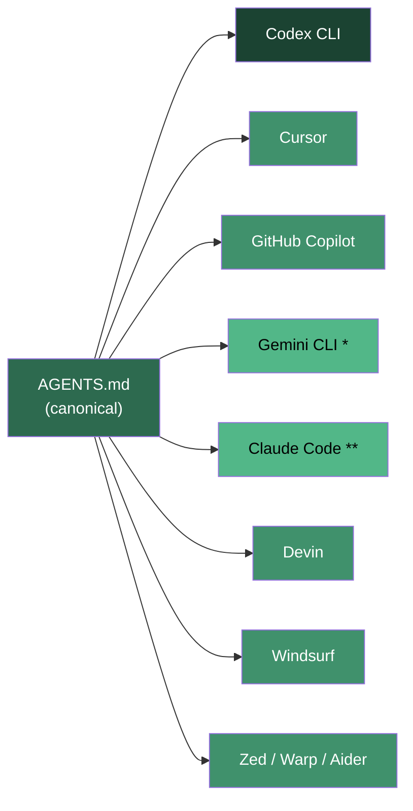

# Agent Instruction Files: AGENTS.md, CLAUDE.md, and Cross-Tool Portability with Codex CLI


---

Every AI coding agent reads a project-level instruction file — but every tool reads a *different* one. Codex CLI reads `AGENTS.md`. Claude Code reads `CLAUDE.md`. Gemini CLI reads `GEMINI.md`. Cursor reads `.cursor/rules/*.mdc`. GitHub Copilot reads `.github/copilot-instructions.md`. Windsurf reads `.windsurfrules`. The result is a fragmented landscape where teams maintaining multi-tool workflows end up with duplicated context scattered across half a dozen files.

This article maps the current instruction-file ecosystem as of May 2026, explains how each format works, and provides a concrete strategy for maintaining a single source of truth that works across all major coding agents — with Codex CLI's `AGENTS.md` as the canonical anchor.

## The Instruction-File Landscape

### AGENTS.md — The Cross-Tool Standard

`AGENTS.md` was released by OpenAI in August 2025 and transferred to the Linux Foundation's Agentic AI Foundation (AAIF) in late 2025 alongside Anthropic's MCP and Block's Goose [^1]. By May 2026, the AAIF has grown to over 170 member organisations [^2], and `AGENTS.md` has been adopted by more than 60,000 open-source repositories [^3].

The format is deliberately minimal: plain Markdown with no required schema, no YAML front matter, and no special syntax [^4]. Where a `README.md` explains a project to humans, `AGENTS.md` explains it to agents — build commands, test commands, code style conventions, architectural constraints, and anything else an agent needs to work effectively.

**Tool support** spans 20+ platforms: Codex CLI, Cursor, GitHub Copilot, Gemini CLI, Google Jules, VS Code, Devin, Aider, Zed, Warp, Semgrep, JetBrains Junie, and others [^3].

**Hierarchy rules:** the closest `AGENTS.md` to the edited file takes precedence; explicit user prompts override everything [^4]. Monorepos can maintain multiple files — OpenAI's own main repository contains 88 [^4].

### CLAUDE.md — Claude Code's Native Format

Claude Code loads `CLAUDE.md` automatically at session start from three locations [^5]:

1. `~/.claude/CLAUDE.md` — global personal preferences
2. `.claude/CLAUDE.md` (or `CLAUDE.md` at project root) — project-level, committed to git
3. `CLAUDE.local.md` — personal overrides, gitignored

The load order is global → project root → subdirectory → user-specific, with later files taking precedence [^5]. Best practice is to keep the file under approximately 800 words to preserve context for actual work [^5].

Crucially, Claude Code also reads `AGENTS.md` as a fallback when no `CLAUDE.md` is found in a directory [^6]. This means teams can maintain a single `AGENTS.md` and have it work with both Codex CLI and Claude Code without duplication.

### GEMINI.md — Gemini CLI's Context Files

Gemini CLI uses a similar hierarchical system [^7]:

- **Global:** `~/GEMINI.md` — rules applied across all projects
- **Project and ancestors:** `GEMINI.md` in the project root — project-wide context
- **Local:** `GEMINI.md` in subdirectories — module-specific instructions

A distinguishing feature is the `@file.md` import syntax, which lets you break large instruction files into composable fragments: `@./components/instructions.md` or `@../shared/style-guide.md` [^7]. The `/memory show` command displays the concatenated content being fed to the model.

The filename is configurable via `settings.json` using the `context.fileName` property, meaning you can point Gemini CLI at `AGENTS.md` directly [^7].

### .cursor/rules/*.mdc — Cursor's Scoped Rules

Cursor has moved from the legacy `.cursorrules` single file to a directory-based system at `.cursor/rules/` containing individual `.mdc` (Markdown Cursor) files [^8]. Each rule file supports:

- **Glob patterns** for file-scoped activation
- **Conditional loading** based on context
- **Per-session toggling**

A critical behavioural difference: when Cursor's Agent mode is active, `.cursorrules` files are invisible — only `.mdc` rules are loaded [^8]. If both formats coexist, `.mdc` rules silently override `.cursorrules` on conflicts.

Cursor also reads `AGENTS.md` natively [^3], so the recommended approach is to keep shared conventions in `AGENTS.md` and use `.mdc` files only for Cursor-specific features like glob-scoped rules that other tools cannot express.

### .github/copilot-instructions.md — GitHub Copilot

GitHub Copilot reads `.github/copilot-instructions.md` in the repository root [^9]. The format is plain Markdown with a recommended limit of approximately two pages. Additionally, path-specific instructions can be placed in `.github/instructions/NAME.instructions.md` files with glob pattern support [^9].

Copilot also reads `AGENTS.md` natively [^3], making the dedicated instruction file primarily useful for Copilot-specific features like the glob-scoped instruction files.

### .windsurfrules — Windsurf/Cascade

Windsurf's AI agent Cascade reads `.windsurfrules` at the project root [^10]. Newer versions support `.windsurf/rules/rules.md` as the preferred location. The format is Markdown with optional XML tags for grouping related rules, with a recommended limit of 12,000 characters [^10].

## The Portability Matrix



**\*** Gemini CLI can be configured to read `AGENTS.md` via `context.fileName`

**\*\*** Claude Code reads `AGENTS.md` as fallback when no `CLAUDE.md` is present

## A Single-Source-of-Truth Strategy

The practical approach for teams using multiple AI coding tools:

### 1. Make AGENTS.md the Canonical Source

Write one `AGENTS.md` at the repository root containing everything that's tool-agnostic: project overview, build/test commands, code style conventions, architecture constraints, testing instructions, commit message format, and security considerations.

```markdown
# AGENTS.md

## Project Overview
Server-side rendered web application. TypeScript 5.8, Node 22, Next.js 15.

## Build and Test
- `npm run build` — production build
- `npm run test` — vitest unit tests
- `npm run test:e2e` — Playwright end-to-end tests
- `npm run lint` — Biome linter

## Code Style
- Functional components only; no class components
- Use server components by default; mark 'use client' explicitly
- Named exports; no default exports except pages
- Error boundaries at route segment level

## Testing
- Colocate test files as `*.test.ts` alongside source
- Minimum 80% branch coverage on new code
- Mock external services; never hit real APIs in tests

## Architecture
- `/app` — Next.js App Router pages and layouts
- `/lib` — shared utilities, no framework imports
- `/components` — React components, one per file
- `/services` — external API clients
```

### 2. Symlink Tool-Specific Files

For Claude Code, create a symlink rather than a separate file:

```bash
ln -s AGENTS.md CLAUDE.md
```

For Gemini CLI, configure `settings.json`:

```json
{
  "context": {
    "fileName": "AGENTS.md"
  }
}
```

### 3. Use Tool-Specific Files Only for Tool-Specific Features

`.cursor/rules/*.mdc` files for glob-scoped Cursor rules:

```markdown
---
description: React component conventions
globs: ["components/**/*.tsx"]
---
Use React.FC type. Destructure props in the function signature.
```

`.github/instructions/api.instructions.md` for Copilot path-specific instructions:

```markdown
---
applyTo: "services/**"
---
All API clients must use the shared `fetchWithRetry` wrapper.
```

### 4. Codex CLI-Specific Patterns in config.toml

Codex CLI configuration beyond `AGENTS.md` belongs in `config.toml`, not in duplicate instruction files:

```toml
[model]
default = "gpt-5.5"

[model.subagent]
default = "gpt-5.4-mini"

[sandbox]
permissions = "read-only"
```

## AGENTS.md Best Practices for Codex CLI

Research by Gloaguen et al. (2026) across 138 real-world repositories found that developer-written `AGENTS.md` files improve agent task success rates by approximately 4% and reduce agent-generated bugs by 35–55%, whilst LLM-generated instruction files actually *decrease* success rates and increase inference cost by over 20% [^11].

**Keep it under 150 lines.** Signal density matters more than format compliance. Every token in `AGENTS.md` is loaded on every turn — overly verbose files waste context budget [^11].

**Be specific, not aspirational.** "Write clean code" changes nothing. "Use `Result<T, E>` instead of throwing exceptions; pattern-match all variants" changes behaviour.

**List exact commands.** Agents automatically execute build and test commands from `AGENTS.md` [^4]. Ambiguous or incomplete commands cause tool-call failures.

**Use the hierarchy for monorepos.** Place a root `AGENTS.md` with shared conventions, then add subdirectory files for package-specific overrides. Codex CLI and most other tools resolve the nearest file to the current working context [^4].

**Never auto-generate.** Write the file by hand. The research is clear: LLM-authored instruction files perform worse than hand-authored ones [^11].

## Security Considerations

Agent instruction files are an attack surface. NVIDIA's research demonstrated that malicious `AGENTS.md` content in dependencies can redirect agent behaviour, exfiltrate data, or inject backdoors while concealing the changes from human reviewers [^12]. Mitigations:

- **Review `AGENTS.md` in dependencies** as carefully as you review code
- **Use Codex CLI's `PreToolUse` hooks** to gate dangerous operations regardless of what `AGENTS.md` instructs
- **Pin instruction files in CI** — diff `AGENTS.md` changes in pull requests and require human approval
- **Never place secrets** in instruction files; use environment variables or vault integrations

## What's Next

The AAIF is actively developing the `AGENTS.md` specification. An open proposal for v1.1 addresses making implicit semantics explicit, clarifying scope boundaries, and supporting progressive disclosure [^13]. As the specification matures under Linux Foundation governance, the current fragmentation of instruction files across tools is likely to consolidate further around `AGENTS.md` as the shared standard — with tool-specific files reserved for features that genuinely require tool-specific syntax.

For teams already invested in Codex CLI, the strategy is straightforward: write `AGENTS.md` well, symlink or configure other tools to read it, and use tool-specific files only when you must.

## Citations

[^1]: Linux Foundation, "Linux Foundation Announces the Formation of the Agentic AI Foundation (AAIF)", [https://www.linuxfoundation.org/press/linux-foundation-announces-the-formation-of-the-agentic-ai-foundation](https://www.linuxfoundation.org/press/linux-foundation-announces-the-formation-of-the-agentic-ai-foundation)
[^2]: OpenAI, "OpenAI co-founds the Agentic AI Foundation under the Linux Foundation", [https://openai.com/index/agentic-ai-foundation/](https://openai.com/index/agentic-ai-foundation/)
[^3]: AGENTS.md official website, [https://agents.md/](https://agents.md/)
[^4]: AGENTS.md specification and format overview, [https://agents.md/](https://agents.md/)
[^5]: Claude Code documentation, "CLAUDE.md file overview", [https://code.claude.com/docs/en/overview](https://code.claude.com/docs/en/overview)
[^6]: HiveTrail, "AGENTS.md vs CLAUDE.md: The AI Developer's Guide to Context Standards", [https://hivetrail.com/blog/agents-md-vs-claude-md-cross-tool-standard](https://hivetrail.com/blog/agents-md-vs-claude-md-cross-tool-standard)
[^7]: Google Gemini CLI documentation, "Provide context with GEMINI.md files", [https://geminicli.com/docs/cli/gemini-md/](https://geminicli.com/docs/cli/gemini-md/)
[^8]: The Prompt Shelf, ".cursorrules vs .cursor/rules (MDC): Which Format to Use in 2026", [https://thepromptshelf.dev/blog/cursorrules-vs-mdc-format-guide-2026/](https://thepromptshelf.dev/blog/cursorrules-vs-mdc-format-guide-2026/)
[^9]: GitHub Docs, "Adding repository custom instructions for GitHub Copilot", [https://docs.github.com/copilot/customizing-copilot/adding-custom-instructions-for-github-copilot](https://docs.github.com/copilot/customizing-copilot/adding-custom-instructions-for-github-copilot)
[^10]: The Prompt Shelf, ".windsurfrules: The Complete Guide to Windsurf AI Rules (2026)", [https://thepromptshelf.dev/blog/windsurfrules-complete-guide-2026/](https://thepromptshelf.dev/blog/windsurfrules-complete-guide-2026/)
[^11]: ASDLC.io, "AGENTS.md Specification: A Research-Backed Guide", [https://asdlc.io/practices/agents-md-spec/](https://asdlc.io/practices/agents-md-spec/)
[^12]: NVIDIA Technical Blog, "Mitigating Indirect AGENTS.md Injection Attacks in Agentic Environments", [https://developer.nvidia.com/blog/mitigating-indirect-agents-md-injection-attacks-in-agentic-environments/](https://developer.nvidia.com/blog/mitigating-indirect-agents-md-injection-attacks-in-agentic-environments/)
[^13]: GitHub Issue #135, "Proposal: AGENTS.md v1.1: Making Implicit Semantics Explicit", [https://github.com/agentsmd/agents.md/issues/135](https://github.com/agentsmd/agents.md/issues/135)
