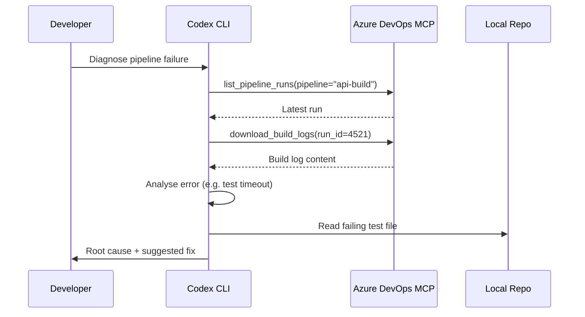

# Codex CLI for Azure DevOps: MCP Server, Work Item Triage, Pipeline Debugging, and Agent Workflows


---

Codex CLI articles cover AWS, GCP, GitHub, GitLab, and half a dozen CI platforms in detail — yet Azure DevOps, which still runs a significant share of enterprise software delivery, has no dedicated coverage. Microsoft's official Azure DevOps MCP server (`@azure-devops/mcp`) ships 77 tools across nine domains, supports both local STDIO and a hosted Streamable HTTP remote server, and authenticates through Microsoft Entra [^1][^2]. This article covers practical configuration for Codex CLI, domain selection strategy, four workflow patterns, and the security considerations that matter when connecting an AI agent to your organisation's boards, repos, and pipelines.

## The Azure DevOps MCP Server Landscape

Two distinct paths exist for connecting Codex CLI to Azure DevOps.

### Official Microsoft Server (`@azure-devops/mcp`)

The official server, maintained at `microsoft/azure-devops-mcp`, provides 77 tools organised into nine domains [^1]:

| Domain | Capabilities |
|---|---|
| `core` | Project and organisation metadata |
| `work` | Team and iteration management |
| `work-items` | WIQL queries, create/update epics, features, stories, tasks, bugs |
| `search` | Cross-service content discovery |
| `test-plans` | Test plans, suites, cases, and results |
| `repositories` | Git repos, branches, file contents, statistics |
| `wiki` | Wiki page CRUD operations |
| `pipelines` | Queue, cancel, retry builds; list runs; download logs |
| `advanced-security` | Security scanning and alert management |

The local variant runs via `npx` over STDIO. The remote variant — announced in public preview on 17 March 2026 — uses Streamable HTTP at `https://mcp.dev.azure.com/{organization}` and requires no local installation [^2][^3].

### Community Alternative: Tiberriver256

The community `Tiberriver256/mcp-server-azure-devops` server offers a feature-based modular architecture with PAT, Azure Identity (`DefaultAzureCredential`), and Azure CLI authentication [^4]. It is a viable option for teams needing on-premises Azure DevOps Server support or finer-grained tool customisation, though it lacks the remote Streamable HTTP transport.

## Configuring Codex CLI

### Local STDIO Transport

Add the official server to `~/.codex/config.toml`:

```toml
[mcp_servers.azure-devops]
command = "npx"
args = ["-y", "@azure-devops/mcp", "contoso"]
env_vars = ["ADO_MCP_AUTH_TOKEN"]
startup_timeout_sec = 15

# Load only the domains you need
[mcp_servers.azure-devops.env]
ADO_DOMAINS = "core,work-items,pipelines,repositories"
```

The `ADO_MCP_AUTH_TOKEN` environment variable accepts a bearer token from `az account get-access-token` or a PAT encoded as Base64 of `email:token` [^5]. For interactive sessions, omit `ADO_MCP_AUTH_TOKEN` and the server falls back to browser-based Entra login.

Alternatively, register via the CLI:

```bash
codex mcp add azure-devops -- npx -y @azure-devops/mcp contoso
```

### Remote Streamable HTTP Transport

For the hosted remote server (public preview), configure with the HTTP URL [^3]:

```toml
[mcp_servers.azure-devops-remote]
url = "https://mcp.dev.azure.com/contoso"
```

> **Caveat:** As of May 2026, the remote server requires dynamic OAuth client registration in Microsoft Entra before non-VS/VS Code clients (including Codex CLI) can connect [^2]. Until Microsoft ships first-party Codex CLI support, you must register an OAuth app in Entra and configure the `bearer_token_env_var`:

```toml
[mcp_servers.azure-devops-remote]
url = "https://mcp.dev.azure.com/contoso"
bearer_token_env_var = "ADO_REMOTE_BEARER_TOKEN"
```

⚠️ The remote server is in public preview. Microsoft has stated the local server will eventually be archived as investment shifts to the hosted solution [^3]. Plan for migration but test thoroughly — not all domain tools may be available in the remote preview.

### Domain Selection Strategy

Loading all nine domains exposes 77 tools, which consumes context budget. A practical approach:

```toml
# Sprint-focused profile
[profiles.sprint]
[profiles.sprint.mcp_servers.azure-devops]
command = "npx"
args = ["-y", "@azure-devops/mcp", "contoso", "--domains", "core,work,work-items"]

# CI/CD-focused profile
[profiles.cicd]
[profiles.cicd.mcp_servers.azure-devops]
command = "npx"
args = ["-y", "@azure-devops/mcp", "contoso", "--domains", "core,pipelines,repositories"]
```

The `core` domain should always be enabled — it provides project-level context that other domains depend on [^1].

## AGENTS.md for Azure DevOps Projects

```markdown
# AGENTS.md — Azure DevOps Integration

## Azure DevOps Context
- Organisation: contoso
- Default project: WebPlatform
- Current sprint: Sprint 42 (2026-05-19 to 2026-06-01)

## Work Item Rules
- Use WIQL for all work item queries — do NOT fabricate work item IDs
- Always include [System.State], [System.AssignedTo], [System.Tags] in WIQL selects
- Respect area paths: features under WebPlatform\Frontend, bugs under WebPlatform\Backend
- Never transition work items to "Closed" without explicit user approval

## Pipeline Rules
- Pipeline names follow the pattern: `{service}-{stage}` (e.g. api-build, web-deploy-staging)
- Do NOT queue production pipelines without approval — use approval_mode = "approve"
- Download build logs before diagnosing failures; do not guess at error messages

## Repository Rules
- Main branch is `main`; release branches follow `release/YYYY.MM`
- PRs require at least one reviewer from the CODEOWNERS path
- Prefer `repositories` domain tools for file browsing over shell commands
```

## Workflow Patterns

### 1. Sprint Standup Preparation

```bash
codex --profile sprint "Get my assigned work items for project WebPlatform \
  in the current sprint. Group by state: completed yesterday, in progress \
  today, and blocked. Format as a standup update."
```

The agent issues a WIQL query through the `work-items` domain, filters by `[System.AssignedTo] = @Me` and the current iteration path, then structures the output into the daily standup format [^6].

### 2. Pipeline Failure Diagnosis

```bash
codex --profile cicd "The api-build pipeline failed on the latest run. \
  Download the build logs, identify the root cause, and suggest a fix."
```



### 3. Work Item Triage with Batch Audit

For bulk triage across a backlog:

```bash
codex exec --prompt "Query all work items in state 'New' for project \
  WebPlatform. For each, assess priority based on title, tags, and \
  description. Output a JSON array with id, title, suggested_priority, \
  and rationale." \
  --output-schema triage-schema.json \
  -o triage-results.json
```

Where `triage-schema.json` defines:

```json
{
  "type": "array",
  "items": {
    "type": "object",
    "properties": {
      "id": { "type": "integer" },
      "title": { "type": "string" },
      "suggested_priority": { "type": "integer", "minimum": 1, "maximum": 4 },
      "rationale": { "type": "string" }
    },
    "required": ["id", "title", "suggested_priority", "rationale"]
  }
}
```

This leverages `codex exec` with `--output-schema` for structured, machine-parseable output suitable for downstream automation [^7].

### 4. Wiki Documentation from Sprint Review

```bash
codex "Get all work items completed in Sprint 42 for WebPlatform. \
  Generate a sprint review wiki page summarising features delivered, \
  bugs fixed, and known issues. Create the page under the 'Sprint Reviews' \
  wiki section."
```

The agent queries completed items, groups them by type, and uses the `wiki` domain tools to create or update a wiki page directly in Azure DevOps — eliminating the manual copy-paste from boards to documentation.

## Server Composition

Azure DevOps MCP pairs naturally with other servers for broader workflows:

```toml
# Azure DevOps for boards, pipelines, repos
[mcp_servers.azure-devops]
command = "npx"
args = ["-y", "@azure-devops/mcp", "contoso", "--domains", "core,work-items,pipelines,repositories,wiki"]
env_vars = ["ADO_MCP_AUTH_TOKEN"]

# GitHub MCP for cross-platform PRs (if repos mirror to GitHub)
[mcp_servers.github]
command = "npx"
args = ["-y", "@modelcontextprotocol/server-github"]
env_vars = ["GITHUB_PERSONAL_ACCESS_TOKEN"]

# Sentry for error correlation
[mcp_servers.sentry]
command = "npx"
args = ["-y", "@sentry/mcp-server"]
env_vars = ["SENTRY_AUTH_TOKEN"]
```

A typical enterprise flow: Sentry surfaces a production error → Codex creates an Azure DevOps bug work item → links it to the relevant pipeline and repo → suggests a fix based on the stack trace.

## Model Selection

Azure DevOps workflows are predominantly text-heavy (WIQL, work item descriptions, build logs). Recommended model pairings:

| Task | Model | Rationale |
|---|---|---|
| Work item queries and triage | `o4-mini` | Fast, cost-effective for structured queries |
| Pipeline log analysis | `o3` | Longer context for verbose build logs |
| Sprint documentation | `o4-mini` | Prose generation at lower cost |
| Complex cross-domain workflows | `o3` | Multi-step reasoning across domains |

## Security Considerations

**Token scope.** PATs should use the minimum required scopes. For read-only triage workflows, grant only `Work Items (Read)` and `Build (Read)`. For wiki creation, add `Wiki (Read & Write)` [^5].

**Approval gating.** Gate destructive operations behind approval mode:

```toml
[mcp_servers.azure-devops]
command = "npx"
args = ["-y", "@azure-devops/mcp", "contoso"]
default_tools_approval_mode = "approve"
enabled_tools = [
  "get_work_items",
  "query_work_items",
  "list_pipeline_runs",
  "get_build_log",
  "get_wiki_page"
]
```

For tools that modify state (creating work items, queuing pipelines, updating wikis), use explicit `enabled_tools` lists rather than loading everything.

**Network access.** The STDIO server makes outbound HTTPS calls to `dev.azure.com`. Codex CLI's sandbox must permit this:

```toml
[sandbox]
allow_network = true
```

**Credential hygiene.** Never hardcode PATs or bearer tokens in `config.toml`. Use `env_vars` to read from the shell environment, or `bearer_token_env_var` for the remote transport [^8].

**Entra-backed organisations only.** The remote MCP server requires Microsoft Entra. Standalone organisations using Microsoft Accounts (MSA) cannot use it [^2].

## Limitations

- **Remote server preview.** The Streamable HTTP transport is in public preview; tool coverage may lag behind the local STDIO variant [^3].
- **OAuth registration.** Connecting Codex CLI to the remote server requires manual Entra OAuth app registration — no turnkey setup yet [^2].
- **Training data lag.** Models may not know the latest Azure DevOps REST API changes or WIQL syntax additions. The `work-items` domain mitigates this by handling query construction, but complex WIQL may still need correction.
- **Token budget.** With 77 tools across nine domains, loading everything consumes significant context. Domain filtering is not optional — it is essential for practical use.
- **No webhook integration.** The MCP server is pull-based. There is no mechanism for Azure DevOps to push events (service hooks) to trigger Codex CLI sessions reactively.
- **Build log size.** Verbose pipeline logs can exceed model context windows. Consider filtering to the failing task or stage before analysis.

## Citations

[^1]: Microsoft, "Azure DevOps MCP Server," GitHub, 2026. [https://github.com/microsoft/azure-devops-mcp](https://github.com/microsoft/azure-devops-mcp)
[^2]: Microsoft Learn, "Enable AI assistance with the Azure DevOps MCP Server," May 2026. [https://learn.microsoft.com/en-us/azure/devops/mcp-server/mcp-server-overview](https://learn.microsoft.com/en-us/azure/devops/mcp-server/mcp-server-overview)
[^3]: Microsoft DevOps Blog, "Azure DevOps Remote MCP Server (public preview)," March 2026. [https://devblogs.microsoft.com/devops/azure-devops-remote-mcp-server-public-preview/](https://devblogs.microsoft.com/devops/azure-devops-remote-mcp-server-public-preview/)
[^4]: Tiberriver256, "mcp-server-azure-devops," GitHub, 2026. [https://github.com/Tiberriver256/mcp-server-azure-devops](https://github.com/Tiberriver256/mcp-server-azure-devops)
[^5]: Microsoft, "Azure DevOps MCP Server — Getting Started," GitHub, 2026. [https://github.com/microsoft/azure-devops-mcp/blob/main/docs/GETTINGSTARTED.md](https://github.com/microsoft/azure-devops-mcp/blob/main/docs/GETTINGSTARTED.md)
[^6]: Microsoft Learn, "Azure DevOps MCP Server — Example usage," May 2026. [https://learn.microsoft.com/en-us/azure/devops/mcp-server/mcp-server-overview](https://learn.microsoft.com/en-us/azure/devops/mcp-server/mcp-server-overview)
[^7]: OpenAI, "Non-interactive mode — Codex CLI," 2026. [https://developers.openai.com/codex/noninteractive](https://developers.openai.com/codex/noninteractive)
[^8]: OpenAI, "Model Context Protocol — Codex CLI," 2026. [https://developers.openai.com/codex/mcp](https://developers.openai.com/codex/mcp)
