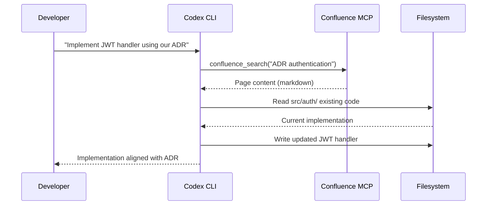

# Codex CLI with Confluence and Notion: Knowledge-Base MCP Integration


---

Knowledge bases are where institutional memory lives — and where it goes to die. Engineering teams document decisions in Confluence, product teams track specs in Notion, and six months later nobody can find any of it. Codex CLI's MCP integration turns both platforms into queryable, writable context sources, letting an agent search your team's knowledge base, pull relevant context into a coding session, and push documentation updates back — all without leaving the terminal.

This article covers the three MCP server options for Confluence, the official Notion MCP server with its 22 tools, and practical workflows for reading, searching, and updating team knowledge bases from Codex CLI.

## The MCP Server Landscape

### Confluence: Three Layers of Access

Confluence access through MCP comes in three flavours, each suited to different deployment contexts.

**1. Atlassian Rovo Remote MCP Server (Official)**

Atlassian's official remote MCP server reached GA in February 2026 with Claude as the launch partner [^1]. It provides OAuth 2.1 authentication, respects existing Confluence permissions, and runs entirely server-side — no local process needed.

The endpoint migrated from SSE to Streamable HTTP in 2026. The legacy `https://mcp.atlassian.com/v1/sse` endpoint will be retired after 30 June 2026 [^2].

```toml
# config.toml — Atlassian Rovo MCP (remote, Streamable HTTP)
[mcp-servers.atlassian]
type = "url"
url = "https://mcp.atlassian.com/v1/mcp/authv2"
```

The Rovo server exposes search, summarisation, page creation, and space navigation tools. Admin controls allow whitelisting specific AI domains and restricting which Confluence spaces are accessible [^1].

**2. sooperset/mcp-atlassian (Community, STDIO)**

For teams needing deeper Confluence integration or running Confluence Server/Data Center, the community `mcp-atlassian` server (v0.21.1, April 2026) provides 72 tools across Confluence and Jira [^3]. The Confluence-specific tools include:

- `confluence_search` — CQL-based search across spaces and pages
- `confluence_get_page` — retrieve full page content as markdown
- `confluence_create_page` — create pages with rich content
- `confluence_update_page` — modify existing pages
- `confluence_add_comment` — add inline or page-level comments

```toml
# config.toml — mcp-atlassian (STDIO, Cloud)
[mcp-servers.confluence]
type = "stdio"
command = "uvx"
args = ["mcp-atlassian", "--confluence-url", "https://yoursite.atlassian.net/wiki", "--confluence-auth-type", "token"]

[mcp-servers.confluence.env]
CONFLUENCE_USERNAME = "${CONFLUENCE_USERNAME}"
CONFLUENCE_API_TOKEN = "${CONFLUENCE_API_TOKEN}"
```

For Confluence Server or Data Center (v6.0+), swap the auth type to `pat` and supply a Personal Access Token [^3].

**3. Other Community Servers**

Several additional options exist: a .NET server for Confluence Cloud REST v2, a Python server with fuzzy multi-word search and markdown content hydration, and pankaj28843's dedicated Confluence server with configurable caching [^4]. These are worth evaluating if your stack constraints exclude Python or Node.js.

### Notion: The Official MCP Server

Notion's official MCP server (`makenotion/notion-mcp-server`) reached v2.0.0 with the migration to the Notion API 2025-09-03, introducing data sources as the primary database abstraction [^5]. The latest release targets API version 2026-03-11 and provides 22 tools [^6]:

| Category | Tools |
|---|---|
| **Search** | `search` |
| **Pages** | `retrieve-page-content`, `create-page`, `update-page-properties`, `append-block`, `update-block`, `delete-block`, `move-page` |
| **Data Sources** | `query-data-source`, `retrieve-a-data-source`, `update-a-data-source`, `create-a-data-source`, `list-data-source-templates` |
| **Databases** | `retrieve-a-database` |
| **Comments** | `retrieve-comments`, `create-comment`, `update-comment`, `delete-comment` |
| **Users** | `retrieve-user`, `list-all-users` |

Notion offers two deployment modes:

**Hosted (recommended):** Notion runs the server at `https://mcp.notion.com/mcp` with OAuth authentication via Streamable HTTP. This is where Notion is investing active development [^7].

**Local STDIO:** The `makenotion/notion-mcp-server` npm package runs locally with a `NOTION_TOKEN` integration token.

```toml
# config.toml — Notion MCP (hosted, remote)
[mcp-servers.notion]
type = "url"
url = "https://mcp.notion.com/mcp"
```

```toml
# config.toml — Notion MCP (local STDIO)
[mcp-servers.notion]
type = "stdio"
command = "npx"
args = ["-y", "@notionhq/notion-mcp-server"]

[mcp-servers.notion.env]
NOTION_TOKEN = "${NOTION_TOKEN}"
OPENAPI_MCP_HEADERS = '{"Authorization": "Bearer ${NOTION_TOKEN}", "Notion-Version": "2026-03-11"}'
```

## AGENTS.md for Knowledge-Base Projects

When using Codex CLI against knowledge bases, an `AGENTS.md` file prevents common pitfalls:

```markdown
# AGENTS.md — Knowledge-Base Integration Rules

## Confluence
- Search with CQL before creating pages — duplicates waste everyone's time
- Preserve existing page formatting when updating; fetch first, modify, push
- Use space keys consistently: DEV for engineering, PROD for product
- Never delete pages through MCP — use archive workflows instead
- Confluence page IDs are stable; titles are not — reference by ID in automation

## Notion
- Use `notion-search` before `notion-create-pages` to avoid duplicates
- Data sources (not raw databases) are the primary abstraction since API 2025-09-03
- Page properties must match the parent database schema exactly
- Use `notion-fetch` to retrieve schema before creating entries
- Comments are append-only — use `notion-update-page` for content corrections
```

## Workflow Patterns

### Pattern 1: Context-Aware Coding with Knowledge Base Search

The most immediate use case — pulling architectural decisions, API contracts, or runbook content into a coding session:

```bash
# Search Confluence for the authentication architecture decision
codex "Search our Confluence for the ADR on authentication service architecture, \
then use that context to implement the JWT refresh token handler in src/auth/"
```



### Pattern 2: Automated Documentation Updates

After completing a feature, push documentation back to the knowledge base:

```bash
codex "Review the changes in this branch, then update the Notion page titled \
'API Reference - User Service' with the new endpoints I've added. \
Add a changelog entry at the top."
```

This pattern works particularly well with Notion's `notion-update-page` tool combined with `notion-fetch` to retrieve the existing content first.

### Pattern 3: Cross-Platform Knowledge Search

When institutional knowledge spans both platforms, compose both MCP servers:

```toml
# config.toml — both servers active
[mcp-servers.confluence]
type = "stdio"
command = "uvx"
args = ["mcp-atlassian", "--confluence-url", "https://yoursite.atlassian.net/wiki"]

[mcp-servers.notion]
type = "url"
url = "https://mcp.notion.com/mcp"
```

```bash
codex "Search both Confluence and Notion for our rate limiting strategy. \
Summarise what each platform says and flag any contradictions."
```

### Pattern 4: Batch Knowledge Audit with `codex exec`

Audit documentation freshness across a Notion database:

```bash
codex exec \
  --prompt "Query the 'Engineering Docs' database in Notion. For each page, \
  check if the last_reviewed property is older than 90 days. Return a JSON \
  array of stale pages with title, last_reviewed date, and owner." \
  --output-schema '{"type":"array","items":{"type":"object","properties":{"title":{"type":"string"},"last_reviewed":{"type":"string"},"owner":{"type":"string"}}}}'
```

## Security Considerations

Knowledge bases contain sensitive institutional data. MCP access amplifies both the value and the risk.

**Credential hygiene.** The Atlassian Rovo server uses OAuth 2.1 with scoped permissions [^1]. For STDIO servers using API tokens, store credentials in environment variables — never in `config.toml` directly. Codex CLI's `${VAR}` syntax in config supports this.

**Permission boundaries.** Both the Rovo server and Notion's hosted server respect existing user permissions — the agent sees only what the authenticated user can see [^2] [^7]. The community `mcp-atlassian` server inherits the API token's permission scope.

**Approval gating.** For write operations (creating pages, updating content), use Codex CLI's approval mode:

```toml
[mcp-servers.confluence]
approval_mode = "unless-allow-listed"
```

This forces explicit approval before Codex modifies any knowledge base content.

**Data residency.** The Notion hosted MCP server processes data through Notion's infrastructure [^7]. The Atlassian Rovo server routes through Atlassian's cloud [^1]. For regulated environments, local STDIO servers keep data within your network boundary.

## Model Selection

Knowledge-base workflows are typically read-heavy with moderate reasoning requirements. For Codex CLI v0.134.0 [^8]:

- **o4-mini** — sufficient for search-and-summarise workflows, lower cost
- **o3** — better for cross-referencing multiple sources and resolving contradictions
- **GPT-5.5** — recommended for complex documentation generation that needs to match existing voice and style [^8]

## Limitations

- **Token budget.** Confluence pages can be enormous. A single architecture decision page may consume a significant portion of the context window. Use targeted CQL queries rather than broad searches.
- **Formatting fidelity.** Confluence storage format and Notion blocks don't map perfectly to markdown. Expect some formatting loss on round-trips, particularly with tables, macros, and embedded content.
- **Rovo SSE deprecation.** The Atlassian SSE endpoint (`/v1/sse`) is being retired after 30 June 2026 [^2]. Teams using SSE-based configurations must migrate to the `/v1/mcp/authv2` Streamable HTTP endpoint.
- **Notion hosted vs local divergence.** Notion is investing in the hosted server whilst the local STDIO server provides more tools but is being sunset [^7]. Plan for hosted-first deployments. ⚠️ The exact sunset timeline for the local server has not been publicly confirmed.
- **No real-time sync.** MCP provides point-in-time reads and writes — there's no webhook or subscription mechanism for live updates.
- **Training data lag.** Models may not know about the latest Notion API changes (Views API, data sources) without the MCP server mediating access to current schemas [^6].

## Citations

[^1]: [Atlassian Remote MCP Server — Extend Atlassian into any AI assistant](https://www.atlassian.com/platform/remote-mcp-server)
[^2]: [Getting started with the Atlassian Rovo MCP Server — Atlassian Support](https://support.atlassian.com/atlassian-rovo-mcp-server/docs/getting-started-with-the-atlassian-remote-mcp-server/)
[^3]: [sooperset/mcp-atlassian — GitHub (v0.21.1)](https://github.com/sooperset/mcp-atlassian)
[^4]: [Confluence MCP Servers — MCP Market](https://mcpmarket.com/businesses/confluence)
[^5]: [makenotion/notion-mcp-server — GitHub](https://github.com/makenotion/notion-mcp-server)
[^6]: [Notion MCP Supported Tools — Notion Developers](https://developers.notion.com/guides/mcp/mcp-supported-tools)
[^7]: [Notion's hosted MCP server: an inside look — Notion Blog](https://www.notion.com/blog/notions-hosted-mcp-server-an-inside-look)
[^8]: [Codex CLI Releases — GitHub (v0.134.0, May 2026)](https://github.com/openai/codex/releases)
