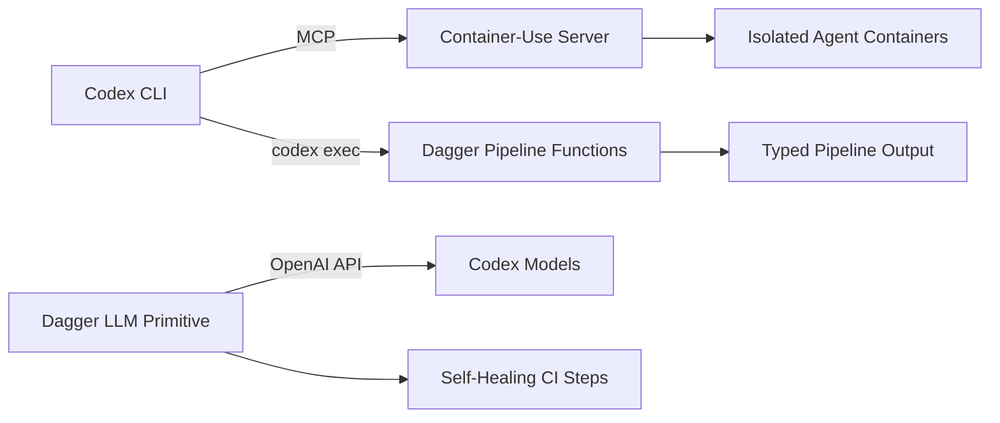
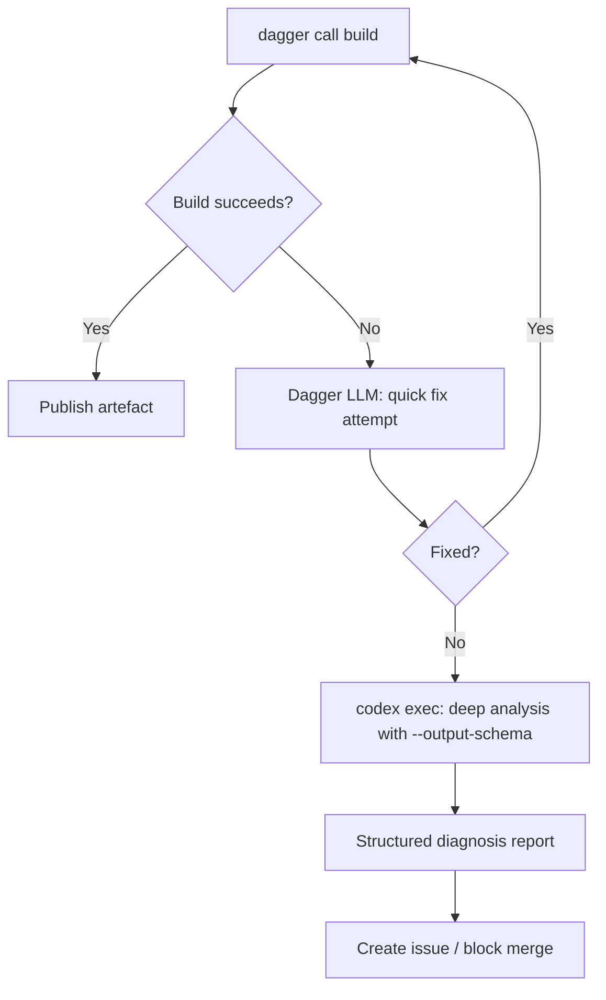

# Codex CLI with Dagger: Container-Use MCP, Programmable Pipelines, and LLM-Native CI/CD


---

Dagger has evolved from a programmable CI/CD engine into a full agent runtime — one where pipelines are functions, environments are containers, and LLMs are first-class primitives. With Dagger v0.20.8[^1] shipping LLM integration, Container-Use as an MCP server[^2], and Codex CLI's native MCP support[^3], the two tools form a potent combination: Codex CLI orchestrates intelligent code generation whilst Dagger provides hermetic, observable, parallelisable execution environments.

This article covers three integration surfaces: using Dagger's Container-Use MCP server to give Codex CLI isolated development containers, invoking `codex exec` inside Dagger pipeline functions, and building LLM-native CI/CD modules that blend Dagger's agent primitives with Codex's structured output.

## Why Dagger and Codex CLI Together

Traditional CI/CD platforms define pipelines in YAML. Dagger replaces YAML with typed functions in Go, Python, or TypeScript — each step runs inside a container, producing identical results on a laptop and in CI[^4]. Codex CLI, meanwhile, excels at generating, reviewing, and refactoring code through conversational and non-interactive modes.

The overlap creates three practical patterns:



## Pattern 1: Container-Use MCP for Agent Isolation

Dagger's Container-Use is an open-source MCP server that provisions isolated development containers, each mapped to a Git branch[^2]. When connected to Codex CLI, every agent session runs inside its own container — eliminating the file-conflict problem that plagues parallel agent work.

### Installation

```bash
# macOS
brew install dagger/tap/container-use

# All platforms
curl -fsSL https://raw.githubusercontent.com/dagger/container-use/main/install.sh | bash
```

### Configuring Codex CLI

Add Container-Use to your project's `.codex/config.toml`:

```toml
[mcp-servers.container-use]
command = "container-use"
args = ["stdio"]
```

Once connected, Codex CLI gains tools for creating, listing, and managing containerised environments. Each environment is a full development context with its own filesystem, installed dependencies, and Git branch.

### Parallel Agent Workflows

The real power emerges when running multiple Codex sessions against the same repository. Each agent gets an isolated container:

```bash
# Terminal 1: backend refactoring
codex --profile container-agent \
  "Refactor the payment service to use the new Stripe SDK v14 API"

# Terminal 2: frontend updates (simultaneously)
codex --profile container-agent \
  "Update all React components to use the new design tokens"
```

Both agents write to separate `container-use/<environment>` Git branches. You review their work with standard Git tooling:

```bash
git log --patch container-use/payment-refactor
git diff main..container-use/design-tokens
```

The `cu watch` command provides a real-time audit trail of every command each agent executes — what it actually did, not what it claims to have done[^2]. When an agent gets stuck, `cu terminal <environment>` drops you into its exact container state.

### AGENTS.md Conventions for Container-Use

```markdown
## Container-Use Rules

- Always create a named environment before making changes: use descriptive names
- Run tests inside the container environment, not on the host
- Commit work to the container branch before declaring completion
- Never modify files on the host filesystem when Container-Use is active
```

## Pattern 2: Codex Exec Inside Dagger Functions

Dagger functions can shell out to any CLI tool available in the build container. By installing Codex CLI into a Dagger container, you embed intelligent code analysis directly into your delivery pipeline.

### Go Module Example

```go
package main

import (
    "dagger/ci/internal/dagger"
)

type CI struct{}

// ReviewPR runs Codex CLI to analyse a pull request diff
func (m *CI) ReviewPR(
    src *dagger.Directory,
    diff string,
) *dagger.File {
    return dag.Container().
        From("node:22-slim").
        WithExec([]string{"npm", "install", "-g", "@openai/codex"}).
        WithEnvVariable("OPENAI_KEY", dag.SetSecret("openai-key", "").Plaintext()).
        WithMountedDirectory("/workspace", src).
        WithWorkdir("/workspace").
        WithExec([]string{
            "codex", "exec",
            "--output-schema", `{"type":"object","properties":{"issues":{"type":"array","items":{"type":"object","properties":{"file":{"type":"string"},"line":{"type":"integer"},"severity":{"type":"string"},"description":{"type":"string"}}}},"summary":{"type":"string"}}}`,
            "Review this diff for bugs, security issues, and style violations: " + diff,
        }).
        File("/workspace/.codex/output.json")
}
```

### Python Module Example

```python
import dagger
from dagger import dag, function, object_type

@object_type
class CI:
    @function
    def review_pr(self, src: dagger.Directory, diff: str) -> dagger.File:
        """Run Codex CLI to analyse a pull request diff."""
        return (
            dag.container()
            .from_("node:22-slim")
            .with_exec(["npm", "install", "-g", "@openai/codex"])
            .with_secret_variable("OPENAI_KEY", dag.set_secret("openai-key", ""))
            .with_mounted_directory("/workspace", src)
            .with_workdir("/workspace")
            .with_exec([
                "codex", "exec",
                "--output-schema", '{"type":"object","properties":{"approved":{"type":"boolean"},"blockers":{"type":"array","items":{"type":"string"}}}}',
                f"Review this diff and determine if it is safe to merge: {diff}",
            ])
            .file("/workspace/.codex/output.json")
        )
```

Call either from the CLI:

```bash
dagger call review-pr --src=. --diff="$(git diff main...HEAD)"
```

Dagger's GraphQL engine lazily evaluates the pipeline, so the Codex step only executes when its output is consumed[^4]. The container is cached — subsequent runs with the same inputs skip the Codex invocation entirely.

## Pattern 3: LLM-Native CI with Dagger's Agent Primitives

Dagger v0.20 introduced the `LLM` type as a first-class pipeline primitive[^5]. This lets you build self-healing CI steps where an LLM analyses failures and attempts fixes — all within Dagger's containerised, observable runtime.

### Self-Healing Build Function

```python
import dagger
from dagger import dag, function, object_type

@object_type
class SelfHealingCI:
    @function
    def build_and_fix(self, src: dagger.Directory) -> dagger.Container:
        """Build the project; if it fails, use an LLM to diagnose and fix."""
        environment = (
            dag.env()
            .with_string_input(
                "task",
                "Fix any compilation errors in the Go project. Run 'go build ./...' to verify.",
                "instructions for the agent",
            )
            .with_container_input(
                "workspace",
                dag.container()
                    .from_("golang:1.24")
                    .with_mounted_directory("/src", src)
                    .with_workdir("/src"),
                "Go workspace with source code mounted",
            )
            .with_container_output(
                "fixed",
                "workspace container after fixes applied",
            )
        )
        return (
            dag.llm()
            .with_env(environment)
            .with_prompt(
                "You are a senior Go engineer. Build the project. "
                "If compilation fails, read the errors, fix the source, and rebuild. "
                "Iterate until the build succeeds or you have attempted 3 fixes."
            )
            .env()
            .output("fixed")
            .as_container()
        )
```

Dagger's LLM type supports OpenAI, Anthropic, Google Gemini, Amazon Bedrock, Azure OpenAI, Docker Model Runner, and Ollama[^6]. Configure the provider via environment variables:

```bash
# Use OpenAI (default for Codex compatibility)
# Set OPENAI_KEY and OPENAI_MODEL in your shell environment
export OPENAI_MODEL="o4-mini"

# Or Anthropic
# Set ANTHROPIC_KEY in your shell environment
export ANTHROPIC_MODEL="claude-sonnet-4-5"
```

### Combining Dagger LLM with Codex CLI

The most powerful pattern chains Dagger's built-in LLM for quick fix attempts with `codex exec` for deeper analysis:



## Integrating Dagger Pipelines into Codex CLI Workflows

### Config.toml Profile for Dagger Projects

```toml
[profiles.dagger]
model = "o4-mini"
approval_mode = "full-auto"

[profiles.dagger.mcp-servers.container-use]
command = "container-use"
args = ["stdio"]

[profiles.dagger.mcp-servers.filesystem]
command = "npx"
args = ["-y", "@anthropic-ai/mcp-filesystem"]
```

### AGENTS.md for Dagger Projects

```markdown
## Dagger Conventions

- Pipeline code lives in `dagger/` — all functions must have doc strings
- Use `dagger call --help` to discover available functions before writing new ones
- Prefer `dagger.Directory` and `dagger.Container` types over raw file paths
- Always test pipeline changes locally with `dagger call` before pushing
- Use `.dagger/config.toml` for module dependencies, `.dagger/lock` for pinning
- When creating LLM-integrated functions, set explicit iteration limits
- Container-Use environments must be named after the task, not the agent
```

## Dagger Cloud Checks: Replacing Your CI Platform

Dagger Cloud Checks connects to your Git provider and triggers `dagger check` on every push, running on auto-scaled Cloud Engines[^7]. If your CI logic is entirely in Dagger modules — and your infrastructure runs on Cloud Engines — you no longer need a third-party CI platform.

This pairs with Codex CLI's `codex exec` for pre-push validation:

```bash
# Local pre-push hook
#!/bin/bash
codex exec "Run 'dagger check' and summarise any failures" \
  --output-schema '{"type":"object","properties":{"passed":{"type":"boolean"},"failures":{"type":"array","items":{"type":"string"}}}}'
```

## Supply Chain Security with .dagger/lock

Dagger v0.20 introduced `.dagger/lock`, which pins container image tags, Git branches, and HTTP fetches to their resolved values[^1]. This lockfile is committed to version control, ensuring reproducible resolution across teams and CI environments.

Codex CLI can audit the lockfile:

```bash
codex exec "Audit .dagger/lock for unpinned dependencies or stale image digests. \
  Cross-reference with the latest tags on Docker Hub." \
  --output-schema '{"type":"object","properties":{"stale":{"type":"array","items":{"type":"string"}},"unpinned":{"type":"array","items":{"type":"string"}},"clean":{"type":"boolean"}}}'
```

## Model Selection

| Task | Recommended Model | Rationale |
|---|---|---|
| Pipeline function generation | `o4-mini` | Strong at typed code with clear interfaces |
| Build failure diagnosis | `gpt-5.5` | Better at multi-file reasoning across error traces |
| Lockfile / dependency audit | `o4-mini` | Structured, factual output; lower cost |
| Container-Use orchestration | `o4-mini` | MCP tool calling is well-handled by smaller models |

## Limitations

- **Container-Use is experimental**: Dagger marks it as early development with active stability work[^2]. Expect breaking changes.
- **LLM type coverage**: Dagger's LLM integration does not yet expose all Codex CLI features (goals, thread persistence, conversation history). For complex multi-turn workflows, `codex exec` inside a Dagger container is more capable.
- **Token budget**: Dagger functions that invoke `codex exec` incur both Dagger Engine overhead and OpenAI API costs. Set `--max-turns` on `codex exec` calls to bound spend.
- **Sandbox interaction**: Container-Use provides its own isolation layer. Running Codex CLI's native sandbox inside a Dagger container creates nested sandboxing, which can cause permission issues on macOS with Seatbelt profiles. Use `--sandbox=false` when Codex runs inside a Dagger-managed container.
- **Cache invalidation**: Dagger caches pipeline steps aggressively. LLM-powered steps are non-deterministic, so mark them with `.withoutCache()` (Python) or `.WithoutCache()` (Go) to prevent stale results.

## Citations

[^1]: [Dagger v0.20.8 Release — GitHub Releases](https://github.com/dagger/dagger/releases/tag/v0.20.8), May 2026.
[^2]: [Container-Use: Development Environments for Coding Agents — Dagger Blog](https://dagger.io/blog/agent-container-use/), 2025–2026.
[^3]: [Model Context Protocol — Codex CLI Documentation](https://developers.openai.com/codex/mcp), OpenAI, 2026.
[^4]: [Programmable Workflows — Dagger Documentation](https://docs.dagger.io/features/programmable-pipelines/), 2026.
[^5]: [LLM Integration — Dagger Documentation](https://docs.dagger.io/features/llm/), 2026.
[^6]: [LLM Providers — Dagger Configuration](https://docs.dagger.io/configuration/llm/), 2026.
[^7]: [Dagger Cloud Checks — Dagger Changelog](https://dagger.io/changelog/), 2026.
