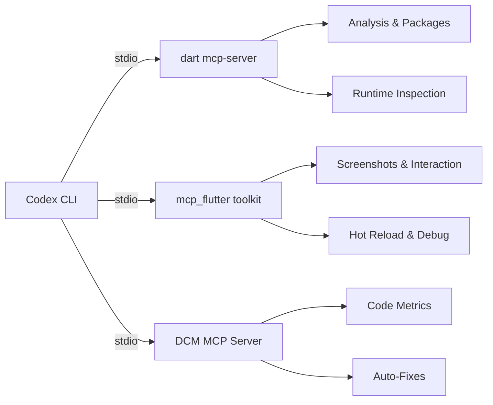
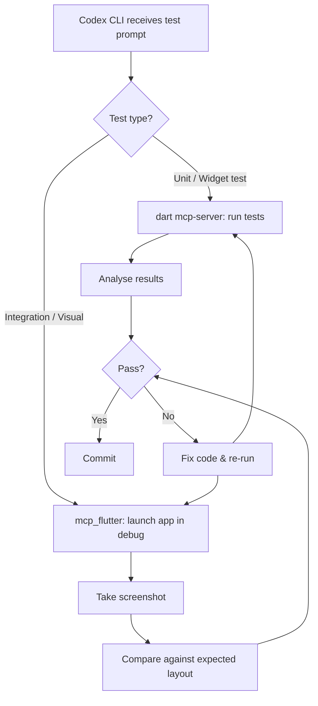
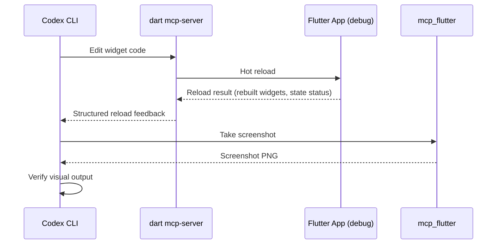

# Codex CLI for Flutter and Dart: Cross-Platform Agent Workflows, MCP Servers, and Widget Testing


---

Flutter 3.44 and Dart 3.12 represent a mature cross-platform toolkit spanning mobile, web, desktop, and embedded targets[^1]. The Dart team now ships a first-party MCP server (`dart mcp-server`) that exposes analysis, package management, runtime inspection, and test execution to any MCP-compatible client — including Codex CLI[^2]. Combined with community tooling such as the `mcp_flutter` toolkit and DCM's code-quality MCP server, Flutter developers can wire up an agent harness that covers the full development cycle: from scaffolding a widget, through static and runtime analysis, to automated test execution and hot-reload feedback loops.

This article walks through configuring Codex CLI for Flutter projects, connecting the available MCP servers, and building agent workflows that cover widget testing, cross-platform builds, and code quality.

## The Flutter MCP Ecosystem in 2026

Three MCP servers matter for Flutter work:

| Server | Maintainer | Transport | Tools | Min Version |
|---|---|---|---|---|
| `dart mcp-server` | Dart team (Google) | stdio | Analysis, formatting, pub.dev search, package management, runtime inspection, widget tree, hot reload | Dart 3.9+ [^2] |
| `mcp_flutter` (flutter-mcp-toolkit) | Arenukvern (community) | stdio | 27 tools: screenshots, semantic snapshots, tapping, scrolling, text input, hot-reload, error reports, VM eval | v3.1.0 [^3] |
| DCM MCP Server | DCM team | stdio | Code metrics, unused code/file detection, auto-fixes, asset analysis, rule previews | DCM 1.31.0+ [^4] |

The official server handles language-level concerns — analysis, formatting, dependency resolution. The `mcp_flutter` toolkit focuses on runtime interaction with a running debug-mode app (screenshots, widget tapping, scroll simulation). DCM adds code-quality metrics and automated refactoring. Together they cover static analysis, runtime inspection, and quality enforcement.



## Configuring Codex CLI for Flutter

### Adding the Official Dart MCP Server

The quickest route uses the `codex mcp add` command[^5]:

```bash
codex mcp add dart -- dart mcp-server --force-roots-fallback
```

The `--force-roots-fallback` flag is required because Codex CLI advertises roots support but does not always set them, and the Dart MCP server needs a project root to resolve packages and run analysis[^2].

This writes the following to `~/.codex/config.toml` (or `.codex/config.toml` for project-scoped configuration)[^6]:

```toml
[mcp_servers.dart]
command = "dart"
args = ["mcp-server", "--force-roots-fallback"]
```

### Adding DCM for Code Quality

```bash
codex mcp add dcm -- dcm start-mcp-server --force-roots-fallback --client=codex
```

Which produces[^4]:

```toml
[mcp_servers.dcm]
command = "dcm"
args = ["start-mcp-server", "--force-roots-fallback", "--client=codex"]
```

### Adding the mcp_flutter Toolkit

The community toolkit requires a binary install first[^3]:

```bash
curl -fsSL https://raw.githubusercontent.com/Arenukvern/mcp_flutter/main/install.sh | bash
flutter-mcp-toolkit codegen-init   # patches your Flutter app with debug hooks
flutter-mcp-toolkit init codex     # writes Codex CLI MCP config
```

The resulting configuration:

```toml
[mcp_servers.flutter-mcp-toolkit]
command = "flutter-mcp-toolkit"
args = ["mcp-server"]
```

### A Complete Multi-Server Configuration

A production Flutter project's `.codex/config.toml` might combine all three with a Figma server for design-to-code workflows:

```toml
model = "codex-mini-latest"

[mcp_servers.dart]
command = "dart"
args = ["mcp-server", "--force-roots-fallback"]

[mcp_servers.dcm]
command = "dcm"
args = ["start-mcp-server", "--force-roots-fallback", "--client=codex"]

[mcp_servers.flutter-mcp-toolkit]
command = "flutter-mcp-toolkit"
args = ["mcp-server"]

[mcp_servers.figma]
command = "npx"
args = ["@anthropic-ai/mcp-server-figma"]
env = { FIGMA_ACCESS_TOKEN = "fig_..." }
```

## Agent Workflows for Flutter Development

### Workflow 1: Scaffold and Analyse a Widget

A single Codex CLI prompt can leverage the Dart MCP server to scaffold a widget, add dependencies, and run analysis:

```
codex "Create a line chart widget that shows heart rate data over time.
Find a suitable charting package on pub.dev, add it, then run analysis
and fix any issues."
```

The agent's tool trajectory:

1. **`pub_dev_search`** — searches pub.dev for charting packages
2. **`pub_add`** — adds the selected package to `pubspec.yaml`
3. **File write** — creates the widget file with typed chart code
4. **`dart_analyze`** — runs static analysis on the project
5. **`dart_fix`** — applies automated fixes for any warnings

### Workflow 2: Runtime Debugging with mcp_flutter

With a Flutter app running in debug mode, the `mcp_flutter` toolkit enables visual feedback loops[^3]:

```
codex "The login button on the sign-in screen isn't responding to taps.
Take a screenshot, inspect the widget tree around the button, check for
any runtime errors, then fix the issue and hot-reload."
```

The agent uses:
- **`screenshot`** — captures the current screen state
- **`get_widget_tree`** — inspects the widget hierarchy
- **`get_runtime_errors`** — checks for exceptions
- **File edit** — fixes the gesture detector or state issue
- **`hot_reload`** — applies the fix without restarting

This closed feedback loop — screenshot, inspect, fix, reload, verify — is what the `mcp_flutter` documentation calls an "agentic harness"[^3].

### Workflow 3: Code Quality Gate

DCM's MCP server can enforce quality thresholds before a commit[^4]:

```
codex "Run DCM analysis on lib/. Fix any unused imports, dead code,
and files exceeding a cyclomatic complexity of 20. Then format everything
with dart format."
```

The agent calls DCM tools for metrics calculation, unused code detection, and auto-fixes, then uses the Dart MCP server's formatting tool to clean up.

## Widget Testing with Codex CLI

Flutter's `flutter test` command integrates naturally with agent workflows. The Dart MCP server exposes test execution and result analysis[^2], enabling prompts such as:

```
codex "Write widget tests for the HeartRateChart widget. Cover:
1. Renders without data (empty state)
2. Renders with sample data points
3. Handles tap on a data point to show tooltip
Run the tests and fix any failures."
```

A practical pattern is to pair the Dart MCP server (for test execution) with `mcp_flutter` (for visual verification on a running app):



### Golden Test Generation

For visual regression testing, you can direct the agent to generate golden files:

```
codex "Generate golden tests for all widgets in lib/widgets/.
Use matchesGoldenFile with platform-specific tolerances.
Run them once to create the baseline PNGs, then verify they pass."
```

The agent creates test files using `testWidgets`, pumps each widget with representative data, and calls `expectLater(find.byType(Widget), matchesGoldenFile('goldens/widget_name.png'))`.

## Cross-Platform Build Workflows

Flutter's multi-platform nature means agents need awareness of platform-specific concerns. A useful pattern scopes instructions in `AGENTS.md`:

```markdown
# AGENTS.md — Flutter project conventions

## Platform targets
- iOS: minimum 13.0, use Cupertino widgets for platform-feel screens
- Android: minimum API 24, Material 3 theming
- Web: use conditional imports for dart:html; test with --platform chrome
- macOS: minimum 10.15, enable entitlements for network access

## Testing
- Widget tests: `flutter test`
- Integration tests: `flutter test integration_test/`
- Golden updates: `flutter test --update-goldens`

## MCP servers available
- dart: analysis, packages, formatting, test running
- dcm: code metrics, unused code, auto-fixes
- flutter-mcp-toolkit: runtime screenshots, widget interaction, hot reload
```

With this context, Codex CLI can make platform-aware decisions — choosing `CupertinoButton` on iOS, handling web-specific conditional imports, and running platform-targeted test suites.

## Dart 3.12 and Agentic Hot Reload

Dart 3.12, shipping with Flutter 3.44, introduces *Agentic Hot Reload* — a mechanism designed specifically for AI-driven development loops[^1]. When an MCP client triggers a hot reload, the Dart VM now returns structured feedback about which widgets were rebuilt, whether state was preserved, and any reload failures. This gives agents like Codex CLI actionable data rather than a bare success/failure boolean.

Combined with the `mcp_flutter` toolkit's screenshot capability, this creates a tight edit-reload-verify cycle:



## Known Limitations and Workarounds

**MCP handshake timeouts.** A known issue (GitHub #13766) causes Codex CLI to time out during the initial MCP handshake with `dart mcp-server` if the Dart SDK is not on `$PATH` or if the project has not run `dart pub get`[^7]. The fix: ensure `dart` is resolvable and dependencies are fetched before starting Codex.

**Debug mode only for mcp_flutter.** The `mcp_flutter` toolkit only works with apps running in debug mode — it cannot attach to profile or release builds[^3]. This is by design; the debug VM service is required for widget inspection and hot reload.

**DCM licensing.** DCM is a commercial tool with a free tier for open-source projects. The MCP server requires DCM 1.31.0+, which is available on all licence tiers[^4].

⚠️ **Codex CLI version note.** The `codex mcp add` command and `config.toml` MCP configuration require Codex CLI v0.1.2501101 or later. Earlier versions used a different configuration format. Verify your version with `codex --version`.

## Conclusion

The Flutter MCP ecosystem has matured rapidly. The official `dart mcp-server` covers the fundamentals — analysis, packages, testing — whilst `mcp_flutter` adds the runtime interaction layer that makes visual debugging possible without leaving the terminal. DCM rounds out the picture with automated quality enforcement. Wired into Codex CLI via `config.toml`, these three servers give Flutter developers an agent harness that spans the full lifecycle from design to deployment.

The key is layering: use the official server for language-level operations, the community toolkit for visual verification, and DCM for quality gates. Combined with `AGENTS.md` conventions for platform-specific guidance, this setup turns Codex CLI into a capable Flutter development partner.

## Citations

[^1]: [Flutter 3.44 & Dart 3.12 release — What's New in Flutter](https://shakilbd.medium.com/whats-new-in-flutter-implementing-flutter-3-44-dart-3-12-in-production-ee932847ef4e) and [Announcing Dart 3.12 — Dart Blog](https://dart.dev/blog/announcing-dart-3-12)
[^2]: [Dart and Flutter MCP Server — Official Documentation](https://docs.flutter.dev/ai/mcp-server)
[^3]: [mcp_flutter Toolkit — GitHub](https://github.com/Arenukvern/mcp_flutter) — v3.1.0, 27 MCP tools for Flutter agent development
[^4]: [DCM MCP Server — IDE Integrations](https://dcm.dev/docs/ide-integrations/mcp-server/) — requires DCM 1.31.0+
[^5]: [Model Context Protocol — Codex CLI Developer Documentation](https://developers.openai.com/codex/mcp)
[^6]: [Configuration Reference — Codex CLI Developer Documentation](https://developers.openai.com/codex/config-reference)
[^7]: [Codex CLI MCP handshake timeout with Dart MCP server — GitHub Issue #13766](https://github.com/openai/codex/issues/13766)
