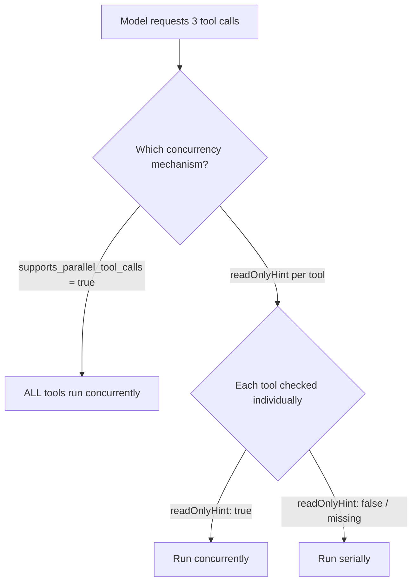
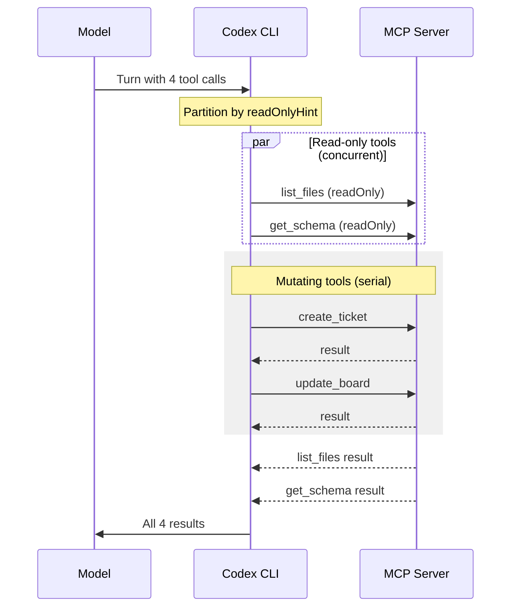
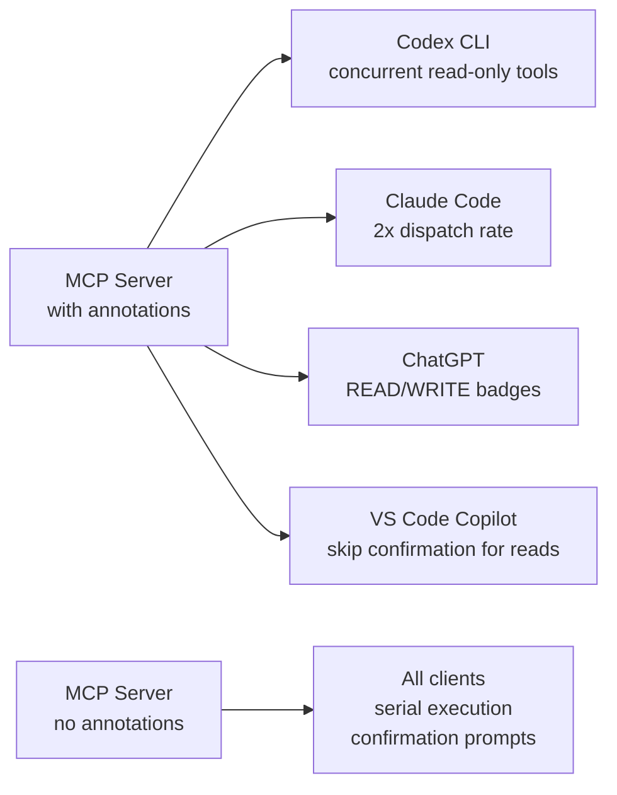

# MCP readOnlyHint in Codex CLI: Tool-Level Concurrent Execution Without the Server Flag


---

Codex CLI v0.134.0 shipped a feature that quietly changes the economics of MCP tool execution: read-only tools now run concurrently when they advertise a `readOnlyHint` annotation [^1]. This is not the same mechanism as the server-level `supports_parallel_tool_calls` flag that arrived in v0.121.0 [^2]. That flag is a blunt instrument — all tools on the server run in parallel, or none do. The new behaviour is **tool-granular**: a single MCP server can expose ten tools, mark three as read-only, and only those three will dispatch concurrently whilst the remaining seven serialise as before.

This article explains what changed, how to annotate your own MCP servers, and how the two concurrency mechanisms interact.

## Two Concurrency Mechanisms, One Agent

Before v0.134, Codex CLI offered a single lever for MCP concurrency: the `supports_parallel_tool_calls` flag in `config.toml` [^2]. Set it to `true` on a server entry and every tool exposed by that server became eligible for parallel dispatch. The flag works well for servers whose tools are all stateless — a documentation search server, a read-only metrics API — but it is dangerous for mixed servers that expose both queries and mutations.



The `readOnlyHint` mechanism is additive. If a server already declares `supports_parallel_tool_calls`, all its tools run concurrently regardless of annotations. The new per-tool path only activates when the server-level flag is absent or `false` [^1] [^2].

## How readOnlyHint Works in the MCP Specification

Tool annotations landed in the MCP specification's 2025-03-26 revision via PR #185 [^3]. The `ToolAnnotations` interface defines five optional boolean hints:

| Annotation | Default | Meaning |
|---|---|---|
| `readOnlyHint` | `false` | Tool does not modify its environment |
| `destructiveHint` | `true` | Modifications are irreversible |
| `idempotentHint` | `false` | Repeated calls produce no additional effect |
| `openWorldHint` | `true` | Tool interacts with external entities |
| `title` | — | Human-readable display name |

The defaults are deliberately conservative: an unannotated tool is assumed to be non-read-only, potentially destructive, non-idempotent, and open-world [^4]. This means servers that never set annotations behave exactly as they did before — no concurrency, no surprises.

Critically, annotations are **hints, not guarantees**. The specification states that "clients MUST consider tool annotations to be untrusted unless they come from trusted servers" [^3]. Codex CLI respects this: `readOnlyHint` only triggers concurrent dispatch; it does not bypass sandbox or approval policies.

## How Codex CLI Uses readOnlyHint

When the model requests multiple tool calls in a single turn, Codex CLI v0.134.0 evaluates each tool individually [^1]:

1. If the server declares `supports_parallel_tool_calls = true`, dispatch all tools concurrently (existing behaviour).
2. Otherwise, partition the requested tools into two sets: those with `readOnlyHint: true` and those without.
3. The read-only set dispatches concurrently.
4. The non-read-only set dispatches serially, in order.
5. Both sets execute within the same turn — read-only tools do not wait for mutating tools or vice versa.



The practical effect is that turns involving a mix of reads and writes complete faster. If three read-only lookups each take 500ms and one write takes 200ms, serial execution costs 1,700ms. With `readOnlyHint`, the reads overlap, bringing the total to roughly 700ms — a 59% reduction in wall-clock time for that turn.

## Annotating Your Own MCP Server

### Python (FastMCP)

FastMCP accepts annotations via the `@mcp.tool` decorator [^5]:

```python
from fastmcp import FastMCP
from mcp.types import ToolAnnotations

mcp = FastMCP("project-server")

@mcp.tool(
    annotations=ToolAnnotations(
        readOnlyHint=True,
        idempotentHint=True,
        openWorldHint=False,
    )
)
def search_issues(query: str) -> list[dict]:
    """Search project issues by keyword."""
    return db.issues.search(query)

@mcp.tool(
    annotations=ToolAnnotations(
        readOnlyHint=False,
        destructiveHint=False,
    )
)
def create_issue(title: str, body: str) -> dict:
    """Create a new project issue."""
    return db.issues.create(title=title, body=body)
```

### TypeScript (MCP SDK)

The TypeScript SDK uses the `annotations` field in `registerTool` [^6]:

```typescript
server.registerTool(
  "search_issues",
  {
    description: "Search project issues by keyword",
    inputSchema: {
      query: z.string().describe("Search query"),
    },
    annotations: {
      readOnlyHint: true,
      idempotentHint: true,
      openWorldHint: false,
    },
  },
  async ({ query }) => {
    return await db.issues.search(query);
  }
);

server.registerTool(
  "create_issue",
  {
    description: "Create a new project issue",
    inputSchema: {
      title: z.string(),
      body: z.string(),
    },
    annotations: {
      readOnlyHint: false,
      destructiveHint: false,
    },
  },
  async ({ title, body }) => {
    return await db.issues.create({ title, body });
  }
);
```

## Codex CLI Configuration Interaction

No `config.toml` changes are required to benefit from `readOnlyHint` concurrency. If your MCP server exposes annotated tools, Codex CLI v0.134.0 picks them up automatically [^1].

The two mechanisms coexist in configuration:

```toml
# Server-level flag: ALL tools concurrent (existing mechanism)
[mcp_servers.metrics-api]
command = "npx"
args = ["-y", "@acme/metrics-mcp"]
supports_parallel_tool_calls = true

# No server-level flag: tool-level readOnlyHint governs concurrency
[mcp_servers.project-tracker]
command = "npx"
args = ["-y", "@acme/project-mcp"]
# Read-only tools will run concurrently; mutating tools serialise
```

You can also combine the server-level flag with tool filtering to restrict which tools are available at all:

```toml
[mcp_servers.project-tracker]
command = "npx"
args = ["-y", "@acme/project-mcp"]
enabled_tools = ["search_issues", "get_issue", "list_sprints"]
# All enabled tools are read-only, so readOnlyHint gives concurrency
# without needing the server-level flag
```

## The Adoption Gap and Why It Matters

The MCP ecosystem has grown to over 9,400 registered servers as of April 2026 [^7], yet tool annotation adoption remains low. Server authors skip annotations because most clients ignore them; clients underinvest in annotation-based features because most servers omit them [^3]. This creates a self-reinforcing cycle.

Codex CLI's decision to grant a concrete performance benefit — concurrent execution — to servers that annotate correctly may help break this cycle. The incentive is tangible: annotate your read-only tools and your users' turns complete faster.

Other clients are also differentiating on annotations. Claude Code uses `readOnlyHint` to determine parallelism, dispatching read-only tools at roughly double the rate [^3]. ChatGPT displays "READ" or "WRITE" badges based on `readOnlyHint` in developer mode [^3]. VS Code Copilot shows confirmation dialogs for tools that lack `readOnlyHint: true` [^3].



## When readOnlyHint Is Not Enough

`readOnlyHint` solves the common case — queries that touch no state — but it cannot express more nuanced concurrency constraints. Consider these scenarios:

**Dependent reads.** Tool B reads data that tool A's read populates into a cache. Both are genuinely read-only, but running them concurrently produces stale results from B. The annotation system has no mechanism for declaring ordering dependencies between tools.

**Idempotent writes.** A tool that upserts a row is safe to run concurrently with itself (it is idempotent), but `readOnlyHint: false` will serialise it. You could set `supports_parallel_tool_calls = true` at the server level, but that affects all tools on the server.

**Rate-limited external APIs.** A read-only tool that queries an external API with strict rate limits may break under concurrent dispatch. `openWorldHint: true` signals external interaction, but Codex CLI does not currently throttle based on it.

For these cases, the server-level `supports_parallel_tool_calls` flag remains the right tool — it is an explicit opt-in that says "I, the server author, have verified that concurrent execution is safe for all my tools."

## Decision Framework

Use this framework to choose the right concurrency strategy for your MCP server:

| Scenario | Recommendation |
|---|---|
| All tools are stateless reads | Set `supports_parallel_tool_calls = true` on the server |
| Mix of reads and writes | Annotate each tool with appropriate `readOnlyHint` |
| All tools mutate shared state | Leave both mechanisms off (serial default) |
| Complex ordering dependencies | Leave serial; consider splitting into separate servers |
| Idempotent writes that could parallelise | Use `supports_parallel_tool_calls = true` with caution |

## Verifying Concurrent Execution

To confirm that your tools are dispatching concurrently, enable Codex CLI's tracing output:

```bash
CODEX_LOG_LEVEL=debug codex --profile dev "Search for open bugs and list recent deployments"
```

In the debug output, concurrent tool calls appear with overlapping timestamps rather than sequential ones. Look for log lines showing multiple `mcp_tool_call_start` events before any `mcp_tool_call_end` events from the same server.

⚠️ The exact log format is not documented as stable API and may change between releases.

## Summary

Codex CLI v0.134.0's `readOnlyHint` support represents a shift from server-level to tool-level concurrency decisions. For MCP server authors, the action is straightforward: annotate your tools accurately. For Codex CLI users, the benefit is automatic — faster turns with no configuration changes, provided your MCP servers ship annotations. As the broader ecosystem converges on annotation-driven behaviour across Codex CLI, Claude Code, ChatGPT, and VS Code Copilot, the incentive to annotate will only grow.

## Citations

[^1]: OpenAI, "Codex CLI v0.134.0 Changelog," *developers.openai.com*, 26 May 2026. [https://developers.openai.com/codex/changelog](https://developers.openai.com/codex/changelog)

[^2]: OpenAI, "Codex CLI v0.121.0 — supports_parallel_tool_calls for MCP servers," *GitHub Releases*, 2026. [https://github.com/openai/codex/releases](https://github.com/openai/codex/releases)

[^3]: MCPBlog.dev, "MCP Tool Annotations: What They Are, Why They Matter, and What's Coming Next," 13 March 2026. [https://mcpblog.dev/blog/2026-03-13-mcp-tool-annotations](https://mcpblog.dev/blog/2026-03-13-mcp-tool-annotations)

[^4]: Model Context Protocol Blog, "Tool Annotations as Risk Vocabulary: What Hints Can and Can't Do," 16 March 2026. [https://blog.modelcontextprotocol.io/posts/2026-03-16-tool-annotations/](https://blog.modelcontextprotocol.io/posts/2026-03-16-tool-annotations/)

[^5]: FastMCP Documentation, "Tools — Tool Annotations," *gofastmcp.com*, 2026. [https://gofastmcp.com/servers/tools](https://gofastmcp.com/servers/tools)

[^6]: Agentailor, "The MCP TypeScript SDK: A Complete Guide to Tools, Resources, Prompts, and Beyond," 2026. [https://blog.agentailor.com/posts/mcp-typescript-sdk-complete-guide](https://blog.agentailor.com/posts/mcp-typescript-sdk-complete-guide)

[^7]: Digital Applied, "MCP Adoption Statistics 2026: Model Context Protocol," April 2026. [https://www.digitalapplied.com/blog/mcp-adoption-statistics-2026-model-context-protocol](https://www.digitalapplied.com/blog/mcp-adoption-statistics-2026-model-context-protocol)
